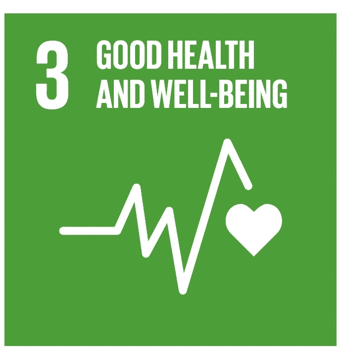
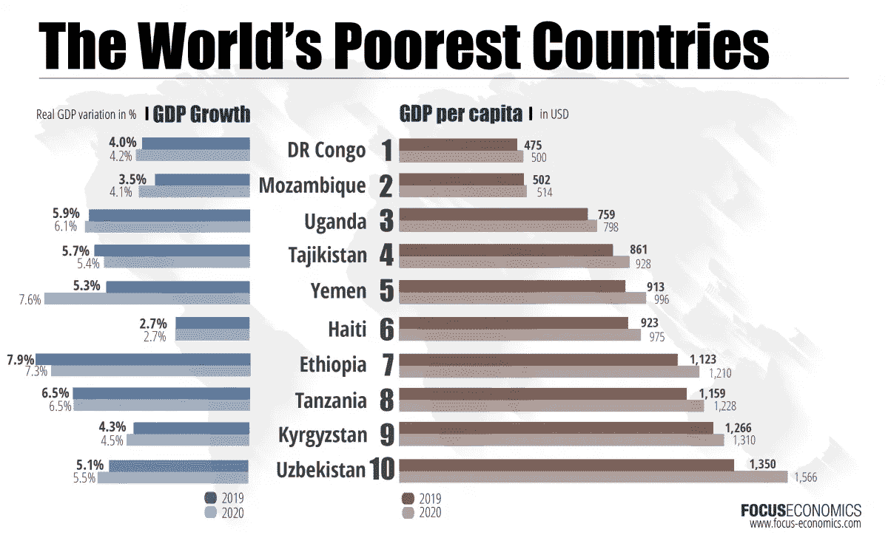
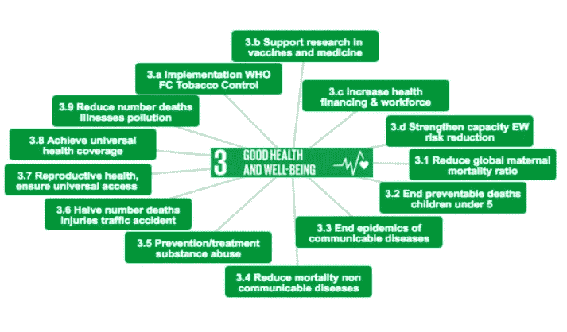

# 解决健康和幸福的关键

> 原文：<https://medium.datadriveninvestor.com/how-we-can-leverage-the-power-of-ai-to-help-solve-the-problem-of-good-health-and-well-being-79590592076b?source=collection_archive---------6----------------------->

## 利用人工智能的力量来帮助解决良好的健康和福祉。

> 你认为我们如何帮助解决全球健康和幸福的问题？

这个问题相当棘手，因为有太多的因素会对我们的健康产生负面影响——环境、我们的消费、我们的生活方式等等。这些是导致我们不健康的原因，但是我们可以在很多方面不健康，从严重的呕吐和腹泻到心血管疾病。怎么才能解决这么大的问题？嗯，在人工智能的帮助下，我们可以帮助解决这个影响我们每一个人的问题。唷，至少 AI 不会像电影里那样毁灭世界😃！

Sustainable Development Goal: Good Health and Well-Being

# 健康和幸福

我们知道，如果你想过上没有疾病的生活，保持健康和身材是很重要的，然而仍有数百万人被诊断患有致命的和罕见的 T2 病。你可以把不同类型疾病的原因分成两类，一类是由于缺乏清洁和卫生，另一类是由于生活方式。在发达国家，获得致命疾病的最大风险是通过我们生活的环境。例如，明尼苏达公共健康大学进行的研究发现，大量摄入快餐与 T4 心脏病直接相关。仅在美国就有超过 3003 万人被诊断患有心脏病，其中每年有 65.7 万人死亡(不要吃太多披萨)😉)。另一个例子是，由于空气中大量的污染，患肺癌的风险增加。肺癌每天杀死 **433 名美国人**，大约是每年 **16 万人**！在发展中国家，最大的疾病风险是传染病。每年有 130-400 万霍乱病例，这大约是加拿大人口的 1/8！这是因为，在大多数发展中国家，大多数人没有意识到不实行消毒和卫生带来的健康风险。这就是致命疾病产生的原因，比如霍乱**、**大肠杆菌**、**伊波拉病毒**等等。**

**因此，无论人们生活在发展中国家还是发达国家，你都会受到身体和/或精神不健康问题的影响。联合国认为，包括这个问题在内的许多问题需要在 2030 年前解决。因此，他们创建了**可持续发展目标**，这是每个国家为了更可持续的未来，到 2030 年需要实现的 17 个目标。专注于确保健康的可持续发展目标被称为**健康和福祉**。在下一部分，我将谈论联合国为这一 SDG 目标设定的更深入的目标。**

****

**The GDP growth of the poorest countries in the world — [Source](https://www.focus-economics.com/blog/the-poorest-countries-in-the-world)**

# **为什么这个问题很难解决**

**我谈到了这个问题，以及世界上有多少人正在受到这个问题的影响。我现在想谈谈为什么这个问题很难解决。今天，目前的**国际贫困线**是**每天 1.90** 美元，而**低收入国家**的人民收入大约为**1.91**美元，勉强够他们养活家人。在发展中国家，许多人生活在贫困线以下，这使得这些人很难去看医生，获得任何种类的药物/治疗。例如，如果一个来自非洲的农民不得不支付 300 到 700 美元的核磁共振扫描费用，他们将负担不起。这就像告诉一个中产阶级买一栋 2000 万美元的豪宅，他们买不起。**

**在发展中国家，人们没有被教育关于清洁和卫生的重要性，这是允许不同疾病传播的原因。每四个孩子中就有一个不会读或写，这使得这些发展中国家的人口中有 25%是文盲。人们不会被告知饮用被污染的水或食用被污染的食物的影响。这也增加了许多传染病在家庭和社区中的传播。霍乱可能需要 12 小时到 5 天的时间传播，几天后症状才会出现，这使得众议院成员更难及早了解感染情况！**

**发展中国家是那些经济不太强劲的国家，他们从 T2 建立了 T4 的医疗保健系统，贫困的人和中低收入阶层的人可以免费享受医疗保健(类似于加拿大的免费医疗保健)。如果我们看上面的图表，我们可以看到世界上大多数最贫穷的国家经济增长不多，这就是为什么他们不能建立先进的医疗保健系统。**

****

**[Source](https://i.pinimg.com/originals/f3/48/cb/f348cb8a4a2cf14cab087fdfbc637d23.png)**

# **了解健康和幸福的目标**

**在我们试图理解该 SDG 的一些目标之前，让我们先来看看其中的一些目标:**

1.  **到 2030 年，将全球**死亡率**降至每 10 万活产儿不到 **70 人****
2.  **到 2030 年，消除新生儿和 5 岁以下儿童的可预防疾病，所有国家的目标是将死亡率至少降低到每 1000 名活产儿中有 12 人死亡，将 5 岁以下婴儿死亡率降低到每 1000 名活产儿中有 25 人死亡**
3.  **到 2030 年，结束艾滋病、结核病、疟疾和热带疾病的流行。此外，抗击**肝炎、水传播疾病和传染病**。**

**4.到 2030 年，通过**预防**和**治疗**和**促进心理健康和福祉**，将**非传染性疾病**导致的过早死亡率降低三分之一。**

**5.实现全民健康覆盖，包括金融风险保障、获得**优质基本医疗服务**，以及获得**安全**、**有效**、**优质**。他们还需要负担得起的基本药物和疫苗。**

**如果您想了解有关 SDG 和其他目标的更多信息，可以访问以下链接。**

** [## 目标 3:健康和幸福

### 确保健康的生活，促进所有年龄的人的福祉。

www.globalgoals.org](https://www.globalgoals.org/3-good-health-and-well-being) 

这些是 SDG 目标中的一些目标，是最重要的目标。如果我们分析这些目标，我们可以看到，其中大多数都与确保每个人都有良好的身心健康有关，无论是根除在世界部分地区引起大量爆发和流行的不同疾病，还是促进心理健康和福祉。许多目标也与预防疾病有关，因为这将有助于降低某些疾病的死亡率，或者通过确保世界各地的每个人都能获得**优质**、**有效**、**安全**和**负担得起**的医疗保健来终结流行病。因此，我们可以得出结论，通过减少疾病传播，我们将能够实现可持续发展目标的所有目标。

All of the branches of AI that can be used in Healthcare

# 人工智能将如何帮助解决健康和幸福的问题

人工智能擅长完成广泛的任务，从能够从医学图像中检测皮肤癌，到能够根据你的情况开出最有效的药物/治疗方法。例如，我认为人工智能如何能够在早期诊断疾病，这样你就有更高的生存机会。例如，在许多早期癌症中，存活的机会超过 5 年，而不是在后期被发现。这不仅可以用于各种疾病，而且生活在发展中国家的人们可以使用人工智能，这种人工智能在检测疾病方面比顶级医生 T21 更准确🤯。人工智能能够检测到大多数疾病，因为它可以学习在疾病和它们的一些症状之间找到模式，这将允许它检测大多数疾病，因为它们不是非常罕见的疾病。

人工智能可能会取代医生，通过使用人工智能中一个叫做**自然语言处理的领域，我们可以创造出能够用英语与任何人聊天的人工智能，它们被称为聊天机器人**。我认为这是非常重要的，尤其是在人们能够访问互联网的地方，因为他们能够访问一个更有效、更高效、更准确并且不花任何钱的聊天机器人(我知道这是难以置信的)！截至 2017 年，美国人均花费**10739 美元**🤯！这在 T4 非常昂贵，对于低收入的人来说很难负担得起这种医疗保健(只有 25%的美国家庭收入超过 10 万美元)。

人工智能的另一个非常重要的意义是，它能够通过其他人的数据预测一个人未来是否会患有某种疾病！例如，让我们说，有人在美国得了心脏病，现在不同的组织正在去发展中国家检查其他人的健康和福祉，他们可以使用来自美国的心脏病患者的数据，通过查看两个人的信息之间的相似性和差异来**预测某个人将来是否会得病(我发现我们如何通过这一过程相互帮助令人惊讶)！**

我希望你喜欢我的文章！👋

*好了，我的文章到此结束，希望大家喜欢！如果你想了解更多，看看这篇研究论文吧！*

 [## 人工智能(AI)与全球健康:人工智能如何为资源贫乏地区的健康做出贡献…

### 人工智能(AI)领域在过去的 60 年里有了长足的发展。虽然现在有许多人工智能…

gh.bmj.com](https://gh.bmj.com/content/3/4/e000798) 

我希望在下一篇文章中看到你，我有几篇文章即将发表(提示:其中一些是与人工智能相关的！)**😉。我想知道你对这篇文章的看法，以及你对人工智能在健康和幸福中的应用的看法！****