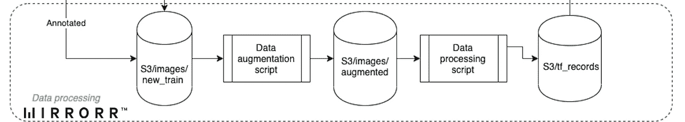

# 我们如何提高 Mirrorr 的机器学习管道效率

> 原文：<https://medium.datadriveninvestor.com/how-we-increased-our-machine-learning-pipeline-efficiency-at-mirrorr-9d574b82613?source=collection_archive---------19----------------------->

首先，我想说我在这篇文章中陈述的所有方法和步骤并不一定是所有商业案例的最终解决方案。但至少对我们来说，这是最好的练习，在[*mirror*](http://mirrorr.com/)*，就目前而言！因此，我建议所有读者考虑所有的管道障碍，如果他们错过了任何障碍，就加强他们的障碍，或者如果对他们的技术堆栈和商业模式来说方便的话，就尝试应用所有障碍。*

*需要提及的是，如果没有与*[*Tooploox*](https://medium.com/u/d5eedac576f2?source=post_page-----9d574b82613--------------------------------)*及其 ML 工程师*[*Ivona taut kute*](https://medium.com/u/2347898e52fb?source=post_page-----9d574b82613--------------------------------)*的持续成功合作，这项工作是无法完成的。*

Mirrorr 是建立在机器学习基础上的产品，而不是以它为后盾。因此，我们准备的模型给出的结果是我们在应用程序中显示的所有报告的主要支柱。为了提供最终的解决方案，我们必须集中精力，尽最大努力完成这一部分。然而，这一点也不容易。我们经历了很多尝试和错误，我们做了很多没有产生任何有效结果的过程。直到我们到达“啊哈！”瞬间。

## 背后的原因

这种管道的创建来自于任何一个 ML 部门的数据科学家都会问的最基本的问题:

*   需要的数据量？
*   需要培训时间吗？
*   需要模型精度？

在旅途中，我们多次试图回答这些问题，但一次也没有给出正确的答案。那是在我们明白这不是回答这些问题之前。它是关于建立正确的过程，在没有任何人为干预或错误估计的情况下回答这些问题。

这是我们开始投资自动化几乎所有流程的地方:从数据收集、注释、数据准备等，直到模型评估和部署。构建这个自动化模块链消除了每个模块在技术方面的负担，并将我们的关注点转移到结果的质量以及如何改进它们上。

## 管道的不同部分

我们的机器学习过程基于 4 个主要模块:数据标注、数据预处理、训练和部署。在 Mirrorr，我们一直努力改进和关注的主要模型是徽标检测。它包括检测任何给定媒体材料(图像或视频)中的品牌标志。所需的数据是一个不确定的数量的图像，有/没有品牌标志。

将我们的云解决方案迁移到 AWS 极大地促进了这条管道的创建以及围绕它的所有自动化流程。

*   **数据注释** 我们的品牌标志检测模型要求为我们服务的每个品牌准备一份经过良好注释的图片列表。这是我们必须考虑的第一步。手动操作是强制性的，尤其是在第一次引入品牌时，然而，在生产出模型的第一个测试版本后，我们重新设计了这个模块，并引入了“主动学习”流程。主动学习自动对 beta 模型预测得分高的图像进行标注，而将其他图像留给手动标注。
    有什么帮助？使用模型的第一个版本，我们注意到了一个小的改进和手工注释图像数量的少量减少。然而，当部署更好的版本时，该模型在检测品牌徽标方面变得更好，因此需要手动注释的图像数量呈指数级减少。

*   **数据预处理** 这是一个复杂的部分，因为它是根据每个机器学习案例的需求定制的。在我们的例子中，我们对图像应用了一些操作，以便为训练做准备。我们的目标是通过在每次完成后触发一个 lambda 函数来自动化这个模块的每一步。许多脚本是在 SageMaker 中创建的笔记本实例中编写的:数据扩充—因此我们增加了训练图像集，预处理脚本—创建 CSV 文件，然后创建 TFrecords 并将其存储到 S3 存储桶中。

*   数据处理完成后，我们得到了启动培训工作所需的一切。SageMaker 也有助于这一点，我们可以使用所需的预设算法或上传的算法来创建正确的训练作业。这总是比创建我们自己的实例、设置环境、处理访问权限和数据访问以及在我们必须执行的每个流程步骤中监控实例 CPU 使用情况要好。
    您可能需要一个第三方工具来评估实验，并做出正确的决定，即您需要为生产部署哪个模型，或者您需要执行哪些确切的更改，以便达到所需的最终精度。为此，我们使用了 comet.ml，它快速、简单且易于实现。

*   **部署** 这是管道的最后一块。一旦我们对训练工作的结果感到满意，并且将模型工件存储在您的 S3 存储桶中，我们所要做的就是通过指定模型工件的正确路径，使用 SageMaker 服务创建一个模型。然后，当然，为部署的模型创建一个端点，最后创建一个 Lambda 函数，这样我们也可以将模型提供给在 AWS 中创建的 API 网关。

## 结论

正如我在引言中提到的，所描述的这条管道是目前在我们的 ML 工作中交付最快和最好结果的最佳实践。该管道实施的预期结果:

*   减少与数据及其处理相关的手动和编程任务的时间/精力
*   模型准确性持续改进
*   机器学习流水线块中的独立性

虽然有很多需要改进的地方，一些流程也需要自动化，但是使用 AWS 提供的服务为我们节省了大量的计算时间，并且在正确的位置实现 Lambda 函数也将许多脚本转移到了无服务器状态。此外，虽然我们的目标是始终改进我们当前的徽标检测模型结果，但我们已经开始研究和训练其他领域的模型，如:上下文检测和人脸情感识别。