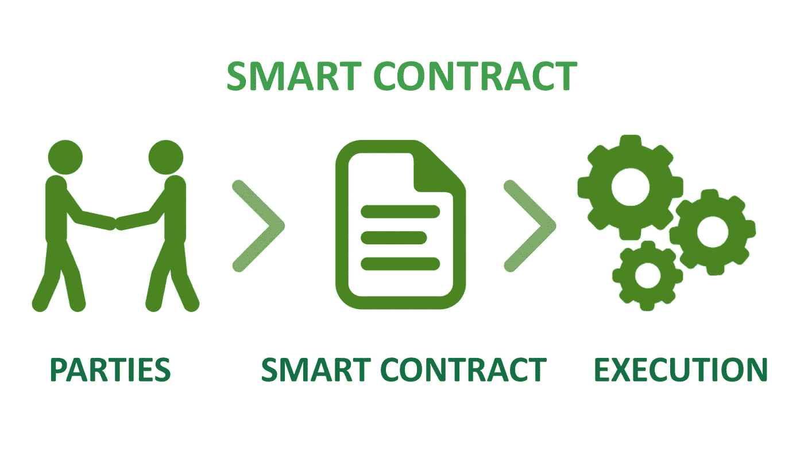

# 15 年后我们将如何看待房地产？(带音频)

> 原文：<https://medium.datadriveninvestor.com/how-we-will-see-real-estate-after-15-years-6b6899b29a24?source=collection_archive---------16----------------------->

房地产是一种不动产，包括土地和任何永久附着于其上的东西，无论是自然的还是人造的。

*   在房地产中，有五大类:住宅、商业、零售、原始财产和特殊用途。

**美国房地产**

*   在美国；自 2018 年以来，美国房价上涨了 7.2%。
*   相对于 7500 万业主自住的房产，美国有近 4400 万租房者自住的房产。
*   2007 年，大约三分之二的投资者主要集中在股票市场。这一数字已降至 50%，许多千禧一代选择投资房地产。
*   过去一年，排名前 100 的房地产市场中，有 91 个经历了价格上涨。

**印度房地产**

*   如果说印度，每个月有 2000 万印度人在网上找房子。
*   几乎 53%的印度房地产交易都受到了互联网的影响。
*   房地产市场是中国第二大雇主，仅次于农业。
*   该行业预计在未来十年将增长 30%。
*   住房占该国国内生产总值的 5%到 6%。

***甚至加拿大 GDP 的 2%都来自房地产交易。房地产行业未来将继续增长。***

**传统系统的弊端:**

*   缺乏信息透明度。每个人都有自己的体系；买家/卖家无法获得所有信息。
*   在购买或投资 it 时，有许多事情要经历，例如，合同、律师、托管、信托、代理、经纪人、保险等。
*   高翻译成本和不必要的支出，即土地出让金、代理费、银行费、成交费等。
*   各方利益不一致可能导致骗局的发生；有人会经历血汗钱的大量损失。

**区块链技术如何解决上述问题？**

*最简单地说，区块链是由一组计算机操作的带时间戳的数据集，而不是由一个人控制的。每个数据块(即块)都将其加密原则(即链)保护并链接在一起。*

上述所有问题都可以像区块链技术一样轻松解决

*   省去中间人。
*   一个地方存放所有数据。
*   信息透明度增加。
*   减少不必要的资源使用。
*   减少开支。
*   100%安全。
*   没有欺诈的机会。

***区块链技术将使用智能合约。*** *智能合约是自动化的。它们用写在代码上的独特指令来执行自己，这些指令在特定条件被创建后被执行。*

**智能合同将在房地产领域发挥什么作用？**

*   通过避免在律师和经纪人身上不必要的支出，我们将节省大量的血汗钱。
*   房地产交易的速度将增加，因为它将消除不必要的大量的高官僚主义。
*   它将保护土地所有者免受土地欺诈。您将把您的土地、文件和合同的数字所有权直接链接到区块链。在内部很难修改或更改区块链。

**现实生活中的应用**

***案例分析 1:开放法***

*   它是一个在以太坊区块链上创建、执行法律协议的框架。法律模板和法律标记语言是为非技术背景的人提供的一些功能。
*   它使用 ERC 721 令牌来表示属性。
*   澳大利亚律师事务所 Corrs Chambers Westgarth 进行了试点测试。

***案例分析 2: Propy***

*   这是一个用加密货币买卖房地产的市场。
*   有一个分散的所有权登记处。它目前正在与佛蒙特州伯灵顿的当地政府合作，开展一个试点项目，使用基于区块链的系统。
*   乌克兰开发商马克·金斯伯格(Mark Ginsburg)通过以太坊区块链上的智能合约，以 6 万美元的价格将基辅的房产出售给了 TechCrunch 的科技新闻网站联合创始人迈克尔·阿灵顿。

**这场革命面临的主要挑战是什么？**

*   许多地方法规、规章和行业惯例需要克服。
*   需要政府在地契和地契方面的合作。
*   现有的法律需要修改。
*   复杂的情况需要平稳处理。
*   现有财产记录保存不良的司法管辖区可能会引起争议。

**未来如果实现会发生什么革命？**

*   将有一个更容易的抵押贷款过程，但需要身份验证。
*   它将支持法定货币或稳定货币用于购买房产。
*   通过令牌实现数字所有权的财产令牌化，这将增加流动性和部分所有权。
*   这将是一个对出租房产的房东和房客都有帮助的系统。这将有助于物业管理公司最终采用新的和更快的技术。
*   区块链技术将允许不动产民主化。这将为潜在的外国买家测试房地产投资敞开大门。如果实施正确，它也可以有利于密码空间。

希望你喜欢。

希望得到积极的回应。

请关注我的@Medium 简介 [Yash Kamal Chaturvedi](https://yashkamalchaturvedi.medium.com/)