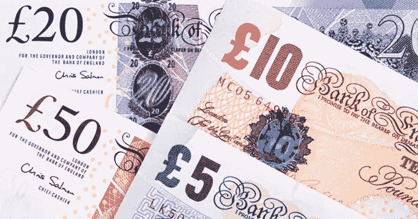
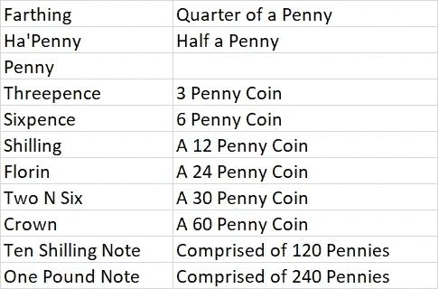
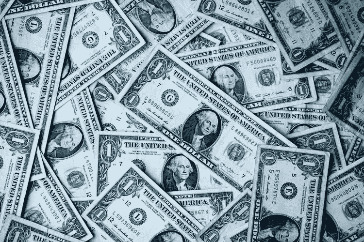

# 世界货币体系有多好？

> 原文：<https://medium.datadriveninvestor.com/how-well-are-the-worlds-monetary-systems-e2d83683a017?source=collection_archive---------10----------------------->

在这个练习中，我使用英国和美国。

Photo By: Christian Dubovan, Unsplash

当我还是个孩子的时候，我在新西兰长大，这个国家的货币体系和澳大利亚一样是基于英国的体系，这两个国家都是大英帝国或英联邦的一部分。英镑被认为是可靠的货币。它与十进制没有丝毫联系，而是基于可以追溯到罗马时代的非常复杂的英镑。有着 1200 年历史的英镑是世界上仍在使用的最古老的货币。英镑在演变成今天使用的货币之前经历了许多变化。

Photo By: Freepik

一英镑由 240 便士或便士组成。出于某种奇怪的原因，一便士是最大的硬币。它最初是用青铜铸造的，成分是 97%的铜，2.5%的锌和 0.5%的锡。1992 年，不断上涨的世界金属价格加速了成分的变化，一便士现在用钢铸造，电镀铜。

最初，英国英镑体系将一便士分为四分和二分，分别称为法分和哈分。1961 年，由于通货膨胀，一文不值的硬币从货币体系中退出。出于同样的原因，哈便士于 1984 年停止流通。但是当我还是个孩子的时候，你可以用一分钱买到东西。

英镑体系的最早单位是先令，由盎格鲁-撒克逊国王奥法设计，他在 8 世纪晚期将银币引入英格兰中部和南部。其中 240 枚的重量相当于一英制**英镑**，因此被称为货币的基石。实际上，240 个银先令的重量不同，结果英镑的实际价值相差很大。

直到 1489 年，在 1504 年亨利七世的统治下，第一枚一英镑硬币才出现。它最初被称为君主。随着英格兰银行的建立，纸币于 1694 年开始在英格兰流通。它们最初是手写的。

这些年来，除了十先令的纸币之外，更多的硬币被引入。令人困惑的英镑体系中的硬币自下而上如下:

Image: Created by the author.

直到 1717 年，英镑的实际价值一直受到其白银重量的支撑。随后，英国政府转而用黄金而非白银来定义英镑的价值。这时，铸币厂主艾萨克·牛顿爵士将黄金价格定在每盎司 4.25 英镑。

因此，在信用卡、借记卡和信用额度出现之前，我们有现金。不错的现金。你当然可以贷款，但贷款是钱。你可以开一张支票，大多数人对他们的支票账户都很诚实。如果你的支票因为某种原因没有清算你的账户，你会接到银行的电话来支付支票。想象一下。

 [## 稳定币会危及比特币在加密领域的地位吗？数据驱动的投资者

### Stablecoin 是一种加密货币，主要用于维持稳定的市场价值。它可以通过…

www.datadriveninvestor.com](https://www.datadriveninvestor.com/2020/06/08/can-a-stablecoin-jeopardize-the-position-of-bitcoin-in-the-crypto-space/) 

那么今天我们手中的钱有什么价值呢？

美元的起源本身就是另外一个故事了，但是在 19 世纪后期，美元是以一盎司黄金的价值为基础的。因此，美元持有者可以进入一家银行，以 18.93 美元的价格购买一盎司黄金。当美国政府在 1933 年取消金本位制时，黄金价格固定在 35 美元，直到 1971 年 8 月理查德·尼克松总统完全放弃金本位制。他宣布美国将不再以固定价值将美元兑换成黄金。今天黄金的价值？

美国财政部持有 2.615 亿金衡盎司黄金。这些有价值的股票大部分以金条的形式持有，其余主要是金币和空白金币，其价值按照 2020 年 9 月 30 日的伦敦黄金固定价格设定，为**4934 亿美元。**

目前，英国政府拥有大约 310 吨黄金，价值 2000 亿英镑或**2670 亿美元。**

那么，这两种货币体系中实际有多少现金呢？

Photo By: Sharon McCutcheon, Unsplash

到 2020 年 11 月 11 日，估计有价值 2.01 万亿美元的美联储纸币或美元在流通。

将这一数字与 2020 年第一季度美国家庭债务总额的美元值进行比较。这包括抵押贷款、汽车贷款、信用卡和学生贷款。据估计为 14.30 万亿美元。根据目前 3 . 28 亿的人口，这相当于每个男人、女人和孩子 44，000 美元。

普通美国家庭在储蓄或支票账户中平均有 8863 美元。这是相当大的差距。

这与拥有 6700 万人口的英国相比如何？截至 2020 年 9 月底，英国家庭债务总额为 1.7 万亿英镑。基于目前 6700 万的人口，这相当于每个男人、女人和孩子 25000 英镑。**以美元计？三万四千美元。**

显然，美国没有足够的黄金来支撑流通中的货币，毫无疑问，这同样适用于英镑。这两种货币都是法定货币，是政府发行的货币，没有黄金等大宗商品作为支撑。法定货币为中央银行提供了对国家经济的更大控制权，因为他们可以控制印刷多少钱，正如在当前的全球疫情中所展示的那样。

不管喜欢与否，我们现在已经进入了一个虚拟货币的时代。由信用卡、抵押贷款、贷款和信用额度提供的“钱”只不过是账面记录。它们不涉及真钱。美元和英镑之所以坚挺，是因为它们在全球货币市场上的声誉，而不是因为它们的现金价值。

比特币，终极虚拟货币，无非是靠投机支撑起来的。它目前的市值约为 1600 亿美元，当然这取决于具体日期，因为任何人都知道谁在关注比特币的涨跌。的问题；如果没有美元，比特币会有价值吗？

如果你对这个帖子有任何意见、异议或其他信息，请通过**媒体**或通过我的 [**网站**](http://www.handshakeconsultants.com/) **联系我。**

关注我上[**TWITTER**](https://twitter.com/Handshake2015)**[**FACEBOOK**](https://www.facebook.com/michael.trigg.773)&[**LINKEDIN**](https://www.linkedin.com/in/handshakeconsultants/)。**

## **访问专家视图— [订阅 DDI 英特尔](https://datadriveninvestor.com/ddi-intel)**