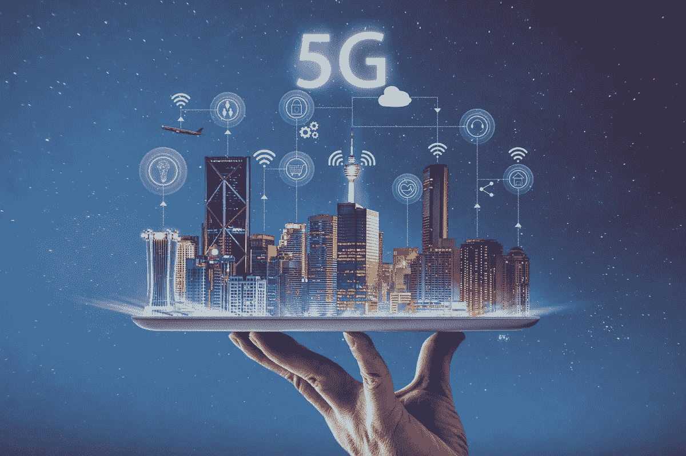
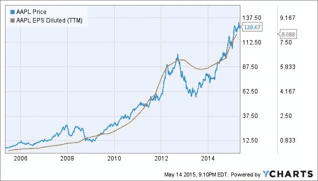

# 5G 将如何改变股市？

> 原文：<https://medium.datadriveninvestor.com/how-will-5g-change-the-stock-market-df5b38471e3d?source=collection_archive---------32----------------------->

Image from Getty Images

现在是 2012 年，你刚刚带着崭新的 iPhone 5 走出苹果商店，对未知的 4G LTE 欣喜若狂。很怀旧吧？接近 7000 万人会同意这一点，因为那一年苹果打破了所有人的预期。

苹果公司的股票在 2012 年暴涨了 30%,这显示了一个新的宽带蜂窝网络正在实施的效果。

Graph by YCHARTS

欢迎回到 2020 年，苹果刚刚发布了搭载 5G 宽带网络的新款 iPhones。他们比最大的竞争对手三星晚了一年半，三星在 2019 年 5 月发布了三星 Galaxy S10。这两家公司在 2010 年至 2012 年期间各自的股票都出现了令人兴奋的上涨，预计未来两年也会如此，因为苹果公司的股票在他们发布新款 iPhones 的活动前一周上涨了近 10%。

5G 显然是一个非凡的催化剂，这对于持乐观观点的交易员来说非常令人兴奋，因为可以看到大量公司在未来一年内崛起。像威瑞森这样波动性非常小的公司，在开始提供 5G 服务时，可以开始看到明显的价格波动。大约在大众电话公司开始实施 5G 网络的同时，威瑞森出现了最后一次迅速崛起，可以自信地估计明年也会出现同样的情况。

威瑞森不是唯一一家将出现大幅增长的电信公司，因为美国电话电报公司和 T-Mobile 等公司处于同一竞争环境，在 5G 世界中可以提供很多东西。当 4G 开始获得牵引力时，这两家公司都经历了同样的激增，预计在不久的将来也会如此。

其他将在 5G 泡沫中发挥重要作用的主要公司是高通和博通，因为这两家公司都是科技行业的半导体巨头，并与 5G 网络有着密切的联系。两家公司将在未来一年销售大量 5G 芯片，预计收益将大幅增长。美国银行给了两家公司很高的目标价，分析师们认为这很容易实现。

2021 年似乎是非常乐观的一年，全球各地的基金和交易员都准备好了从不断上升的 5G 泡沫中获利。如果著名的刺激法案顺利通过，价格波动甚至可能会提前一点开始，这可能会导致 5G 泡沫中的公司获得更高的价格目标。几乎毫无疑问——5G 正在走向月球。