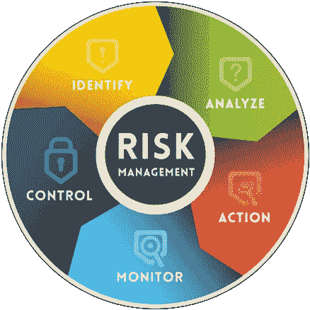

# 冠状病毒将如何影响世界物流和供应

> 原文：<https://medium.datadriveninvestor.com/how-will-coronavirus-impact-the-worlds-logistics-and-supply-chains-10052c2446f6?source=collection_archive---------16----------------------->

Source: mobinspire.com

中断时有发生，但疫情疫情有所不同——疫情影响了员工的准入，降低了生产率，并改变了人们的行为，即购物习惯和支出。

全球运输和供应链公司继续感受到疫情的影响，面临劳动力短缺和监管不确定性。当公司准备应急计划时，物流和供应链必须处理这种快速变化的情况。

虽然很难预测确切的后果，但全球供应链的[影响已经感受到，包括供应短缺、劳动力减少、旅行限制、现有供应网络的能力限制、消费者购买减少等等。](https://www.joc.com/special-topics/coronavirus-effect-supply-chains)

 [## 物联网解决方案如何改变供应链中的机遇|数据驱动型投资者

### 物联网(IoT)可能开始时规模很小，但它正在成为世界经济中的一个重要因素。事实上…

www.datadriveninvestor.com](https://www.datadriveninvestor.com/2018/11/14/how-iot-solutions-are-shifting-opportunities-in-the-supply-chain/) 

根据每个方面的影响评级，很明显，对供应、运输和物流的总体影响是严重的。

领先的供应链和物流企业利用增强的风险管理流程，包括持续测量关键风险指标，为预期的不确定性准备方案，以及关注不可预见的中断。

我们在货运和物流行业看到了哪些影响:

# 受影响的工业运营

在疫情期间，一些政府当局规定了额外的疫情预防措施，企业必须满足这些措施才能继续运营。

其中一些措施包括制定预防方案、提供防护设备(*口罩、手套、消毒剂*)、进行常规温度控制和消毒、保持社交距离等等。

执行这些请求所需的时间以及审批过程的不透明已经对希望恢复运营的制造商产生了巨大影响。

外国制造工厂的削减导致进口放缓或暂时停滞，港口延误主要是由于劳动力减少。

Source: truthdive.com

另一方面，对药物、医疗用品和设备以及清洁用品的需求急剧增加，因此经销商正在努力满足相关机构的额外订单，从而给供应和物流提供商带来压力。

一些行业专家担心，疫情爆发后，企业在支出方面将更加谨慎，导致商务旅行和交通服务被取消，成为豪华轿车或拼车服务。

拼车服务的一个亮点是，一旦情况开始正常化，城市开始重新开放，公众可能会不愿意使用公共交通系统，这可能会导致对出租车和打车服务等替代交通服务的需求增加。

# “不可抗力”条款

冠状病毒赋予了法律术语“不可抗力”新的含义。

除了世界经济因疫情而暂时关闭之外，在中国与供应商合作的公司还面临着法律上的**“不可抗力**”条款，这些条款将在不履约的情况下生效，以保护供应商免于法律和财务责任。

“不可抗力”是一个法语术语，字面意思是“*更大的力量*”——它是指无法预料的外部情况(*自然灾害或武装冲突等人类灾难)。*)阻止一方履行义务。

流行病偶尔被列为“不可抗力”事件，尽管当局在决定特定疾病是否符合描述时有些经验不足。然而，冠状病毒对全球经济的影响可以与任何其他大规模自然灾害相比。

还有另一个非法律术语“价格不可抗力”( price probability )( T7 ),交易员们用它来开玩笑，说一些买家利用这些条款作为借口，在价格对他们不利时退出合约。

据一些法律专家称，尽管这些证书分量很重，但它们并不排除进一步的谈判。

# 工作和供应拥挤和短缺

疫情局势和检疫导致工作和供应短缺。

各种全市范围的限制，如检疫、温度控制和车辆检查或消毒，使工人无法到达工作场所，造成了大规模的劳动力短缺。

由于冠状病毒，许多公司最近鼓励在家工作，随着收入枯竭，运输行业(如出租车服务)可能会出现破产潮。

由于这种情况，工作流程受到影响，导致严重延误或生产和服务大幅减少。

Source: news.yahoo.com

旅行限制和劳动力短缺导致全球许多港口货物积压，与此同时，钢铁厂和矿山也在努力运输其关键资源，如锌、铜等。从他们的精炼厂供应原材料。

制造商和供应链仍在努力实现高效的工作流程，因为拥挤和短缺不仅会影响完成工作所需的时间，还会影响完成相同工作的能力。

# 交通延误加剧了短缺

随着疫情的蔓延，许多国家之间的跨境交通严重中断。出口和其他货物在边境被耽搁，而一些卡车在世界上最大的边境口岸等待了几天。

一旦冠状病毒的情况变得更加严重，各个当局就开始对所有进入该国的公民进行至少 14 天的隔离，以减少旅行人数。

Source: straitstimes.com

跨境卡车司机不包括在某些地区，交货是可能的，但事先通知。根据一些卡车运输公司和货运经纪人的说法，卡车司机被要求呆在装卸地点的卡车里，从纸质方式转向电子方式来记录交货和提货。

所有这些发展导致了卡车旅行的延误和价格的迅速上涨。

# 有限的货运能力

超过 50%的空运能力与其他货运渠道(航空、铁路、公路等)一起被取消。)根据[载重之星](https://theloadstar.com/)，这可能导致航空运费上涨 300–400%。

关于铁路运输，运力问题也影响了这种运输方式，然而这种方式比海运快一倍。许多火车路线被取消，留下集装箱等待更好的日子。

Source: container-mag.com

通过卡车运输货物的困难导致到达任何目的地的时间的可视性降低。

据[国家高级轿车协会](https://www.limo.org/news/Default.asp)称，地面运输公司的收入下降了 90%。

与前一个月相比，4 月份所有主要负载类别的负载需求都有所下降，例如，与干式货车和平板负载相比，专用拖车和冷藏负载的需求状况更好。然而，更少的闲置交通也降低了燃料消耗和卡车运输公司的成本。

行业专家有些乐观地认为，随着一些国家试图放松封锁限制并逐步重新开放经济，货运量和运费可能会反弹。

# 受影响的海外供应链

疫情疫情也对工业生产和延伸到中国境外的全球供应链产生了巨大影响。

无论你在哪个行业工作，新冠肺炎的爆发都导致了供应短缺——例如，汽车行业出现了供应短缺，一些主要的汽车制造商(*现代、起亚汽车、日产等*)。)不得不暂时停止运营，同时从替代市场寻求供应。制药行业也受到了沉重的打击，因为中国不得不保留某些药物的原料供应，从而减少了对其他市场的出口(*美国，印度*等)。).

Source: freightwaves.com

国内商品离开港口的速度也相当缓慢，导致产量减少。分销商面临的挑战是平衡供应商的货物流量和客户的需求。

船运公司已经利用了他们船只的空载运行。空驶指的是船东由于需求低而取消在某一特定港口(或整条航线)的计划停靠。据[海洋情报海事咨询](https://sea-intelligence.com/)称，截至 2020 年 3 月，船运公司取消了大约 54 次亚欧贸易的出发。

虽然一些措施已经放松，但据一些托运人说，预计集装箱的到达仍将延迟三到四周。

# 如何为中断做准备？

根据 Gartner 高级主任分析师 Koray kse 的说法，供应和物流公司需要采取一些措施来准备应对对其价值链的影响。

**短期行动**包括为受病毒影响的国家制定供应链中断监控和响应计划，以及一级及以下级别的潜在供应链风险。业务部门应确定客户的支出可能如何波动，并确保所有库存都在可及范围内，且不在受影响区域内。公司应咨询法律和人力资源部门，以了解供应失败时的任何财务影响，并为受影响地区的员工提供指导。

**中期行动**应侧重于平衡供需、建立战略储备以及审查(或制定)公司的整体风险管理战略。内部股东和战略供应商可以帮助建立一致的风险管理方法，以防任何潜在的材料或制造能力短缺。

Source: pei.com

**长期行动**都是关于预测下一个‘何时’——实施一个场景并制定行动计划，开发替代资源，在内部能力(*替代库存、资源、案例储备等)的情况下致力于战略供应。*)不足以缓解重大中断。该解决方案正在准备中，因为它可以在任何类似中断的情况下打开新的机会。

# 下一步是什么

全球焦点已经在全球范围内转移了所有企业的优先事项——意识到风险对于所有企业向前发展至关重要，并将有助于制定企业战略。公司需要调整和改变他们自己的生产和经营策略以保持运营。

由于一些国家已经采取了严厉的措施来控制疫情的爆发，所以仍然很难预测爆发对全球商业和工业的经济影响。

考虑到当前的形势以及对多个行业的巨大运营和财务影响，可能需要几个月或更长时间来评估影响。

使用正确的数据集和预测工具对于企业在当前市场中导航和制定未来战略决策至关重要。