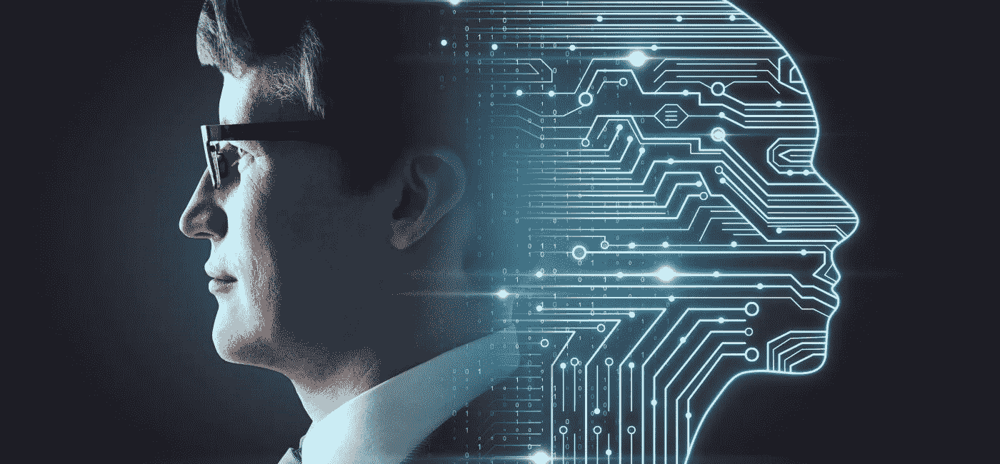
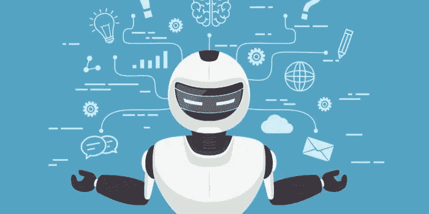
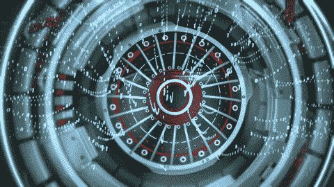

# 人工智能时代营销会如何进化？

> 原文：<https://medium.datadriveninvestor.com/how-will-marketing-evolve-in-the-age-of-artificial-intelligence-5f07dd198cd4?source=collection_archive---------13----------------------->

> 我想象着有一天我们对于机器人就像狗对于人类一样，我支持机器。
> 
> **——克劳德·香农**

在当今的商业和营销世界中，变化是唯一不变的、占主导地位的事实。作为营销人员，这并不容易，因为你需要拥有解开和利用任何变化的能力。现在对你的消费者有用的东西，可能会在一段时间内改变。密切关注这些趋势及其发展是至关重要的。

做了三年的营销人员，**我已经意识到改变需要金钱并且代价高昂，但是不改变你的营销方式代价会更高。**并非所有的变化都是显著的，你需要量化它们的影响。新时代营销人员，包括许多像我一样正在成为新时代营销人员的研究生，都在滔滔不绝地谈论大数据和人工智能。

SOURCE: [Google Images](https://www.google.com/search?q=artificial+intelligence&rlz=1C1SQJL_enIN861IN861&sxsrf=ALeKk01CbFDqn_B_YLxTP5l9uvlTjgh3UQ:1587325226517&source=lnms&tbm=isch&sa=X&ved=2ahUKEwiP2JOin_XoAhX2hHIEHaQ4ATEQ_AUoAnoECBkQBA&biw=1422&bih=642#imgrc=RrtYg-RqhRh-SM&imgdii=auXw0sR-zceSjM)

**人工智能******能否触动人类的和弦，在营销人员中引发了激烈的争论。**我们说说[大数据](https://en.wikipedia.org/wiki/Big_data)、[机器人学](https://en.wikipedia.org/wiki/Robotics)、[分析学](https://en.wikipedia.org/wiki/Analytics)、[机器学习](https://en.wikipedia.org/wiki/Machine_learning)等这样的重磅名词。我绝对相信这些术语正在塑造营销世界，我们需要跟上它的步伐。我们正在走向数字化，轻松地筛选大块数据，分析新兴技术如何引起客户参与，并关注我们技术增强的竞争对手。**

**想知道[人工智能](https://en.wikipedia.org/wiki/Artificial_intelligence)如何改变你的营销策略吗？我们来探索一下。**

****什么是人工智能？****

**嘿 Alexa！**

**今天外面的天气如何？**

**你认为这背后的科学是什么？[当然是人工智能](https://en.wikipedia.org/wiki/Artificial_intelligence)。人工智能是机器在使困难的任务变得更简单方面展示的智能。**它是一个总括或父术语，用于代表认知计算、机器学习、语音搜索等技术。** [人工智能营销](https://emarsys.com/learn/blog/artificial-intelligence-marketing-solutions/)是一种利用客户数据并利用机器学习的方法，通过绘制客户的模式、兴趣和活动来预测客户的下一步行动并改善他们的客户之旅。**

****

**SOURCE: [Google Images](https://www.google.com/search?q=artificial+intelligence+and+marketing&tbm=isch&ved=2ahUKEwixjN3ymPXoAhVJT98KHcPTAmIQ2-cCegQIABAA&oq=artificial+intelligence+and+marketing&gs_lcp=CgNpbWcQA1CdpQVYsbQFYO61BWgAcAB4AIABAIgBAJIBAJgBAKABAaoBC2d3cy13aXotaW1n&sclient=img&ei=fKKcXrHeGsme_QbDp4uQBg&bih=642&biw=1422#imgrc=xqqsGSvdMJlw9M)**

** [## 值得购买的 4 大人工智能股票及其原因|数据驱动型投资者

### 人工智能(AI)在 2019 年继续进入大众意识。通过应用程序…

www.datadriveninvestor.com](https://www.datadriveninvestor.com/2019/03/06/top-4-artificial-intelligence-stocks-to-buy-and-why/) 

**对营销人员有什么好处？**

人工智能已经是大营销世界的一部分。我认为，在营销活动中使用人工智能可以提升品牌的表现，并对客户产生持久的影响。

[对营销人员和品牌有哪些好处？](https://business.twitter.com/en/blog/The-pros-cons-AI-in-marketing.html)

1)预测分析使公司能够**了解用户偏好，并根据这些数据做出建议**。网飞用它来推荐节目，亚马逊用它来推荐产品。

2)通过人工智能进行深度学习可以让计算机**准确识别用户行为**并预测哪些细分市场将会盈利。

3)它可以帮助营销人员制作更智能的广告，完善内容交付，并依靠机器人解决客户问题。

SOURCE: [Giphy.com](https://giphy.com/gifs/EvaGarnerSecretEden-robot-ai-eva-garner-1AiIaPuJNIKsk4N7dV)

未来会发生什么？

我看到一些品牌已经在利用人工智能为自己谋利。如果不是[谷歌地图](https://www.google.com/maps)建议到达目的地的更好路径，[网飞](https://www.netflix.com/browse)根据我的历史推荐节目， [Alexa](https://developer.amazon.com/en-US/alexa) 回答我所有的问题，或者 [Xfinity](https://my.xfinity.com/?cid=cust) 网站上的聊天机器人指导我如何修理我的 WiFi 路由器，我们的生活将会不同。即使是营销人员也无法创造竞争优势。

我坚信 **AI 在与消费者沟通方面，未来会将营销从自动化转向个性化**。它将成为收集、分析和应用数据的不可或缺的工具，从而帮助我们制定更好的数字营销策略。很高兴看到**人工智能如何结合两个世界的精华——技术的智能和人类大脑的创造力**,通过个性化的内容、相关和及时的通信在最深层次上吸引消费者，使他们感到有必要保持参与。

SOURCE: [Giphy.com](https://giphy.com/gifs/media-social-smartphone-atZII8NmbPGw0)

有了数据，营销将不再是猜测。这将有助于我们创建体验式营销活动，我觉得这些活动可以用来展示产品、收集线索、输入有关客户体验的数据。

最重要的是，它不会容忍任何人为错误。它不仅会改变营销活动，还会改变工作和职业。人类将能够专注于增强他们的能力。

然而，作为营销人员，我们的目标应该是让消费者感到安全，而不是扰乱他们的生活。虽然人工智能拥有超能力，但如果没有以正确的方式使用它，它可能会出现可怕的错误。**我们应该关注客户的生活、隐私问题和他们的担忧。**

***好了，我一切就绪，可以乘坐自动驾驶*** [***特斯拉***](https://www.tesla.com/autopilot) ***汽车了。准备好上车了吗？***

SOURCE: [Giphy.com](https://giphy.com/)**