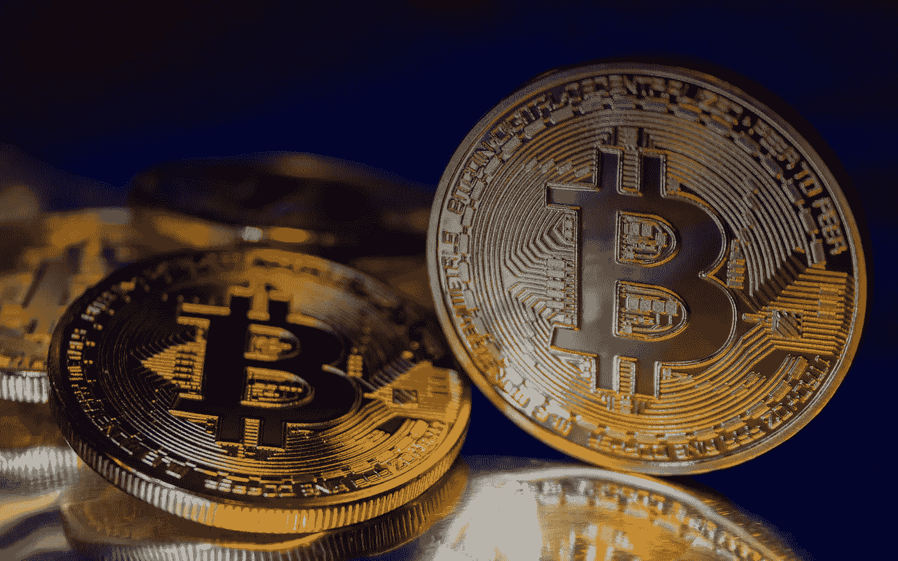
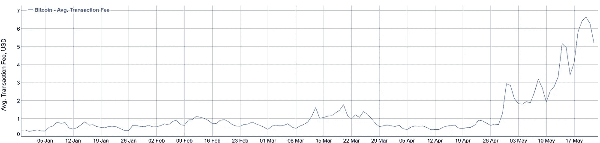
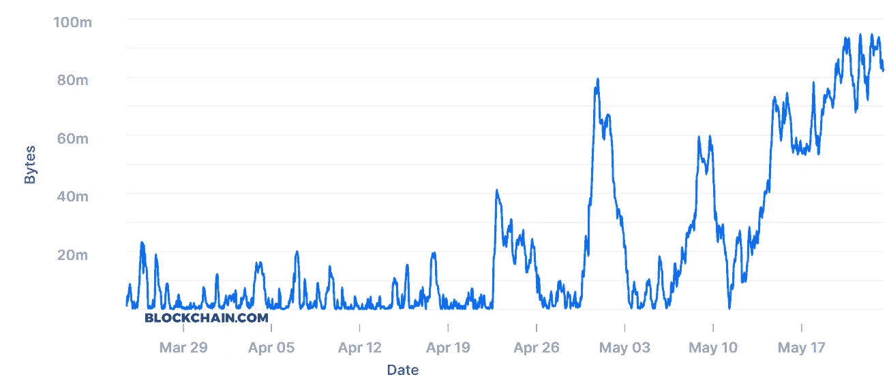

# 比特币交易手续费会如何发展？

> 原文：<https://medium.datadriveninvestor.com/how-will-the-bitcoin-transaction-fees-develop-afc887e8e87a?source=collection_archive---------2----------------------->

比特币的平均交易费用已达到 4 月 28 日以来的最低水平。如今，发送一笔比特币交易的平均成本仅为 1 美元左右。

就在两周前的 5 月 20 日，比特币交易的平均成本为 6.64 美元。这是近两年来最高的平均费用——自 2018 年 7 月以来没有过。

今年年初，平均费用低至 0.28 美元，自 1 月 1 日以来上涨了 2.213%。

比特币交易平均成本的突然飙升似乎是由于在比特币的整体奖励减半之前，网络上的活动增加了。

这意味着自 5 月 20 日以来，比特币交易的平均费用下降了 83.7%。5 月底交易费的大幅上涨恰逢 5 月 11 日比特币减半的炒作，此后新比特币的大宗奖励减半。

 [## 比特币满足价值储存的属性吗？

### 由卢卡斯·维斯弗莱克在首都

medium.com](https://medium.com/the-capital/does-bitcoin-fulfill-the-properties-of-a-store-of-value-1af3e59a0c8f) 

但是街区奖励的减少——从每街区 12.5 BTC 减少到 6.25 BTC——在 5 月 12 日通过了，费用只是继续飙升。自从交易费用减半以来，平均交易费用飙升了 144%以上。

 [## 比特币:与之前减半的 10 个差异

medium.com](https://medium.com/datadriveninvestor/bitcoin-10-differences-to-the-previous-block-halving-f2c44cc7f69b) 

每当比特币区块链被大量使用时，费用通常都会上涨。来自 Blockchain.com*的数据[支持了这一观点，该数据显示了大量积压的待处理比特币交易。](https://www.blockchain.com/charts/mempool-size)*

5 月 20 日，mempool 显示有 94MB 的比特币交易等待处理。自 2018 年 1 月以来，mempool 从未如此堵塞——在比特币迄今为止最大的牛市高潮期间。

作为参考，比特币的区块一次处理 1MB 的交易。当网络被大量使用时，人们被迫支付更高的交易费用，以获得将他们的交易包含在下一个块中的特权。

 [## 加密货币行业是死是活？数据驱动的投资者

### 九月初，我们在 X-Order 内部就代币市场的未来进行了一场辩论。有趣的是，我们的观点是…

www.datadriveninvestor.com](https://www.datadriveninvestor.com/2019/12/12/will-the-cryptocurrency-industry-be-dead-or-alive/) 

用户仍然可以在钱包内自由设定较低的交易费用。然而，他们面临着被比特币矿工忽视的风险，这些矿工自然会寻求更高的费用。

比特币用户甚至可以自由地将费用设定为零。在比特币的早期，这是一件常见的事情，但今天，矿商们更有可能忽略这种交易，或者完全拒绝它们。

货币政策的这一部分被硬编码到比特币协议中，几乎使采矿收入减半，这意味着矿工必须付出两倍的努力才能获得相同数量的比特币奖励。

随着比特币交易需求的增加，减半宣传导致需求激增，因为一些人认为，减半后的比特币价格可能会按照前一半的模式上涨——处理比特币交易的需求飙升。

 [## 比特币是货币吗？或者钱到底是什么？

### 你在这篇文章中学到了很少有人知道，但每个人都应该知道的东西。

medium.com](https://medium.com/the-capital/is-bitcoin-money-or-what-is-money-anyway-65812fba67ec) 

然而，随着新的、更强大的矿工进入网络，比特币网络的散列率在最近几天飙升，这证明了有足够多的比特币矿工来处理交易。

这意味着目前的数字仍比 1 月 1 日高出 277%。但如果目前的下降趋势持续下去，平均交易费可能会回到今年年初的水平。

我在每月一期的 [**简讯中分享了更多私密的想法，你可以在这里**](https://mailchi.mp/bf8f8e8ed697/keep-in-touch-with-lukas) 查看。请在评论中告诉我，并在各种社交媒体平台上加入我:

[**推特**](https://twitter.com/WiesfleckerL)●[**insta gram**](https://www.instagram.com/lukaswiesflecker/)●[**脸书**](https://www.facebook.com/lukaswiesfleckerr)●[**Snapchat**](https://www.snapchat.com/add/luggooo)**●[**LinkedIn**](https://www.linkedin.com/in/lukas-wiesflecker-1b11251a5/)**

**无论你做什么，都要带着爱和激情去做！**