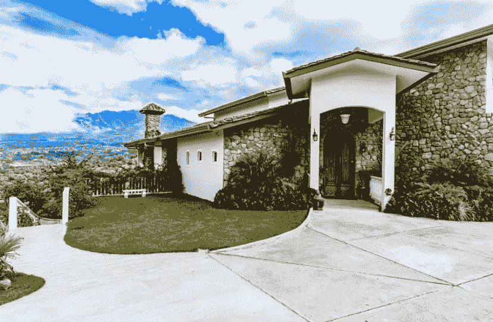

# 当地理位置不再重要时，房地产市场将如何应对？

> 原文：<https://medium.datadriveninvestor.com/how-will-the-real-estate-market-cope-when-location-no-longer-matters-6174f5f7445b?source=collection_archive---------19----------------------->

## 过去销售房地产的位置，但在远程工作和学习的时代，它不一定提供价值

> 照片由 Unsplash 提供

# 是什么推动了有形资产的价值？

有形资产是你所拥有的看得见、摸得着、摸得着的东西。有形资产是指产品、商品，你猜对了，还有房地产。

住宅、度假出租、酒店和商业建筑/广场都被归类为房地产，因此是有形商品。

# 是什么决定了房地产等有形资产的价格和价值？

虽然有形资产是你看得见、摸得着、摸得着的东西，但决定它们的价值和价格的往往是无形的(你看不见、摸不着、摸不着)。在房地产方面，有人可能会说，房地产拥有的一个有形的价值驱动属性是等待它，位置。

# 位置，位置，位置

任何一生中认识房地产经纪人的人都听过“位置、位置、位置”这句话来解释为什么一个基本上糟糕的房产定价过高。

它离商店、餐馆、你的工作单位很近，学校是顶级的，通勤时间很短。。。无限期

# 让我们谈谈新技术革命中的增值主张

*为了节省时间，技术革命将被称为 T.R

**前 T.R.:**

*这栋房子很贵，因为它离商店和餐馆很近。*

**后 T.R.:**

我们可以在两个工作日内将所有东西送到世界上的任何地方。甚至我当地的杂货店和药店现在也送货上门。酒店甚至送货上门。

**前 T.R.:**

*这个房子贵是因为离办公室近，你的通勤路程会更短。想想你节省的时间！*

**后 T.R.:**

我们大多数人有时或一直在家工作。我可以在世界任何地方用手机或笔记本电脑登录工作。需要开会吗？电话会议、zoom 电话和 google meetings 会处理这些问题。我可以在我的卧室或船上或任何地方经营一家财富 500 强公司。

**前 T.R.:**

*这房子贵是因为顶级的公立学校！想想你的孩子不用付私立学校的学费就能接受的教育吧！*

**后 T.R.:**

我的孩子可以登录他们的 chrome book，听哈佛教授的互动讲座。Youtube 上有你能想到的所有免费内容，还有值得信赖的谷歌。

# 区位自由将无限期地打断房地产市场

现在，随着工作人员的移动性以及越来越多的不受地点限制的员工，房地产资产类别的一个有形附加值，即地点，现在基本上已经过时了。

因此，我的预测是，在未来几十年，我们将不会看到房地产的大幅增长，因为劳动力继续变得独立于地点，不太可能长期留在一个地区。