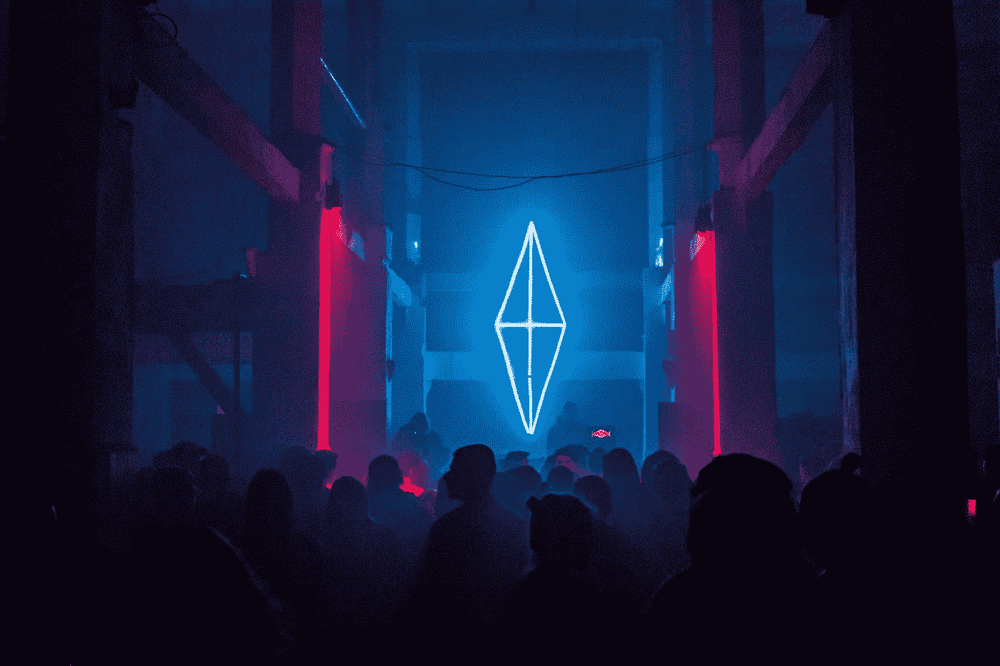

# 对互联网用户来说，技术乌托邦会是什么样子？

> 原文：<https://medium.datadriveninvestor.com/how-will-the-technological-utopia-look-like-for-internet-users-dc0e1955b515?source=collection_archive---------31----------------------->

Photo by [Alexander Popov](https://unsplash.com/@5tep5?utm_source=medium&utm_medium=referral) on [Unsplash](https://unsplash.com?utm_source=medium&utm_medium=referral)

如果你是小说世界的粉丝，你可能已经多次听说过乌托邦这个名字。这个概念适用于享有某些超然条件的想象中的土地。

在这篇文章中，我不去探究乌托邦理想的确切定义。我只是用这个词来定义一个理想的土地，对一个特定的人群(在线用户)有独特的功能。用户的需求由在线平台预测，并在任何尝试之前被消除。

在被用户监控之前，平台存在于他的脑海中。

# ***连续文明***

13 年来，互联网是我生活的一部分，最初我只是为了好玩和好奇，今天它已经成为我职业生活和事业的主要部分。起初，我把它看作是各种各样有趣的服务的集合。但是今天，我把它看作是一片广阔的、完整的、前景深远的土地。

我的存在和这片广袤土地上的很大一部分用户，从开始到现在，分成了三个不同的时期。像[威尔·杜兰特](https://en.wikipedia.org/wiki/Will_Durant)把地球上人类生活的历史划分为几个文明时期，我们可以称之为互联网文明时期，用一些指标来区分。

Photo by [Leon Seibert](https://unsplash.com/@yapics?utm_source=medium&utm_medium=referral) on [Unsplash](https://unsplash.com?utm_source=medium&utm_medium=referral)

第一个文明时期是当我在寻找一个特定的内容或服务，并通过搜索引擎访问所需的服务或内容。第二个文明时代是，由于我过去的搜索或兴趣，我的一些服务或内容由推荐系统提供给我，从而减少了我对搜索的需求。所以现在我们还处于文明的第二个时期。

但是互联网文明的第三个时期会是什么呢？我们也许可以根据过去的经验来预测其中的一些，并把它称为互联网用户的乌托邦。用户的需求在他们知道或搜索之前就被平台识别和解决。但是什么样的基础设施会创造这样的平台呢？

 [## 数据启示录后期|数据驱动的投资者

### 思考一个不可知的未来并在其中运作是很困难的。但是数据驱动确实有助于解决这个问题。数据是…

www.datadriveninvestor.com](https://www.datadriveninvestor.com/2020/09/21/data-apocalypse-later/) 

# ***文明第三版:灵活的用户界面和集成的全球用户记录数据库***

这几年好像一直有两个重要的东西:数据和用户界面。这些数据包括从宝贵的 cookie 资源和平台上收集的各种网站上的所有用户活动记录，这些记录经过提取和审查，以确定用户的部分偏好和需求，然后通过用户界面提供给他所需的内容。

在未来，除了基础设施和相关技术的广泛发展，这两个因素将是最严重的实际变化。下面我们只预测他们的情况。硬件基础设施、通信技术和访问速度肯定会发生变化，但最重要的是这两个因素。因为所有的基础设施和技术都为他们服务。但是这两个因素会如何变化呢？或许，如果我们更深入地观察当前的平台，我们会在其中一些平台上看到不属于当前时代的迹象。

Photo by [Mitchell Luo](https://unsplash.com/@mitchel3uo?utm_source=medium&utm_medium=referral) on [Unsplash](https://unsplash.com?utm_source=medium&utm_medium=referral)

# ***谷歌标签管理器:全局数据库*** 标志

社交网络和在线平台已经开始为用户创建数字伴侣，但需要一个更全面集成的全球数据库来更准确地利用这些信息。

一个用户可能在一天中访问几十个互联网服务，每个服务都可以满足他们的一些需求。这些平台中的每一个都单独聚集了用户行为数据。通过技术公司的协同作用，将这些信息整合到全球数据库中，可以产生更实际的结果。以至于连用户自己都欢迎这个惊人的结果。

下面是一些在线平台和它们从用户那里收集的数据类型的例子；

**社交网络:**兴趣话题、趋势、社交互动和交流社区

**搜索引擎:**用户需求、学习课程、身心疾病记录、兴趣爱好

**可穿戴小工具:**身体状况包括心率和健康状况、喜欢的运动、日常活动和活动范围。

**在线地图:**地理位置，包括娱乐和商务活动在内的外地旅行历史

**网络杂志:**内容偏好和喜欢的新闻话题。

该类别仅涵盖有限数量的在线平台，收集的数据类型仅为样本。通过这些在线工具，可以收集和使用更多类型的数据。

想象一下，有多少数据集成和集成到数据库中可以使平台更接近用户。通过神经网络和深度学习系统，甚至可以从这些数据中提取更有用的信息，包括基于传统心理模式的用户个性类型，如 [MBTI](https://en.wikipedia.org/wiki/Myers%E2%80%93Briggs_Type_Indicator) 。这使得在线平台最接近用户的思想和情绪。

在这种情况下，不仅可以提供用户当前需求的内容，还可以优化用户在不久的将来的未来研究模式、关注点和需求。

当创建这个全球数据库时，平台将不需要收集和分析数据。通过一个软件接口，只要用户进入平台，他的完整的数字孪生轮廓将被提供给平台。在这种情况下，服务器的所有焦点和力量将集中在开发内容和内容交付的质量上，这是互联网平台从一开始就关心的主要问题。

谷歌标签管理器(Google Tag Manager)等服务的出现，是整合所有用户行为分析工具的任务的一部分，可能是向全球数据库迈出的一步。想象一下，一个智能、免费的全球数据库将在诸如[区块链](https://en.wikipedia.org/wiki/Blockchain)等基础设施上开发，并跨平台共享。

它将监控所有覆盖平台的用户行为，并将信息存储在一个大型全球数据库中。它还将行为信息神经网络转换为有价值的知识，以数字双胞胎的形式存储每个用户在个性各个方面的完整状态。任何平台都可以通过 API 以加密的方式访问用户的数字加密信息，并使用它来个性化他们的平台。

Photo by [Alvaro Reyes](https://unsplash.com/@alvarordesign?utm_source=medium&utm_medium=referral) on [Unsplash](https://unsplash.com?utm_source=medium&utm_medium=referral)

# ***中:用户界面中普遍转型的标志***

内容呈现给用户的方式现在至关重要。未来这一数字将会翻倍。内容交付的发展需要平台接口的转变。为了理解未来发生的事情，我们必须首先回顾一下从开始到今天的界面设计。

多年来，网页界面设计倾向于使用各种各样的图形元素。除了图形界面，内容层也非常多样化。登录在线杂志后，用户可以获得各种内容和服务选项，但这种结构发生了变化。起初，图形层受到极简设计运动的影响，后来又受到材料设计语言的影响。

在未来，这些变化将变得更加严重和切实，在线平台将缺乏一个集成的用户界面。事实上，内容平台和社交网络的界面会根据用户的偏好和兴趣进行即时调整。我们过去称之为默认页面的东西在未来将不复存在。当然，在图形设计层，我们看到的未来要比现在的版本容易得多。图形符号和视觉设计有时会影响内容或服务，这是一个缺点。

为什么脸书用户会提到它？在其工具栏中寻找图形设计和醒目的颜色？还是社交互动、联系朋友、发展个人和社交关系是用户接入此类平台的重中之重？

也许在非常遥远的过去(网络文明的第一个时期)，引人注目的图形界面和美丽的图形符号吸引了用户的注意力，但今天重要的是内容、服务和最终的价值。

> 所以在未来，我们面对的是已经过了更高智力成熟度的用户。对他们来说，保持视觉设计原则就足够了，但最吸引他们的是平台创造的用户体验、内容和价值。

随着响应式标准的出现，包括 Bootstrap 和 Google Material 在内的集成设计语言和高级应用程序都在提供创建跨设备和操作系统的协作平台体验所需的基础设施方面发挥了作用。最新的基本发展是用户界面。

像 [Medium](http://Medium.com) 这样的媒体的出现，使得内容完全个性化，只有经过认证才能使用，这是我们现在处于第二个网络文明时代结束的标志。

Medium 主页中嵌入的很多内容只是针对平台从用户那里获得的认知而量身定制的，平台并没有通用内容布局的默认页面。如今，这种媒体仅覆盖精英受众，但在未来，所有媒体都将采用这种模式。平台界面将完全定制，以满足您的兴趣和需求。也就是说，每个平台为每个用户呈现不同的面貌。

Photo by [Skye Studios](https://unsplash.com/@skyestudios?utm_source=medium&utm_medium=referral) on [Unsplash](https://unsplash.com?utm_source=medium&utm_medium=referral)

# ***最后一战是为了内容:今天和未来的共同点***

全球数据库的发展和界面的演变只与第三次网络文明的技术和功能基础设施有关。未来，唯一的竞争将是内容生产和价值。和现在一样，这个平台的大部分精力都花在了生产内容和价值上。未来的媒体和平台将会向他们的观众提供最好的内容或价值。

内容定制将达到最大限度，算法将与用户最密切地互动，但重要的是呈现给观众的内容。所有这些都是为了在最短的时间内满足用户的内容需求。事实上，基于[用户的数字孪生](https://en.wikipedia.org/wiki/Digital_twin)和用户界面进化的全球数据库只是第三次互联网文明成果的一部分，被称为基础设施。这个文明的转折点就是内容本身。

在我们所期待的城市愿景中，创造性思维将倾向于生产有用的内容，而不是开发技术基础设施。人工智能是逻辑专家的儿子，可以在未来继续独立运作，甚至负责基础设施开发，并从用户数据和记录中独立提取语义模式。但是右脑专家将成为第三文明发展的主要部分和卓越网络的愿望，即生产有价值的内容，以满足用户的不同口味，在最短的时间内满足他们的需求。

**进入专家视角—** [**订阅 DDI 英特尔**](https://datadriveninvestor.com/ddi-intel)