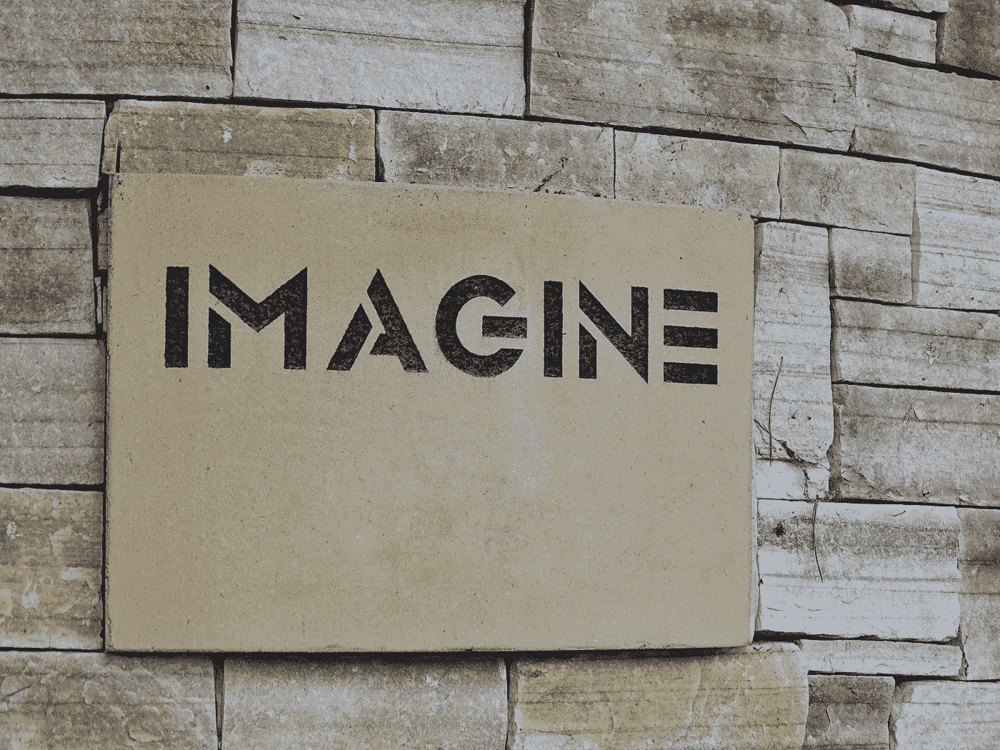

# 2050 年我们将如何挣钱生活？通过区块链释放无形经济的价值:第一部分

> 原文：<https://medium.datadriveninvestor.com/how-will-we-earn-money-to-live-in-2050-b81e9a5353d3?source=collection_archive---------3----------------------->

Photo by [Drew Beamer](https://unsplash.com/@drew_beamer?utm_source=medium&utm_medium=referral) on [Unsplash](https://unsplash.com?utm_source=medium&utm_medium=referral)

> 区块链是信任，信任是支撑商业和就业的基础货币。

我想知道关于工作的未来，2050 年的社会会是什么样子。技术和自动化的进步，以及我们目前有严重的全球性问题需要解决，将意味着我们未来的谋生方式需要从头开始重新设计。

在这篇文章的最后，我列出了一些在考虑使用区块链作为解决方案时要问自己的问题。

这项激动人心的新技术并不总是解决您业务问题的答案。新兴技术是你的数字工具包的一部分，它可以让你在当前的限制之外重新想象商业。

## 一便士买你的想法？

我们已经开始从有形的经济向无形的经济转变，在无形的经济中，知识和想象力得到重视和出售。

> 据估计，到 2040 年，无形经济将增长到惊人的 1，281 万亿美元。但是，根据最近欧盟委员会关于全欧盟数字技能差距的调查，43%的欧盟人不知道如何完成基本任务，比如在线搜索信息。

那么，我们如何带领大家踏上旅程呢？并确保所有人的全球繁荣。

## 2050 年——劳动力减少的经济

2050 年，我们可能会有一个由自动化推动的劳动力较少的经济；社会将如何调整和支付商品和服务？我们还会有政府、中央集权企业和法定货币吗？

我认为转型和变革的动力始于 2008 年比特币的创新，以及我们如何在数字世界中重新想象交换价值的出现。使用区块链技术进行直接的点对点交易，而不需要几个中间人，开创了金融支付和电子商务的发展。

 [## Azbit 旨在连接传统金融和加密货币|数据驱动的投资者

### Azbit 是下一个提供交易平台的加密项目，该平台提供保证金和算法交易。一样多…

www.datadriveninvestor.com](https://www.datadriveninvestor.com/2019/03/20/azbit-aims-to-connect-traditional-finance-and-cryptocurrency/) 

区块链是无形经济增长的一部分。区块链研究项目正在开发中，旨在研究新的全球支付系统如何为个人和当前的全球金融巨头发挥作用。这种发展的一个例子是，通过区块链应用程序，如 [**阿尔格兰德的**](https://www.algorand.com/) **无状态智能合同**，使机器能够进行机器支付。

> 智能合约是我们金融系统的终极进步，因为它们支持无信任执行和最终完成金融交易，而无需人工干预。

## 需要解决的社会问题

社会面临的问题涉及废除现代奴隶制、扭转气候变化、平均分配财富、解决个人数据使用的剥削以及可持续的城市和社区。这些只是今天需要解决的一些问题，我相信新兴技术可以有所帮助。我见过的一些最聪明、最尽责的人正在从事区块链、人工智能、机器人和物联网项目。他们想把他们开发的产品做好。

联合国 2030 年可持续发展议程概述了 17 个目标，2015 年，193 个联合国成员国通过了这些目标。这些目标是将我们的世界转变为一个可行的未来所必需的。

政策制定者将如何应对，以推动技术革命并跟上变革的步伐，从而确保全球共同繁荣？有人建议建立全球技术原则，但这些原则会奏效吗，就像历史上其他行业的指导原则一样，并不总是为社会的更大利益带来有利的结果。

Photo by [Belinda Fewings](https://unsplash.com/@bel2000a?utm_source=medium&utm_medium=referral) on [Unsplash](https://unsplash.com?utm_source=medium&utm_medium=referral)

## 重塑金钱——为电子商务的未来奠定基础

2008 年，随着比特币的发明，我们踏上了重新设计货币流通方式的旅程。从那时起，企业家和传统企业就被区块链的底层技术以及这种基础技术如何帮助他们在数字世界中蓬勃发展所吸引。

学者、计算机科学家、经济学家、梦想家和企业对区块链发展表现出的兴趣得到了 IDC 年度研发支出报告的支持。他们报告称，2019 年全球在区块链解决方案上的支出预计将接近 29 亿美元，比 2018 年的 15 亿美元增长 88.7%。

## 第四次工业革命

政府、政策制定者、立法者、企业、思想领袖和活动家正在思考我们的世界将如何适应这些根本变化的影响。这是[世界经济论坛议程——2020 年达沃斯上的一个明确的关注点和主题。](https://www.weforum.org/events/world-economic-forum-annual-meeting-2020/programme)

第四次工业革命似乎是永久性的。第一，作为我们参与的技术的使用者，我们都被召唤去挑战；例如，考虑我们的数据隐私和使用——这是最近的热门话题。我大胆猜测，自从最近的丑闻以来，我们大多数人都没有从集中的平台上离开。这些平台提供看似免费的服务，将数据情报货币化，无论我们是否意识到这一点，我们都接受这种交易。

这些用户友好和可访问的平台仍然吸引着用户数量的可观增长，因为它们方便且充满益处。

我们目前喜欢使用的这些大型平台的伦理论点。以及我们正在部署的新技术的社会影响，都在挑战监管机构，以前所未有的规模和速度跟上社会的变化。

## 区块链大规模采用

对于区块链来说，要获得与当前全球平台同等的大规模采用，技术需要成熟，以提供同样的易用性。

作为人类，我们通常喜欢舒适和简单，而不是复杂，如上所述，我们仍然使用我们讨厌的平台。

便利是我们人类 DNA 的一部分，是我们保存能量的先天生存机制。移动平台，删除账号都需要付出巨大的努力。而且不管欧盟 GDPR 法规是否善意，也不太可能删除你所有的在线角色。

鼓励用户远离集中式平台，将区块链应用作为首选。开发的区块链产品需要解决影响日常生活的现实问题，并为每个人提供用户友好和可访问的体验。

## 区块链的好处

区块链可以提供的两个独特优势是，与集中式平台不同；

*   区块链拥有无与伦比的内置安全性，并且
*   它还可以实现个人数据管理模式——您拥有自己的数据

## 现实世界中的区块链

这在现实世界中意味着什么？一个例子是当你用信用卡或借记卡支付咖啡时。那笔钱要经过大约五到七个中间人。一个基于厚厚的公司中间层的金融系统是不现代的、不高效的、不划算的，也不是数字安全的。

现在想象一个没有或更少中介的独家点对点支付的世界。现在，我们的金融支付系统和您的数据更加安全。因为潜在恶意攻击的失败点更少，并且您的详细信息落入坏人手中。

我认为区块链和去中心化的应用程序将在社会生活中扮演重要角色。

区块链不仅仅是技术堆栈的更新，也是我们全球社区和企业运营方式的根本性变革。

## 区块链和社区

我认为区块链最初的精神是以社区和用户为中心。第三代区块链，如阿尔格兰德，正在通过协同经济学、伦理学、哲学、商业和计算机科学的学校，为新的金融交易的发生奠定基础。以及一个广泛的全球大使社区，他们严格地投入到他们的开发和开源技术中。稳健和未来的区块链项目是整体性的，其发展具有全球包容性。毕竟，我们正在为我们的未来奠定基础技术。

## 使用区块链的社区拥有的未来商业模式

一些区块链解决方案中的一个令人兴奋的概念是利用纯粹的利益证明，并为区块链的金融系统创新共识机制，从而实现一种新型的商业模式和企业思维过程。不过，一些央行指出，这种新兴金融可能会破坏市场稳定，因为你正在移除监管交易的中介，这是正确的。但 2050 年的国家和司法管辖区可能会与今天截然不同。

为消费者带来价值回报的支付解决方案的进步可能会促进社区利益相关方商业模式的创新和扩展。类似于今天的合作企业，但规模更大，互动性更强。这种模式将使个人成为他们选择的公司的利益相关者，并分享这些利润。

区块链是信任，信任是支撑商业和就业的基础货币，未来将变得更加如此。未来的公司将不得不把他们的社会目标放在他们长期战略的中心，以保持相关性。

Photo by [Fachy Marín](https://unsplash.com/@fachymarin?utm_source=medium&utm_medium=referral) on [Unsplash](https://unsplash.com?utm_source=medium&utm_medium=referral)

## 评估区块链解决方案时要问的问题

*   当回顾商业区块链解决方案时，问自己以下问题:
*   它在解决什么问题？
*   市场是否已经存在？还是需要创建一个新的？
*   会给你带来什么优势，会盈利吗？
*   你要去掉一个大的中间层吗？
*   想一想区块链如何能让您在公司之外获得独特的能力？

如果你对更多的[区块链洞见](https://blockchainscout.co.uk/blockchain-insights)感兴趣，看看我关于区块链、分散金融和我们的星球的其他文章和思考。