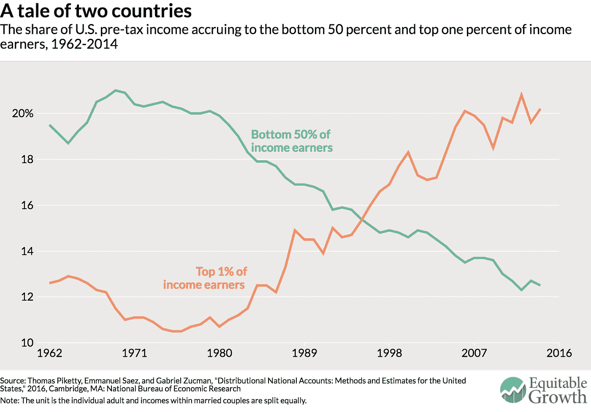

# 我们如何知道冠状病毒救援是否有效？

> 原文：<https://medium.datadriveninvestor.com/how-will-we-know-if-coronavirus-relief-works-beaad318c697?source=collection_archive---------4----------------------->

## 答案是我们需要衡量它。以下是方法。

本周，美国众议院议长南希·佩洛西(D-CA)公布了一项新的全面的冠状病毒[救助法案](https://docs.house.gov/billsthisweek/20200511/BILLS-116hr6800ih.pdf)。这是第一个也是唯一一个能够有效衡量低收入和中等收入家庭在危机中和危机后状况的一揽子救助方案。

这一条款将支持联邦政府决定收益——或者，在今天严峻的现实中，损失——如何在收入阶梯上上下下分配的努力。这很重要，因为**这是我们衡量国会颁布的救市计划是否真正奏效的唯一真正的方法。**

这一措施是基于 2019 年的[衡量实际收入增长法案](https://www.congress.gov/bill/116th-congress/senate-bill/3102/text?q=%7B%22search%22%3A%5B%22Measuring+real+income+growth+act%22%5D%7D)，该法案已经得到了两位诺贝尔奖得主、三位前总统经济顾问委员会主席、前美联储主席珍妮特·耶伦和数十位其他经济学家的[支持。该法案将要求商务部经济分析局将收入增长估计值分解为低收入、中等收入和高收入美国人的增长，该法案基于华盛顿公平增长中心命名为 GDP 2.0 的项目。实际上，它分配了国内生产总值的增长，因此我们可以看到经济变化中谁赢谁输。](https://equitablegrowth.org/nobel-laureates-former-fed-chair-two-former-cea-chairs-and-58-economists-endorse-the-measuring-real-income-growth-act-of-2019/)

总的来说，这个被提议的第四个立法方案可能有一些缺陷，但它也是向前迈出的重要一步，为国会提供了为经济复苏支付大笔定金的机会。根据提议，该法案将延长增强的失业保险福利，为大多数家庭提供额外的救济款项，向州和地方政府提供大量救济资金，并提高补充营养援助计划的福利水平，以减少冠状病毒衰退带来的饥饿和粮食不安全。它还将确保那些工作的人受到保护，让更多的工人获得带薪病假，并为重要的工人提供额外的工资。

但是，如果所有这些条款都成为法律，国会议员将如何知道他们是否成功地走向了收益(和损失)共享的经济？没有适当的数据，我们可能不知道普通美国人的经济是否已经复苏。这就是 GDP 2.0 的用武之地。

为了理解现在，让我们看看过去。

这并不是美国第一次引发对增强数据理解的经济灾难。上一次失业率如此之高是在大萧条时期，美国商务部委托国家经济研究局经济学家西蒙·库兹涅茨(Simon Kuznets)对国民总收入进行估算。1934 年，他[展示了他的团队的第一批发现，这些发现提供了从独立来源获得的非常详细的数据，以及各大行业和相关政府机构的统计摘要。](https://fraser.stlouisfed.org/files/docs/publications/natincome_1934/19340104_nationalinc.pdf)

Photo by [Sonder Quest](https://unsplash.com/@sonderquest?utm_source=medium&utm_medium=referral) on [Unsplash](https://unsplash.com?utm_source=medium&utm_medium=referral)

1942 年，美国卷入第二次世界大战之初，第一份美国国民收入统计数据公布。基于库兹涅茨的工作，他获得了经济学领域的[诺贝尔奖](https://www.nobelprize.org/prizes/economic-sciences/1971/kuznets/facts/)，这些报告帮助政策制定者了解国家生产了什么，哪些行业正在繁荣或萎缩。他们允许国家将经济资源用于战争，从那时起，我们就用这些数据来编制国内生产总值。

在大萧条和战争期间，库兹涅茨和他的团队汇编的数据帮助决策者度过了这两次危机。然后，从战后到 1980 年，由于经济增长的基础广泛，国内生产总值的增长合理地反映了美国各收入阶层的经济进步。

**然而，自 1980 年以来，GDP 增长带来的好处已经******不成比例地流向了富裕阶层，尤其是前 1%的人。我们知道这一点，因为研究人员托马斯·皮凯蒂、伊曼纽尔·塞兹和加布里埃尔·祖克曼花了数年时间开发和完善分解 GDP 的方法，这样我们就可以看到随着经济增长谁赢谁输。他们的最新数据显示，自 1980 年以来，最富有的 10%的美国人获得了超过一半的经济增长。与此同时，收入低于中值的美国工人阶级只获得了总增长的 10%。由于白人家庭不成比例地处于收入阶梯的顶端，这也意味着有色人种家庭不太可能从经济增长中受益。****

****

**Since 1980, the benefits of Gross Domestic Product growth have accrued disproportionately to the wealthy, especially the top 1 percent.**

**经济分析局仍然发布 GDP 的整体数据，而不是各个收入阶层的细分数据。然而，尽管它似乎考虑了整个经济，但 GDP 的增长在很大程度上反映了富裕美国人的收入增加。这使得它对于衡量普通美国人的收入毫无用处。这一事实并没有阻止经济学家、决策者和媒体将 GDP 作为衡量经济表现的最重要指标。这种关注完全被放错了地方。**

**库兹涅茨本人非常清楚 GDP 的局限性。他总是小心翼翼地区分总经济产出和“经济福利”的概念。他指出，GDP 并不是衡量幸福的标准。**

**由于国内生产总值是我们的衡量标准，它被作为衡量国家经济进步的重要指标呈现给公众。然而，因为它不能反映不同收入阶层的人们的生活状况，最近的研究表明，这种对 GDP 的关注扭曲了对经济的报道，以反映富人的生活状况。媒体报道好像每个人都过得很好，但事实上，只有富人过得好。正如《公平增长》杂志的奥斯汀·克莱门斯在[中写道](https://equitablegrowth.org/gross-domestic-product-sets-the-tone-of-the-u-s-economic-debate-while-leaving-working-and-middle-class-families-behind/)，“因为 GDP 增长被频繁、显著地发布，并且作为一个重要指标由来已久，记者们依赖于它，结果是美国公众被引导去相信经济是好的，而事实上，它可能只对一小部分处于社会顶层的人有利。”**

****随着《衡量实际收入增长法案》的潜在颁布，我们现在有机会重新构建我们的国家经济对话，以适应这一时刻。****

**由于早些时候国会的行动，BEA 已经开始为提供这些报告打下基础。BEA 最近[发布了 2007 年至 2016 年间高收入者和低收入者个人收入增长的新估计](https://apps.bea.gov/data/special-topics/distribution-of-personal-income/measuring-inequality-in-the-national-accounts.pdf)。这第一次发布[确立了](https://equitablegrowth.org/new-distributional-snapshot-of-u-s-personal-income-is-a-landmark-federal-statistical-product/)BEA 将用于每年报告这些数据的方法，最早从今年开始。这项新措施的颁布将为 BEA 提供关键支持，因为它试图为决策者、学者和公众提供我们都需要的工具，以了解所有美国人(而不仅仅是富人)正在经历的经济。理想情况下，随着时间的推移，BEA 将致力于按种族和跨地区提供这些数据，以便我们能够真正衡量美国增长时谁受益。**

**支持发布分布式账户——在可行的情况下，最好是每季度一次——是下一部冠状病毒立法的根本目的。没有我们从收入增长的分配测量中获得的知识，我们不知道我们正在做的事情是否有效。回顾大萧条时期，我们知道富人的收入迅速反弹，而大多数美国人却在苦苦挣扎。由于没有实时数据，媒体不会逐季度对此进行报道。如果我们有过去十年的这些数据，政策制定者可能会感到更大的压力，以确保复苏是所有人的复苏，而不仅仅是顶层的人。**

**这次我们有机会把事情办好。数万亿美元被花掉了。让我们确保美国人民从投资中获得尽可能好的回报，同时让我们的国家走上更强劲、更稳定、更广泛共享的经济增长之路。**

**希瑟·鲍西是华盛顿公平增长中心的总裁兼首席执行官，也是《自由的 T2:不平等如何限制我们的经济以及我们能做些什么》一书的作者 *。***