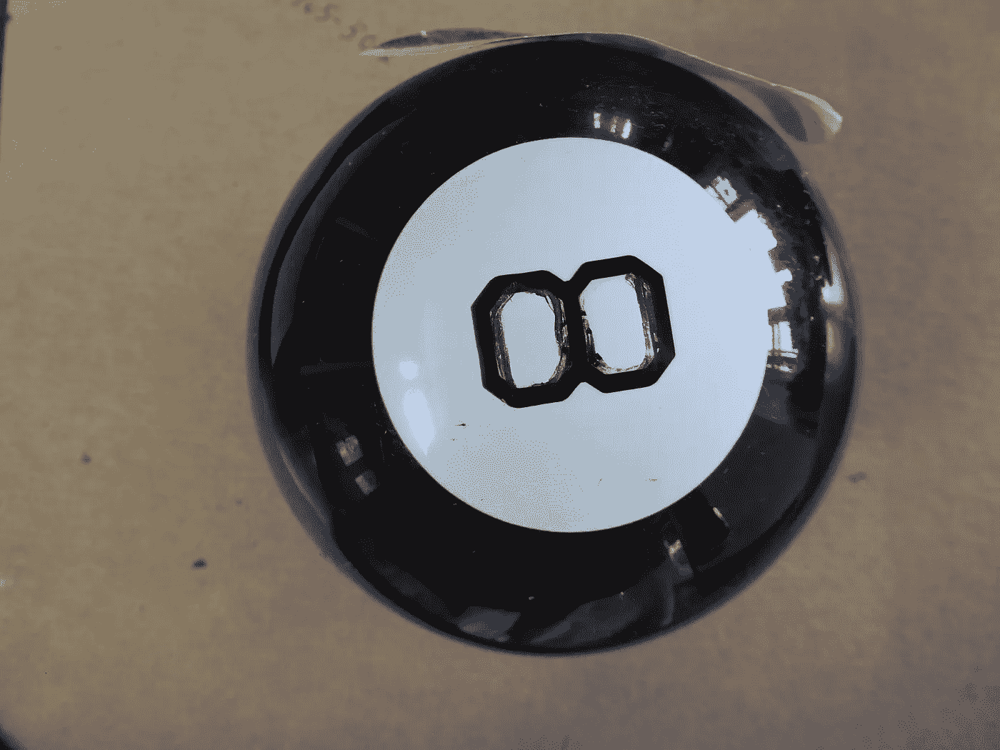

# 我们怎么知道我们已经过了疫情？

> 原文：<https://medium.datadriveninvestor.com/how-will-we-know-were-past-pandemic-67dabc717872?source=collection_archive---------13----------------------->

共享创伤的心理学和社会变革

No magic Eight Ball, Christyl Rivers

对于那些认为我们会回到新冠肺炎之前的生活的人，很抱歉让你们失望了。

大多数专家——我们真正需要关注的人——都同意，即使有了检测和接触追踪，我们的生活在未来一段时间内也会被打乱。仅仅是这两个期望中的变化:测试和追踪，就会对文化产生影响。有些人谈到豁免护照，但每个人都会认为这是公平和平等的吗？失去隐私的现实是我们在一段时间内必须应对的另一个变化。

还有一个现实是，当我们再次出现在公共场合时，不会是去看体育场比赛或音乐会，而是带着面具和围巾。

拥抱和握手，即使对于我们这些渴望再次接触人类的人来说，会很尴尬，对大多数人来说很有挑战性。

最后，随着我们走向重新开放，每个人都有不同的故事来讲述谁输了谁赢了。这些故事不仅仅是关于工作和破损的社会结构，而是关于人类的心碎和死亡。

## 共同的冲突

对于共同的创伤和损失，真的有很大的心理影响，所以许多人仍然在经历着关于重新开放的热切讨论。

如果你是一个外向的人，你肯定会在某个时候遇到一个和你不一样热情的人。同样，当你过度谨慎时(如果这再次成为一件事的话)，当你看到人们混杂在一起时，你会感到奇怪，就好像这是上个世纪伍德斯托克摇滚音乐节上的一次恋爱。

事实是，就像战斗中的士兵一样，我们可以用新的方式结合。但是，它也不会是一条布满玫瑰的道路。

我们如何理解所有这些人类的情感和感觉？深呼吸，记住我们是不完美的人类，这很重要。我们必须允许一个缓慢而容易的调整，以便不发脾气，不指责他人，或者对我们的同胞采取警戒姿态。

 [## 认知计算——一套被广泛认为是……

### 作为它的用户，我们已经习惯了科技。这些天几乎没有什么是司空见惯的…

www.datadriveninvestor.com](https://www.datadriveninvestor.com/2020/02/19/cognitive-computing-a-skill-set-widely-considered-to-be-the-most-vital-manifestation-of-artificial-intelligence/) 

如果之前没有关于什么是“隐私”的一致意见，关于隐私的态度将会被放大。这是因为当人们感觉到真正的危险时，即使他们是无意识的，他们也会产生更多的肾上腺素、荷尔蒙和恐惧。或者，在光谱的另一端，那些迫不及待想再次成为超级社交者的人会奇怪，为什么每个人在他或她的感知中都是如此冷漠，甚至是敌对的。

我们人类情感反应的心理学将不得不被逐个案例地检验，一次一个互动。

## 时代变了

然而，在某些情况下，人类也有一种非常有弹性的方式来接受变化。如果你们还记得 911 之前的机场是什么样的，以及 911 之后机场是如何变化的，你们应该知道这种变化是什么样的。现在想象一下，扩大到包括所有公共场所，有新的规则，新的期望，新的协议，甚至新的抱怨。

所有这些都是作为一个社会公民的一部分。

许多人希望，有了这种普遍的经验，许多新的规则将反映我们已经吸取的惨痛教训。

每一次创伤都会给我们一些教训，我们只需要意识到它们可能不是每个人都想看到的推动变革的教训。例如，我们可能会改变我们的饮食习惯，以反映病毒是通过严重干扰自然而传播的，但这意味着改变食物的一切，从我们采购食物的地方，到我们提供食物的地方，以及我们如何食用食物。

如果大多数人同意工厂化养殖或野生动物贩运对人类健康有害，新的限制就会生效。然而，这种改变会遭到激烈的反对，因为这是人类对任何大规模新转变的正常反应。

一百多年前，当简单洗手被引入时，许多医生反对这项新措施。在大多数情况下，需要几十年的时间，一个全新的社会才会出现，这个社会将这些行为视为完全常规和正常的。

## 玫瑰色眼镜还是透过玻璃，深色？

鉴于 COVD-19 的巨大影响力和普遍经验，我认为变化会来得更快。不过话又说回来，我心理乐观，就像很多职场人士心理悲观一样。

我们将经历混乱的变化，在工作、呆在家里、上学、娱乐和吃饭方面。让我们都准备好接受考验。