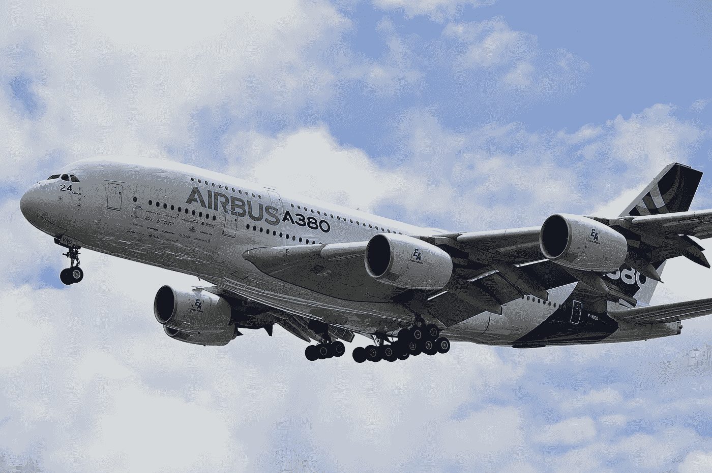
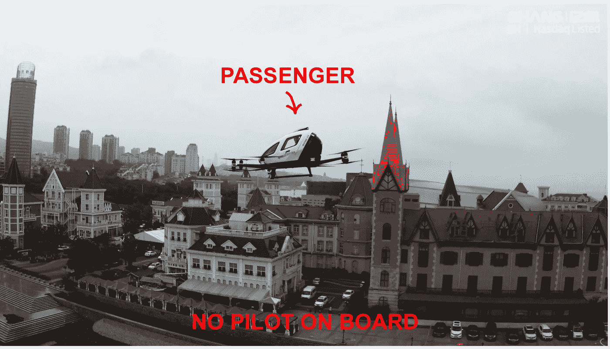

# 2025 年你将如何飞行？

> 原文：<https://medium.datadriveninvestor.com/how-will-you-be-flying-in-2025-b99beec13e09?source=collection_archive---------1----------------------->

## 航空公司——以及飞机——将努力适应后大流行时代

The Airbus A380—world’s largest passenger jet—won’t be flying much in 2025\. Photo Daniel Eledut/Unsplash

去年二月，国际航空运输协会(IATA)的成员在纽约会面。议程中有一个特别热门的话题:新冠肺炎疫情对航空旅行的影响。国际航空运输协会的专家预测，与 2019 年相比，亚太地区的航空公司全年客运收入可能会下降 13%。他们预计影响是短暂的，主要集中在中国。

没有一个人预见到将要发生的事情。

今年 3 月，国际航空运输协会修改了它的估计。新的预测是*全球*客运收入将比 2019 年骤降 44%。

7 月，国际航空运输协会首席经济学家 Brian Pearce 报告称，6 月份的全球客运收入(实际数字)下降了 86.5%。展望未来，他说，“商业航空旅行人数预计要到 2024 年才能恢复到 2019 年的水平。”

新冠肺炎导致了大量有翅膀的东西的取消。16，000 多架商业客机停在孤立的阳光明媚的飞机跑道上。成千上万的航空公司飞行员现在或者很快就会停在他们郊区的家里，在好市多烧烤廉价的廉价汉堡。今年 5 月，沃伦·巴菲特宣布出售他们的全部航空股票组合。伯克希尔-哈撒韦公司清算了美国航空公司、达美航空公司、西南航空公司和达美航空公司的 40 亿美元头寸。巴菲特解释说:“对于航空公司来说，世界已经变了。”

那么，我们去水晶球吧。在后 Covid 时代，航空公司和飞机会是什么样子？到 2025 年有多少人会坐飞机？他们会有多安全？出行习惯会有怎样的改变？飞机将如何被调整和修改——或者废弃和替换？

F 首先，我的资历:三十年来，我一直是一名“勇往直前”的 CEO。我驾驶我的广告公司的单引擎飞机去客户那里旅行。并为达索猎鹰飞机公司、NetJets 公司和飞行安全国际公司制作广告。如果我需要一个很好的猜测“航空业的下一步是什么”，我会打电话给航空贸易杂志的主编。这些人没有时间兜圈子，吹牛，或者公司的空话。(恰当的比喻)他们确实能从 30，000 英尺的高空看到航空。这一有利位置往往向他们展示了远在天边的机遇或问题。

为了这篇文章，我打电话给《航空运输世界》的主编凯伦·沃克。她是一个直言不讳的人。对于我提出的 2025 年的航空会是什么样子的问题，她给出了明确的答案:

“我们谁也不知道。”

尽管如此，沃克指出，新冠肺炎的影响将是持久的。会有持续的混乱。各大航空公司都会破产消失，有的已经有了。“其他航空公司，”她说，“将被他们国家的政府接管和拥有。”但是联邦政府对航空公司的控制经常会带来新的问题。提供的优惠越少，票价可能越高。路由可能不太方便，客户服务可能会变得吝啬。而且，一般来说，创新不会在政府的花园里蓬勃发展。

 [## 这么说一家大型风投基金正在投资你的初创公司？4 实际考虑|数据驱动的投资者

### 首先，恭喜你。融资总是需要努力的，一个大的风险投资基金当然是一个大的…

www.datadriveninvestor.com](https://www.datadriveninvestor.com/2020/08/09/so-a-big-vc-fund-is-investing-in-your-startup-4-practical-considerations/) 

飞机的组合将会改变。机队将包括更多更小、更省油的客机。巨型四引擎洲际空客 380 和波音 747 可能会继续停放。A380 的生产将于 2021 年结束，波音公司在运行了半个世纪后，将于 2022 年停止建造标志性的 747。这些巨型飞机是前 Covid 时代的恐龙——太大，太耗油。

此外，随着旅游市场开始开放，沃克说:“这可能是一场竞争的大屠杀。”幸存的主要航空公司将背负沉重的债务负担(包括拥有闲置数月或数年的飞机的成本)。)然而他们需要现金来重新赢得市场份额。与此同时，一批敏捷的航空公司初创企业必将涌现——在重组后的市场中寻找利基机会。无论是新航空公司还是旧航空公司，最具创新性和以客户为中心的运营都将获得奖励。

有鉴于此，展望 2025 年，今天的航空公司应该考虑哪些“生存因素”？(注:作者推测。)

## **不要在我身上呼吸的因素**

即使疫苗在 2025 年前到位，Covid 的宿醉也可能会持续下去。太多的人会失去太多的亲人。可能有一种普遍的不祥预感:*如果它回来了呢？如果新冠肺炎变异成更致命的 Covid-20 怎么办？*对航空公司来说，关键问题是:如何最好地保证乘客在登机和机舱内的人身安全？

让我们对五年后的情况做一些假设:在大门口将会有即时结果的病毒测试。飞机空气过滤系统将得到进一步改善(今天的 HEPA 系统非常好。)。座椅之间会插入某种物理分隔物。即使采取了这些措施，未来的空中旅行者会高兴地坐在离陌生人 18 英寸远的地方五个小时吗？

另一个复杂因素是终端。当拥挤时，它们可能成为感染的培养皿。直飞航班的减少(很可能是由于运营现实)将意味着在熙熙攘攘的机场候机室等待更多的时间。如果 10%的公众选择不冒这些风险，这对航空公司微薄的利润有什么影响？

## **缩放系数**

世界上的每一个组织都报名参加了一个速成班:“如何举办一个更好的视频会议”首席执行官们欢欣鼓舞:*哇。我可以随时与所有关键人物进行动态互动，无论他们身在何处。*幼虎参赛:*我怎样才能从我的变焦头脑风暴会议中获得更多想法？*一种新的反旅行/支持视频的工作习惯正在生根发芽，而且根会很深。很大一部分商务旅行——较低层次的面对面会议——可能会永远消失。

## **闲谈因素**

但视频通话永远无法提供闲聊的因素。人类将永远渴望真正的人类接触。坐飞机去参加一个会议不仅仅是参加几个会议。参与者享受早餐、午餐、晚餐、走廊活动、网球和高尔夫球游戏的欢乐组合。会议在纽约、洛杉矶、芝加哥、新奥尔良还是拉斯维加斯举行？那么这种体验可以包括很棒的餐馆和令人瞠目的娱乐。十年后，没有哪位首席执行官会对他的顶级客户说。“嘿，比利·鲍勃，我永远不会忘记我们在 2020 年第一次见面的时候——那真是一个他妈的伟大的变焦电话！"

## **公司文化因素**

伟大的公司文化因伟大的故事而繁荣。其中许多都发生在远离总部的地方。例如，早在 20 世纪 80 年代初，Money*的广告总监*在佛罗里达州的莱福德岛举办了一次销售会议。这是午夜，在一天的会议结束很久之后——聚会的酒也喝完了。这个团体的无与伦比的领导者跳进了一辆 E-Z-GO 高尔夫球车，紧急跑到俱乐部去要更多的朗姆酒。他把它直接开进了一个没有灯光的游泳池。但是这个无畏的家伙还是设法回来了，浑身湿透，徒步，带着烈酒。这个关于个人坚持不懈的故事成为了时代公司的传奇。

## **大型会议大厅因素**

终极的商业网络工具将永远是大型会议。这些聚会可能会很刺激！在一个巨大的会议中心里，你的整个行业聚集在一起。所有主要竞争对手都在价值百万美元的华丽展位上展示他们的产品。世界各地的顾客来到这里浏览——打开支票簿，准备好信用卡。大型会议会消失吗？没门儿。

## 商务飞机会在 2025 年飞行吗？

在我飞行的日子里，查理·赫希是我的飞行教练。从那以后，他离开了航空公司(他是一名 747 机长)，进入了商务航空领域。今天，他驾驶塞斯纳奖状喷气式飞机从事包机业务。我打电话问他有多忙？

“今年上半年，我飞了 50 天，”他说。"但在 3 月 15 日，一切都停止了，我的生意一落千丈."

听起来不太好。但是赫希继续说道。

“我的手机保持了两个月的安静。然后在 5 月 17 日，它突然开始响了——从那以后，我已经飞了 12 天了。”

我想听到更多关于商务航空的可能上升。于是打电话给*商业&商业航空*的主编。威廉(比尔)陈嘉炜是一个领先的航空记者，今年早些时候，他获得了航空“学院奖”。他被载入了航空界的活传奇。(这个精英航空协会的其他成员包括尼尔·阿姆斯特朗、巴兹·奥德林、“萨利”苏伦伯格和名人飞行员约翰·特拉沃尔塔。)陈嘉炜对公务机运营商说了一些安慰的话:

“商务航空没那么担心，”他说。“大多数飞行部门没有关闭——他们仍然拥有自己的飞机，也保留了自己的飞行员。”

陈嘉炜谈到了物流障碍——当 Covid 大规模抵达时——导致公务机运营商按下暂停按钮。

“如果一个高管团队想飞往加州，他们会住在哪里？他们会在哪里吃饭？他们的顾客甚至会希望看到他们吗？”

听起来很消极。"那么，商务航空有麻烦了，是吗？"

“不，恰恰相反，”他说。“公务机行业的共识是‘这是我们的*时刻！*’”

“那是怎么回事？”我问。

“想想吧，”他说。“如果你的航班从泰特波罗的通用航空终点站出发，你的豪华轿车可以直接开到飞机跟前。没有候机楼、等候门和行李检查的麻烦。公务机客舱的座位允许足够的距离。将会有更多的喷气机卡、喷气机俱乐部和空回程航班上的交易。”

“未来，”陈嘉炜说，“商务航空将会更加民主化——以新的方式让它变得更加实惠。”

他如何看待大型航空公司在试图东山再起时将面临的挑战？“航空公司将需要投入大量资金来吸引旅客，”他说。“你可以看到‘99 美元到毛伊岛’或‘19 美元到坎昆’这样的票价。”"

美中不足的是幸存的航空公司将会资金紧张。他们亏损的资产负债表可能不允许他们提供亏本的廉价航班。

## **2025 年前会有新飞机问世吗？**

新飞机的开发是一个复杂的多年过程。这需要大量的资金和多年的详细规划。制造商制造了一个原型并进行测试。然后他们创新以解决问题，并再次测试。接下来是更多的创新/测试/创新/测试循环——直到这只鸟准备好接受联邦航空局的最终检查。为了批准一种新型号，检查员对它进行了一系列认证试飞。目前，还没有准备在 2025 年前试飞的新飞机。

但是一个闪亮的小玩意已经在这里了。准备学习一个新的缩写词:AAV。它代表自主飞行器。中国科技企业亿航控股(Nasdaq: EH)是无人机领域的市场领导者。他们的 EHang 216(见图)可以在一个由 16 个螺旋桨提升的小舱内搭载两名乘客。它已经在中国、美国、奥地利、荷兰、卡塔尔和阿联酋完成了 4000 多次飞行，所有飞行都获得了当地航空监管机构的批准。其中许多是客运航班。哦，我有没有提到？“自主”意味着 216 架飞机*上没有飞行员*。

The EHang 216 on a sightseeing flight in China — without a pilot. Photo credit: EHang, edited by author

别担心。地面站的人类飞行员正在监控你的飞行。但你的机上飞行员是隐形科技船长。(想象一下五年后 AAV 科技会把我们带到哪里，这很有趣。)

## **快乐飞行的未来**

到 2025 年，公众会重返天空吗？他们会再次追求辉煌的遥远假期和异国情调的假日远足吗？你作者自信的预测:是的！—但我们必须等待 Covid 瘟疫过去。当这种情况发生时，满是灰尘的大箱子将被从壁橱里拖出来，从阁楼上搬下来——旅行癖将填满十亿人的心灵。度假和休闲旅游的预订量将创下新纪录。

如果你不相信这一点，请记住——通过 Zoom 游览巴哈马总是很糟糕。

关于另一个飞行故事，请阅读 1986 年世贸中心双塔是如何构成一个惊人的戏剧性特写镜头的。

 [## 给我父亲的圣诞礼物

### 在 1986 年的一次飞越中，双子塔呈现出鲜艳的金色条纹

medium.com](https://medium.com/storyville-stories/a-christmas-gift-for-my-father-86815de9101d) 

**访问专家视图—** [**订阅 DDI 英特尔**](https://datadriveninvestor.com/ddi-intel)