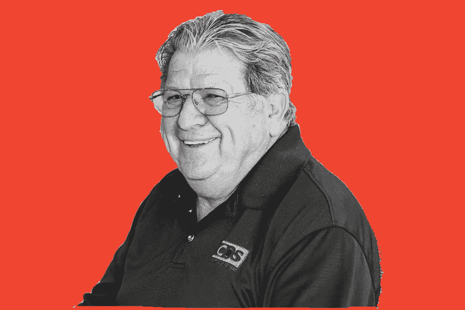

# 威利斯·约翰逊如何将一个垃圾场变成 270 亿美元

> 原文：<https://medium.datadriveninvestor.com/how-willis-johnson-turned-one-junkyard-into-27-billion-15d9aab249e2?source=collection_archive---------9----------------------->

artwork by author

如今，你打开一份商业报纸或杂志，很难不看到一些关于科技公司的内容。

埃隆·马斯克。方股票。加密货币。

这些故事吸走了房间里所有的氧气，因为它们很性感。但作为一名投资者或企业家，很难在一个人人皆知的行业中获得优势。

我喜欢潜伏在幕后的公司。那些看不见的、不受人喜欢的公司，却满足了一个关键的需求。

垃圾车、废水处理、废金属买家——这样的例子不胜枚举。人们经常对这些服务嗤之以鼻，但他们缺乏的性感，可以通过现金流来弥补。

# 输入部分

威利斯·约翰逊(Willis Johnson)与世界上最大的打捞工具拍卖商 Copart 一起建立了这些鲜为人知但极其成功的企业之一。

像其他处理服务一样，移动报废汽车的业务是在幕后进行的。在事故中报废的汽车不会简单地消失。每年有数百万辆汽车被销毁，从技术上和后勤上来说，运往垃圾场的过程都很复杂。

这也非常有利可图。2020 财年，Copart 营收 22 亿美元，盈利 7 亿美元。该公司估值为 270 亿美元。约翰逊本人身价超过 20 亿美元。

如果你在 1994 年 Copart 首次公开募股时投资 1 万美元，你今天会有 178 万美元。

这位越战老兵是如何从一无所有变成惊人的财富的？

# Copart 增长故事

1982 年，约翰逊从加州瓦列霍的一个垃圾场开始，他把赚到的每一分钱都投入到了生意中。当时，救助汽车业务是一个高度分裂的行业，约翰逊通过收购在早期扩张。

约翰逊对迪士尼主题公园展示的“商业中的商业”概念很感兴趣，那里有门票费、餐馆和礼品店，他通过在自己的位置添加越来越多的服务，将 Copart 打造成了一个庞然大物。

> 每次你为同一渠道增加收入流，利润率都会发生巨大变化。你把更多的东西放进了那个管子。这是我在业务中一直努力做到的，也是我们成功的原因。

像迪斯尼乐园一样，约翰逊早期的废品收购站收取少量入场费。然后，客户支付从停车场的汽车上取下的单个报废零件，或者参加 Copart 的整车拍卖。除此之外，科帕特还经营旧货生意，出售经常被丢弃在报废汽车中的垃圾。

约翰逊意识到该行业正走向整合。较大的公司可以提供规模经济，赶走较小的竞争对手。寻求获得市场主导地位的保险汽车拍卖公司(IAA)开始收购全国各地的夫妻店。随着竞争的加剧，Copart 于 1994 年上市以筹集资金。

不久之后，Copart 预见到拍卖最终会转移到网上。约翰逊总是尝试新技术，他是公司里最早采用计算机的人。该公司开发了一个拍卖车辆的在线系统，消除了现场拍卖的管理费用和不便。

# 威利斯·约翰逊的故事

在他 2015 年的自传《从垃圾到黄金:从废品到世界上最大的在线汽车拍卖》中，威利斯·约翰逊讲述了一个经典的白手起家的故事，这个故事讲述了一个人从赤贫开始，努力工作，克服了难以置信的困难，建立了一个价值数十亿美元的帝国。

 [## 自然中的创新:改变企业的生活史战略方法|数据驱动…

### 在我们这个时代，每个人都以谷歌、亚马逊或苹果为例谈论创新。在这些会谈中，创新…

www.datadriveninvestor.com](https://www.datadriveninvestor.com/2020/11/20/innovation-in-nature-a-life-history-strategy-approach-to-change-your-business/) 

在涉足这个奇特的行业之前，约翰逊过着丰富多彩的生活。虽然他来自一个普通的家庭，但他的成长得益于父亲涉足许多商业风险。在经历了越南战争的残酷战斗后，年轻的约翰逊带着对生活的新热情和创业的渴望回到了美国。

像其他成功的商人一样，约翰逊决策迅速。大多数人都支支吾吾，因为没有行动，他们默认选择什么也不做。据他自己承认，约翰逊倾向于凭直觉行事，甚至在仅仅约会十天之后就向他的妻子求婚(他们在 50 多年后仍然结婚)。

由于约翰逊朴实无华的风格，许多实力强大的竞争对手和华尔街金融家往往会忽视科帕特。从某些方面来说，这被证明是公司的一大优势。在与 IAA 的整合战中，许多较小的废品收购站老板选择卖给谦逊而有风度的约翰逊，而不是 IAA 的富有高管。

# 理想的企业

像亚马逊、脸书和其他科技公司一样，Copart 受益于网络效应。这项服务很有价值，仅仅因为它是买卖报废汽车的目的地*。美国打捞行业是双头垄断，Copart 和 IAA 都占有大约 40%的市场份额。*

凭借其庞大的仓储网络、来自大型保险公司的重复业务以及领先的在线平台，一个新贵要想击败 Copart 是非常困难的。这项业务有一个巨大的“护城河”，正如沃伦·巴菲特所说。

尽管 Copart 的利润随着汽车销售价格而起伏，但收入基本保持稳定，因为人们经常撞车。总损失频率也在增加，因为汽车维修费用更高。与此同时，发展中国家对二手车的需求正在上升，因为汽车的寿命比过去长得多。现在，Copart 的大部分业务是向海外买家拍卖整车，而不是出售零部件。

随着美国市场饱和，Copart 将目光转向了国际扩张。使用在美国行之有效的相同策略，Copart 成功地收购了许多外国救助业务，并将其并入自己的业务。

# 垃圾变黄金

这个故事引人注目的转折是，任何人在 2015 年——在 Copart 上市 20 多年后——拿起约翰逊的书，都可能购买这只股票，并在 5 年内获得 6 倍的回报。

我本人在 2017 年的 *Seeking Alpha* 和我的在线出版物[*Tyco noist*](https://thetycoonist.com/2017/09/22/how-willis-johnson-turned-one-junkyard-into-7-billion/)*上都写过关于购买 Copart 的文章。初始投资已经翻了两番。*

我现在会购买 Copart 吗？很可能不会，如果仅仅是因为今天的估值高得多。华尔街开始意识到，Copart 是一家产生惊人回报的科技公司。

即便如此，我也不打算卖掉我的股份。当其他人都在忙着追逐电动汽车时，我会愉快地坚持肮脏的回收业务。

[*在这里报名*](https://lp.constantcontactpages.com/su/ZE6T9rX) *获取我的免费每日商业和金钱新闻公告，仅限于* [*的大亨。*](https://thetycoonist.com/)

## 访问专家视图— [订阅 DDI 英特尔](https://datadriveninvestor.com/ddi-intel)