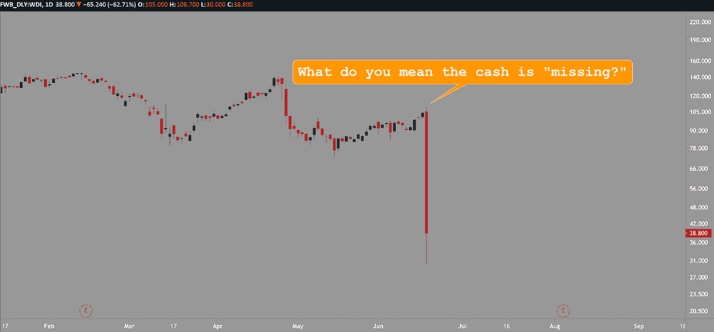

# Wirecard 如何隐藏其€19 亿美元的阴谋|数据驱动投资者

> 原文：<https://medium.datadriveninvestor.com/how-wirecard-concealed-its-1-9-billion-plothole-data-driven-investor-c851fb645c69?source=collection_archive---------8----------------------->

## 祝你好运挤出这一个。

德国主要支付处理公司 Wirecard 在一次审计中显示，其账本丢失了大约 19 亿€现金。事实证明，根据外部审查，*这笔现金实际上根本不存在。这不是 Wirecard 第一次与审计人员发生冲突。让我们回到几年前，探索 Wirecard 的来源，它今天是如何工作的，以及它是如何陷入如此混乱的。*

Wirecard，[成立于 1999 年](https://en.wikipedia.org/wiki/Wirecard)网络繁荣时期，是诞生于那个泡沫时代的少数幸存公司之一。该公司最初是一家为基于网络的公司提供在线支付服务的公司，这在当时是一个新奇的概念，并通过这一最初的价值主张发展壮大。虽然它仍然是一个数字支付处理器，但这一核心概念在大约 20 年后更加适用，因为每个企业都保持着一些在线业务。

# Wirecard 的当代服务产品:

Wirecard 是为 300，000 多家客户提供全球支付解决方案的市场领导者，在全球 26 个地方雇用了 5800 多名员工。这是一家市值数十亿欧元的公司，并准备在 2020 年赚取超过 10 亿€的 EBITDA 面对新冠肺炎环球疫情不是小数目。然而， [EBITDA](https://www.investopedia.com/terms/e/ebitda.asp) ，或净利润加上利息、税收、折旧和摊销，并不一定是辨别公司盈利能力的可靠方法。根据公司的注册地，机构支付债务或已发行债券的应计利息，还负责纳税。公司还必须考虑随着时间的推移自有资产的折旧以及贷款的潜在分期偿还，这取决于支付结构。

EBITDA 是实际收益的一个混乱的、不准确的版本。根据 Investopedia 的数据，[当公司的净收入不尽如人意时，它们往往会关注自己的 EBITDA 业绩](https://www.investopedia.com/terms/e/ebitda.asp#:~:text=EBITDA%20is%20essentially%20net%20income,of%20financing%20and%20capital%20expenditures.)。在 Wirecard 的情况下，这个目标可能会转移分析师和投资者对€19 亿美元的关注，特别是与€每年 10 亿美元的收入相比。

# 这不是 Wirecard 第一次狡猾了

4 月份，在随后的审计中，由于发现 Wirecard 的会计流程存在违规行为，Wirecard 的市场份额下降了 26%。作为对这一[严厉指控](https://ru.reuters.com/article/technologyNews/idUSKCN22A0R4)的回应，Wirecard 首席执行官 Markus Braun 声明:“我想强调的是，总的来说，在每一点上，这些指控都没有得到证实。”当时，Markus 虽然在技术上是正确的，但他代表他的公司在重要事实和投机掩盖之间拖着一条细线。

随着[4 月份的审计报告被全球主要媒体报道](https://www.usnews.com/news/technology/articles/2020-04-28/wirecard-says-kpmg-audit-found-no-suspect-accounting)，Wirecard 最终对《金融时报》提起诉讼，指控其在一篇关于审计如何展开的报道中滥用商业机密。这起诉讼特别针对一位作者。丹·麦克拉姆在 2019 年 10 月公开了该公司不同寻常的会计标准[的故事。虽然 Dan 在《金融时报》上发表的 10 月份文章为 Wirecard 奇怪的会计做法提供了大量证据，但他在 2019 年 12 月发表的](https://www.ft.com/content/19c6be2a-ee67-11e9-bfa4-b25f11f42901)[文章](https://www.ft.com/content/845b0dce-1836-11ea-9ee4-11f260415385)进一步美化了这一说法，证明 Wirecard 在其支付处理操作中计入了他们的信托账户。

通过安永的调查和审计，今天标志着 Wirecard 结束的开始，巩固了公司内部奇怪的和潜在的犯罪财务。Wirecard 的股票在该公司账面现金大量失踪的消息传出后暴跌了约 63%。在几个小时内，灾难性的三分之二的市场份额逃离了之前强劲的资产。

Wirecard AG in free-fall after 1.9 billion Euros turned out to be fake; Source: HeavyZen

该公司首席执行官马库斯·布劳恩(Marcus Braun)厚颜无耻地将该公司描绘成欺诈行为的受害者，尽管股东受到了影响。Argonaut 绝对回报基金的经理 Barry Norris 在 4 月份审计的差异之后，在 Wirecard 中建立了一个[重大空头头寸](https://www.marketwatch.com/story/wirecard-shares-plunge-after-saying-auditor-cant-find-billions-of-missing-cash-2020-06-18)。诺里斯断言，Wirecard 有“比你在共产主义集会上看到的更多的红旗。”

德国股市监管机构正在单独调查布朗先生的内幕交易指控——[布朗持有该公司 7%的股份](https://www.marketwatch.com/story/wirecard-shares-plunge-after-saying-auditor-cant-find-billions-of-missing-cash-2020-06-18)。正如我们在[早先的文章](https://medium.com/datadriveninvestor/robinhood-retail-traders-are-getting-shafted-29bab6887f0c)中的类似事件所示，这位 CEO 可能会从他现在陷入困境的公司获得一个“金色降落伞”。然而，他的降落伞不太可能将他从德国的内幕交易调查中解救出来。

这个故事的真正英雄是调查记者丹·麦克拉姆。他是 Wirecard 对新闻媒体提起诉讼的中心人物，并从一开始就推动透明度。McCrum 还在 2019 年第四季度发布了关于 Wirecard 会计实务的开创性报告。McCrum 的文章揭示了 Wirecard 的会计方法如何远离最佳实践，并随后导致数十亿欧元的损失，欺骗了全世界的股东。

# 总结

Wirecard 的未来看起来很严峻，告密者丹·麦克拉姆被证明是正确的——审计结果导致这家德国公司的股票市值暴跌三分之二。实际上，德国企业之间最重要的竞争在于基本面。这是 Wirecard 对德意志银行的竞争。

之前的 Wirecard 图表呈现了一个已经很严峻的交易环境，尤其是最近的审计公告。可以说，Wirecard 的前景并不乐观，因为投资者正在迅速逃离。这可能意味着 Wirecard 作为一家公司，在不久的将来将很难获得流动性。流动性的缺乏更不用说可能出现的针对该公司潜在欺诈行为的潜在后续诉讼。对 Wirecard 的历史和故意糟糕的会计实践的概述应该作为一个警示故事。当一家价值数十亿欧元的上市公司接受审查时，只是发布内部审计、攻击媒体，并最终屈服于来源充足的最初指控，这至少值得暂停考虑。Wirecard 的图表说明了一切，其背后的故事有望成为那些将短期利润置于长期基本面和道德风险之上的公司的警示故事。

*原载于 2020 年 6 月 19 日*[*【https://www.datadriveninvestor.com】*](https://www.datadriveninvestor.com/2020/06/19/how-wirecard-concealed-its-e1-9-billion-plothole/)*。*