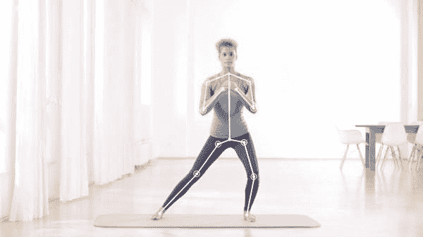
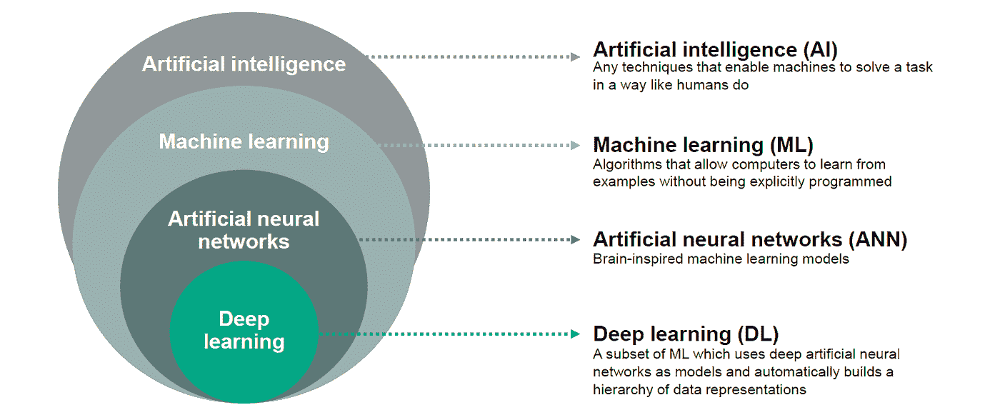

# 在家工作是如何变得更容易的？

> 原文：<https://medium.datadriveninvestor.com/how-working-out-from-home-got-easier-65fe69664daf?source=collection_archive---------33----------------------->

## 人工智能驱动的健身应用的出现。

***为什么人们会选择在家锻炼而不是去健身房？***

这有很多原因。让我们简要讨论其中的几个:

更便宜——在家锻炼可以是免费的，或者比健身房会员卡便宜很多。

它节省了你的时间——你不需要去健身房。在去健身房或回家的路上，你可能会遇到交通堵塞。

这个仪器可能有细菌——我们用手触摸一切。因此，这些是人体的一些外部身体部分，有大量的细菌和其他微生物。因此，许多人使用健身器材意味着他们可能会在上面留下大量的微生物！

**你不需要为你的锻炼设定一个具体的时间** —当你在家锻炼时，你可以决定什么时候开始你的锻炼课程。

结束任何站不住脚的借口——在家里，你有你的运动服，你有时间，你不必担心自我意识和知道该做什么。

想穿什么就穿什么——你不再需要为了在健身房里让陌生人看起来像样而买衣服。时间，金钱，压力都在这里省下了！

你需要的设备总是可以得到的——你不必再为在拥挤的健身房里感到沮丧，那里大部分设备都被占用了，你必须等待轮到你。

# 人工智能正在彻底改变个人健康

人工智能健身应用现在可以媲美私人教练。

## **什么是人工智能(AI)？**

人工智能(AI)是一个计算机科学领域，专注于使机器看起来像拥有人类智能。智能行为可能表现出学习、理解和解决问题的能力。

人工智能驱动的健身应用程序可以与可穿戴设备、智能手表和智能手机等设备连接，并跟踪你的行为、习惯和重复的锻炼模式。这些数据用于指导你走向更健康的生活。

# **健身可穿戴设备中的 AI**

可穿戴设备可以帮助健身者进行日常训练活动。这些可穿戴设备大多允许用户追踪他们的活动。例如，如果用户走了 1400 步，可穿戴设备会记录并显示这个计数。

然而，这些可穿戴设备有一个局限性。在某一点之后，人们不明白如何利用数据。

可穿戴设备中人工智能的目的是改善功能和用户体验，为用户提供实时见解、统计数据和帮助，以做出明智的生活方式选择。

当人工智能启用这些可穿戴设备时，它们可以跟踪数据，并定义用户应该吃什么，应该睡多长时间，以及应该如何训练以改善健康状况等。

如今，这些可穿戴设备有着不同的形式和智能语音助手集成等技术进步。这些可穿戴设备中嵌入了先进的传感器，可以通过生成实时的用户洞察来跟踪、分析和改善用户的健身活动。

这些“智能”可穿戴设备为用户提供可操作的见解，以减少受伤的可能性，并取代在任何运动中警告你任何危险动作的教练。

有了智能可穿戴设备，很多由私人教练完成的工作都交给了人工智能。

# **人工智能、机器学习和深度学习**

理解人工智能(AI)、机器学习(ML)和深度学习(DL)之间的关键差异很重要。我们已经讨论过什么是人工智能。

机器学习是人工智能的一个子集。ML 算法是计算机可实现的指令，它将数据集作为输入，执行计算，并在以前未发现的数据集中找到模式。

深度学习(DL)是 ML 的一个子集。这是一种利用人工神经网络(ANN)的 ML 方法。人工神经网络是计算系统的一部分，设计用来模拟人脑如何分析和处理信息。

# **引领我们走向交互式人工智能健身教练的两大健身趋势**

**1。随着越来越多的人选择在家健身，一对一的训练不再是一种溢价，而是一种商品。**

人们把健身带回家。客厅是许多人锻炼和健身的新地方。

对功能性健身的强调使健身房变得不那么必要，对于那些不能一直去健身房的人来说，健身应用程序是一个更可行的选择。

根据一项调查，54%每月至少锻炼一次的美国人有兴趣购买一套家庭健身系统。让我们来讨论一些受欢迎的家庭健身公司:

*   [**Peloton**](https://www.onepeloton.com/?utm_campaign=embodied-ai&utm_medium=email&utm_source=Revue%20newsletter) 以家用健身 Peloton 自行车闻名。拥有 Peloton bike 的人可以访问成千上万的课程和点播内容。
*   [**Tonal**](https://www.tonal.com/?utm_campaign=embodied-ai&utm_medium=email&utm_source=Revue%20newsletter) 提供了一个家庭健身系统，由一个连接在墙上的滑轮组成。它配备了力量训练和有氧运动，通过人工智能规划器根据您的健身能力进行调整，该规划器可以根据之前的锻炼来衡量表现。
*   [号的**镜**号的](https://www.mirror.co/?utm_campaign=embodied-ai&utm_medium=email&utm_source=Revue%20newsletter)舰上有一个互动监视器。它提供各种课程，包括有氧运动、瑜伽、芭蕾和普拉提，并订阅一系列服务和点播内容。不使用时，显示器被伪装成镜子。
*   [**FightCamp**](https://joinfightcamp.com/?utm_campaign=embodied-ai&utm_medium=email&utm_source=Revue%20newsletter) 提供最佳的家庭拳击训练，包括拳击手套、训练垫、站立袋等设备，以及通过电视或屏幕传输到家中的训练。

这些公司的家庭健身产品和服务提供了便利、来自顶级教练的内容和非常相关的体验。他们本质上是把一对一的健身训练作为一种商品来做，它将不再仅仅是一种溢价服务。

 [## 机器学习和人工智能如何改变电子商务的面貌？|数据驱动…

### 电子商务开发公司，现在，整合先进的客户体验到一个新的水平…

www.datadriveninvestor.com](https://www.datadriveninvestor.com/2020/11/19/how-machine-learning-and-artificial-intelligence-changing-the-face-of-ecommerce/) 

**2。计算机视觉应用和运动跟踪设备正在将健身和健康专业知识数字化和大众化**

**计算机视觉**是人工智能的一个领域，专注于训练计算机解释和理解视觉世界。这使得机器能够准确识别和定位对象，然后使用来自相机、视频和深度学习模型的数字图像对它们“看到的”做出反应。

许多健身应用程序内容丰富，但缺乏交互性。应用程序所不能提供的是健身房的人类教练所能提供的实时、正确的反馈。

然而，一些创业公司已经开始通过利用可穿戴设备和计算机视觉来构建更复杂的人工智能来实现这一目标。

例如， [Vi Trainer](https://vitrainer.com/?utm_campaign=embodied-ai&utm_medium=email&utm_source=Revue%20newsletter) 配备了生物传感耳机，可以收集用户的生理数据，并实时调整他们的形态。该应用程序在锻炼过程中提供激励性反馈，对基本的语音命令做出反应，并具有聊天机器人功能，用于有限的互动。

初创公司也在开发虚拟教练，可以用计算机视觉技术指导和训练用户，如姿势估计，绘制用户身体上的关键点。

[**Kaia Health 的**](https://www.kaiahealth.com/) [运动教练](https://www.youtube.com/watch?v=DakX48JNTJ4&feature=youtu.be&utm_campaign=embodied-ai&utm_medium=email&utm_source=Revue%20newsletter)是一款在治疗过程中提供实时矫正反馈的应用。为此，需要将摄像机朝向用户。

形体矫正和物理治疗，这两种曾经只能通过在健身俱乐部或运动诊所预约才能获得的方式，将通过技术实现数字化和大众化(每个人都可以获得)。

# **新冠肺炎环球疫情为健身企业带来了新的挑战**

2020 年，世界各地的健身房和健身工作室被迫关闭场所的大门，以防止疾病传播。

[**Inqline**](https://ai.inqline.com/) 注意到健身企业在这段时间面临的新的和意想不到的挑战，为了帮助这些企业生存，推出了其 [**Inqline Fit**](http://inqlinefit.com/) 平台。

该平台允许企业以直播会议和点播锻炼视频的形式提供服务。它还允许会员使用信用卡支付。对于任何健身企业来说，它的理想之处在于它在过程中采用了自动化，如果由个人完成，则容易出错。

# **结论——深度学习支持虚拟教练的可视化和互动**

家用健身产品正在使一对一训练商品化，计算机视觉正在使专业知识的获取民主化。结合这两者为深度学习奠定了基础，这是人工智能进步的最新浪潮。

你能想象一个真正的私人教练在一个随叫随到、不加评判、但像人一样的化身中体现一对一的沟通、激励和有益的纠正性指导吗？

它存在！了解关于计算机视觉人工智能健身教练 Mille Fit 的信息。

在家工作肯定会消除你健身之旅中的大多数障碍。

该是你受益的时候了！

**访问专家视图—** [**订阅 DDI 英特尔**](https://datadriveninvestor.com/ddi-intel)