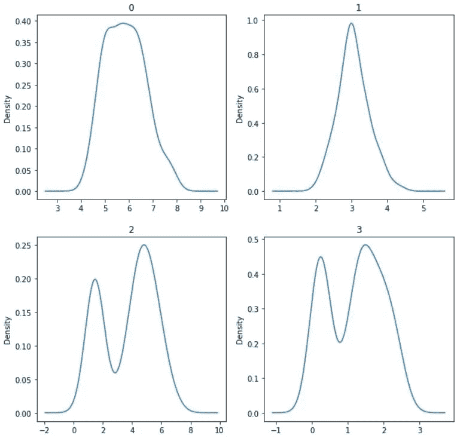
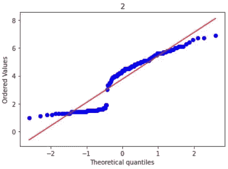
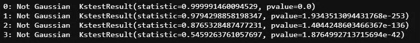

# 我如何知道我的变量分布是否是高斯分布？

> 原文：<https://medium.datadriveninvestor.com/how-would-i-know-if-my-variable-distribution-is-gaussian-c3b215383469?source=collection_archive---------1----------------------->

> “您的输入变量/特征必须具有高斯分布”是少数机器学习模型(esp。线性模型)。但是我怎么知道我的变量分布是不是高斯分布。这篇文章强调了一些方法来确保一个变量的分布是高斯分布。

Image by [Carlos Muza](https://unsplash.com/@kmuza?utm_source=medium&utm_medium=referral) on [Unsplash](https://unsplash.com/?utm_source=medium&utm_medium=referral)

本文假设读者对高斯/正态分布有所了解。在本文中，我们将使用 Scikit-Learn 中众所周知的**虹膜数据。**首先，让我们导入所需的包。

数据框(或)输入要素/变量的列名为[0，1，2，3]

# 方法一:直方图法

这是第一个简单的方法，用来获得一个变量分布的合理概念。让我们绘制虹膜数据变量的直方图。

Image by author

上面的直方图显示变量 0 和 1 接近高斯分布(1 似乎是最接近的)。而 3 和 4 看起来一点也不高斯。需要注意的是，直方图可能会产生误导。

# 方法 2:密度图(KDE 图)

密度图是绘制变量分布的另一种方法。它们类似于直方图，但与直方图相比，给出了一个更清晰的变量分布图。

Image by author

现在，我可以看到变量 0 和 1 比直方图中显示的更加高斯。变量 2 和 3 看起来也有点接近高斯，除了两个峰值。

# 方法 3: Q-Q 图

Q-Q 图根据指定的分布绘制数据。在这种情况下，指定的分布将是“norm”。在 Python 中，可以使用 **' *scipy.stats'*** 模块的**'*proplot*'**方法绘制 Q-Q 图，如下图所示。

Image by author

Image by author

Image by author

Image by author

从上面的 Q-Q 图可以看出，变量 0 和 1 非常接近红线(正态/高斯分布)。而变量 2 和 3 在一些地方严重偏离红线，这使它们远离高斯分布。Q-Q 图比直方图和密度图更可靠。

# 方法 4:夏皮罗-维尔克检验

夏皮罗-维尔克检验是正态性的统计检验。这是检验正态性的定量方法。夏皮罗-维尔克检验检验数据来自正态分布的零假设。在 Python 中，可以使用 ***【夏皮罗】*** 方法****【scipy . stats】***模块进行夏皮罗-维尔克测试，如下图所示。*

**

*Image by author*

*从上面的结果可以看出，只有变量 1 是高斯型的。夏皮罗-维尔克检验的一个缺点是，一旦样本量(或)变量长度超过 5000，它就不可靠了。*

# *方法五:柯尔莫哥洛夫- **斯米尔诺夫试验***

*Kolmogorov-Smirnov 检验是拟合优度的统计检验。这个测试比较两个分布(在这种情况下，两个分布中的一个是高斯分布)。这个检验的零假设是，两个分布是相同的(或)两个分布之间没有差异。在 Python 中，可以使用***【ks test】***方法****【scipy . stats】***模块进行 Kolmogorov-Smirnov 测试，如下图所示。首先，我们将对随机生成的正态分布进行测试。**

****

**Image by author**

****

**Image by author**

**现在，我们将对虹膜数据进行测试。**

****

**Image by author**

**以上结果表明，没有一个变量具有高斯分布。Kolmogorov-Smirnov 检验期望输入变量具有完美的正态分布。**

# **方法 6: D 阿戈斯蒂诺和皮尔逊检验**

**这种方法使用偏度和峰度来检验正态性。这个检验的无效假设是，分布是从正态分布中提取的。在 Python 中，可以使用***【scipy . stats】***模块的***【normal test】***方法进行该测试，如下所示。**

****

**Image by author**

**上述结果表明，变量 0 和 1 是高斯型的。该测试并不期望分布完全正态，而是接近正态。**

**这些是用于检验数据正态性的许多方法中的几个。我个人倾向于使用上述所有方法的组合来决定一个变量的分布是否是高斯分布，同时牢记数据、问题和使用的模型。**

**在文章[中如何将数据转换成高斯分布的样子？](https://medium.com/datadriveninvestor/how-to-transform-the-data-to-look-like-gaussian-distribution-c50ab3fdada5)，我已经讨论了各种变量转换，使您的数据看起来更高斯。**