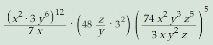
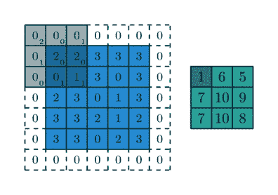
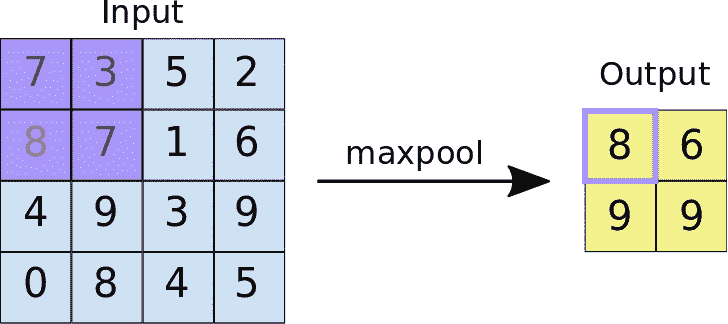
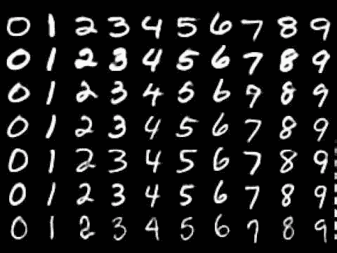
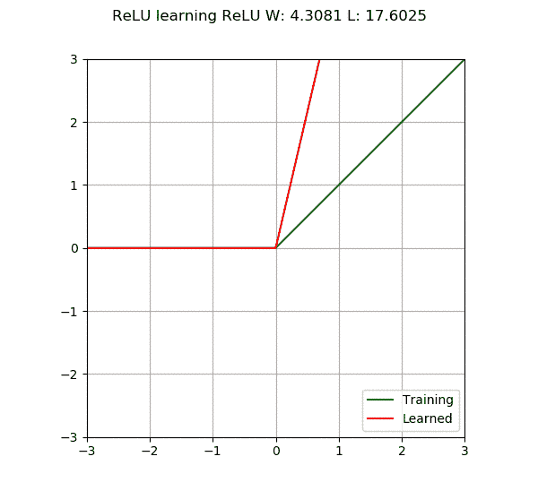

# 如何在不尴尬的情况下猜出老师的年龄

> 原文：<https://medium.datadriveninvestor.com/how-you-can-figure-out-your-teachers-age-without-embarrassing-yourself-f4f4363113d6?source=collection_archive---------12----------------------->

还记得小时候不小心问老师几岁的那些时候吗？是的，我知道，结局不太好。你的父母很生你的气，因为他们已经告诉你“不要问女人的年龄和男人的工资”🙄。但是，当你直接向某人提问题，而从他们那里得到的唯一答案是你让自己难堪，这难道不痛苦吗？

但是如果我告诉你有一种方法可以摆脱这一切呢？如果你能得到世界上任何一个人的照片并计算出他们的年龄会怎么样？i̶n̶t̶r̶o̶d̶u̶c̶i̶n̶g̶̶s̶r̶i̶t̶e̶c̶h̶:̶̶a̶n̶̶a̶p̶p̶r̶o̶a̶c̶h̶̶t̶o̶̶s̶o̶m̶e̶̶o̶f̶̶t̶h̶e̶̶k̶i̶d̶'̶s̶̶b̶i̶g̶g̶e̶s̶t̶̶c̶h̶a̶l̶l̶e̶n̶g̶e̶s̶.̶我教过人工智能(是的，我的💻)告诉我我的老师多大了，而不用问她，让我所有的朋友都嘲笑我是个白痴。让我们再多谈一点。

# Nerding Out 第一季第 101 集:你的 Windows Vista 如何从二战读取的图像

我不打算讨论什么是人工智能和深度学习，但我确实写了一本终极人工智能教科书，它有一切(像教科书一样)让你理解所有的高等数学和微积分👶语言。


Photo by [Photos Hobby](https://unsplash.com/@photoshobby?utm_source=medium&utm_medium=referral) on [Unsplash](https://unsplash.com?utm_source=medium&utm_medium=referral)

人工智能是关于让机器学习的 T2 科学。想象一下:你明天有一个关于向量的数学考试，而你的老师甚至没有解释向量是什么。你会说，“搞什么鬼？我该怎么办？唉，我明天考试会不及格，最后会被我的朋友嘲笑😦."但是多亏了史蒂夫·乔布斯，我们有了一个叫做 Siri 的聊天机器人。所以，你 skrt skrt 说，“嘿 Siri。”聊了 5 分钟向量后，你意识到，“嘿！我真的有朋友。它的名字叫 Siri！”

你对话的“如何”部分是人工智能。Siri 像人类一样思考。见鬼，这是一个复制人类智能的**人造人**(因此得名**人工智能**)。但是让我们更深入地研究一下深度学习。

就像我说的用 AI，参考我的[终极 AI 教材](https://medium.com/analytics-vidhya/the-ultimate-ai-textbook-dc2cf5dfe755)对一切有更深入的理解。深度学习就是通过一种被称为**人工神经网络的东西来模仿人脑。**


This is our brain in math 😁

在这一点上我 100%同意你。这是**吓人的**。像在万圣节被吓一跳跟这个比起来根本不算什么。想象一下每天都要经历 Wx+b(好吧，没那么可怕，但你明白了😉)!

深度学习有 3 个主要层:输入层、隐藏层和输出层。输入层都是关于数据的。这是你将数据输入神经网络的地方。从那里，数据经过不同类型的功能，如**激活功能**。基本上，我们来看看 h[1][1](☝).上图中 h1 层的第一个神经元 h1 是输入层 I 中每个单个输入的加权和。

这样想:姑且说 i[1](第 I 层的第一个神经元)的值为 1。权重(连接 h1 中神经元的线)有一个与之相关的值。假设 i[1]和 h[1][1]的权重值是 2。假设我们也有一个 1 的偏差。因此，我们将通过我们的函数 Wx+b 来运行它。我们现在只需替换值(2*1 + 1 = 3)，现在 h[1][1]的值为 3！我们会继续对每一个神经元都这样做，直到完成为止。

简单回顾一下，我们从输入数据中得到 x 的方法。例如，输入中的每个神经元可以是华氏温度的数据，我们的目标是教会神经网络如何将其转换为摄氏温度。w(重量)告诉我们那个神经元的**有多重要。**权重越大，它在神经网络中的作用越突出。**例如，如果我想让计算机读取手写数字的图像，那么我们会希望存储手写数字的神经元具有更大的权重，因为这是我们想要知道的。**

在得到 h[1][1]的所有加权和之后，我们将通过一个**激活函数**运行它。激活函数告诉神经网络某个特定的神经元是否应该被激活。输出将总是在 0 和 1 之间(由于差值很小，计算机将获得更高的精度)。根据您使用的功能，输出会有所不同。例如，[阶跃函数](https://en.wikipedia.org/wiki/Step_function#:~:text=In%20mathematics%2C%20a%20function%20on,having%20only%20finitely%20many%20pieces.)仅在输出大于特定阈值时输出 0 或 1。如果输出等于或小于 0，则[整流线性单元(ReLU)](https://en.wikipedia.org/wiki/Rectifier_(neural_networks)) 将返回 0，否则它将只返回输出。

是的。这就是深度学习的整体要旨！这好像是我第 100 次这么说了，但是请看看教科书上的文章；在那里你会学到更多！

[](https://www.datadriveninvestor.com/2020/08/27/what-is-a-data-catalog-and-how-does-it-enable-machine-learning-success/) [## 什么是数据目录，它如何使机器学习取得成功？数据驱动的投资者

### 数据目录是机器学习和数据分析的燃料。没有它，你将不得不花费很多…

www.datadriveninvestor.com](https://www.datadriveninvestor.com/2020/08/27/what-is-a-data-catalog-and-how-does-it-enable-machine-learning-success/) 

# 进入有趣的东西:卷积神经网络(CNN)

啊啊，卷积神经网络。这才是真正有趣的地方。不，不是像看你的模型训练几个小时那样有趣，而是像花几个小时在 stackoverflow 上纠正形状错误那样有趣😁。不管怎样，你不是来听我咆哮的，所以让我们开始吧！

CNN 是一种深度学习算法，专门用于图像和对象识别。大多数人通常会说:“Sri，CNN 和常规前馈神经网络有什么区别？”好吧，答案是这样的:虽然前馈网络可以用于 MNIST 数据集等基本图像，但它们在处理数据和像素如此丰富的图像时绝对糟糕。

CNN 的总体目标是将图像的“丰富度”减少到一种真正容易处理的形式，同时保持产生真正好的预测所需的主要特征和细节。

第一章:卷积

卷积神经网络—卷积=神经网络。明白了吗？没有卷积，CNN 根本不存在。他们给 CNN“注入”活力。

卷积是这样工作的:我们有一个内核，一个步长和填充。让我们试着分解一下。你有一个非常复杂的数学问题，你的老师让你明天完成:



你不是一个疯子，你只是代入老师告诉你的任何值，然后解决它。相反，你用你的🧠意识到，“嘿！我们可以简单地分解它，直到我们得到更容易处理的真正小的东西！”

这就是卷积的工作原理。数学问题是图像，解决的方法是通过内核、步幅和填充。让我们更详细地讨论一下这两个问题:


内核(☝上方的绿色 3x3 网格)基本上是一个过滤器，我们通过它进入我们的网络。利用它，我们可以对整个图像进行矩阵乘法运算。我们得到的输出就是右边的红色网格。内核移动的距离称为步幅。在上面的例子中，步幅被设置为 1，这仅仅意味着它一次一个地移动到下一个像素矩阵。如果你的步幅是 2，这就意味着无论何时你都要跳过一行/一列像素。

一旦我们做了矩阵乘法，我们会把所有东西加起来，然后输出我们的单个值(红色的值)。内核值(与像素进行矩阵乘法)通常是随机选择的，然后使用梯度下降进行优化。但有时，你的图像矩阵的长度是不均匀的。如果你有一个 5x5 的矩阵，而不是上面的 6x 6 呢？像素不会重叠吗？

这个问题的答案是填充，特别是零填充。名字赋予了它一切；我们给图像添加一个零边框。



现在，这样做了之后，我们的矩阵将再次变得均匀！！希望这是卷积的直观例子。有问题就 dm 我 [@srianumakonda](https://twitter.com/srianumakonda) 。

**第二章:最大池**

Maxpooling。嗯嗯🤔听起来像最大限度地利用你的时间⌚当你游泳的时候🏊‍♀️.

好了，今天玩笑开够了。Maxpooling 是在给定特定内核大小的情况下取最大值。让我们回到上面执行的卷积。一般来说，当一幅图像变得复杂时，大多数人会选择最大化。假设我们的内核大小是 2x2。就像卷积一样，我们将它应用到图像上。从那里，内核框架中的最大值将被添加到输出中。下面的图片应该可以澄清你的任何问题👇。



looks like the image is better at explaining than me 😅

**第三章:辍学和过度适应**

像这样考虑过度拟合:假设你的老师告诉你学习乘法表，这样你就可以做 EQAO。所以，作为一个好学生，你什么都背。但是，当你写 EQAO 时，他们要求你“解释你的答案”以及 8 * 8 = 64。你完蛋了。你只是专注于记忆，不明白 8 * 8 = 64 是怎么回事。

这就是神经网络中的过度拟合。神经网络记忆所有的训练数据，当它得到一个测试图像时，它就崩溃了。

我们解决这个问题的方法是通过**辍学。** Dropout 是随机掉落“神经元”的方法。这意味着不是每一层都有固定数量的神经元，我们会有一个随机数量的节点层，而不是遵循我们定义的 x 数量的节点。


一开始我觉得退学很奇怪。关掉神经元有什么意义？这难道不会使模型变得更糟吗？因为我们会失去那些细节和特征。

不，那是不可能的。为什么？假设我们正在处理 MNIST 数据集，它实际上只是一个手写数字库。



Hands down the best datasets for DL beginners btw 😁

当我们将此输入神经网络时，如果黑色背景上的权重比白色背景上的权重大呢？如果模型更关注背景而不是数字本身呢？

繁荣💥。这就是辍学的原因。通过关闭这些节点，它们会随机重置，并开始关注手写数字本身，而不是继续摆弄背景。

**第四章:批量标准化**

批量规范化一般是大多数人不太了解的话题。如果没什么道理，[这篇文章](https://towardsdatascience.com/batch-normalization-in-neural-networks-1ac91516821c)和[这篇文章](https://machinelearningmastery.com/batch-normalization-for-training-of-deep-neural-networks/#:~:text=Batch%20normalization%20is%20a%20technique,required%20to%20train%20deep%20networks.)应该能帮到你一点。

每当我们有图像数据时，大多数人会做的第一件事就是将数据归一化。这基本上意味着，每当我们有一个图像(让我们以一个灰度图像为例)，像素值在 0 和 255 之间(0 是黑色，255 是白色)。这对计算机来说是一个巨大的范围，因为当然，计算机必须将所有东西转换成二进制，并使用更多的内存。因此，我们可以做的是将范围从 0 到 255 更改为 0–1。这将使它在计算机上变得容易得多，并通过不必等待很长时间来帮助你自己。

这同样适用于神经网络。即使我们通过我们的激活函数传递所有的东西，在某一点上，我们最终会得到一个非常大的值。标准化可以使模型变得更加容易，通过允许我们使用更高的学习速率来加速它，并且可以在某些情况下减少过度拟合。

**第五章:激活功能**

有一堆激活函数。我已经在上面谈到过这个问题，但它的 TLDR 是激活函数告诉神经网络某些节点是否应该“打开”。

我用于我的神经网络的激活函数被称为**整流线性单元(ReLU)** 。ReLU 无疑是最常用的激活函数类型，因为 a)它几乎可以在深度学习的任何地方使用，b)它实际上非常简单。



首先要注意的是，ReLU 本质上是非线性的，因此通过激活函数拟合非线性数据应该不成问题。ReLU 的特点是它可以使模型**变得更轻**。ReLU 是这样工作的:如果神经元的输出≥ 0，那么神经元不会被触发，因为它的值为 0。否则，ReLU 将简单地返回输出。

这样做的好处是没有多少神经元会被激活，这是一个令人惊讶的好现象。这主要是因为它将使模型更轻，从而能够训练得更快，使用更少的内存。它也一点也不复杂，通常可以在任何情况下使用。

**第 6 章:将所有内容整合在一起**

现在我们已经讨论了神经网络中的主要组件，让我们把它们放在一起！您可以在下面看到整体模型架构:

```
neural_network(
  (layer1): Sequential(
    (0): Conv2d(1, 64, kernel_size=(3, 3), stride=(1, 1))
    (1): ReLU()
    (2): BatchNorm2d(64, eps=1e-05, momentum=0.1, affine=True, track_running_stats=True)
    (3): Dropout(p=0.2, inplace=False)
    (4): MaxPool2d(kernel_size=(2, 2), stride=(2, 2), padding=0, dilation=1, ceil_mode=False)
  )
  (layer2): Sequential(
    (0): Conv2d(64, 128, kernel_size=(3, 3), stride=(1, 1))
    (1): ReLU()
    (2): BatchNorm2d(128, eps=1e-05, momentum=0.1, affine=True, track_running_stats=True)
    (3): MaxPool2d(kernel_size=(2, 2), stride=(2, 2), padding=0, dilation=1, ceil_mode=False)
    (4): Dropout(p=0.25, inplace=False)
    (5): ReLU()
  )
  (layer3): Sequential(
    (0): Conv2d(128, 256, kernel_size=(3, 3), stride=(1, 1))
    (1): ReLU()
    (2): BatchNorm2d(256, eps=1e-05, momentum=0.1, affine=True, track_running_stats=True)
    (3): Dropout(p=0.2, inplace=False)
    (4): MaxPool2d(kernel_size=(2, 2), stride=(2, 2), padding=0, dilation=1, ceil_mode=False)
  )
  (layer4): Sequential(
    (0): Conv2d(256, 512, kernel_size=(3, 3), stride=(1, 1))
    (1): ReLU()
    (2): BatchNorm2d(512, eps=1e-05, momentum=0.1, affine=True, track_running_stats=True)
    (3): Dropout(p=0.2, inplace=False)
    (4): MaxPool2d(kernel_size=(2, 2), stride=(2, 2), padding=0, dilation=1, ceil_mode=False)
  )
  (flatten): Flatten()
  (dropout): Dropout(p=0.25, inplace=False)
  (output): Linear(in_features=512, out_features=2, bias=True)
)
```

我们有 4 层，每层都有一个卷积、ReLU，然后是 BatchNormalization、Maxpooling 和 Maxpooling。我们重复 4 次，然后将输出平坦化为 1-D 向量。从那里，我们把另一个辍学层，然后把一个密集层作为我们的输出(从 512 个节点到 2)。

# 总结:训练和测试我们的模型

经过测试和各种测试，该模型获得了大约 50-70%的准确性。这很糟糕，但目前正在努力使准确率达到 80%。你可以在这里找到 GitHub 代码。代码目前正在更新，所以一定要看看我的 GitHub！

# Cya 后期短吻鳄🐊

感谢阅读！下面是我的[时事通讯注册](https://subscribepage.com/srianumakonda)、 [linkedin](https://www.linkedin.com/in/srianumakonda/) 、 [twitter](https://twitter.com/srianumakonda) 、 [email](mailto:info@srianumakonda.com) ，以及[网站](http://srianumakonda.com)。

如果你想了解我更多，看看我九月的时事通讯吧！

Cya！
——✌

## 访问专家视图— [订阅 DDI 英特尔](https://datadriveninvestor.com/ddi-intel)