# 如何用神经科学解读任何人的思想？脑电图简介

> 原文：<https://medium.datadriveninvestor.com/how-you-can-read-anyones-mind-with-neuroscience-and-an-electroencephalogram-eeg-1c6068b42705?source=collection_archive---------2----------------------->

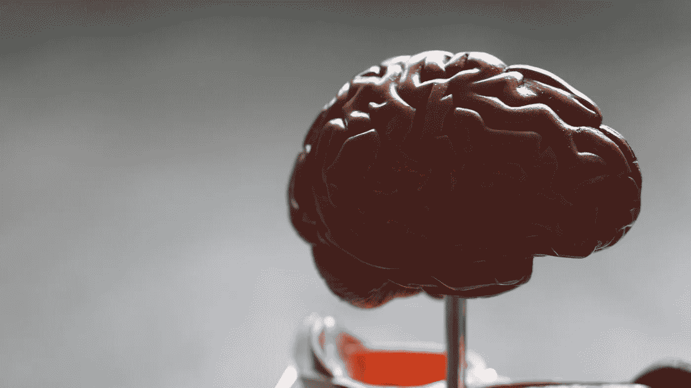

大脑可以说是人体中最复杂的器官。大脑由数千亿个细胞组成，负责我们身体的一切活动，它可能是我们所知道的最迷人的东西之一。技术，被称为脑机接口(又名。B.C.I .)，对大脑的理解仍处于起步阶段，但已知有一项创新比其他创新更容易实现。

近年来，脑电图(试着说快 10 倍)，或简称 EEG，因使研究大脑变得更加容易而臭名昭著。传统上，大脑技术一直很昂贵。即使在今天，一次脑部核磁共振成像也要花费超过 1000 美元。

然而，在脑电图的帮助下，你可以开始在自己舒适的家中拥有你的*自己的*大脑阅读设备，只需不超过几百美元。虽然它的作用与核磁共振成像不同，但脑电图可以采集你的脑电波，并报告给电脑供你解读。

就实际用途而言，脑电图目前正被用于诊断癫痫、表征癫痫发作活动，甚至在癫痫发作即将发生之前检测到癫痫发作，这可以将所涉及的风险降至最低。它们还可以用于在外科手术过程中检查大脑的血液循环，监测睡眠以诊断睡眠障碍，检测大脑病变，测试阿尔茨海默氏症，并能够对各种其他大脑功能障碍提供大量见解。请记住，这项技术仅仅处于起步阶段。谁知道未来会怎样？

在这篇文章中，我将让您对 EEG 背后的一些程序和过程有一个相对详细的了解，希望到最后，您会对这项很酷的新技术略知一二！

本文将深入探讨以下主题:

*   什么是脑电图？
*   在家设置
    -物理设置
    -输出类型
    -灵敏度设置和参数
*   解读脑电波
    -大脑状态介绍
    -如何对大脑状态进行分类
    -识别肌肉和眼球运动
*   关于作者
*   附加资源+文章中使用的资源

准备好大吃一惊了吗🤯？让我们开始吧，⬇️！

# 什么是脑电图？

EEG 是一种耳机，用于测量大脑中的电活动，方法是拾取在放置电极的小区域周围一起放电的大群神经元(相对于单个神经元)。

电极是一个单独的传感器，你可以在上图中看到与之相连的电线。他们通过将小金属盘粘贴到你的头皮上来检测作为大脑活动副产品出现的微小电荷，从而检测电波。一个典型的耳机会有几个到几十个电极来接收这些电信号。

脑电图也主要测量突触后电位(相对于动作电位)，这基本上意味着它在你完成一个动作或思维过程时/后拾取大脑活动，而不是在此之前的积累。

A simplified version of what EEG outputs typically look like. Credit to [Emotiv](https://www.google.com/search?q=eeg+waves&source=lnms&tbm=isch&sa=X&ved=2ahUKEwj-q73J8rnuAhWks1kKHb7KDJwQ_AUoAXoECBwQAw#imgrc=ofp0y9uEcwN8tM)

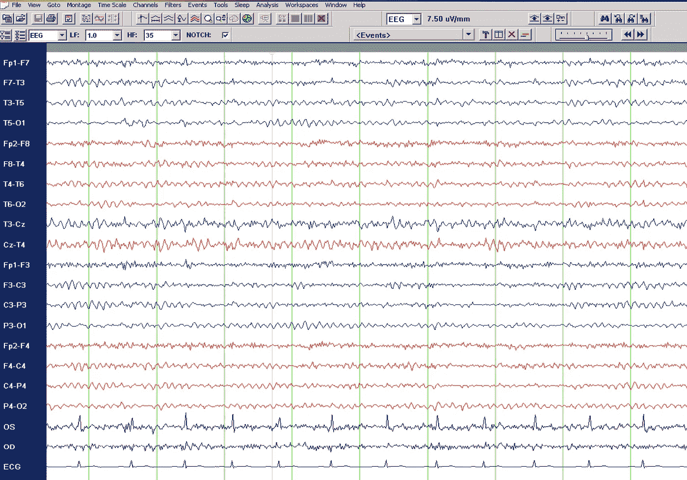

What an actual EEG Output can look like. Credit to [Marie Atkinson, MD](https://neurology.med.wayne.edu/pdfs/how_to_interpret_and_eeg_and_its_report.pdf).

脑电图的输出以连续脑电波的形式出现在图表上，如上图所示。该耳机可用于测量事件期间发生的大脑活动或测量自发的大脑活动。

脑电图的一些优点和缺点是:

## 优势:

*   相对低成本
*   可以(几乎)实时输出
*   无痛，几乎没有抵抗

## 缺点:

*   空间共鸣差(精确区分大脑各部分的能力)
*   很难记录大脑中比皮层更深的部分。

如果你感兴趣，我已经添加了一些很棒的资源，让你的知识在最后更上一层楼！

好吧好吧，你被说服了。这项新技术是革命性的。但是怎么用呢？

# 正在设置

## 国际 10-20 系统

理解如何使用脑电图的第一步是理解国际 10-20 系统。国际 10–20 系统是测量头部和放置电极的常用方法。它依靠四个要点来确定自己的方向。首先， ***鼻根*** 位于鼻梁和额头，然后 ***枕叶*** 位于后脑勺，然后 2 个 ***耳前*** 点位于耳朵正前方。

为了放置电极，下图(显示了头部自上而下的透视图)显示了大脑是如何按照 10-20 的比例划分的。这种模式也适用于垂直线。

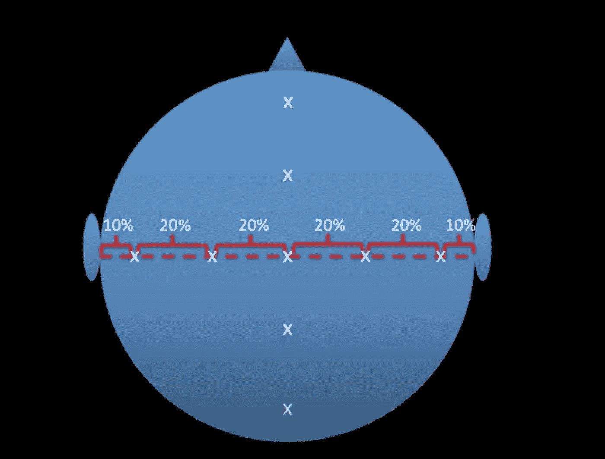

Credit to [Jeremy Moeller](https://www.youtube.com/channel/UC78lghwicbk8Ay0H4nIBvuA) in [Introduction to EEG](https://www.youtube.com/watch?v=XMizSSOejg0%3D67s)

然后，在头部周围以 10%的增量做标记。使用 25%的增量进行矢状面测量，最后进行横向测量。然后，使用矢状面和横断面测量值的交点来制作最终标记。一旦所有的标记都做好了，每一个标记都有了名称，总体看起来应该是这样的:

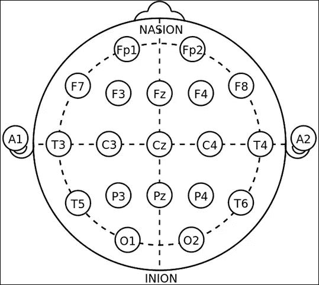

Credit to [Open BCI Documentation](https://docs.openbci.com/docs/01GettingStarted/02-Biosensing-Setups/EEGSetup)

系统的标签是奇数在左边，偶数在右边。较低的数字通常意味着标记更靠近中线。中线本身有字母“z ”,代表“Zed”或零。这些字母也可以作为脑叶的指示器。f 代表额叶，C 代表中枢，P 代表顶叶。电极被放置在任一标记处，以从该位置产生输入。

## 什么是差分放大器？

脑电图功能使用称为差分放大器的逻辑门操作。差分放大器本质上意味着输出被视为两个输入之差。这在显示非常小的电信号时特别有用。

假设你有两个输入的脑电波，除了中间有一点小差异外，其余完全相同。通过将这两个输入插入差分放大器，所有的相似性被抵消，输出将只是输入之间的差异。

这意味着脑电波不是在一个绝对的尺度上，而是相对于基于特定环境的波动。这也是为什么当你阅读脑电图时，你不会在左边看到单个电极。相反，您将看到类似“Fp2-F8，F8-T8”等输入，如下图所示。

实际上，您看到的输出线显示了标在线上的两个电极之间的差异。

## 显示输出

输出被称为“蒙太奇”，以两种方式之一显示。第一种方式是**两极蒙太奇**。

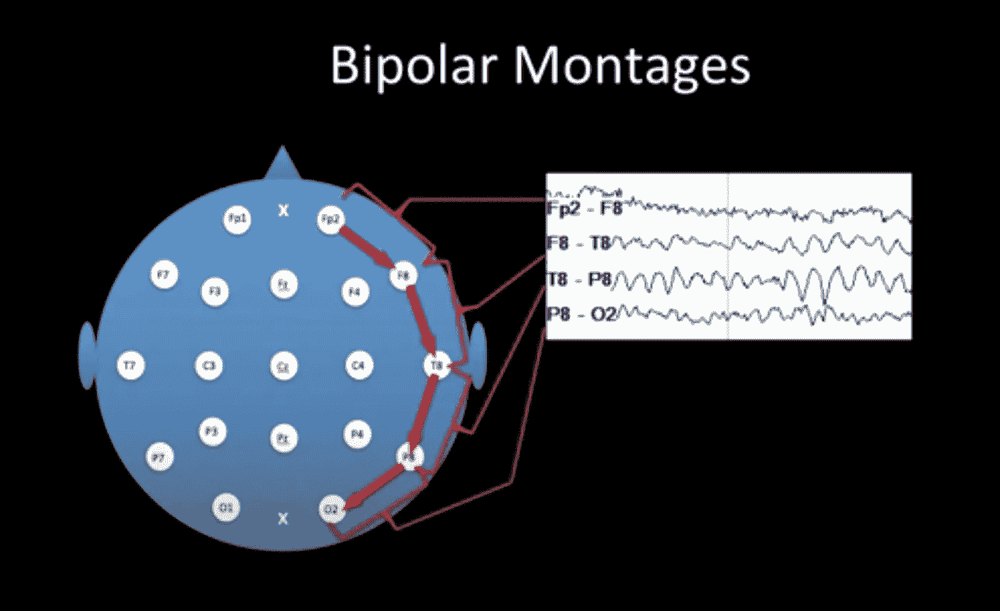

Credit to [Introduction to EEG](https://www.youtube.com/watch?v=XMizSSOejg0%3D67s)

从 Fp2 开始，向后移动，减去电极差(使用差分放大器),使每条线在上图的输出部分可见。每条单独的线路被称为一个**通道**。上面可见的一串录音被称为**链**。在这种情况下，这将是*右时态链*。

两极蒙太奇的结果可以是这样的:

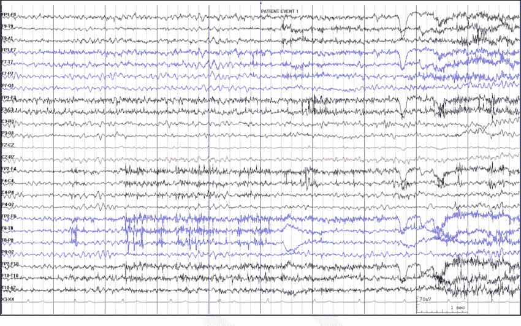

Credit to [Researchgate](https://www.researchgate.net/figure/Anterior-posterior-bipolar-montage-showing-EEG-activity-of-one-of-patients-habitual_fig1_324277432)

它们的排列是这样的:

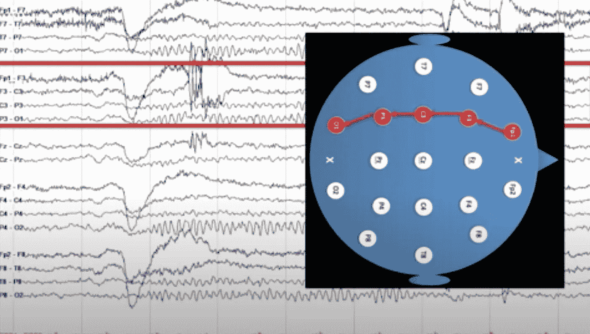

Credit to [Introduction to EEG](https://www.youtube.com/watch?v=XMizSSOejg0%3D67s)

链条按以下顺序(从上到下):
-左颞链
-左矢状旁链(红色)
-中线
-右矢状旁链
-右颞链

另一种输出形式是**普通平均参考蒙太奇。**

该剪辑将感兴趣的电极与头部所有其他电极的平均值进行比较。一个普通参考蒙太奇的布局非常相似，就像这样:

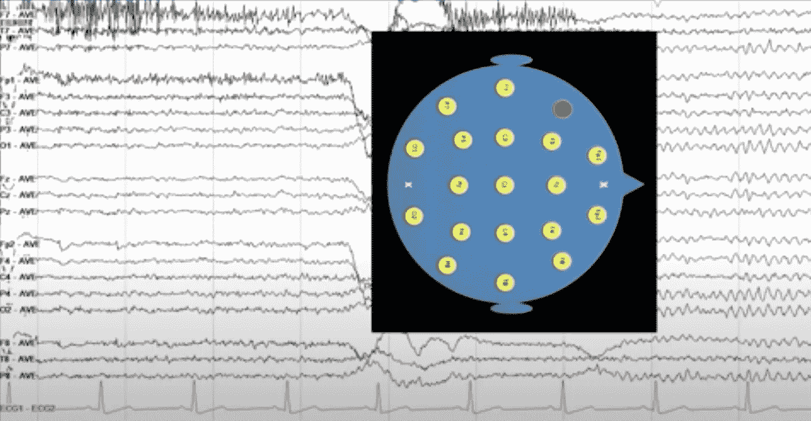

Credit to [Introduction to EEG](https://www.youtube.com/watch?v=XMizSSOejg0%3D67s)

# 传感器设置

现在你知道了脑电图是如何工作的，以及如何观察输出，让我们开始工作吧。这里告诉你如何*读取*和*识别*脑电图模式！

你需要做的第一件事是了解如何设置参数来修改你的读数。这包括灵敏度和各种滤波器，以确保脑电图读数尽可能清晰。

## 灵敏度设置

灵敏度是以微伏为单位的设置。无论您决定设置什么样的微电压，都将在该电压或更高电压下记录波形。下面你会看到不同的灵敏度设置如何影响输出。

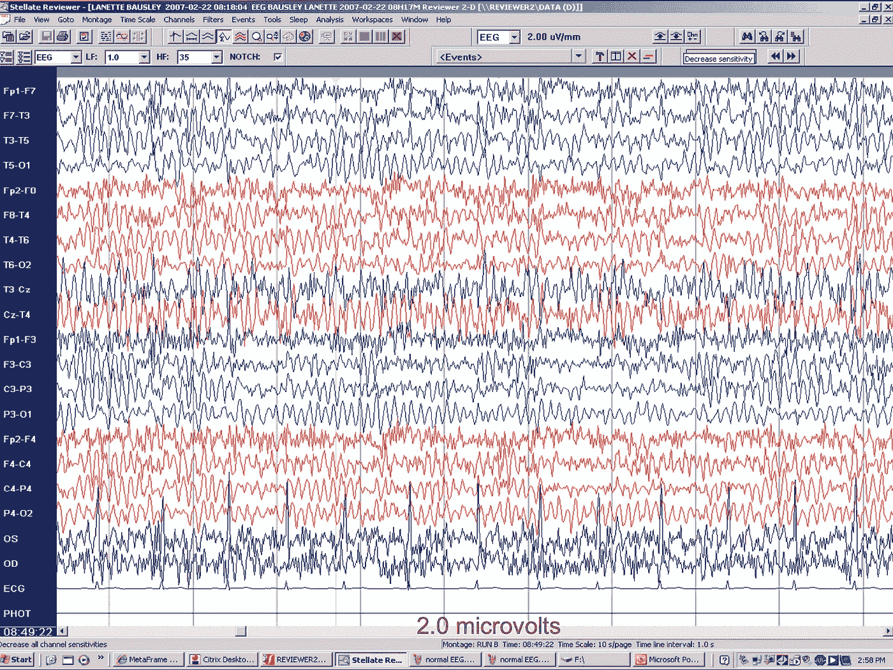

Credit to [Marie Atkinson, MD](https://neurology.med.wayne.edu/pdfs/how_to_interpret_and_eeg_and_its_report.pdf).

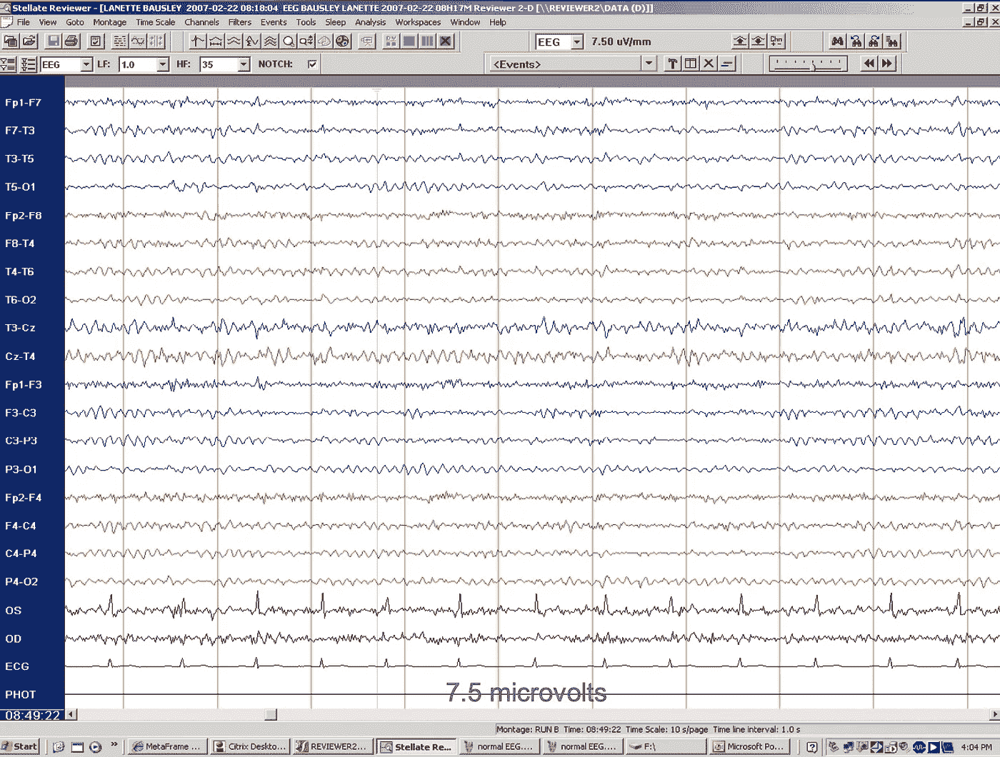

Credit to [Marie Atkinson, MD](https://neurology.med.wayne.edu/pdfs/how_to_interpret_and_eeg_and_its_report.pdf).

Credit to [Marie Atkinson, MD](https://neurology.med.wayne.edu/pdfs/how_to_interpret_and_eeg_and_its_report.pdf).

实际上，你选择的电压越低，你看到的波形就越多。你应该选择能让你最清晰地看到波浪的感光度。通常情况下，该值约为 7.5 微伏。

如果脑电图下的人是镇静的或无意识的，你可能想要更高的灵敏度。如果 EEG 下的人受到刺激(例如音乐、解决数学问题或任何其他可能促进大脑功能增加的事情)。

## 低频、高频和陷波滤波器

除了设置脑电图的灵敏度，你还需要设置低频滤波器和高频滤波器。两个滤波器都被设置为设定的赫兹数。

在**低频滤波器**下，无论你将它设置在什么数字，脑电图都不会放大低于该数字的任何频率*。通常，LF 滤波器设置为 1.0 Hz。实际上，在实施中，这意味着脑电图将*而不是*显示任何频率*低于* 1.0 赫兹的波。*

在**高频滤镜**下，正好相反。脑电图记录的不是最低频率，而是最高频率。通常，高频设置为 35Hz。

最后是**槽口**的设置。陷波是一种特殊的滤波器，可以让您切断 50 或 60 赫兹的所有频率。凹口的目的是过滤掉你周围的任何电活动，例如来自房间内其他机器或插座的电活动，这些电活动可能会影响读数。在北美，我们通常将频率设置为 60 Hz。

现在有趣的是，

# 如何阅读脑电图

让我们来分解一下:

为了有效地阅读脑电图，你需要知道两件重要的事情。那些是…

1.  背景活动:给出正在发生的事情的总体感觉
2.  常见工件:破坏后台活动的常见模式。

您可能想知道的其他重要事项有:

1.  对称(和不对称)模式:显示病灶变化
2.  警觉的阶段
3.  和异常:慢波、锐波、三相、癫痫发作、PLEDs 等

然而，对称性、警觉性和异常性的模式通常用于医学诊断和/或睡眠期间的测量，这不是本文的重点。如果你想让我写一篇关于这些细节的文章，请在评论中告诉我！

不过，现在让我们来看看如何理解背景活动。

## 背景活动

脑电图上显示的背景活动用于了解病人的情况。最好通过*后*通道进行评估，通常是枕叶。需要注意的一点是，为了读取任何背景活动，受试者或患者*必须*闭上眼睛。

输出以 4-5 种不同的频率显示:**阿尔法、贝塔、德尔塔、西塔、**有时还有**伽马**。它们看起来像这样:

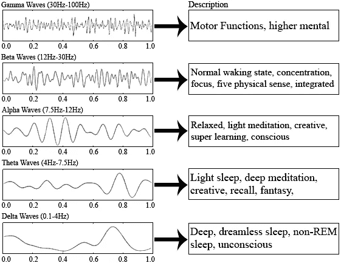

A diagram you may find useful. Credit to [Neeuro.com](https://www.neeuro.com/eeg-waves/)

请注意，当您读取 EEG 时，您会根据 **Hz** 中的频率对背景状态进行分类。找到这个频率的方法是以一秒为间隔计算“波”的数量。大多数 EEG 软件会自动在 EEG 数据上创建一秒钟的间隔，显示为垂直线。当我们浏览每个类别时，你会明白我的意思。

**Delta** 是最慢和最低的波，大约在**1-3hz**处。它们是振幅最高的脑电波，也是我们在睡眠时的体验。我们也通过 Delta 获取我们潜意识中的信息。

下面，你可以看到由一秒钟间隔(垂直的绿线)分隔的“波”(浅蓝色)。在这个特殊的例子中，一秒钟间隔有两个波，这意味着它大约是 2Hz。

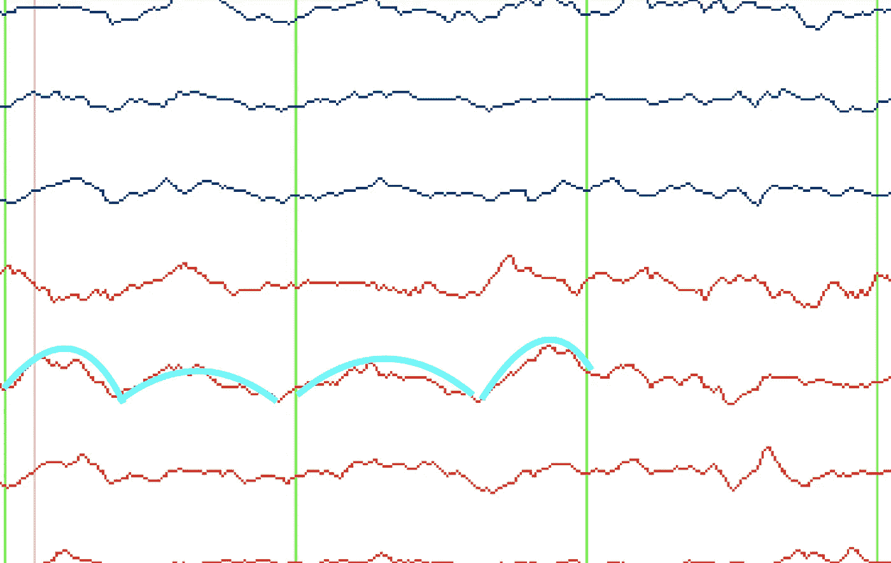

Credit to [Marie Atkinson, MD](https://neurology.med.wayne.edu/pdfs/how_to_interpret_and_eeg_and_its_report.pdf), and my glorious editing skills.

在全尺寸图上，δ波看起来像这样:

Credit to [Marie Atkinson, MD](https://neurology.med.wayne.edu/pdfs/how_to_interpret_and_eeg_and_its_report.pdf).

**Theta** 只是稍微慢一点，在大约**4–7 赫兹**时略低于平均值。这些波代表了一种白日梦般的、空灵的精神状态，与深度冥想、创造力和连通性相关联。在非常低的水平上，θ波可以表示非常放松的状态，通常是清醒和睡眠之间的模糊区。

θ波看起来像这样:

Credit to [Marie Atkinson, MD](https://neurology.med.wayne.edu/pdfs/how_to_interpret_and_eeg_and_its_report.pdf).

你可以看到我对几个波的简短描述，这样你就知道一个单一波是什么样子了。

**阿尔法**被认为是你在**8–13Hz**的正常大脑状态。它们比θ波更慢更大。阿尔法与放松状态有关，代表大脑进入空转状态，等待需要时做出反应。如果你想象一些平静的事物，你会产生阿尔法脑波的增加。

作为输出，它看起来会像这样:

Credit to [Marie Atkinson, MD](https://neurology.med.wayne.edu/pdfs/how_to_interpret_and_eeg_and_its_report.pdf).

我没有概述这个特殊图表的一部分，因为它会有点乏味。然而，我画了一个理论上的阿尔法波轮廓图:

贝塔波的频率在 **12 到 35Hz** 之间。β波是小而快的脑电波，与精神、智力活动和向外集中注意力的状态有关。这是你的警觉状态，也是你做决定的体验。

下面是贝塔波的样子:

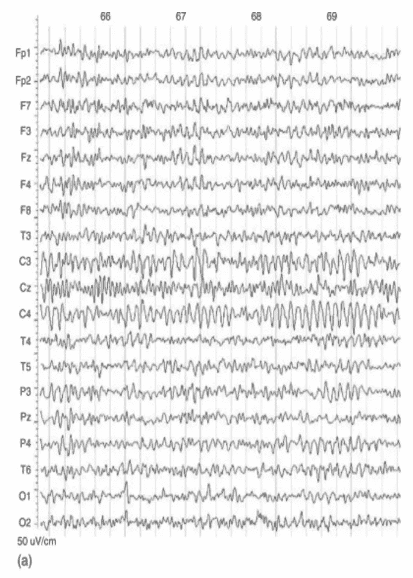

Credit to [Sceincedirect.com](https://www.sciencedirect.com/topics/medicine-and-dentistry/beta-wave)

一些脑电图也能探测到处于伽马状态的更高级的脑电波。伽马波是最快的波，范围从 35Hz 到 100Hz！。当你的大脑极度集中处理信息和运动功能时，伽马波就会出现。当你全神贯注或积极参与解决问题时，它们就会释放出来。

*巴达-比姆巴达-嘣*

你现在可以阅读你的任何朋友的大脑状态！

在你离开之前，你必须意识到肌肉运动和眨眼是什么样子的。这些行为违反了典型后台活动的规则，但完全正常。

## 眨眼和肌肉运动

为了理解如何发现眨眼和肌肉运动，你需要遵循几条规则。它们如下所示:

**闪烁**规则:

*   仅见于前额叶通道
*   查看相关通道，眼球运动同时发生，只是方向相反。

在脑电图报告中，眨眼通常是这样的:

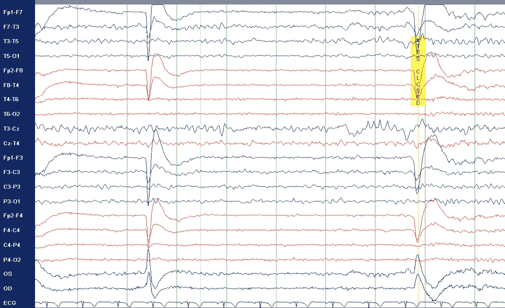

Credit to [Marie Atkinson, MD](https://neurology.med.wayne.edu/pdfs/how_to_interpret_and_eeg_and_its_report.pdf).

**肌肉运动**规则:

*   他们通常太尖锐而不真实
*   病人通常很激动
*   需要记住的一点是，如果去掉高频滤波器，图形看起来会更糟。

在脑电图报告中，肌肉运动可能看起来像这样:

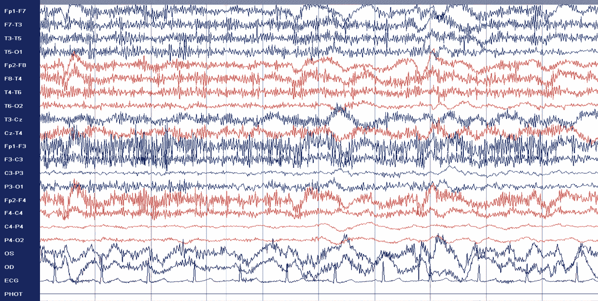

Credit to [Marie Atkinson, MD](https://neurology.med.wayne.edu/pdfs/how_to_interpret_and_eeg_and_its_report.pdf).

就这样结束了！

所以，现在你也可以 ***读取你朋友的心思*** 。这意味着巨大的影响。在结束之前，让我们看看 EEG 在现实生活中的一些应用。

## 最后，

所以…你还在等什么？出去自己做脑电图吧！你可以从 [OpenBCI](https://openbci.com/) 、 [Muse](https://choosemuse.com/) 和 [Emotiv](https://www.emotiv.com/) 的众多[其他](https://www.amazon.com/eeg-headset/s?k=eeg+headset)选项中找到购买脑电图的选项。

开始实验吧！谁知道你会发现什么很酷的东西？如果没有，当你有客人的时候，拿出你自己的脑机接口是一个不错的聚会技巧！🥳

# 接触

嘿，各位，感谢阅读到这里！我希望你从这篇文章中有所收获。

我叫萨特维克。我是知识社会的一名 15 岁的创新者。我对机器学习、脑机接口和哲学感兴趣。请随时在下面的任何平台上联系我，或者查看我写的其他一些文章。我希望你喜欢这篇文章！

**电子邮件【satvikagnihotri12@gmail.com **

在这里找到我的 LinkedIn。

你也可以在这里注册我的**个人月报** [。](https://www.subscribepage.com/o8u0c9)

# 我使用的资源:

 [## 脑电图简介

### 健康专业学生的脑电图介绍，包括医学学生，神经病学住院医师，和…

www.youtube.com](https://www.youtube.com/watch?v=XMizSSOejg0%3D67s)  [## 脑电图(脑电图)入门指南

### 免责声明- EMOTIV 产品仅用于研究应用和个人用途。我们的产品是…

www.emotiv.com](https://www.emotiv.com/eeg-guide/)  [## 设置 EEG OpenBCI 文档

### 本页将解释使用您的 OpenBCI 板、使用我们的金杯处理 EEG 数据的最基本设置…

docs.openbci.com](https://docs.openbci.com/docs/01GettingStarted/02-Biosensing-Setups/EEGSetup)  [## 什么是脑电波？|通过神经反馈改善大脑健康

### 什么是脑电波？脑电波是大脑中的电脉冲。个人的行为、情感和思想…

www.sinhaclinic.com](https://www.sinhaclinic.com/what-are-brainwaves/)  [## 脑电波的科学——大脑的语言

### 定义 EEG(脑电图仪)测量大脑中不同频率的脑电波。电极…

nhahealth.com](https://nhahealth.com/brainwaves-the-language/)  [## 脑电波

### 脑电波是大脑中的振荡电压，只有百万分之几伏特。有五个…

www.sciencedirect.com](https://www.sciencedirect.com/topics/agricultural-and-biological-sciences/brain-waves) 

https://www . health line . com/health/gamma-brain-waves #:~:text = others % 20 慢% 20。-，伽马% 20 脑% 20 波% 20 是% 20 最快% 20 脑% 20 波% 20 产生% 20 内，从事% 20 内% 20 解决% 20a %问题。