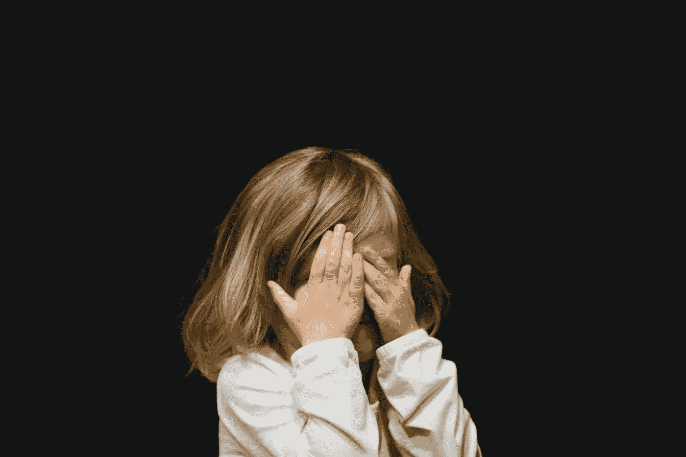
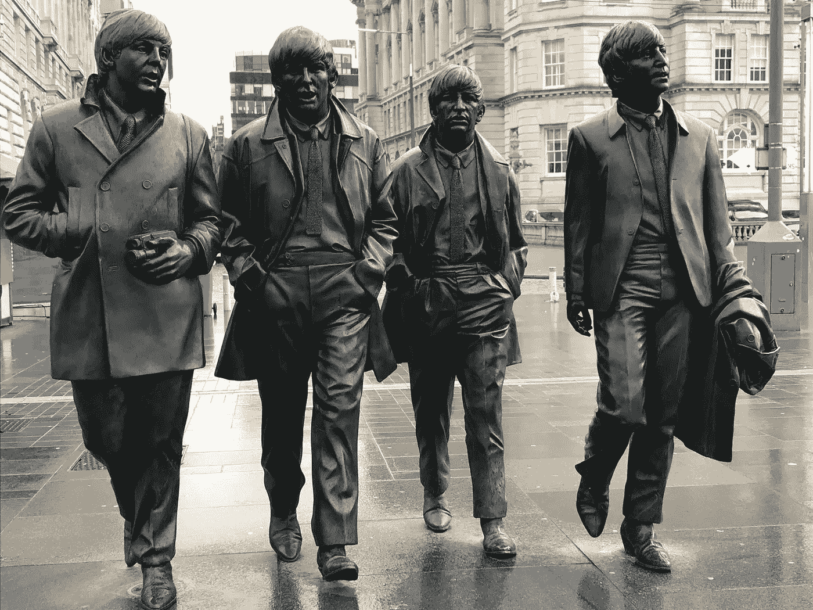

# 你的基本情绪如何影响你的日常生活#1 恐惧

> 原文：<https://medium.datadriveninvestor.com/how-your-basic-emotions-impact-on-your-daily-life-1-fear-243332245c28?source=collection_archive---------29----------------------->

坚持听完披头士的颂歌，帮助赶走那些恐惧，点亮你的一天。

Photo by [Caleb Woods](https://unsplash.com/@caleb_woods?utm_source=unsplash&utm_medium=referral&utm_content=creditCopyText) on [Unsplash](https://unsplash.com/s/photos/afraid?utm_source=unsplash&utm_medium=referral&utm_content=creditCopyText)

在你的生活中，你会经历过恐惧、石化、瘫痪、完全害怕的时候。因为生活中有些事情我们可能应该害怕，有些事情是不合理的，无害的，不可触摸的，似乎只会影响我们自己。

## 理解我们的基本情感

> 情绪是与神经系统相关的生物状态，由与思想、感觉、行为反应和一定程度的快乐或不快乐相关的神经生理变化引起。目前，科学界对这一定义还没有达成共识。情绪通常与情绪、气质、个性、性情、创造力和动机交织在一起。

 [## 情绪

### 情绪是由各种神经生理变化引起的与神经系统相关的生物状态…

en.wikipedia.org](https://en.wikipedia.org/wiki/Emotion) 

## 站在我旁边的人怎么可能对发生的事情浑然不觉，没有感受到我高度的恐惧？

首先，我们并不都是一样的，有着相同的生活经历。因此，并不是每个人都以同样的方式经历恐惧也就不足为奇了。有些恐惧不需要解释；它们是原始而古老的过去，贯穿了我们的一生，几乎融入了我们的 DNA。

以前我们问为什么当我们经历恐惧时，就像生小猫一样，被粘在地板上，不能动。我们旁边的人没有陶醉在同样的经历中。

有些人可能对恐惧更敏感，某些情况或物体反过来会引发这种情绪。我们也可以对预期的威胁或甚至对潜在危险的想法做出类似的反应，这就是我们通常认为的焦虑。

我很少记得我的梦，尤其是那些不太好的梦，是当我面对恐惧的情况时。我变得瘫痪，僵在原地，真的吓僵了。这些都在增强梦的情感和强度方面发挥了作用。

## 那么，当我们经历恐惧时，我们感受到的是什么呢？

恐惧是一种自然的、强大的、原始的人类情感。恐惧提醒我们危险的存在或伤害的威胁，无论这种危险是身体上的还是心理上的。恐惧在生存中扮演着重要的角色。当你面对一些危险并经历恐惧时，你会经历所谓的战斗或逃跑反应。

[https://www . nwbh . NHS . uk/healthandwellbeing/Pages/Fight-or-flight . aspx](https://www.nwbh.nhs.uk/healthandwellbeing/Pages/Fight-or-Flight.aspx)

你的肌肉变得紧张

你的心率和呼吸加快

你的头脑变得更加警觉

让你的身体要么逃离危险，要么奋起抗争

> hippopotomonstrosisquippedaliophobia 字典中最长的单词之一——害怕长单词。

并不是所有让我们害怕的事情都一定会对我们造成身体伤害。有时候，是我们脑子里的想法以超乎我们想象的方式麻痹了我们的生活。有些人积极寻找引发恐惧的情境。极限运动和其他刺激可能会引起恐惧，但有些人似乎茁壮成长，甚至享受这种感觉。

重复暴露在恐惧的物体或环境中会导致熟悉和适应，这可以减少恐惧和焦虑的感觉。暴露疗法(脱敏)包括逐渐增加你暴露在恐惧症中的时间。

例如，如果你有广场恐惧症，害怕公开和公共场所。你可以从短期外出开始。逐渐增加你在户外的时间和离家的距离。

暴露疗法是一种非常有效的方法，可以帮助你应对焦虑。以可控和安全的方式逐渐让人们接触到令他们害怕的事物。最终，恐惧感开始减少。

## 应对日常恐惧的 7 种方法

1.抽出时间

如果你被恐惧或焦虑冻结，清晰的思路可能会被禁止。花些时间出去，让身体平静下来。如果可以的话，把自己从这种情况中解脱出来，到新鲜空气中散散步。在浴室里享受放松的时光。喝杯茶吧。

2.在恐慌中呼吸

手心出汗，心跳加速。将手掌放在肚子上，慢慢深呼吸。这样做的目的是帮助你的大脑应对恐慌，消除对恐惧的恐惧。

https://www . health line . com/health/breathing-exercises-for-anxiety

3.直面你的恐惧，回顾证据

逃避你的恐惧只会让它们更可怕。面对它，用你面前的证据挑战那些想法。这一现实应该有助于焦虑开始消退。

4.没有人是完美的

我们的生活忙忙碌碌，充满了压力，它们绝对不是完美的。我们并不完美。不要强调完美和拥有完美的人生。因为不管你是谁，不管别人怎么说，没有人真正拥有完美的人生。所以，为糟糕的日子做好准备，庆祝并享受美好的日子，因为这就是生活。

5.谈谈吧

分享恐惧会消除他们的恐惧。如果你无法与伴侣、朋友或家人交谈，请拨打帮助热线。避免什么都不做，因为那真的没有帮助。

6.避免酒精或毒品

这些只会让事情变得更糟。相反，试着做一些简单的日常事情，比如睡个好觉，吃顿健康的饭，散散步。这些通常是治疗焦虑的最佳方法。

7.奖励自己

最后，犒劳一下自己。你打了那个你一直害怕的电话，或者抚摸了那条蛇，抓住了那只蜘蛛，走出你的房子，向你的邻居问好。无论是什么让你害怕，拍拍自己的背，犒劳自己。直面你的恐惧从来都不容易，但你能做到。

Photo by [IJ Portwine](https://unsplash.com/@jithotw?utm_source=unsplash&utm_medium=referral&utm_content=creditCopyText) on [Unsplash](https://unsplash.com/s/photos/the-beatles?utm_source=unsplash&utm_medium=referral&utm_content=creditCopyText)

正如承诺享受这个伟大的轨道，最好的服务出现在#9。甲壳虫乐队，嘿，裘德。[https://youtu.be/A_MjCqQoLLA](https://youtu.be/A_MjCqQoLLA)