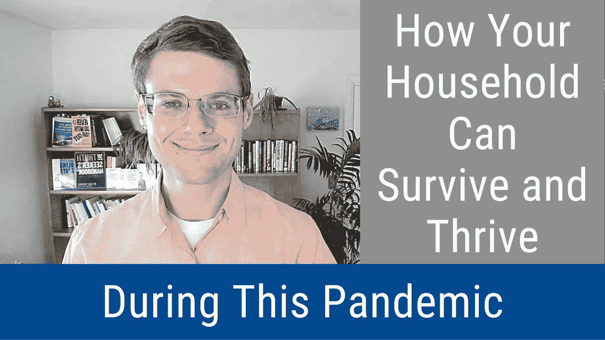

# 疫情期间，您的家庭如何生存和发展(视频和播客)

> 原文：<https://medium.datadriveninvestor.com/how-your-household-can-survive-and-thrive-during-this-pandemic-video-and-podcast-ca470863aac2?source=collection_archive---------39----------------------->

通过识别和解决家庭的基本需求:安全、联系和自尊，你可以在疫情的新异常中生存和发展。这就是本期《明智的决策者》节目的关键信息，它描述了你的家庭如何在这个疫情中生存和发展。

# 视频:“疫情期间，您的家庭如何生存和发展”

# 播客:“在这个疫情，你的家庭如何生存和发展”

# 视频广播和播客中提到的链接

*   这是关于你的家庭如何在这个疫情生存和发展的第[篇文章](https://disasteravoidanceexperts.com/how-your-household-can-survive-and-thrive-during-this-pandemic/)
*   《T2:适应和计划新冠肺炎冠状病毒疫情的新异常》一书在[这里](https://disasteravoidanceexperts.com/adapt)有售
*   欢迎您注册[免费的明智决策者课程](https://disasteravoidanceexperts.com/subscribe/)

 [## 你的 COVID 等级是多少？为疫情安全设计办公空间|数据驱动投资者

### 自从新冠肺炎·疫情席卷美国，迫使工人逃离办公室，走向孤立无援的境地…

www.datadriveninvestor.com](https://www.datadriveninvestor.com/2020/11/23/whats-your-covid-rating-designing-office-spaces-for-pandemic-safety/) 

# 副本

Hello, everyone, and welcome to another episode of the wise decision maker guide, where we help you make the wisest and most profitable decisions. Today, I want to talk about how your household can survive and thrive during this pandemic. It’s a really difficult issue and many people are realizing right now that the pandemic is going to go on much longer than they thought at the beginning of the pandemic, people thought, well, we’ll go on maybe a couple of weeks month, it will be over by the summer, folks like Elon Musk, were saying he had a tweet in April 19 saying closed on March 19\. Clay said that there is going to be close to zero new cases by the end of April. Yeah, right. Unfortunately, we are in the pandemic right now. In the depths of it at the end of August, we have over 180,000 people dead, and over 5 million cases. So it’s a pretty terrible situation. It’s really bad. And people are really realizing the depths of the situation. So many schools are closed. That’s one example. Many universities are closed, many workplaces are still closed or choti, multiple places, and others are laying people off, right and left because they just don’t need the services of these people. So we’re in a pretty terrible situation. And people are figuring out that it’s going to go on for a very long time, we won’t have a vaccine available until the spring of 2021 at the earliest. And then it will, then that’s a super optimistic scenario, one very unlikely to happen to have an effective vaccine over 80% effective By that time, even if we do which would be wonderful, I really hope that we’re crossing my fingers. But it will take how how long to actually produce enough but distributed vaccinate people, the most promising vaccine candidates, the Pfizer vaccine and the maternal vaccine are novel technology that needs to be stored at the Pfizer needs to be stored at minus 94 degrees Fahrenheit, the maternal vaccine needs to be stored at minus four degrees Fahrenheit. And neither of those are things that modern pharmacies, typical pharmacies can handle. These need to be specialized venues. So be pretty hard to actually produce it and distribute the vaccine. And then polls surveys are saying that something like 40% of the American population is not really willing to take it only 60% are really willing to take it. So then you have to have a massive public education campaign to actually get enough people to take the vaccine. So it’s going to be a pretty difficult issue, even once we have an effective vaccine, and that will very unlikely to happen by the spring of 2021, which is the earliest possible timeline. So it is likely the pandemic is likely to last for several more years, and we’re still going to be dealing with it in the most optimistic case it will take a year to distribute, produce, distribute and vaccinate people. So that’s going to go on into early 2022\. But more realistically, 23 or 24\. So you’ve got to figure out how your household can survive and thrive during this period. Using individuals in your household as a whole. That’s something you really need to learn about. And you need to think about the need to make a plan for your household to survive and thrive in this pandemic, not simply treat it as a day to day issue, not simply treat it as Hey, I’m going to deal with this next flare up next issue of COVID-19\. Related next and not really think about the long term consequences because when you don’t think about the long term consequences, you burn out, people are treating COVID-19 as a sprint, but really it’s a matter of thumb. And they need to think about this for their household for themselves. How do they address this? How do they change the way they live? How do they change their mental habits, their physical habits, everything about how they go about their personal lives, their family lives, their connection to others. You need to figure out how to satisfy your needs in this new abnormal. And that is where we’re in my new book called resilience, adapt and plan for the new normal of the COVID-19 coronavirus pandemic. I talked about how we can think of it as going back to a normal we’re falling into a cognitive bias. A dangerous judgment is called the normality bias. But we want to act as though things are normal. And so we don’t really think through how to address this new abnormality. So what we need to do is figure out how to satisfy your underlying needs because pandemic or no pandemic your underlying needs your households The line needs to remain the same. But you have to figure out how to satisfy them in a different way. There’s going to be much less interaction with people outside your household in order to figure that out. But you need to think about the consequences, the long term consequences of these lesser interactions, you know, not seeing your family favorite family members for Thanksgiving, you might have seen them for the summer for July 4, you can see them outside. But on Thanksgiving, of course, that’s going to be pretty cold unless you’re lucky in a very warm tropical area. But for most of the US and most of the world, Thanksgiving is not a place where you can have a time where you can easily do it outdoors. So given that it’s how unsafe It is to be in enclosed spaces, where you have a Thanksgiving meal, you’re not going to interact with your relatives on Thanksgiving, much less interaction with your friends, much less interaction with people outside of your household. And it can also be a problem to interact more with people inside your household that can cause its own set of problems, believe me, there’s going to be much less travel much less of these dynamics, you know, airline, travel is way down other public transport is way down. Car travel is somewhat up but still much lower than it used to be Haldol occupancy is much lower. So you have to think about traveling and not traveling. How do you replace that more time at home, feeling cooped up feeling like you’re in prison, I know that feeling. Believe me, I’ve spent a lot of time in my home. And it’s not. I’ve been definitely trying to make it nicer with a long term perspective. But that’s not something that is necessarily pleasant to think that I’m going to spend much more time in my home. But you have to be ready for it, you have to prepare for it. And you have to plan for it. You have to figure out your fundamental needs. And those are really the main things you need to satisfy to survive and thrive in this pandemic, your fundamental basic needs. Those are the things you need to address to survive and thrive in this pandemic, your needs of safety, your needs a connection and your needs of self esteem. And if you know Abraham Maslow’s hierarchy of needs. This is based on the research of Maslow’s hierarchy of needs, adapted and modernized by current research on the hierarchy of needs, what we actually truly need, because Maslow was definitely ahead of his time. And some of the things that he wrote about has been superseded by more recent research that has been shown to be not as accurate as we’d like to be. So there are three areas that you need to be thinking about safety, connection and self esteem. And I’ll go into each area and what that means saved, you need to have two months of supplies, you might have a serious local outbreak, as happened in New York City, as it’s happening is still happening in a number of cities in Texas as they speak right now, which is the end of August, it’s happening a number of areas in Florida, Arizona. So this is an California This is not a great situation. So those areas find it much harder to go outside of their home. And it’s pretty dangerous to go shopping. So of course online delivery services are experiencing a lot of interruption. So you got to get two months of supplies, for your home, for your house of food, water, everything like that, how various household supplies, cleaners, medications, supplements, whatever you use, ask your doctor for a prescription enough for two months, get the pharmacy to write out the prescription for two months, there’s various ways you can ensure that they can do that, although they do it standard for a month to serve two months of supplies laid away. And I recommend food by the way that you go. Don’t try to empty the grocery store shelves, that is not a good idea. It’s gonna be more burdensome for you and more expensive and will deprive your neighbors of whatever was in the grocery store shelves. So I recommend that you go online and order in bulk, it’s going to be cheaper, and it’s going to be fairer to others. So that’s something you want to be thinking about in terms of safety. As part of the course of safety. You want to be thinking about your economic safety, and how will you ensure that your job is safe and the pandemic depends, of course in your job. But that’s something you want to be thinking about how your career will progress. Right now we’re in a situation where the people with the PPP loans are protecting many people’s jobs, but pretty soon, they’ll run out and many people will get laid off who aren’t expecting to get laid off. Connection, you want to be thinking about your connection to others, members of your household. So of course you’re spending a lot more time with them with your kids. If you have kids, with your romantic partner. You know if you’re let’s say spending time with your romantic partner with my wife, for example, right now we’re spending 24 seven together and that is Quite a bit harder than spending a more balanced amount of time. So we sat down, and we figured out how to avoid getting in each other’s faces in each other’s spaces quite as much, and make sure that we have a balance of how we interact and integrate our lives with each other. And that’s when I coach people as an executive coach. And as a life coach, that has been really helpful for people to think about, how do you manage your relationships, that is something to think through, and all aspects of your relationships to make sure that they’re balanced, and that you’re not harming your relationships with important members, important people in your life, and your romantic partners, your kids, it’s very, especially teenagers, it’s hard to deal with them being in the same household for them to deal with it for you to deal with it. But as well as elderly parents, let’s say you’re a caretaker, how do you support them, knowing that they’re much more vulnerable to COVID-19, people who are older, especially older males, but older women as well, are much more vulnerable to COVID-19\. When you’re studying getting into your 50s, that’s when the vulnerability sharply increases. And of course, people who are under 50, if they have an underlying health condition of some sort, then people outside your household. If you have a romantic partner who is outside of your household, you must decide whether you’ll be in the same pod with them meaning you are someone who they are comfortable having been socially close to and the same for you. And that you share the same amount of risk in terms of exposure to COVID-19\. The same goes for your friends, you will likely not want to make more than a couple of households outside of your own house or part of your pod. So you’ll have to decide which friends are close enough that you might want to have them as part of your pod. And also which are willing to abide by your guidelines for how you treat COVID-19 or which ones you will want to be socially distanced from wearing a mask and so on. And when you need to see them inside, outside, keeping 10 feet in six feet is really not enough. According to recent research, you really need about 10 foot distance outside to have some safety, and then your community right now it’s not a good idea to go to church, if you typically go to church, far from everyone does that. But right now, it’s not a good idea to go to church or other sorts of clubs, other sorts of faith based groups, other sorts of values based groups, secular secular groups, whatever. So all of those things in person are not a good idea unless they’re done outside within 10 feet distance apart from other people, which most of these things are pretty hard to do. Unless you’re part of a frisbee club, or something like that, or tennis playing club. So you want to figure out how to do virtual activities. A lot of these things can be done virtually virtual game night as part of my community activities, I do that. And so when you want to figure out how to replace the kinds of things you had with other people, that’s a connection. Finally, self esteem, this is something that’s really underrated. self esteem is an important part of having a good life and a good life experience and appreciating our fundamental needs. And there are free areas and self esteem that you need to be thinking about self confidence, self respect, and sense of mastery. So self confidence comes from a sense of control over the world. Not Of course, that you have control over other people, but that you have control over your fate over your circumstances. So the more control you can gain over your fate, the better your self confidence will be. And that means the first thing that means is figuring out how your household will survive and thrive for the pandemic, sitting down working out a plan by yourself and or with other members of your household. Who are the responsible adults in your household? And of course for yourself, you want to also have some activities by yourself so that other members of the household, how you will survive and thrive as a household in the pandemic that is going to be a great first step to building up that confidence, self respect that comes from feeling like you’re doing whatever you’re supposed to be doing feeling like you have power in your life and feeling that you can respect yourself and their ways. It really depends on each person, how they find that sense of self respect, what gives them that self respect, what gives them that sense that they are moving forward, and that they are pleased with the way that they’re moving forward in their lives. This is different from control over your faith and the self confidence that comes from that. This is a sense of self respect that you’re accomplishing your life goals. You’re doing what you would like to be doing. So That’s what self respect is for. And you want to figure out what gives you that sense that you are accomplishing your life goals, and then move toward that. And then with a sense of mastery, you want to make sure that you have mastery over skills and activities over your environment. To the extent that’s possible, this is somewhat different than those self confidence over your fate, shaping your fate. This is more about skills and activities in your environment. As you might be able to tell from the first I really from my office, I enjoy having lots of plants around. So that is something that gives me a sense of mastery, and this hobby, these plans, that’s a fun thing. For me, I enjoy that reading is something I enjoy, and for reading, learning about new things. So picking up new hobbies, new activities, or getting back into old ones, Enriching yourself, learning a new language, growing plans, making viral YouTube videos, whatever is enjoyable for you. Some outside activities, if you like to play sports, or go hiking, that’s a good time to do more of that. These are things that relate to that sense of mastery. So that means that you have skills that you’re building up learning information, knowledge, this is also a good time to develop in your professional career, especially if you might be worried about your professional career. So a sense of mastery also relates to your skills in your professional career. So professional development, this is a good time for that. And that’s a good set of activities to build up your sense of mastery. All right, definitely one sub. That’s what I wish to share about for this episode of the wise decision maker guide. And I encourage you to check out the blog that’s associated with this episode, which has a much more in depth case study of how to survive and thrive in this pandemic with where I talk through the example of a person executive for whom I both provide executive coaching, and life coaching. There you can see for this case, study how one person has handled this matter. So check out the blog linked in the show notes, and check out my two books on this topic, resilience, adapt and plan for the new normal of the COVID-19 Coronavirus pandemic, and the blind spots. That’s of course, but the coronavirus pandemic itself. And then the blind spots between us how to overcome unconscious cognitive bias and build better relationships, on developing relationships with other people. And finally, never go with your gut, I would always recommend checking that out for basic fundamental decision making. And that’s going to be good, never go with your gut how pioneering leaders make the best decisions and avoid business disasters. So check those out as well that are also going to be linked in the show notes. And there’s going to be a way that you can check out the show notes and there’s going to be social media links. So follow us on social media to get more information about these topics and share all sorts of articles, videos and podcasts, audio interviews, there so it means you’ll enjoy checking those out. There’s Facebook, Instagram, LinkedIn, and Twitter. I also want to encourage you to make sure to sign up on your favorite subscription venues to get this video cast and podcast we broadcast both in the form of videos and podcasts. So wherever you’re checking out this episode, make sure of the wise decision maker show and make sure to sign up there to get more of the show. Please leave your comments on the show wherever you’re getting it, whether it’s on video or podcast, please leave your comments about what you thought of this show. And if you like it, click Like and share it with your friends. So that would be very helpful. You’ll want to help them survive and thrive for this pandemic. Alright, I hope this episode has been helpful for you and as always the wisest decisions to you, my friends.

转录自 [https://otter.ai](https://otter.ai)

*原载于* [*避灾专家*](https://disasteravoidanceexperts.com/how-your-household-can-survive-and-thrive-during-this-pandemic-(video-and-podcast)/)

—

**Bio** :国际公认的思想领袖，被称为灾难规避专家，[Gleb Tsipursky](https://disasteravoidanceexperts.com/glebtsipursky/)博士的使命是通过制定最有效的决策策略来保护领导者免受被称为认知偏差的危险判断错误的影响。作为一名畅销书作家，他最著名的作品是《T4》*《永远不要跟着感觉走:先锋领导者如何做出最佳决策并避免商业灾难* (职业出版社，2019 年)、《我们之间的盲点:如何克服无意识的认知偏见并建立更好的关系 (《新先驱》，2020 年)和《韧性:适应并计划新冠肺炎冠状病毒疫情 (《变革者图书》，2020 年)他发表了 550 多篇文章，接受了 450 多个知名媒体的采访，如[*Inc .*](https://www.inc.com/entrepreneurs-organization/a-behavioral-scientist-explains-why-your-swot-analysis-is-dangerously-flawed.html)[*企业家*](https://www.entrepreneur.com/article/348115)[*CBS 新闻*](https://www.cbsnews.com/video/study-says-taking-a-small-break-from-facebook-might-be-good-for-your-mental-health/)[*时代*](http://time.com/4257876/wounded-warrior-project-scandal/)[*商业内幕*](https://www.businessinsider.com/disaster-expert-companies-should-face-coronavirus-with-pessimism-2020-3)[*政府官员*](http://www.govexec.com/excellence/promising-practices/2017/03/heres-why-your-gut-instinct-wrong-work-and-how-know-when-it-isnt/136104/)[他的专业知识来自于作为](https://disasteravoidanceexperts.com/NeverGut/)[避灾专家](http://disasteravoidanceexperts.com/)的 CEO，20 多年的[咨询](https://disasteravoidanceexperts.com/consulting/)、[辅导](https://disasteravoidanceexperts.com/coaching/)、[演讲和培训](https://disasteravoidanceexperts.com/speaking/)。这也源于[作为一名行为经济学家和认知神经科学家在学术界超过 15 年的](http://disasteravoidanceexperts.com/research)。通过 Gleb[at]DisasterAvoidanceExperts[dot]com、Twitter[@ Gleb _ tsipursky](https://twitter.com/Gleb_Tsipursky)、insta gram[@ dr _ Gleb _ tsipursky](https://www.instagram.com/dr_gleb_tsipursky/)、 [LinkedIn](https://www.linkedin.com/in/dr-gleb-tsipursky/) 联系他，注册他的免费[明智决策者课程](https://disasteravoidanceexperts.com/newsletter/)。

## 访问专家视图— [订阅 DDI 英特尔](https://datadriveninvestor.com/ddi-intel)