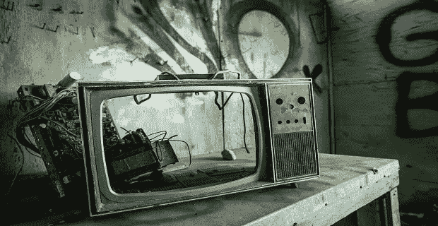

# 你的电视是如何毁掉你的银行账户的

> 原文：<https://medium.datadriveninvestor.com/how-your-television-is-destroying-your-bank-account-50f02ad97d8e?source=collection_archive---------23----------------------->

你知道上周谁被踢出了这个岛吗？谁收到了最后的玫瑰？

如果是这样，你就正常了。*太正常了*。

请听我说完。据 Business Insider 报道，普通美国人每天看电视 5 小时！

五个小时。我认为剪线会扼杀电视行业？

一个更神奇的数据:平均来说，美国人每周看电视超过 35 个小时(直播或录制/流媒体)!这几乎相当于拥有另一份全职工作！

Photo by [Tina Rataj-Berard](https://unsplash.com/@t_rat_max?utm_source=unsplash&utm_medium=referral&utm_content=creditCopyText) on [Unsplash](https://unsplash.com/s/photos/television-trash?utm_source=unsplash&utm_medium=referral&utm_content=creditCopyText)

我不是那个要告诉你停止看电视的人，我和其他人一样喜欢看电视。我在这里告诉你 ***电视正在摧毁你的财务*** 以及生产力的五种方式！ ***来了:***

看电视会让你变成一个穷光蛋

**电缆账单**

根据《财富》杂志的文章，今天美国的平均有线电视费用是每月 103 美元。每年超过 1200 美元。十年来，平均每个美国家庭在电视上的花费超过 12，000 美元！

在 10 年内每年投资 1200 美元，可能会比你了解《实习医生格蕾》中的每个角色，或者卡戴珊夫妇今天在和谁约会多一点。(不好意思，太简单了！)

 [## 现在是用 DeFi 取代银行的时候了吗？数据驱动的投资者

### 当你想到传统银行时，你会想到哪些服务？支票账户贷款储蓄…

www.datadriveninvestor.com](https://www.datadriveninvestor.com/2020/07/17/is-it-now-the-time-to-replace-the-banks-with-defi/) 

**时间**

想想你可以用这额外的 35 小时/周做些什么有益的事情？我们不要走极端；削减(17.5 小时/周)怎么样？

在 17.5 小时内，你可以完成无数的事情。

开始副业还是找份兼职？锻炼身体。看书。出去吧。花时间和家人或朋友在一起。去上课。做点有成效的事！我认为“多产”的电视节目不多。有些项目以教育和学习为中心，但不多！

你花在看《单身汉》上的时间回不来了。想想吧。

如果你在看电视，你会购买新的电视和配件。

从小到大，我相信我的家庭在我们非常简朴的家里(3 间卧室-2 间客厅-厨房、车库、商店)有 8 台电视。我们家有四个人，我父母，我妹妹和我。我们可能有些极端，但如果我说电视不是我生活中的一大部分，那我是在撒谎！

我们总是为某个房间买一台新电视！每个“黑色星期五”，我们都会在凌晨 4 点排队疯狂购物，因为有一个非常好的交易，我们不能错过！我们总是需要一台新电视吗？不要！

如今，一切都是关于“智能电视”他们在黑色星期五是如此便宜，尽管是正确的。快讯:它被称为黑色星期五，因为零售商正在赚钱-他们“在黑暗中”除非盈利，否则他们不会卖给你产品！越大越好，高清，3D，你能想到的，为了“与邻居攀比”,你每 2-3 年或更长时间就要买一台新电视！

假设你是一个时髦的“脐带切割者”你认为你已经对这一切免疫了。不对。看你的网飞，Hulu 等。你必须有一些方法来投射它，镜像它或者在你的大电视上播放它，旧的显像管电视没有这个能力！零售商和公司创造了一个系统，你“别无选择”，只能升级！

**电**

我承认，这并不是很大的变化。也就是说，让我们从头回到那个统计。每周 35 小时。如果你在看电视的时候开着灯，那么每周还有 35 个小时。如果你是流媒体，你可能有另一台设备每周运行 35 个小时。

如果你停下来，开电视的电费不会改变你的生活。然而，如果你把它加起来超过一年，或者超过十年，我可以想象你可以想出更好的方法来处理你的钱！

**广告**

你曾经从电视购物中买过东西吗？也许不是。从一个商业广告怎么样？我想是的。

我们接触广告越多，就越有可能购买这些产品。不相信我？

公司为超级碗广告空间支付数百万美元是有原因的。人们观看它。

公司在广告上花费数千美元是有原因的:它们有效！

如果你停止看电视，你就会减少接触广告，简单明了。

在过去的 2-3 年里，由于上面列出的原因，我几乎不看电视了。我发现我的生活有了很多改善；结果，更不用说它给我省了多少钱了！我鼓励你试一试，或者至少削减开支！

**访问专家视图—** [**订阅 DDI 英特尔**](https://datadriveninvestor.com/ddi-intel)