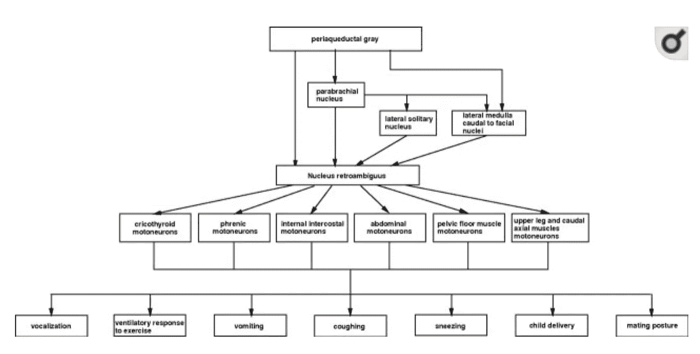

# 你的声音是如何工作的

> 原文：<https://medium.datadriveninvestor.com/how-your-voice-works-14681ee776b0?source=collection_archive---------9----------------------->

## 洞察你声音中的“你”

Photo by [Joyce McCown](https://unsplash.com/@moonshadowpress?utm_source=medium&utm_medium=referral) on [Unsplash](https://unsplash.com?utm_source=medium&utm_medium=referral)

这里是你声音中的“你”？对一般人来说，“演讲”是一个非常简单的现象，很大程度上是一种事后的想法，但在它的简单背后隐藏着无数复杂的过程，每个过程都体现在你说话的*方式*和你被听到的*方式*中。

人们如何听到你会影响你的职业轨迹，[被发现会影响性吸引力](https://medium.com/@oratorvoice/how-your-voice-reveals-your-sexual-quality-2e39fd84da76)，如果说话有技巧和策略，会创造各种机会[。](https://medium.com/swlh/how-to-give-your-voice-depth-why-it-matters-411dad2fc78)

成为一个伟大的演说家需要你了解你的身体是如何工作的，以及它如何影响你声音中的“你”；因为这背后的动力很大程度上是无意识的…

# 澄清一些常见的误解

在我们开始之前，有几个误解值得澄清:

> **1。“向你的横膈膜吸气”**

首先，上面的短语经常被提及，但事实上，它在生物学上是不可能的——你只能用肺呼吸。其次，*横膈膜呼吸*无时无刻不在发生，它不是你必须学习的东西，尽管呼吸和加强横膈膜的过程可以大大改善！简单地说，横膈膜是一块平坦的肌肉，形状像一个圆顶，位于你的肺下面，与肺相连。当横膈膜变平时，它会向下拉动肺部，通过产生负气压来增加胸腔容量，从而获得更多空气。这个不可思议的过程以及它如何影响我们可以在这里找到更多的细节。

> **2。"我嗓子哑了，因为我喊得太大声了！"**

失声其实并不是因为增加了你分贝的范围；也不是整天不停地说话。“婴儿可以哭几个小时”和孩子可以尖叫和说话几天的事实背后有很大的分量。类似地，在当地唱诗班唱歌的人，实际上是在大喊大叫，在大规模的喷溅和咳嗽后往往不会离开。

*那么为什么成年人失声更有规律更普遍呢？*

因为成年人有更多的责任，随之而来的是生活中的许多压力。身体压力的隐性成本会对发声器官造成严重破坏，这可能导致:

1.  喉部肌肉发声困难(喉部紧张)
2.  呼吸受限或被迫
3.  逐渐减弱的发声习惯
4.  不良姿势

这样的例子不胜枚举…

其他身心因素也会对声音产生影响，正如患有创伤后应激障碍、慢性焦虑和创伤的人所见，这通常表现为口吃或失声。

以上每一点都可能导致失声，所以我在这里指导你****来学习你能做些什么。然而，失声并不是由于说话*太*多，或者喊叫*太*大声。如果是这样的话，将会有很多声音嘶哑的孩子，父母仍然会保持理智，因为他们的孩子只哭了十分钟就哭了出来！然而，从这个列表中你会注意到严重缺乏*玩耍，而*玩耍是保持你声音活力和不知疲倦的关键因素。****

> ******3。“我不会唱歌！”******

****如果你从来没有练习过，那么这可能是真的，但是像所有的技能一样，它是可以学习的，而且有大量的研究表明，为了你的身心健康，你为什么应该这样做；事实上，唱歌比锻炼对情绪有更大的积极影响。****

****现在，让我们从呼吸开始。****

# *****为什么呼吸对说话很重要？*****

****因为呼吸是你发声的基础；但是呼吸的过程本身受到大量输入的影响，这些输入反过来会影响你的声音。首先，理解呼吸实际上是如何发生的是谨慎的。****

**** [## 当科幻进入现实|数据驱动的投资者

### 科幻小说以其疯狂的技术故事统治了世界，充满了诸如读心术和人类的想法…

www.datadriveninvestor.com](https://www.datadriveninvestor.com/2020/04/17/when-science-fiction-enters-reality/) 

# 脑干及其呼吸中枢

## 延髓

大脑的这一部分有许多功能，但我们的重点是在其中发现的两组呼吸相关神经元:背侧呼吸组(DRG) 和腹侧呼吸组(VRG) 。

DRG 是一组吸气神经元，通过神经支配膈肌和肋间肋肌收缩来控制 *Eupnea (* 也称为静息呼吸率 *)* 。DRG 通过轴突作用于膈肌，轴突经由称为 [*膈神经*](https://www.sciencedirect.com/science/article/pii/B9780128008836000665) 的神经离开脊髓。

你横膈膜的收缩增加了你的胸腔容量，产生了气压下降(真空)，而[导致吸气](https://medium.com/swlh/what-crocodiles-and-humans-have-in-common-8f15ba87f6d9)。当来自 DRG 的脉冲停止时，它不再触发横膈膜和肋间肌收缩，并且没有神经支配，肌肉通过称为弹性反冲的过程释放；这意味着肌肉弹回它们的起始位置，导致呼气。值得注意的是，这种呼气是被动的，这意味着这一阶段的发生没有运动激活。Eupnea，或轻松的呼吸，是与重力对话的关键基础。在呼吸受到阻碍的地方，比如过度屏气，随着时间的推移，声音的音调和质量会降低，因为两者是交织在一起的。

然而，VRG 虽然包含吸气和呼气神经元，但在呼吸暂停时是不活动的。只有在积极的呼吸过程中，比如在运动中，它才会变得突出。VRG 中的神经元刺激附属腹肌收缩，导致*强迫*吸气*和*呼气。

[The Brainstem](https://courses.lumenlearning.com/boundless-ap/chapter/respiration-control/)

## 呼吸节奏

脑桥是脑干中最大的部分。在脑桥的一部分内，有另一个呼吸网络，称为*脑桥呼吸群*【PRG】，或*呼吸中枢*。在 PRG 中有一组被称为臂旁核和克勒克尔-福思[KF]区的原子核。KF 区的功能是调节吸气相和呼气相的频率，同时在呼吸循环期间对上气道限制的动态控制也有输入(Dutschmann 等人，2012)。它主要与延髓[呼吸神经元](https://www.sciencedirect.com/topics/medicine-and-dentistry/respiratory-neuron)联系，但也与 [*下丘脑*](https://www.sciencedirect.com/topics/medicine-and-dentistry/hypothalamus) 、大脑皮层*核* *孤束核*联系(Pramod K. Pal，Robert Chen，2014)。

上述这些神经连接表明，你的呼吸频率受到你的内部情绪状态的影响是多么重要，因为下丘脑调节你的激素和觉醒，而长石束核向边缘系统发送投射，该系统控制对改变的心肺状态的情绪反应，因为它在恐慌症中起作用。

> KF 中的突触可塑性和“记忆”对呼吸气流的**行为** **适应**至关重要。这里的关键词是行为适应:意思是，一些呼吸是习得的。鉴于我们倾向于受环境的支配，我们可能会以错误的方式学习。

突触可塑性，即突触根据其活动的增加或减少而生长或衰退的能力(即，“如果不使用它，你就会失去它”)，是神经系统的一个普遍属性，在哺乳动物的行为和情绪储备发展时出现。如果你一直处于一个危险的环境中，或者*认为*一个人会处于危险的环境中，为积极呼吸、战斗或逃跑而招募的肌肉会接受训练，使自己习惯于这种呼吸方式，也就是说，积极呼吸成为常态，即使在休息时也是如此。这可能会导致不和谐的有害发声习惯，如这里的[所解释的](https://medium.com/@oratorvoice/the-voice-keeps-the-score-29291fb68345)。

最终，声音本身需要被调制。声音的调节取决于吸气和呼气活动的时间、上呼吸道和横膈膜的精细运动控制以及[迷走神经反馈](https://pubmed.ncbi.nlm.nih.gov/11282387/)。

这些信息与一列称为疑后核的神经元结合在一起，这些神经元为许多不同的肌肉提供信号或运动神经支配，以协调工作。最后，你有足够的“燃料”在你的喉头产生振动，这是最初声音的来源！

[https://www.ncbi.nlm.nih.gov/pmc/articles/PMC6665025/](https://www.ncbi.nlm.nih.gov/pmc/articles/PMC6665025/)**** 

# ****声道和呼吸如何激发声音****

****声道被认为是一组结构，*过滤和操纵*从发声的最初来源(你的声带)产生的声音。这个结构群包含口腔(嘴、牙齿、嘴唇)、鼻腔(鼻子里面和后面的区域)、咽(喉咙后面)和喉。在这些结构中，还存在其他更小的成分，进一步扭曲和过滤你声音的旋律。****

****喉的主要生物功能是作为阀门来打开和关闭气道并保护肺部。发声，或“声音”，是一个次要的功能，在我们随后从爬行动物进化而来，已经适应了说话和唱歌。发声的源头始于声带层面。声带位于喉内，彼此直接相对固定，其间的空间称为“声门”。当声带聚集在一起发声时，声门就会消失。声带在前部锚定在甲状软骨上，后部锚定在杓状软骨的突起上。这些由内在喉肌启动的软骨运动负责打开和关闭声门，并负责声带的紧张和松弛。****

## ****声带的解剖****

****最外层是声带的薄上皮或“皮肤”。下面是固有层，由三层纤维组织组成。固有层的第一层与上皮结合形成皱襞的粘膜内层，而第二层和第三层结合形成声带韧带。声带韧带形成了声带的“嘴唇”。在固有层之外是一层称为“声带”的肌肉。正如我们所知，声带之间的空间被称为声门，而声带上方是另一套喉襞，被称为“假”或前庭声带。在真假声带之间是喉室，它容纳了一袋粘液腺，用于润滑声带。有效的润滑对声带的健康功能至关重要，可能会受到各种因素的干扰，包括感染、压力、情绪、吸烟、酒精、空调——所有这些都会导致声带干燥，使它们对短期损伤敏感。****

****所有这些都与你的呼吸频率、从肺部排出的空气柱以及你的声道的形状相结合，以过滤和塑造你的声音。****

# ****结论****

****也许“你”存在于你的呼吸频率中，而呼吸频率是由 Poms 中的呼吸中枢决定的，Poms 是脑干中两个呼吸中枢之一。或者，也许是因为血液中过量的二氧化碳导致脑干中的中枢化学受体向呼吸中心发出信号，以增加呼吸频率，从而增加肺潮气量(每次吸入或呼出之间置换的空气量)？****

****但是正如你所看到的，声音不能被分成几个部分，而是作为一个整体聚集在一起。如果这一链条中有一环缺失，声音或声音质量就会受损。这就是为什么对演讲者来说，不仅要触及他们的心理，还要触及他们的生理，这一点很重要。除非你开始把声音看作是整个人的一面镜子，否则你所说的话和你说话方式的潜力就无法实现。****

# ****引用的作品****

****神经解剖学，孤束核。金银岛(FL): StatPearls 出版社；2020****

****[阿米诺夫神经病学与普通医学(第五版)](https://www.sciencedirect.com/book/9780124077102)，爱思唯尔公司，2014 年。****

****Dutschmann，m .，& Dick，T. E. (2012 年)。脑桥的呼吸控制机制。*综合生理学*， *2* (4)，2443–2469。[https://doi.org/10.1002/cphy.c100015](https://doi.org/10.1002/cphy.c100015)****

****神经科学杂志，2009 年。疑后核控制呼吸。《神经科学杂志》，29(12):3824–3832。doi:10.1523/jneurosci . 0607–09.2009****

## ****访问专家视图— [订阅 DDI 英特尔](https://datadriveninvestor.com/ddi-intel)****