# 数据科学下的人力资源分析

> 原文：<https://medium.datadriveninvestor.com/hr-analytics-with-data-science-adc1649f4596?source=collection_archive---------0----------------------->

预测员工流失


员工流失率是指一个组织中现有员工离职和新员工入职时的整体人员流动率。T2 的离职率通常计算为特定时期内员工离开公司的百分比。尽管一些员工的流动是不可避免的，但是 T4 的高流失率是很昂贵的。


这个项目旨在给出一个完整的过程描述，用来预测一个公司中可能的员工流失。对一些公司来说，员工流失可能是一个上千万美元的问题。使用数据科学程序，公司可以预测可能离职的员工，还可以使用探索性数据分析来发现模式，这些模式可以告知员工可能决定离职的原因。这个项目的数据集可以在这里找到:为了给这个项目一点混合，R 用于 EDA 程序，Python 用于机器学习项目。这两个脚本都可以在数据集旁边的链接中找到。

要启动此过程，请加载数据集并执行以下操作:

```
#Read newly saved file
attrition <- read.csv("attrition.csv", stringsAsFactors = T)#Examine data structures
str(attrition)#Lets start with some correlation relationships
library(polycor)
attrition_corr <- hetcor(attrition)
attrition_corr$correlations %>% 
  melt() %>% 
  ggplot(., aes(Var1, Var2, fill = value)) +
  geom_tile() +
  scale_fill_gradient(low = "grey", high = "darkred") +
  geom_text(aes(Var1, Var2, label = round(value,2)), size = 2)+
  labs(title = "Correlation Matrix", x = "Numeric column", y = "Numeric Column",
       fill = "Coefficient Range") +
  theme(axis.text.x = element_text(vjust = 0.5, angle = 45),
        plot.title = element_text(face = "bold", hjust = 0.5))
```

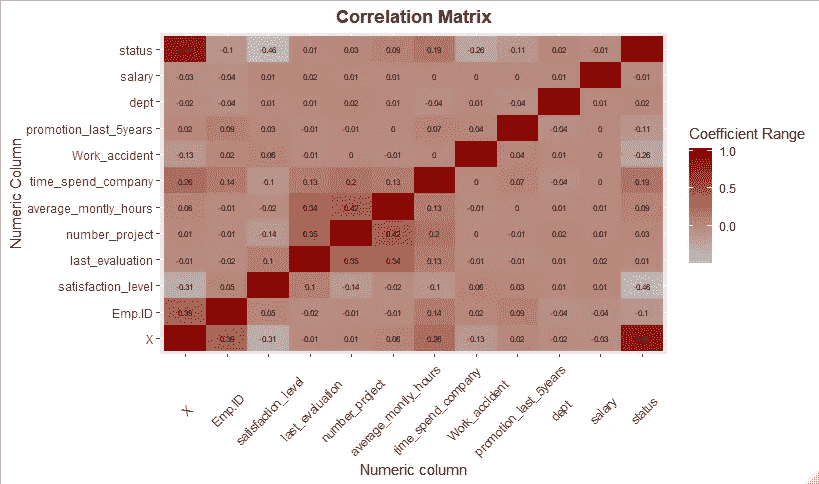

The Correlation Matrix

如上所述，这是一种相关性分析，用于检查数据集中变量之间的关系。

[](https://www.datadriveninvestor.com/2019/01/23/which-is-more-promising-data-science-or-software-engineering/) [## 数据科学和软件工程哪个更有前途？数据驱动的投资者

### 大约一个月前，当我坐在咖啡馆里为一个客户开发网站时，我发现了这个女人…

www.datadriveninvestor.com](https://www.datadriveninvestor.com/2019/01/23/which-is-more-promising-data-science-or-software-engineering/) 

现在，我们来看看现有员工与离职员工的比例:

```
#Lets examine the class 
attrition %>% 
  count(status) %>% 
  ggplot(., aes(status, n, fill = status)) +
  geom_bar(stat = "identity") +
  ggtitle("Existing staffs vs Exits")
```

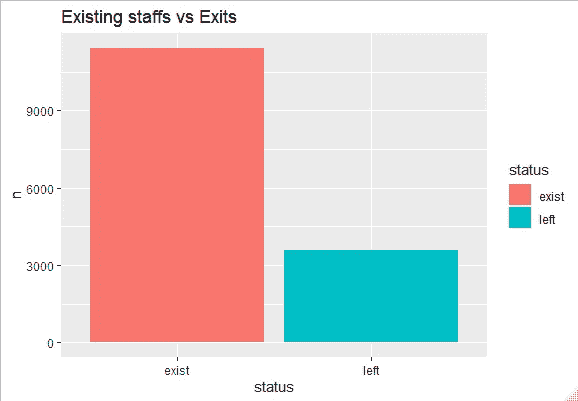

Existing Staffs vs Exits

接下来，我们检查员工人数最多的部门:

```
#Department with highest mumber of employess
attrition %>% 
  count(dept) %>% 
  ggplot(., aes(reorder(dept, n), n, fill = n)) +
  geom_bar(stat = "identity") +
  coord_flip() +
  labs(title = "Deparment staff counts",
       x = "Department")
```

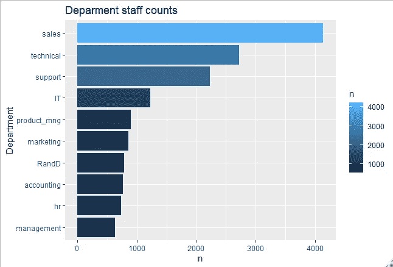

Staff Counts by Department

销售部门显然拥有最多的员工，管理部门拥有最少的员工。有了这些信息，我们可以尝试查看人员流动率最高的部门:

```
#Lets examine the department who has more people who left
attrition %>% 
  count(status, dept) %>% 
  filter(status == "left") %>% 
  ggplot(., aes(reorder(dept,n), n, fill = n)) +
  geom_bar(stat = "identity") +
  coord_flip() +
  ggtitle("Department with Largest Attrition Number") +
  xlab("Department")
```

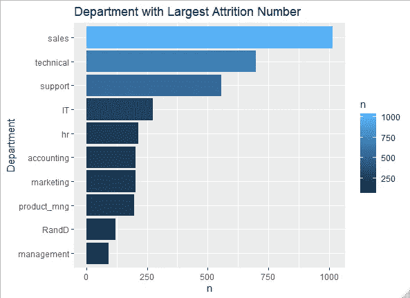

Attrition count by Department

部门规模和该部门的减员数之间似乎存在关系。要检查这种关系:

```
#relationship between department size and the churn size
cbind.data.frame(size = attrition %>% 
                   count(dept) %>% 
                   select(n),
                 churn = attrition %>% 
                   count(status, dept) %>% 
                   filter(status == "left") %>% 
                   select(n))
#There is a relationship of 0.993
```

我们还会继续查看所有部门的平均工作时间:

```
#Examine the average working hrs of each dept
attrition %>% 
  group_by(dept) %>% 
  summarise(n = mean(average_montly_hours)) %>% 
  ggplot(., aes(reorder(dept,n), n, fill = n)) +
  geom_bar(stat = "identity") +
  coord_flip()
```

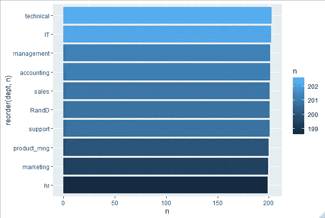

所有部门的平均工作时间几乎相等。检查所有部门的薪资分布可能会让我们对数据集有更深入的了解:

```
#Dept with the lowest salary range
attrition %>% 
  group_by(dept) %>% 
  count(salary, sort = T) %>% 
  ggplot(., aes(reorder(dept, n), n, fill = salary)) +
  geom_bar(stat = "identity") +
  coord_flip() +
  ggtitle("Salary range by department")
```

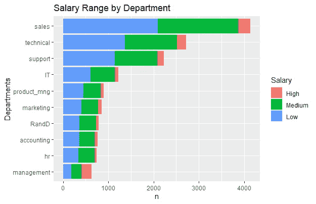

Salary Range Distribution across Departments

可以看出，所有部门的工资都比其他范围低，其次是中等。管理部门是唯一一个看起来处于中高工资区间的部门。为了更深入地了解每个部门的人员流动情况，重要的是要严格检查每个部门现有员工和离职员工的比例:

```
#ratio of people in a dept versus those who left
attrition %>% 
  group_by(dept) %>% 
  count(status) %>% 
  mutate(n2 = sum(n)) %>% 
  mutate(n3 = n/n2) %>% 
  ggplot(., aes(x = "", y = n3, fill = status)) +
  geom_bar(stat = "identity", width = 2) +
  coord_polar(theta = "y") +
  facet_wrap(~dept) +
  scale_fill_manual(values=c("#999999", "#E69F00"))
```

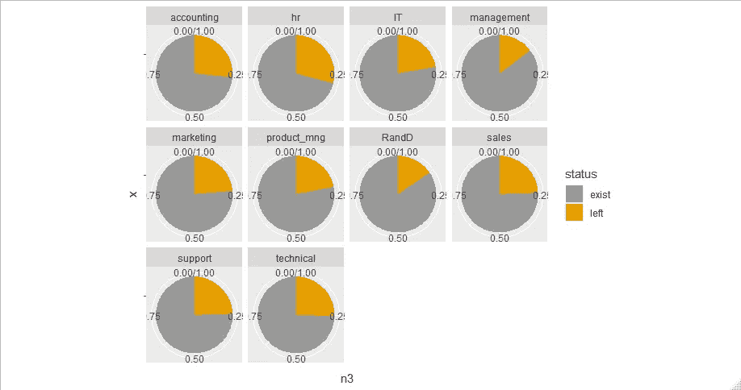

The Ratio of existing employees and those who left individually

为什么是这种可视化？

这种可视化可以帮助我们去除规模，仔细观察每个部门的流失率。例如，销售部门拥有最多的员工，但是与人力资源部门相比，它的流失率实际上要小一些，而人力资源部门的员工数量仅次于销售部门。继续检查每个部门的平均满意度:

```
#Satisfaction level by department
attrition %>% 
  group_by(dept) %>% 
  summarise(level = mean(satisfaction_level)) %>% 
  ggplot(., aes(reorder(dept, level), level, fill = dept)) +
  geom_bar(stat = "identity") +
  coord_flip() +
  ggtitle("Satisfaction Level by Department")
```

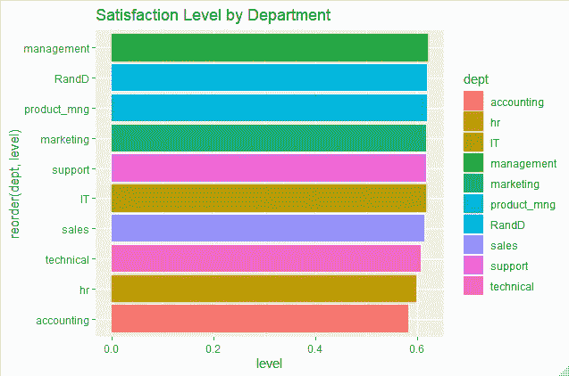

Satisfaction Level

现在，我们可以看看离开或留下的人的比例以及执行的项目数量:

```
#Ratio of people who left and are remaining by the number of projects they conducted
attrition %>% 
  group_by(number_project) %>% 
  count(status) %>% 
  ggplot(., aes(factor(number_project), n, fill = status)) +
  geom_bar(stat = "identity")attrition %>% 
  group_by(number_project) %>% 
  count(status) %>% 
  mutate(n2 = sum(n)) %>% 
  ungroup() %>% 
  mutate(n3 = n/n2) %>% 
  ggplot(., aes(x = "", y = n3, fill = status)) +
  geom_bar(stat = "identity", width = 2) +
  coord_polar(theta = "y") +
  facet_wrap(~number_project) +
  scale_fill_manual(values=c("#999999", "#E69F00"))
```

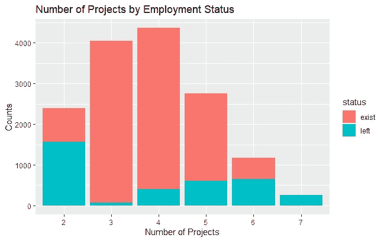

Number of Projects done across status levels

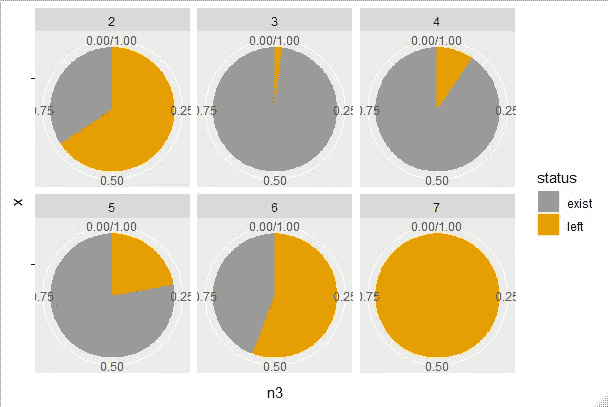

这个画面提供了很多关于离开的人的事实。我们可以看到，拥有 2、6、7 个计数项目的人离职倾向更大。比如每个还剩 7 个项目的人。多么有见地！

更进一步，让我们看看现有员工和离职员工的平均工作时间:

```
#People who left ap
ggplot(attrition, aes(average_montly_hours, fill = status)) +
  geom_density(alpha = 0.1) +
  ggtitle("Average Working hours")
```

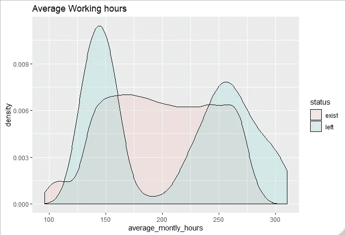

这个密度提供了很多信息。离职的人工作过度，大部分工作不足，而在职员工的分布相当稳定。可以有把握地推断，离开的人大多是那些工作不足和过度劳累的人。

最后，我们研究了在公司的时间和流失状态之间的关系:

```
#Lets examine the time spent in the company
attrition %>% 
  group_by(time_spend_company) %>% 
  count(status) %>% 
  mutate(n2 = sum(n)) %>% 
  ungroup() %>% 
  mutate(n3 = n/n2) %>% 
  ggplot(., aes(x = "", y = n3, fill = status)) +
  geom_bar(stat = "identity", width = 2) +
  coord_polar(theta = "y") +
  facet_wrap(~time_spend_company) +
  scale_fill_manual(values=c("#999999", "#E69F00")) +
  ggtitle("Time Spent in Company")
```

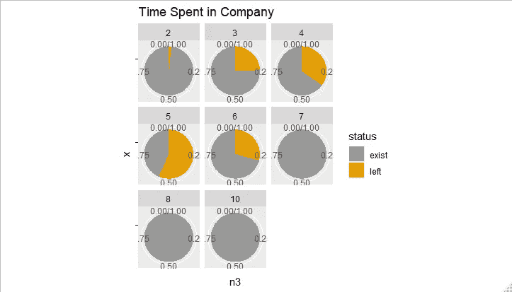

Time spent in company by churn status

饼图显示，可能离开的人也在公司工作了 3-6 年。有了所有这些信息，公司就能找到让工作对员工更有吸引力的方法。

## 机器学习

可以执行机器学习脚本，并且使用随机森林模型在测试数据上的最终得分显示出大约 99%的准确度。采用集合方法寻找最佳模型，RF 性能更好，但计算时间稍长:

Machine Learning Model in Python

## 结论

该项目已经能够操作流失数据集，并为组织在员工流失方面可能面临的深层问题提供可操作的见解。非常重要的一点是，人力资源团队将分析团队的发现传达给利益相关者，并采取更好的措施来确保有效的保留文化。