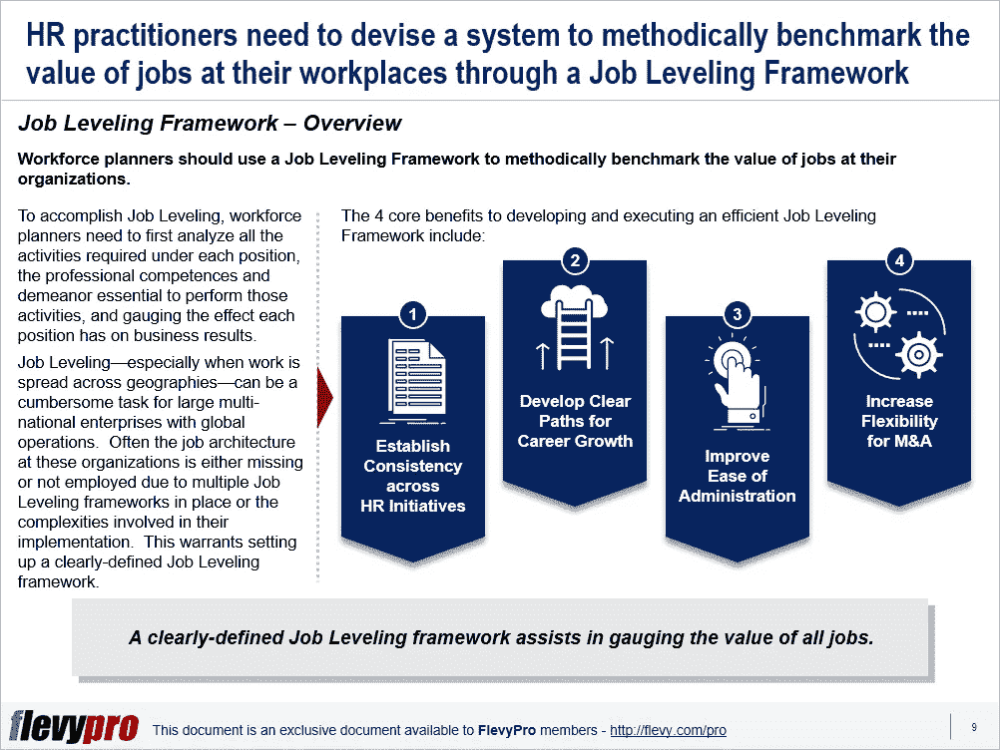

# 人力资源战略:设计一个强大的职位平衡框架的 4 个好处

> 原文：<https://medium.datadriveninvestor.com/hr-strategy-4-benefits-of-devising-a-robust-job-leveling-framework-3fd352e2569b?source=collection_archive---------7----------------------->

结构不合理的工作会在员工中产生争议、负面看法、不平等和挫折感。另一方面，清晰的工作、适当的工作分配、合理的权力级别以及对单个工作价值的正确估计会提高员工的敬业度、生产率和工作满意度。有组织的工作级别是有效的[人力资源管理](https://flevy.com/browse/stream/human-resources)功能的标志。

缺乏结构化的工作设计以及定义不清的工作使组织效率低下，并承受着过多的人员配备和薪资成本。这就要求领导层计划并实施职位平衡计划。职位平衡是一种规范的方法，用于衡量组织中各个职位的工作价值。它需要确定每个职位所做工作的性质、权限级别以及每项工作对业务结果的影响。该计划对于管理奖励结构至关重要。

然而，职位平衡是大多数组织都关心的问题——没有多少人对分配给他们角色的价值感到满意。缺少适当的或不充分的工作级别会给整个组织带来严重的后果。价值高于实际价值的工作会导致资源浪费，而价值低的工作会被认为是令人不快的，会让人失去动力。

当组织不断遇到问题时，职位设计和职位平衡至关重要，例如:

*   不断有员工抱怨并要求重新分类工作
*   过多的职称
*   对报酬的普遍不满
*   任务/流程冗余
*   资金外流
*   人员配置失衡和头重脚轻的结构

劳动力规划者应该制定一个清晰的[职位平衡框架](https://flevy.com/browse/flevypro/hr-strategy-job-leveling-5328)来解决这些问题，并有条不紊地为他们组织中的职位价值设定基准。要做到这一点，他们需要首先分析每个职位要求的所有活动，执行这些活动所必需的专业能力和行为，并衡量每个职位对业务结果的影响。

开发和执行高效工作平衡框架的 4 个核心优势包括:

1.  **在** [**人力资源**](https://flevy.com/browse/stream/human-resources) **计划**中建立一致性
2.  **为职业发展制定清晰的道路**
3.  **提高管理的便利性**
4.  **增加弹性为**[**M&A**](https://flevy.com/business-toolkit/manda)

现在，让我们深入研究其中的 3 个好处。

# 建立人力资源计划的一致性

标准化的工作评估方法可以实现一致的工作结构术语。它使沟通和职位平衡相关的决策变得更加容易。工作分级框架使用知识、问题解决、互动、影响和责任等要素，帮助定义各种工作的相对位置。通过职位平衡框架调整职位有助于在其他人力资源计划中保持一致性，并做出更好的人才相关决策。

# 为职业发展制定清晰的路径

组织使用清晰的职业道路来提高员工参与度，满足员工期望，并为他们的发展提供机会。工作分级框架提供清晰的工作结构来激励员工。通过职位等级框架制定的职业发展路径有助于领导者努力提高团队、单位和部门之间的流动性。

# 提高管理的便利性

职位平衡框架有助于开发有效的方法来管理人力资源计划。职位平衡框架能够提高与关键人才及其工作相关的效率和决策。例如，它简化了工资级别和工资结构；规范职称；简化短期激励标准和目标定义；并构建长期奖励资格标准和提名。

有兴趣了解更多有关职位平衡框架及其实施优势的信息吗？你可以点击 [Flevy 文档市场](https://flevy.com/browse)上的下载**人力资源战略:职位平衡框架**上的[可编辑幻灯片。](https://flevy.com/browse/flevypro/hr-strategy-job-leveling-5328)

## 你在这个框架中找到价值了吗？

你可以从 [FlevyPro 库](https://flevy.com/pro/library)下载关于这个和数百个类似业务框架的深入介绍。FlevyPro 得到了数千名管理顾问和企业高管的信任和使用。有些人不得不说:

> “我的 FlevyPro 订阅为我提供了当今市场上最受欢迎的框架和平台。它们不仅增加了我现有的咨询和辅导产品和服务，还让我跟上了最新的趋势，为我的实践激发了新产品和服务，并以其他解决方案的一小部分时间和金钱教育了我。我强烈推荐 FlevyPro 给任何认真对待成功的顾问。”

–比尔·布兰森，战略商业建筑师事务所创始人

> “作为一家利基战略咨询公司，Flevy 和 FlevyPro 框架和文件是一个持续的参考，有助于我们为客户构建我们的调查结果和建议，并提高他们的清晰度、力度和视觉效果。对我们来说，这是增加我们影响力和价值的宝贵资源。”

–Cynertia Consulting 的咨询区域经理 David Coloma

> “作为一个小企业主，FlevyPro 提供的资源材料已被证明是非常宝贵的。根据我们的项目事件和客户要求按需搜索材料的能力对我来说很棒，并证明对我的客户非常有益。重要的是，能够针对特定目的轻松编辑和定制材料有助于我们进行演示、知识共享和工具包开发，这是整个计划宣传材料的一部分。虽然 FlevyPro 包含任何咨询、项目或交付公司都必须拥有的资源材料，但它是小公司或独立顾问工具箱中必不可少的一部分。”

–变革战略(英国)董事总经理迈克尔·达夫

> “作为一名独立的成长顾问，FlevyPro 对我来说是一个很好的资源，可以访问大量的演示知识库来支持我与客户的合作。就投资回报而言，我从下载的第一个演示文稿中获得的价值是我订阅费用的好几倍！这些资料的质量让我能够打出超出自己体重的水平，这就像是用很小一部分开销就能获得四大咨询公司的资源一样。”

–Roderick Cameron，SGFE 有限公司的创始合伙人

> “我每个月都会浏览几次 FlevyPro，寻找与我面临的工作挑战相关的演示文稿(我是一名顾问)。当主题需要时，我会进一步探索，并从 Flevy 市场购买。在所有场合，我都阅读它们，分析它们。我采纳与我的工作最相关和最适用的想法；当然，所有这些都转化为我和我的客户的利益。"

量子 SFE 公司首席执行官奥马尔·埃尔南·蒙特斯·帕拉

在 [**领导力、辅导和个人成长**](https://app.ddichat.com/category/leadership-coaching-and-personal-growth) **:** 中安排一次对话

 [## 专家-领导力、教练和个人成长- DDIChat

### DDIChat 允许个人和企业直接与主题专家交流。它使咨询变得快速…

app.ddichat.com](https://app.ddichat.com/category/leadership-coaching-and-personal-growth) 

在此申请成为 DDIChat 专家[。
与 DDI 合作:](https://app.ddichat.com/expertsignup)[https://datadriveninvestor.com/collaborate](https://datadriveninvestor.com/collaborate)在此订阅 DDIntel [。](https://ddintel.datadriveninvestor.com/)