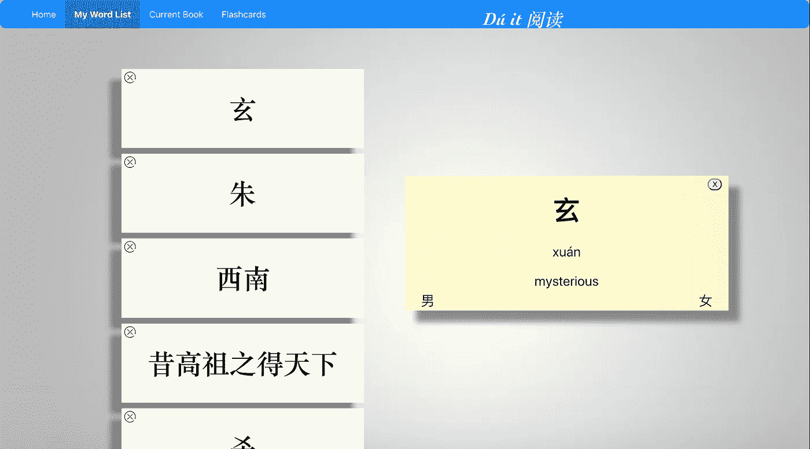
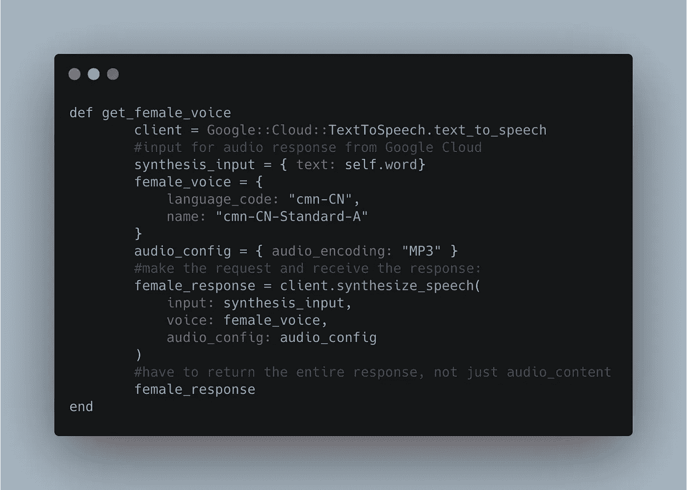
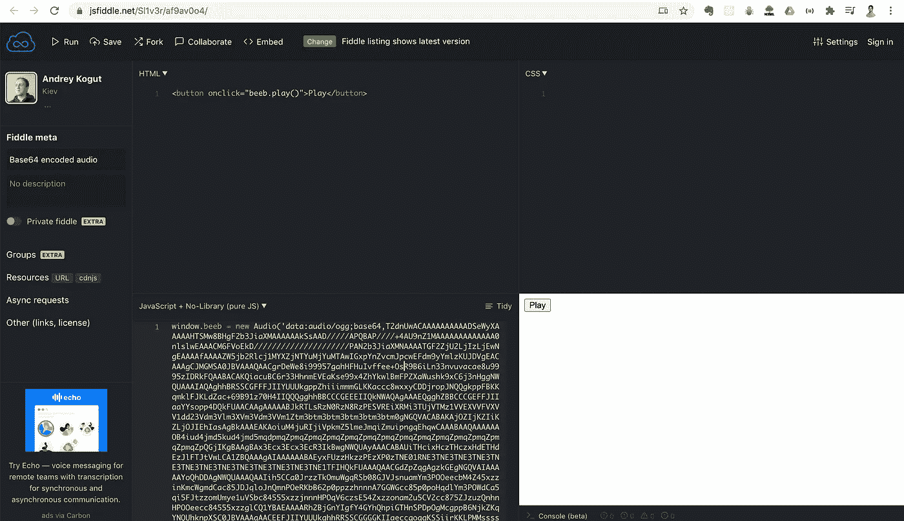
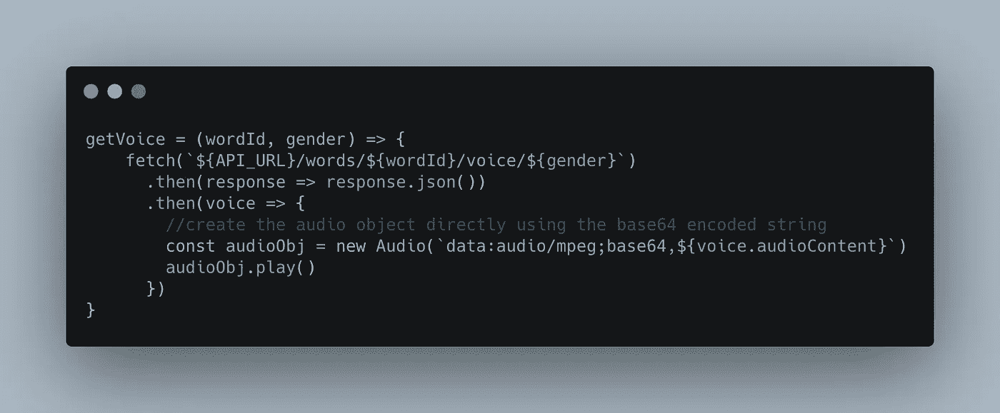

# HTMLAudioElement 可以解码编码字符串

> 原文：<https://medium.datadriveninvestor.com/htmlaudioelement-can-decode-encoded-strings-b4fe67642c8a?source=collection_archive---------11----------------------->

我正在摆弄 Google Cloud 的文本到语音 API，想通过在 Rails 后端发出调用，用 React 前端接收响应并播放声音来测试一下。

我不会深入讨论如何使用 Google Cloud Text to Speech SDK Gem for Rails，但不用说，[文档中给出的示例代码拥有您需要的一切](https://cloud.google.com/text-to-speech/docs/libraries)。

但是，我将详细介绍我是如何调用 Google Cloud 来获取我发送的文本的“声音”的。

我创建了一个名为“Du It”的应用程序这是我特别制作的，目的是让说英语的普通话学习者更容易阅读中文小说。

【https://youtu.be/VHXAkeIC1_0 号

在我的 Rails API 中，我有一个名为“Word”的模型当用户在应用程序中查找单词时，就会创建一个新的实例。在实例化时，对 Google Cloud Translate 的单独请求会获得英语定义，而我找到的一个有用的 gem 会提供给定单词的发音。

现在是音频。

当用户点击位于定义卡每个底部角落的声音性别字符时，就会发出对 Google Cloud 文本到语音转换的请求:

Note that the gender is the Chinese character for male/female respectively, for the diligent learner of Mandarin.

单击后，将对特定的 word 对象调用以下实例方法:

An instance method of the Word model, which is called by a method in the Words Controller. The value ‘female_response’ is JSON, with a key ‘audioContent’ and value of a base64 encoded string.

从 Google Text-to-Speech 收到的响应将是一个 base64 编码的字符串。

在此之前，我对如何使用编码字符串相当无知，对如何处理编码成一个字符串的音频更是一无所知。甚至 [HTMLAudioElement 的文档也没有明确指出任何处理它们的能力。](https://developer.mozilla.org/en-US/docs/Web/API/HTMLAudioElement)

然而，[我偶然发现了 Andrey Kogut 的一把 JS 小提琴](https://jsfiddle.net/Sl1v3r/af9av0o4/),它为我澄清了一切，非常壮观:

Notice the parameters passed into the Audio() constructor: ‘data: audio/ogg; base64, …’

Andrey 在这里使用 audio/ogg 进行格式化，但是我的格式是 audio/mpeg(即 mp3，您会注意到在实例方法中指定的选项。

因此，指定“数据:音频/mpeg；base64”和 Audio()对象要解码的整个编码字符串；我在 React 前端的一个方法中实现了它:

I love interpolating strings.

结果呢？当用户用普通话阅读小说时，可以听到单词的实际音频。这太不可思议了，我真的很感谢我能够像那样偶然发现安德烈·科古特的 JSFiddle。

我不知道有多少次我试图埋头用我的第二语言阅读，结果却因为我不知道如何读一个字/词而失败。让你的阅读流畅起来，这是阅读乐趣的源泉；培养对用另一种语言阅读的热爱的潜力只会增加阅读的乐趣。