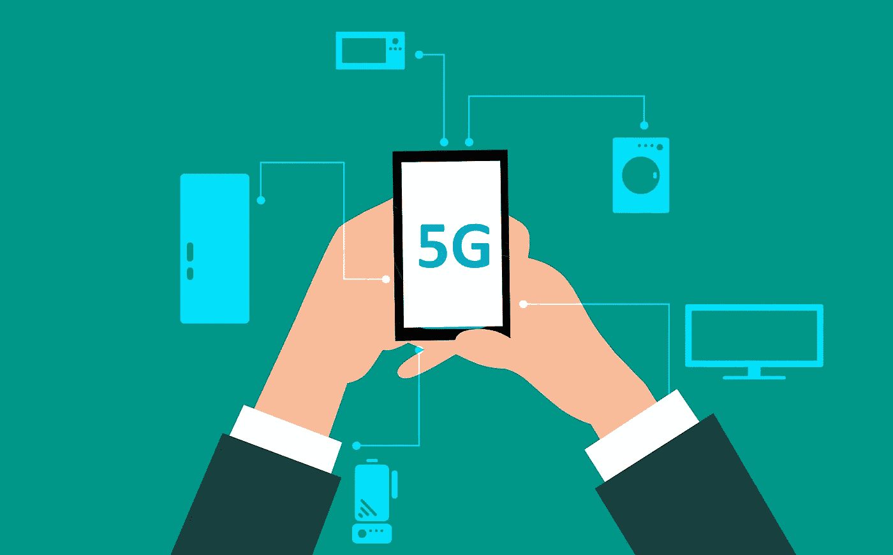

# 华为的 5G 技术已经被比作电力的发明…

> 原文：<https://medium.datadriveninvestor.com/huawei-s-5g-technologies-are-already-being-compared-to-the-invention-of-electricity-c6ac9fb34f18?source=collection_archive---------17----------------------->

## 5G 将成为与人工智能、大数据等其他新兴技术相结合的“新电力”。

Image by [mohamed Hassan](https://pixabay.com/users/mohamed_hassan-5229782/?utm_source=link-attribution&utm_medium=referral&utm_campaign=image&utm_content=3570138) from [Pixabay](https://pixabay.com/?utm_source=link-attribution&utm_medium=referral&utm_campaign=image&utm_content=3570138)

郭萍表示，5G“代表着科技行业的一个巨大机遇，尤其是对[科技]开发者而言”，他认为这项新技术将为“创业者创造无数机遇”

 [## 在中国做生意:如何优化您的运营|数据驱动的投资者

### 中国是一个受本地和外国公司欢迎的商业中心。在一个国家设立实体存在…

www.datadriveninvestor.com](https://www.datadriveninvestor.com/2019/03/17/doing-business-in-china-how-to-optimize-your-operations/) 

华为正在接受美国关于 5G 网络设备的严格审查。今年 5 月，特朗普政府将华为列入其所谓的“商业黑名单”，严重限制了中国科技巨头与美国公司做生意的能力。

接替华为董事长的郭萍自 22 岁开始工作以来，已经在该公司工作了 30 多年。华为采用的制度是，高管在几个月内更换董事长并离职，首席执行长任郑飞留任。

周一在葡萄牙里斯本举行的网络峰会技术会议上，郭品对 5G 和人类对电力的技术应用进行了比较。他说，“5G 加“x”将创造一个新的智能时代。

中国科技公司中的巨头华为占据了电信设备市场 29%的份额，使其成为 5G 超高速无线互联网的领导者。

“3G 和 4G 解决了将人们聚集在一起的问题，”Go Pin 继续说道。“5G 和人工智能代表着 ICT 技术的转折点。这项技术将进一步应用于所有行业，就像一个多世纪前的电力一样。这使得 ICT 成为行业发展的关键因素。"

> 尽管华为受到美国的不懈压力，作为所谓的“冷战科技战”的一部分，中国和美国正在争夺技术优势，但郭品仍持乐观态度。

今年 5 月，特朗普政府将华为列入其所谓的“组织名单”，该名单禁止该公司在未经美国政府批准的情况下从美国公司购买零部件。

华为发言人在决定做出后立即表示，此举将“只会限制美国选择更低但更昂贵的替代产品，使美国在 5G 部署方面落后，最终损害美国公司和消费者的利益。”

华为在美国的地位目前仍不明朗，尽管有理由相信这个问题将很快得到解决。早些时候，美国商务部长威尔伯·罗斯告诉彭博，美国公司为华为销售组件的许可证将“很快”出现