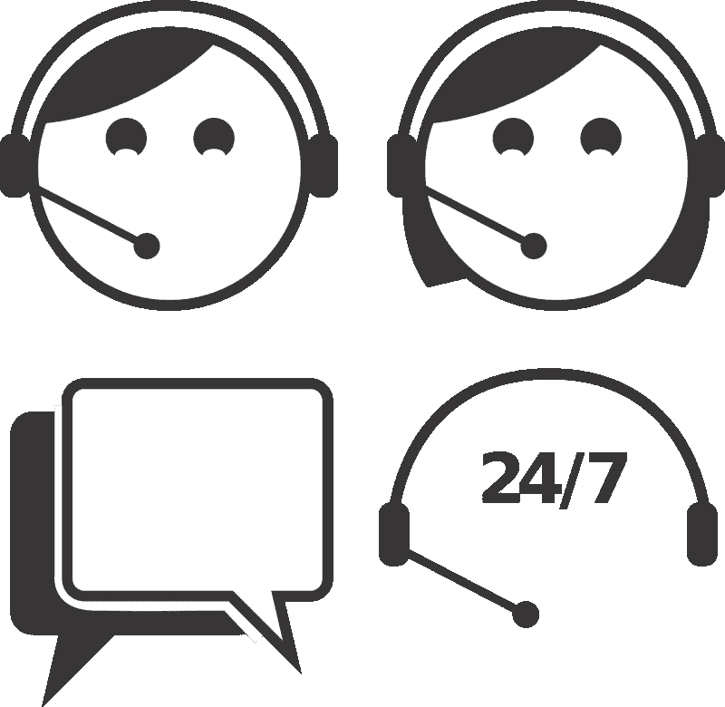

# HubSpot 另一个被严重高估的软件股票——市场疯人院

> 原文：<https://medium.datadriveninvestor.com/hubspot-another-grossly-overpriced-software-stock-market-mad-house-ba29cd6dd7d6?source=collection_archive---------11----------------------->

HubSpot Inc .(纽约证券交易所代码:HUBS) 是市场先生在云泡沫中严重高估的另一只股票。

2021 年 2 月 17 日，市场先生支付了 523.33 美元购买 **HubSpot (HUBS)** 股票。然而，HubSpot 报告称，截至 2020 年 9 月 30 日，其季度运营亏损为-1546 万美元。此外，HubSpot 当天公布的季度营收为 2.2838 亿美元，季度毛利为 1.8578 亿美元。

因此，市场先生以 5.2333 亿美元收购了一家亏损且收入只有 2.2838 亿美元的公司。令人难以置信的是，*巴伦的*声称 HubSpot 在 2021 年 2 月 11 日发布了[“惊人的收益”和](https://www.barrons.com/articles/hubspot-stock-earnings-report-wall-street-upgrades-51613152073)“井喷的结果”。

# HubSpot 泡沫

HubSpot 的季度业绩显示，井喷的业绩和巨大的收益包括 760 万美元的季度运营亏损和 2.521 亿美元的季度收入。我认为 HubSpot(纽约证券交易所代码:HUBS) 唯一被吹爆的是其股票的泡沫。

在过去的一年里，HubSpot 的股价从 2020 年 2 月 16 日的 196.62 美元上涨到 2021 年 2 月 16 日的 515.15 美元。因此，HubSpot 的股价在一年内上涨了 318.53 美元，并出现了亏损。

我认为这种疯狂类似于 21 世纪初的互联网泡沫和 20 世纪 20 年代疯狂的股市。尤其是巴伦周刊等“记者”的支持者，让人想起上世纪 20 年代末的作家。

一些观察家敲响了警钟。贝尔德私人财富管理公司的市场策略师迈克尔·安东内里告诉雅虎！金融他担心“[越来越多的人认为我们正处于繁荣期](https://finance.yahoo.com/news/strategist-concerned-that-a-roaring-20-s-scenario-is-pricedin-173203923.html)”

“感情只有在极端的情况下才会起作用，”安东内里告诉雅虎！金融。“我明年担心的事情之一是繁荣的概念，即‘咆哮的 20 年代’"

# 那么什么是 HubSpot 呢？

那么什么是 HubSpot (HUBS) 呢？为什么一些投资者认为它在 2021 年 2 月 16 日的价格是每股 518.52 美元？

使用免费增值服务；或免费的商业模式，以促进基于云的客户关系管理(CRM)平台。CRM 平台提供的服务类似于 **Salesforce(纽约证券交易所代码:CRM)** 提供的服务。

不同的是，HubSpot 提供一些免费服务，让顾客对其产品着迷。这是视频游戏公司经常使用的[免费增值业务](https://marketmadhouse.com/hubspot-another-grossly-overpriced-software-stock/#:~:text=Freemium,%20a%20portmanteau%20of%20the,the%20free%20version%20of%20the)模式。

解释一下，免费增值这个术语是“免费和优质”这两个词的[混搭](https://marketmadhouse.com/hubspot-another-grossly-overpriced-software-stock/%5C)本质上，免费增值是一种定价策略，公司免费提供基本产品或服务，但对附加功能和服务收取额外费用。

因此，HubSpot 允许客户免费访问销售、营销、服务和 CMS(内容管理软件)中心。一旦进入网络中心，顾客就可以购买额外的服务。

我认为这些中心很受欢迎，因为许多销售和营销专业人员在家工作，需要基于云的 CRM 解决方案。许多专业人士去 HubSpot 是因为它的一些产品是免费的。因此，怀疑新冠肺炎恐慌推动了 HubSpot 的增长。

# HubSpot 提供了什么价值？

HubSpot (HUBS) 声称在 120 多个国家拥有超过 100，000 名客户。

此外，HubSpot 声称其博客每月访问量超过 700 万次。另外，HubSpot 声称有超过 330，000 名认证专家在 HubSpot 学院学习。HubSpot 还声称拥有超过 260 万名社交媒体粉丝。HubSpot 有超过 150 个用户群，HubSpot calls Inbound 拥有 26，000 名注册用户。

HubsSpot 声称其客户包括世界野生动物联合会(WWF)、铃木、SurveyMonkey、Trello、Soundcloud、Classpass 和 Vmware。

我认为 HubSpot 对投资者的主要吸引力在于增长。HubSpot 声称其订阅收入在 2020 年第四季度增长了 36%,达到 2 . 443 亿美元。同样，HubSpot 估计其年度订阅收入将增长 32%，至 2020 年的 8.53 亿美元。

此外，HubSpot 报告称，2020 年第四季度总收入增长了 35%，达到 2.521 亿美元。同样，2020 年总年收入增长 31%，至 8.83 亿美元。

HubSpot 声称其总客户群在 2020 年增长了 42%，达到 103，994 人。然而，HubSpot 承认，在 2020 年第四季度，每位客户的平均订阅收入下降了 3%，至 9758 美元。

# HubSpot 能产生多少现金？

HubSpot (HUBS) 报告称，2020 年第四季度的季度运营现金流为 6130 万美元。

季度运营现金流从 2020 年第三季度的 3867 万美元上升至 2019 年第四季度的 4789 万美元。然而，Stockrow 估计 HubSpot 在 2020 年 9 月 30 日报告了负的季度[期末现金-7619 万美元](https://stockrow.com/HUBS/financials/cashflow/quarterly)。季度期末现金流从 2019 年 12 月 31 日的 4522 万美元下降。

值得注意的是，HubSpot 在 2020 年 9 月 30 日报告了连续六个季度的正融资现金流。这意味着 HubSpot 的借款超过了其债务偿还。例如，HubSpot 的季度融资现金流从 2020 年 6 月 30 日的 2.0769 亿美元降至 2020 年 9 月 30 日的 412 万美元。

截至 2020 年 9 月 30 日，HubSpot 的长期债务为 4.7405 亿美元。长期债务从 2019 年 12 月 31 日的 3.4056 亿美元增长。

截至 2020 年 12 月 31 日，HubSpot 拥有 12.82 亿美元的现金和等价物。现金和短期投资从 2002 年 9 月 30 日的 11.845 亿美元增加到 2019 年 12 月 31 日的 9.615 亿美元。

我认为 HubSpot 的真正价值微乎其微。例如，2020 年 9 月 30 日，其总资产为 18.75 亿美元。总资产从 2019 年 12 月 31 日的 15.69 亿美元。

# 为什么 HubSpot (HUBS)是一支危险的股票

我认为 **HubSpot (HUBS)** 是一只普通人需要回避的危险股票，因为市场先生对它的估值过高。

我认为 HubSpot 是危险的，因为它可笑的价格。不切实际的价格是危险的，因为它可能会崩溃。

这并不意味着 HubSpot 是一家生产糟糕产品的糟糕公司。不，这是一家被市场先生高估的公司。

记住，泡沫会抬高优秀公司的股价，比如亚马逊(Amazon)和特斯拉(Tesla)的股价。泡沫对好公司和坏公司的影响是一样的，因为情绪驱动泡沫。

# 投资者为何参与泡沫

包括机构投资者在内的投资者参与泡沫，是因为害怕损失。令人担忧的是，如果投资者现在不购买，他们可能会错过股价的大幅上涨。

泡沫是危险的，因为泡沫投资者将他们的决策建立在价格而不是任何东西的基础上。因此，泡沫投资者为优秀的股票如**特斯拉汽车公司(纳斯达克:TSLA)** 和有问题的公司如 **HubSpot (HUBS)** 支付了过高的价格。我认为 HubSpot 是一家有问题的公司，因为它目前的价值纯粹是理论上的。

由于存在泡沫，投资者需要避开 HubSpot，并对所有云股票保持警惕。HubSpot 显示，云和科技股正处于危险的泡沫之中，可能会迅速崩溃。

*原载于 2021 年 2 月 17 日*[*【https://marketmadhouse.com】*](https://marketmadhouse.com/hubspot-another-grossly-overpriced-software-stock/)*。*