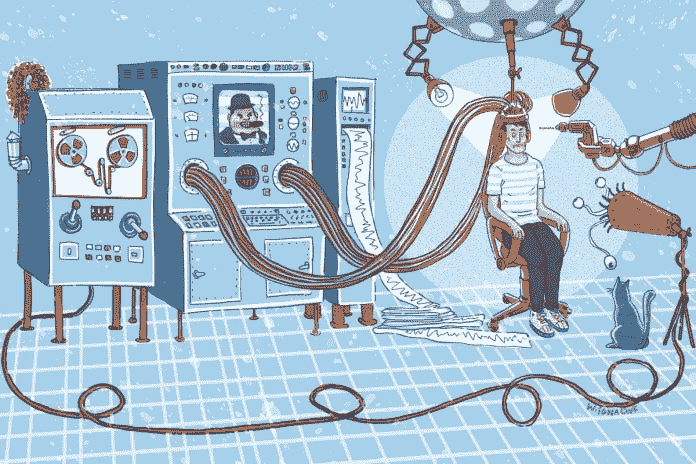
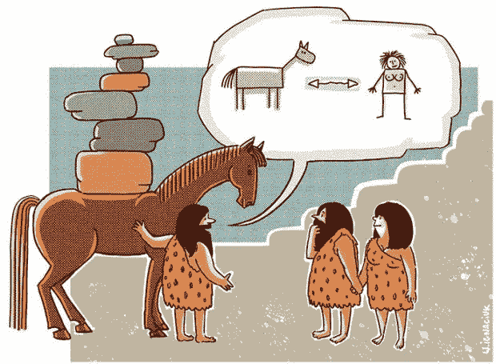
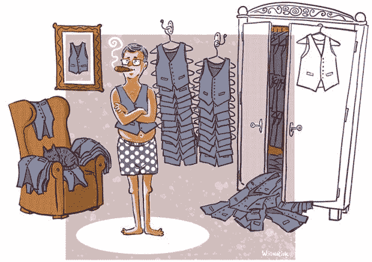

# 资本主义中的人类和人工智能

> 原文：<https://medium.datadriveninvestor.com/human-and-artificial-intelligence-in-capitalism-c69feace7a85?source=collection_archive---------2----------------------->

[© Wojciech Ignaciuk](https://www.facebook.com/Farfotzle/)

变老的令人惊讶的好处是发现引起年轻一代兴趣并经常吓到他们的问题一点也不独特。它们是先前经验的现代变体。在 20 世纪 60 年代，电子大脑对公众的兴奋和敬畏不亚于现在的人工智能。我学的是我们现在所说的计算机技术，但是我的文凭显示我的学位是数学机器。那些害怕他们无法掌握的技术的人给今天对我们来说只不过是有用工具的东西起了那些花哨的名字。

今天，人工智能被许多人视为对我们的民主和个人福祉的威胁。[哈佛荣誉退休教授肖莎娜·祖博夫](https://www.hbs.edu/faculty/Pages/profile.aspx?facId=6582)是表达这一观点的主要人物之一。她发明了一个新的、可怕的术语，“监视资本主义”，并写了一本关于它的[书](https://www.amazon.com/Age-Surveillance-Capitalism-Future-Frontier/dp/1610395697)。首先，现在资本主义没有好名声；因此，她的理论像火一样传遍了媒体。如果有人错过了，深思熟虑的审查是[在这里](https://www.datadriveninvestor.com/2020/03/04/on-artificial-intelligence-and-surveillance-capitalism/)。让我们来关注一下她最近发表在《纽约时报》上的长篇文章“你现在被远程控制了”。

# 我们是如何拥有如此先进的文明的

祖博夫教授的著作表明，她是众多总体上不信任资本主义的人之一。她担心不管资本家会做什么，对我们都没有好处。她的目标不是帮助我们理解我们周围的世界。她试图提供额外的论据来证明资本主义是多么灾难性。我们可以原谅她在意识形态上的偏见，因为她没有隐瞒；她让读者明白。

然而，对于一个科学家来说，缺乏历史视角是不可接受的。自从我们的文明开始以来，人性没有改变。今天的发明发生的方式和穴居人一样。比如说，有人想用一匹马。每一项发明——无论是驯服一匹马，还是使用风车或蒸汽机——都需要时间和资源，这超过了创新者的基本生存需求。因此，他需要想出如何得到补偿。首先学会如何训练一匹马的人不想让每个人都知道如何去做。那个人更愿意用一匹经过训练的马来交换对他们来说有价值的东西。发明者只能通过至少在一段时间内获得(用祖博夫教授提倡的术语)一种“认知不平等”才能成功。“认知”的意思是“关于知识或获取知识的条件”祖博夫教授在《纽约时报》的上述文章中使用了 19 次。她对资本家比其他人更快更多地从学习中获利感到愤慨。

我们有我们的文明，只是因为在无数的场合，我们的祖先比他们的同胞更了解一些东西，他们利用这一点来获利。值得补充的是，只有当社会结构允许保留发明的利益时，创新者才能获利。一个奴隶没有时间或手段去研究一个新的想法，保留其利润的机会也很渺茫。例如，在美国，技术进步在没有奴隶的州蓬勃发展。

我们所知道的资本主义，从 19 世纪中叶开始就被认可了。但它来自于自古以来许多社会中存在的企业相对自由的悠久传统。我们的文明之所以出现，完全是因为在过去，有一些社会规则的社区，现在被称为资本主义，在那里企业家可以利用他们认知上的不平等。如果我们没有尊重习俗的社会，我们承认这是资本主义的，祖博夫教授会在洞穴的壁龛里照看火和孩子。不会有她工作的哈佛大学；不会有脸书，也不会有谷歌，她抱怨了这么多。如果她有一些批评意见，她也不能写下来，因为文字也不会被创造出来。

# 变化是唯一不变的

对于任何发明来说，许多人类互动必须发生。发明家是稀缺品；他们需要时间和资源来发展他们的想法。需要有足够的需求，发明者才能获利。最后，应该有条件允许发明传播到其他社区。在史前时代，当大多数人生活在小而孤立的社区时，上述所有情况都需要很长时间才能出现。马的驯化从最初的尝试到成为欧亚大陆大多数社区的重要组成部分，大概花了几千年的时间。后来，人们学会了利用风能和水能，制造机器，最近又发明了计算机。由于发明，我们变得更加富有。我们的生活条件改善了，我们有很多人。我们受到更好的教育，并以光速与世界各地的其他人互动。因此，正如我们都能看到的，也是祖博夫教授警告我们的，关键的技术变革发生得比我们许多人能够抓住和适应的还要快。

[© Wojciech Ignaciuk](https://www.facebook.com/Farfotzle/)

直到 19 世纪末，一个年轻人年轻时所学的东西足以指导他的一生。后来，在最发达的国家，进步的速度加快到了关键技术转变在一代人的一生中发生不止一次的程度。大约半个世纪前，它影响了发达国家的几乎所有人和世界各地的许多人。今天，没有人能躲开它；它是全球性的。

自人类诞生以来，我们现在目睹的技术进步的性质以及我们从中受益的方式从未改变。不同之处在于，人类历史上第一次，改变生活的技术进步在我们的生产寿命中发生了几次。为了发挥作用，我们需要掌握新的技能，改变职业，并适应我们的习惯。我们比以往任何时候都更需要不断提高我们传统的人类智能。

阿尔文·托夫勒在他 50 年前出版的书《T2 未来的冲击》中描述了在我们看来，我们在太短的时间内发生了太多的变化现在我们有了托夫勒注意到的大量即将到来的东西。不管我们从哪个角度看待它，我们都有两个选择:学习如何处理变化或停止进展。对我们大多数人来说，答案是显而易见的:拥抱新事物并掌握如何使用它。

尽管意识到一个令人震惊的快速变化的社会对我们来说可能是一种新奇的体验，但在精神上，我们应该为此做好准备。大约 2500 年前，希腊哲学家赫拉克利特在他著名的“panta rhei”中说，万物都是流动的，我们不能两次走进同一条河。他的教义是西方文明的一部分；因此，我们应该已经知道变化是生活中唯一不变的。[人工智能](https://www.datadriveninvestor.com/glossary/artificial-intelligence/)是正在进行的进程中的又一大步。没有必要去发现任何新的、抽象的概念，比如监视资本主义。

# 好人和邪恶的资本家

当阅读祖博夫教授的文章时，人们可以得出结论，这就是她如何理解我们的社会。无私的人在一边，掠夺他们的，资本家在对面。感谢卖给我我正在使用的软件的资本家，点击几下，我发现祖博夫教授在她的文章中八次使用了“*猎物*”这个术语。祖博夫教授解释了我购买该软件的原因:“*监控资本家行动迅速，因为他们既不寻求真正的同意，也不寻求共识。他们依靠精神麻木和不可避免的信息来制造无助、顺从和困惑，麻痹他们的猎物。*“简单地说，根据祖博夫教授的说法，我们买东西不是因为我们需要它们。我们这样做是因为资本家在没有我们同意的情况下，偷偷收集我们的信息，然后用它来麻痹我们的思想，让我们处于一种听天由命和无助的状态。然后，困惑和麻痹，我们成为他们的猎物，买他们想卖的任何东西。

她的论点有一点真实性。借助先进的数据收集和处理技术，营销比以往任何时候都更加精确。比如我喜欢穿背心。营销人员发现了这一点，我收到了不请自来的电子邮件和向我提供背心的广告。很可能，我买的比我需要的多了一些。但多亏了那次营销，我对马甲价格了如指掌；因此，我在打折的时候买它们。额外浪费在背心上的几美元，我喜欢但不需要，并没有影响我的财务状况。但它给了我片刻的幸福快乐，一点点富裕。

[© Wojciech Ignaciuk](https://www.facebook.com/Farfotzle/)

我认识一个人，他经常出差，总是确保谷歌知道他喜欢什么，不喜欢什么。然后，回忆他的喜好，谷歌在新的地方引导他。对许多人来说，大数据操纵者了解我们多少并不重要。我们珍惜时间，愿意牺牲一些隐私来换取在需要时快速获得我们想要的东西的便利。

祖博夫教授不承认我们与谷歌或脸书等公司之间的这种交易关系。当写到“*监视资本家”*在没有我们*“真正的同意或一致同意”的情况下获取关于我们的信息时，s* 他意外地透露出她并没有意识到学术界象牙塔之外正在发生的事情。正如[杰森·t·沃伊维奇](https://medium.com/@jasonvoiovich)在他的[文章](https://medium.com/swlh/what-shoshana-zuboff-mark-zuckerberg-both-get-wrong-about-privacy-rights-and-how-you-can-fix-it-3e9f4b2d81d4)中指出的，安装了亚马逊 Alexa 助手的设备已经售出超过 [1 亿台。这一亿买家不仅同意。他们也给了他们的钱，这构成了共识，授权大资本家访问他们的私人数据。](https://techcrunch.com/2019/01/04/more-than-100-million-alexa-devices-have-been-sold/)

我们中的一些人划定了界限，为了方便起见，我们允许交换哪些数据。方便的时候我们用信用卡，重要的时候我们用现金支付。我们运用人类的智慧来屏蔽泄露到公共领域的有害信息，但让“监视资本家”相信他们掌握了全局。它代表了我们的信念，即我们古老的人类智慧仍然能够胜过新的人工智慧。

在她那张可怕的照片中，祖博夫教授把我们描绘成无助于监视资本家的贪婪。就有人符合她的叙述而言，她是对的。蛇油和布鲁克林大桥总会有买家。我们每个人都至少认识几个不会理财的人。他们凭冲动购物，他们不能做预算，或者，正如我曾经听说的，用他们没有的钱，他们买他们不需要的东西，来打动他们不喜欢的人。

直到最近，我们的大多数祖先都生活在生存的边缘。拥有一个避难所和不饿着肚子睡觉是首要目标。现在，我们大多数人，至少偶尔会有一些可支配收入。我们中的一些人仍然没有学会如何明智地处理它。早在计算机和复杂的数据处理技术出现之前，这些人就是各类营销人员的金矿。现在，数据丰富的“监控资本家”也在探索这一利润丰厚的市场领域。祖博夫教授错误地将我们当中金融文盲的不幸归咎于“监督资本家”。那些“监视资本家”伤害的大多是仍在使用世俗人类智慧的旧式营销人员。旧式资本家和新一代的“监督资本家”都不是问题。问题在于，在一个繁荣的社会，比如在美国，太多的人对经济一无所知。我们的挑战不是驯服使用人工智能的赢家，而是提高普通人类的智能，让我们更多人能够从技术进步中受益。

# 隐私还是隐私

祖博夫教授不同意。她声称这是一种错觉或者说是“最危险的幻觉”让我们看一看在资本家介入之前我们祖先的隐私。在工业时代之前，大多数人居住在农村社区，在那里每个人都认识每个人。如果一个男孩吻了一个女孩，很可能有人看到了，谣言就开始了。当地商人比现在最先进的“监视资本家”更了解他所有的客户。他利用这一点为自己谋利。参与任何商业、宗教或政治的其他人也是如此。即使在城市里，当大部分的旅行都是步行的时候，人们也聚集在一起，在那里他们彼此认识。

资本主义改变了一切。随着旅行的方便，人们移居到世界各地。大城市出现了。在人群中保持匿名成了标准。那些不喜欢资本主义的人哀叹道，在匿名的城市群中，传统的社区纽带消失了，滋生了犯罪和不道德行为。由于进步，现在，在全球范围内，我们可以体验到我们的前辈在小村庄里拥有的社会联系。我们不会失去隐私；我们失去了城市化曾经提供的匿名性。那些不喜欢资本主义的人又开始抱怨了。我们目前在隐私和匿名方面的变化并不新鲜，它们会随着进步而演变。不管下一步的改进会是什么，资本主义的反对者会发现它的一些消极方面，并再次提出它们作为资本主义罪恶的证据。

差不多半个世纪前，我开始了我的政治写作。为了研究我的文章，我花了很长时间在图书馆浏览书籍、旧报纸和社区公告。很多次，我惊讶于我能找到这么多有用的信息。几乎所有在公共场合发生的事情都会留下痕迹。从那以后没有太大的变化，除了现在，只要点几下鼠标，我就能在网上找到更多的信息。

与此同时，我的写作让我在社区中获得了一些认可，很快我意识到许多我不认识的人都知道我是谁。后来我惊讶地发现，在一个相对较大的城市里，人们已经注意到了我的行踪。即使在家人和朋友之间，如果我的行为有新闻价值，它可能会成为公共知识。我的结论是，当我和别人在一起时，我的隐私是公开的。保护隐私需要保持私人物品的私密性。50 年前确实如此；在脸书时代更是如此。我通过观察生活在社会主义国家的人们的行为理解了这一点。为了得出同样的结论，祖博夫教授需要发明“监视资本家”。

# 政治中的人类和人工智能

祖博夫教授报告说，监视资本家使用人工智能来获得"*认知不平等*，"形成"*认知等级*，"给予他们"*认知优势*，"剥夺我们"*认知权利*，"*认知公正*"她指出:“*在这个新时代，认知公正和认知权利的挑战可以概括为三个关于知识、权威和权力的基本问题:谁知道？谁决定谁知道？谁决定谁决定谁知道*？”她错过了最明显的问题:谁阻止人们学习？没人知道。这比人们想象的要容易。为了弥合认知上的不平等，我们不需要知道其他人的所有数据。我们只需要知道我们是谁，我们想要什么。此外，我们应该考虑到，他们对我们的了解只是我们选择公开的内容。在这种方法中，认知不平等对我们有利。即使是最聪明的人工智能也没有办法确定我是给自己买背心，还是在为竞争对手刺探情报。

这同样适用于政治信息。著名的脸书-剑桥分析数据丑闻之所以会发生，只是因为大多数美国人可耻地缺乏基本的公民教育。谎言和欺骗对公众舆论的操纵和人类文明一样古老。罪犯总是利用他们日常的人类智慧来寻找传播毒药的最佳地点。一个理智的人会认为，现在他们会去人多的地方，去脸书。但是祖博夫教授是 T2 最优秀和最聪明的 T3 之一，他感到惊讶的是"*这些平台不是公告栏，而是超高速的全球血流，任何人都可能在没有疫苗的情况下向其引入危险的病毒。她没有想到人们应该接种的疫苗应该来自除了她和她的同事以外的其他人。疫苗是经济、人类行为和美国政治制度概念的基本知识。*

祖博夫教授没有承担这项任务，而是高兴地指出“*有许多迹象表明立法者已经准备好加入并领导*。在人工智能时代，太多的人落后于他们普通的人类智能。这是我们问题的症结所在。人们不能通过一项让美国人变得更聪明的法律。

祖博夫教授恰当地指出，监视技术的实际危险在于政府的使用。例如，中国正在新疆采用这种技术，那里的维吾尔族人生活在露天监狱里，受到面部识别系统的永久监视。她一口气提到了出于商业目的的数据收集以及政府的数据收集。一个商人想要我们的数据，目的是为我们提供我们可能想要的东西，并感谢提示我们这些东西。政府收集数据来确定我们的行为是否证明限制我们的自由是合理的。祖博夫教授没有意识到两者之间的区别。

[© Wojciech Ignaciuk](https://www.facebook.com/Farfotzle/)

我们可能对公司保存我们什么样的信息没有什么发言权。但是，作为选民，我们有权控制政府可以掌握的关于我们的信息。最简单的方法是不资助政府监控项目。但是在这里，祖博夫教授陷入了她论点的不一致性。她认为企业是最大的危险，为了保护我们免受其害，她愿意赋予政府额外的权力。政府承担的任务越多，游说者能买到的就越多。他们携手合作，相互勾结。大公司得到了政府的默许，因为他们利用了 Zuboff 教授所批评的认知不平等。作为回报，政府可以获得企业拥有的大数据，但我们永远不会。

正如每一项新技术一样，现有规模的数据收集和视频监控给我们的隐私和自由带来了潜在的漏洞。但是要求政府解决这个问题就像让一只狐狸掌管一个鸡舍一样有效。

# 这些数据将决定我们的未来

很久以前，用马推动了我们的文明。许多其他发明接踵而至，定义了它们的时代。计算机是 20 世纪下半叶的东西。现在我们已经进入了数据时代。我们大多数人都没有做好充分的准备，因为习惯了舒适，我们没有像我们的祖先那样获得那么多的智力刺激。订购比萨饼比寻找晚餐更少精神挑战。我们可能会操作非常复杂的机器，但它们都是用户友好型的。拥有智能手机也不会让人变得更聪明。

如果没有很好地理解技术、经济、人性和政治的原理，我们注定会被比我们学得更多更快的人利用。仅仅拥有一套狭窄的技能，让我们作为庞大机器中的一个齿轮来谋生，已经不够了。国家的未来取决于广泛的教育。那些比其他人更能看清大局的国家将会是我们这个时代的赢家。祖博夫教授告诉我们，我们所有的痛苦都来自那些比我们学得更多更快的人。她错了。

*原载于 2020 年 4 月 16 日*[*【https://www.datadriveninvestor.com】*](https://www.datadriveninvestor.com/2020/04/16/human-and-artificial-intelligence-in-capitalism/)*。*