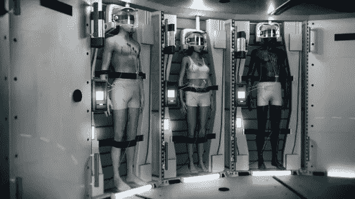
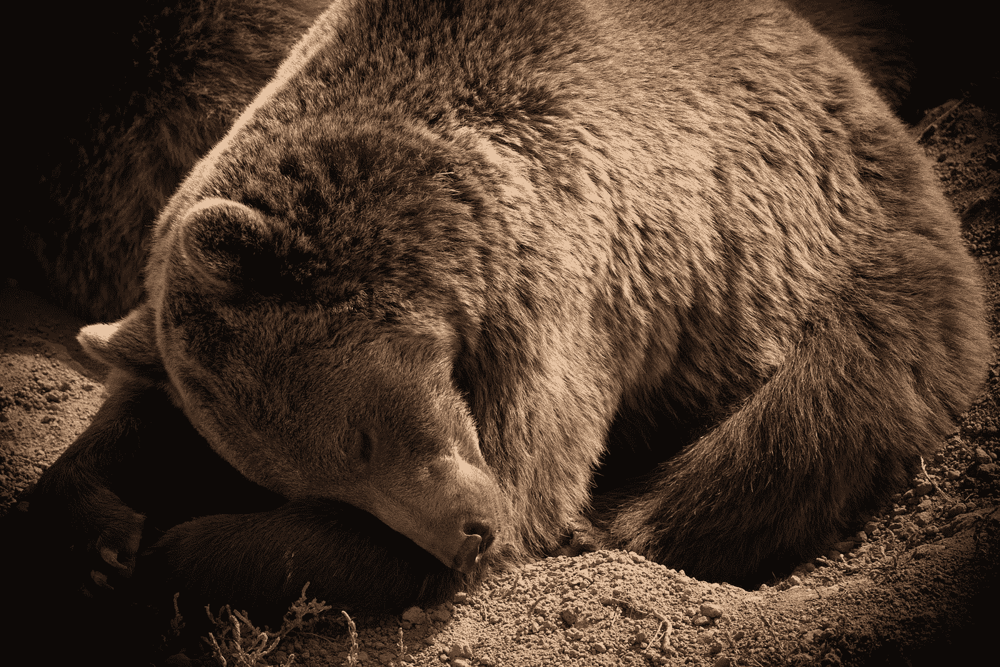

# 人类冬眠:睡眠的大秘密

> 原文：<https://medium.datadriveninvestor.com/human-hibernation-the-big-sleep-secrets-881fb4889e89?source=collection_archive---------16----------------------->

## DNA 修复机制在低温下工作得更好吗？

Image by [traveldudes](https://pixabay.com/users/traveldudes-1753593/?utm_source=link-attribution&utm_medium=referral&utm_campaign=image&utm_content=4375780) from [Pixabay](https://pixabay.com/?utm_source=link-attribution&utm_medium=referral&utm_campaign=image&utm_content=4375780)

2000 年，美国科学界掀起了一股新的学术潮流，旨在研究如何阻止所谓的肥胖流行。人体肥胖的原因有很多，但简单来说，如果人体能量摄入超过消耗，多余的能量就会以脂肪的形式积累，最终导致肥胖。基于这一理论，一些科学家提出，可以通过增加人体能量消耗来预防肥胖。

科学家也进行了相关研究。他们关注褐色的[脂肪组织](https://en.wikipedia.org/wiki/Adipose_tissue)。棕色脂肪组织可以通过消耗能量产生热量。因此，科学家怀疑激活棕色脂肪组织可能会刺激身体消耗能量，从而减轻体重。

 [## 静悄悄的金融危机

### 疫情仍是最大的不确定因素

medium.com](https://medium.com/datadriveninvestor/the-quiet-financial-crisis-b01898a809a7) 

当时大脑对褐色脂肪组织调控机制的科学研究还是空白。直到 2009 年，人们才发现[棕色脂肪](https://en.wikipedia.org/wiki/Brown_adipose_tissue)不仅在人体内非常活跃，还能调节生理功能。

> 但是我们如何激活棕色脂肪组织呢？这一直是困扰科学家的问题

从现有的知识来看，科学家们已经锁定了几个可以控制棕色脂肪组织功能的大脑区域。最有趣的大脑区域之一是脑干。这个大脑区域的[神经元](https://en.wikipedia.org/wiki/Neurons)是控制身体代谢功能的开关。这些神经元在活动时可以大大增加人体的能量消耗。然而，当时所有人都在研究应对肥胖的方法，谁也没有想到要关掉这个神奇的“*开关*”。

当我们逆向思考这个问题时，我们得到了一个新的研究思路:如果关闭脑干中的代谢开关，人类是否可以模拟冬眠？

在给大家详细介绍让大脑处于模拟冬眠状态的诸多好处之前，我想先简单回顾一下相关的历史研究，告诉大家什么是冬眠，冬眠有什么独特之处。

过去，科学家曾经认为[冬眠](https://en.wikipedia.org/wiki/Hibernation)意味着动物处于持续的睡眠状态。著名的博物学家和[生物学家拉扎罗·斯帕兰扎尼](https://en.wikipedia.org/wiki/Lazzaro_Spallanzani)在 18 世纪的研究记录中也提到了这种状态。在一些登山爱好者中，有一个故事始于秋天，野生的[土拨鼠](https://en.wikipedia.org/wiki/Groundhog)的数量将继续减少，直到它们消失，然后在春天再次出现。

那么，土拨鼠消失后的这几个月去了哪里？

答案是他们已经进入了[昏睡状态](https://en.wikipedia.org/wiki/Lethargy)。更准确的描述是，这段时间土拨鼠处于冬眠状态。在日常交流中，我们习惯于将冬眠定义为一种长期的睡眠状态。试想，谁不想在冬天的早晨多睡一会儿呢？

事实上，在这一点上，我们可能和动物一样有冬眠的需求。我们现在知道冬眠是一种与睡眠完全不同的状态。我们可以将冬眠与[昏迷](https://en.wikipedia.org/wiki/Coma)、[全身麻醉](https://en.wikipedia.org/wiki/General_anaesthesia)或任何其他已知的基于快速动眼期的状态区分开来。

**那么到底什么是冬眠呢？**

冬眠具有典型的代谢特征。例如，冬眠动物可以自主关闭代谢过程。简而言之，它们可以大大降低人体的能量代谢要求。打个简单的比方，休眠就像电脑进入待机状态。

这时，动物的体温会降低。然而，体温下降并不是冬眠期间发生的第一件事。相反，随着时间的推移会慢慢发生，因为身体首先大大降低了能量消耗，此时不产生热量，造成体温降低。

*Credit: SpaceWork Enterprises, Inc*

而借此机会，我也想给大家介绍另一种状态:身体主动抑制能量消耗的过程——不活跃状态“*”这种状态是指动物在遇到不利环境时，会主动降低体温，减少代谢活动的一种状态。这个过程可能持续几个小时到几天。当不活跃状态持续的时间更长，比如几个月，就变成了我们所说的冬眠。*

# ***温度竞赛***

*说到这里，我们有一个疑问，为什么动物会出现不活动和冬眠的现象？*

*从[分类学](https://en.wikipedia.org/wiki/Taxonomy)来说，动物可以分为[温血动物](https://en.wikipedia.org/wiki/Warm-blooded)和[冷血动物](https://en.wikipedia.org/wiki/Cold-blooded)，而[哺乳动物](https://en.wikipedia.org/wiki/Mammal)是温血动物。事实上，哺乳动物之间存在一些差异。那些会冬眠的哺乳动物并不是纯温血动物。研究人员称这些动物为 [*恒温动物。*](https://en.wikipedia.org/wiki/Ectotherm) “现在，科学家们正在试图破译[恒温动物](https://en.wikipedia.org/wiki/Heterothermy)自动关闭新陈代谢，降低体温的机制。*

***[**变温动物**](https://en.wikipedia.org/wiki/Heterothermy) **的最低体温是多少？*****

***已知的最低记录是一只来自北极圈的[松鼠](https://en.wikipedia.org/wiki/Squirrel)，其体温可低至**-2℃**。这些例子提醒我们，如果要研究冬眠，可能要从两亿年前的温血动物说起。***

***在进化史的初期，早期的哺乳动物可以利用恒温的特性在晚上出来，以避免白天被变温动物[捕食](https://en.wikipedia.org/wiki/Predation)。这正是早在 1942 年[验光](https://en.wikipedia.org/wiki/Optometry)专家[戈登·林恩·沃尔斯](https://en.wikipedia.org/wiki/Gordon_Lynn_Walls)提出的*假说。****

****哺乳动物的祖先只敢在夜间活动，因为依靠阳光维持体温的恐龙在夜间的活动量明显下降。不过，除了大型的[暴龙](https://en.wikipedia.org/wiki/Tyrannosaurus)，还有一些小型恐龙。这些小恐龙的身体逐渐适应了夜间的低温，开始在夜间捕食哺乳动物。在进化过程中，这些小恐龙开始通过防止温度损失来减少热量消耗。在这种情况下，最初的羽毛出现了。****

********

****Photo by [Jie Wang](https://unsplash.com/@itworkonline?utm_source=unsplash&utm_medium=referral&utm_content=creditCopyText) on [Unsplash](https://unsplash.com/s/photos/brown-bear?utm_source=unsplash&utm_medium=referral&utm_content=creditCopyText)****

****棕熊的季节性睡眠" [*熊科熊科熊科熊科熊科熊科熊科熊科熊科熊科熊科熊科熊科熊科熊科熊科熊科熊科熊科熊科熊科熊科熊科熊科熊科熊科熊科熊科熊科熊科熊科熊科熊科熊科熊科熊科熊科熊科熊科熊科熊科熊科熊科熊科熊科熊科熊科熊科熊科熊科熊科熊科熊科熊科熊科熊科熊科熊科熊科熊科熊科熊科熊科熊科熊科熊科熊科熊科。在冬眠期间，它们几乎停止新陈代谢。*](https://en.wikipedia.org/wiki/Brown_bear)****

****结果，哺乳动物的祖先和食肉动物之间就出现了一场持续了数千万年的[体温调节](https://en.wikipedia.org/wiki/Thermoregulation)竞赛。哺乳动物试图通过吃更多的食物来保持体温，而像蜥蜴这样的捕食者试图通过减少散热来实现这一点。****

****长期以来，哺乳动物一直处于进化的边缘。一旦它们的体温调节策略失败，它们可能会面临灭绝危机。幸运的是，包括人类在内的哺乳动物已经选择更有效、更经济地利用能源，避免能源枯竭。为了满足身体新陈代谢的需要，除了多吃食物，我们也尽可能的保存自己的能量。所以，当人类在非睡眠期不是很活跃的时候，也会进入不活跃状态。****

****迄今为止，大多数研究人员认为最早的哺乳动物是[恒温动物](https://en.wikipedia.org/wiki/Heterothermy)，这意味着恒温是哺乳动物祖先共有的特征。哺乳动物的后代很可能会保留在冬眠期间维持生命功能的基因。****

****2002 年，[意大利摩德纳大学的神经运动科学教授 Pietro Cortelli](https://www.unibo.it/sitoweb/pietro.cortelli/en)和他的同事描述了一种罕见的疾病，这种疾病会自发进入休眠状态，这无疑支持了哺乳动物有能力进入非活动状态的观点。****

# ******医学应用前景******

****人工诱导人类进入休眠或冬眠具有诱人的临床应用前景。如果你把大脑想象成一个小动物，只要心脏和循环系统继续输送食物喂养它，一切都会正常。但是如果因为某种原因食物短缺了呢？大脑本身是一个能量丰富的器官，可以在短时间内不摄入能量的情况下继续工作。****

> ****但如果大脑长期缺乏能量，就会造成脑死亡****

****如果我们的大脑像松鼠的大脑一样，它可以通过进入冬眠来抵抗能量短缺。不幸的是，人类在现实生活中无法进入类似松鼠的冬眠状态，因此，由于心脏骤停或中风导致的能量供应不足，人类的大脑会受到损害。****

****[热疗](https://en.wikipedia.org/wiki/Heat_therapy)现在是很多医院采用的医疗方式。这种方法可以帮助患者减少中风或心脏骤停时的大脑能量需求，从而保护大脑功能。在治疗过程中，医生会向患者输送[低温液体](https://en.wikipedia.org/wiki/Cryogenics)，或者将患者的身体暴露在流动的冷空气中，使患者进入低温状态。但当人体感知到体温下降时，会采取一系列措施进行抵抗，包括最大化代谢来应对体温下降，所以[低温](https://en.wikipedia.org/wiki/Hypothermia)的治疗温度不会低于**34℃**。****

****值得注意的是[体温过低](https://en.wikipedia.org/wiki/Hypothermia)和身体对冬眠的反应是相反的。低温疗法是主动降低病人的体温。如果疗法有效，体温降低后新陈代谢也会下降；而冬眠首先降低的是新陈代谢，而降低的体温只是新陈代谢下降的结果。如果我们能够模拟冬眠状态，这将有助于我们避免在[低温](https://en.wikipedia.org/wiki/Hypothermia)治疗期间出现[心律失常](https://en.wikipedia.org/wiki/Arrhythmia)等副作用。****

****人工冬眠的临床应用价值很高。一方面可以防止患者脑损伤，另一方面也可以减少医疗体系中中风的额外费用。****

**** [## AI 会抢你的饭碗吗？

### 有些工作只有人类有能力去做

medium.com](https://medium.com/datadriveninvestor/will-ai-take-your-job-b28c8c458633) 

相关领域的科学家一直秉承这一宗旨研究人工冬眠。但近年来，人工冬眠的许多其他应用已经出现。例如，科学家发现，当动物处于冬眠状态时，它们的神经系统会发生更令人惊讶的事情。

神经元是构成中枢神经系统的基本细胞。它们形成了数以亿计的细胞连接——突触(T7)，这使得神经元能够相互交流。研究人员观察到 [Tau 蛋白](https://en.wikipedia.org/wiki/Tau_protein)在冬眠期间发生变化，这种蛋白可以调节神经元功能。此外，在患有[神经退行性](https://en.wikipedia.org/wiki/Neurodegeneration)疾病(如[阿尔茨海默病](https://en.wikipedia.org/wiki/Alzheimer%27s_disease))的患者的大脑中，也经常检测到异常的 tau 蛋白。因此，人们可能会认为冬眠就像进入了一种[痴呆](https://en.wikipedia.org/wiki/Dementia)的状态。

事实上，这种状态并不连续。动物在脱离冬眠的几个小时内就会恢复突触连接的数量，tau 蛋白也会恢复正常。随着研究的深入，科学家们发现，在冬眠过程中，动物体内的各种器官和系统都会发生与其功能相关的重大变化。

Image by [VSRao](https://pixabay.com/users/vsrao-8105725/?utm_source=link-attribution&utm_medium=referral&utm_campaign=image&utm_content=3168269) from [Pixabay](https://pixabay.com/?utm_source=link-attribution&utm_medium=referral&utm_campaign=image&utm_content=3168269)

tau 蛋白会改变形状。在冬眠状态下，tau 蛋白会发生一些可逆的变化，而这些变化在[老年痴呆症患者](https://en.wikipedia.org/wiki/Alzheimer%27s_disease)的大脑中很常见。

冬眠动物的免疫系统也很特别。他们的[淋巴细胞](https://en.wikipedia.org/wiki/Lymphocyte)会在循环系统中产生，像三文鱼归巢一样回到[淋巴结](https://en.wikipedia.org/wiki/Lymph_node)；[血小板](https://en.wikipedia.org/wiki/Platelet)也有同样的特性，但最终还是会回到肝脏。此外，动物消化系统中的[微生物种群](https://en.wikipedia.org/wiki/Microbial_population_biology)和[粘液](https://en.wikipedia.org/wiki/Inflammation)[的](https://en.wikipedia.org/wiki/Mucous_membrane)炎症状态在冬眠期间也会发生变化。更神奇的是，冬眠状态会让癌细胞停止增殖，肿瘤不再增殖。

过去，美国的一些抗癌治疗研究与这些观察密切相关。在当时，低于正常体温的**9℃**是人体降温试验的极限，也就是说人类被降低到这个温度后可以被重新唤醒。

> **虽然单纯降低体温并不会杀死肿瘤，因为癌细胞被唤醒后会重新开始增殖。**

但是科学家们在想，如果人工冬眠可以用来中止癌细胞的增殖，它可能会使[化疗](https://en.wikipedia.org/wiki/Chemotherapy)和[放疗](https://en.wikipedia.org/wiki/Radiation_therapy)更加有效。但到目前为止，这种策略只在理论上可行，没有任何人体试验可以支持这种理论。理论上，在人工冬眠期间，生命体会进入一种新的功能模式，可用于临床治疗性干预，但这些研究往往不被批准进行临床试验。

# **诱导动物冬眠**

我们有没有可能对从不冬眠的动物(包括人类)进行人工诱导冬眠？十几年前，这种想法还被认为是天方夜谭。在过去十年左右的时间里，这个方向出现了许多发现。

值得一提的是华盛顿大学的马克·罗斯和他的同事于 2005 年在《科学》杂志上发表的实验。他们发现极低剂量的[硫化氢](https://en.wikipedia.org/wiki/Hydrogen_sulfide)就能让实验鼠进入一种*睡眠*状态，而*睡眠*是用来定义人工冬眠的术语之一。

但在本文中，我还是会用人工冬眠这个术语来指代人工诱导冬眠的状态。

罗斯的工作为人工冬眠带来了巨大的希望。硫化氢似乎是一种有效且易于管理的气体。但他们一开始只在老鼠身上做实验，所以有人对此提出质疑，而质疑点恰好是老鼠本身。

因为在合适的条件下，老鼠可以自发进入一种“*睡眠*状态。所以有可能硫化氢本身并没有产生人工冬眠效应，而是硫化氢刺激小鼠进入了一种“*睡眠*状态。然而[马克·罗斯](https://en.wikipedia.org/wiki/Mark_Roth_(scientist))随后在非冬眠动物身上测试硫化氢，得到了与老鼠实验相同的结果。

为避免上述疑虑，科学家开始选择不会进入“*休眠*状态的动物模型，大鼠成为最佳选择。

> 2013 年的两项实验表明，老鼠也可以被诱导进入人工冬眠。

本实验采用的方法在相关领域中比较特殊。我们知道冬眠是因为新陈代谢下降，而[线粒体](https://en.wikipedia.org/wiki/Mitochondrion)是细胞内负责新陈代谢的[细胞器](https://en.wikipedia.org/wiki/Organelle)。因此，大多数科学家认为，他们可以通过降低线粒体的活性来实现人工冬眠。由于线粒体可以利用氧气产生能量，硫化氢正好可以抑制线粒体的活性。基于上述硫化氢实验，科学家认为线粒体活性的降低一定在冬眠中发挥了作用。然而，很难找到一种非特异性阻止细胞产生能量的物质。

**如果牢房是一艘大船**，为了阻碍这艘船的航行，我们可能会选择直接解雇船上负责发动机的正经水手或机械师，甚至让厨师不准备食物。事实上，冬眠期间发生的事情和上面的想象是不一样的:比如我们不能完全辞退水手。在接到指挥官降低能耗的命令后，水手们仍然会保证船向前行驶。他们会把食物打包放在船舱里以备不时之需。而且他们会保留那些必不可少的服务，比如把工作室的灯关了，这样船长就能知道船的状态。

**为了避免上述情况**，我们有了一个新的想法:“*欺骗大脑*，让它相信身体不再需要产生能量。经过多次尝试，科学家们取得了这一成果，并发表在 2013 年的《神经科学杂志》上。在研究中，他们使用药物欺骗他们试图激活的神经元来对抗肥胖。几个月后，美国俄勒冈健康和科学大学的 Domenico Tupone 也在《神经科学杂志》上发表了类似的结果。他们的研究表明，腺苷受体的激活也可以实现。欺骗大脑，让动物冬眠的目的。

目前只有这两个实验可以安全有效地在非冬眠动物身上实现人工冬眠，但这离临床应用还有一段距离。

[https://media.giphy.com/media/3og0IP6JmQRsNMFFCg/giphy.gif](https://media.giphy.com/media/3og0IP6JmQRsNMFFCg/giphy.gif)

# **人工冬眠的好处**

我们经常在科幻小说中读到关于人工冬眠的内容，很多科幻电影也离不开人工冬眠舱的情节。不过我还是想告诉大家，科学家对太阳系的探索还处于初级阶段，在航天领域应用人工冬眠还不太现实。

然而，我们仍然可以在人工冬眠中讨论太空旅行的许多好处。

**第一个**是航天员的食量。冬眠中的人将不需要吃喝，甚至不会产生生理废物。这样会大大减少需要携带的食物量，节省很多钱。

**第二个**好处是，人工冬眠有利于航天员的心理健康，可以减轻他们在微重力条件下和远离地球生活的心理压力。在长期的太空旅行中，不排除个别宇航员会出现精神问题。但如果宇航员处于人工冬眠状态，精神问题的风险可以降低。

**人工冬眠的第三个**好处是有助于肌肉和骨骼的健康。或许我们在电视上看到过这样的画面——经历了长时间太空任务的宇航员返回地球后，需要有人搀扶着走出太空舱。这是因为，在太空中，宇航员的身体失去了地面重力刺激，肌肉逐渐失去力量，骨骼变得更加脆弱。[骨质疏松](https://en.wikipedia.org/wiki/Osteoporosis)是宇航员执行太空任务后常见的[后遗症](https://en.wikipedia.org/wiki/Sequela)。令人惊讶的是，冬眠动物即使几个月不活动，也不会表现出肌肉无力和骨质疏松的症状。我们还不知道冬眠是如何保护动物的肌肉和骨骼健康的，但为了帮助维持宇航员的健康，我们必须验证这一机制。

**除了这些好处**，人工冬眠还有一个非常重要的生物学优势，那就是可以帮助探索太阳系的宇航员抵御来自宇宙的辐射。在宇宙中，质子以非常高的速度行进，地球磁场可以阻挡大部分质子，保护我们免受辐射攻击。而太空环境中的宇航员失去了这种保护，必然会受到大量的辐射。目前，我们唯一的对策是加强太空舱的辐射屏蔽能力。然而，人工冬眠也可能有助于宇航员抵抗辐射。

# 最后

研究发现，冬眠动物在代谢活动减少时，似乎能够获得一定程度的辐射防护。科学家们已经进行了许多实验来测试冬眠动物对辐射的反应。总的来说，这些实验的结果非常令人惊讶。冬眠可以让动物获得对辐射造成的生物损伤的高抵抗力，即使是在极高的辐射条件下。长期以来，科学家认为冬眠动物获得的保护机制是由于冬眠时细胞活动停滞所致。当细胞不分裂时，DNA 就不会复制，所以可以得到更多的保护。一些实验结果表明，冬眠时组织相对[缺氧](https://en.wikipedia.org/wiki/Hypoxia_(medical))，有助于减少辐射造成的损伤。

2017 年，印度新德里核医学与联合科学研究所的 Prem Kumar Indraganti 在科学报告中发表了一项有争议的实验结果。他发现，即使动物在进入人工冬眠前受到辐射，它们仍然可以获得抗辐射能力。这项研究也让科学家看到了其他方向。如果库马尔的实验没有问题，人工冬眠可能成为暴露在致命剂量辐射下的人的有效疗法，例如需要修复的核电站。

除了缺氧和细胞复制受阻，我们还需要其他机制来解释人工冬眠的辐射防护作用。例如，DNA 修复机制在低温下是否工作得更好？这是目前正在研究的一个方向。

无论如何，人工冬眠可能仍然是医学界和太空探索中影响深远的技术。从生理学的角度来说，这是一种全新的生命形式。我们必须像寻找系外行星一样探索人工冬眠。

 [## 爆炸之后:布拉沃城堡的幸存者

### 从第二次世界大战结束时的两次巨响，到福岛核电站事故，这是疯狂的…

medium.com](https://medium.com/datadriveninvestor/after-the-bomb-survivors-of-castle-bravo-159f6f5cd579)****