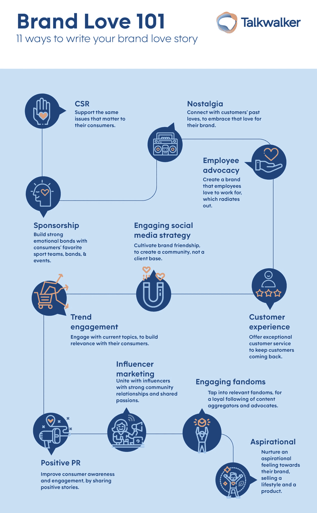

# 人情味助推优秀品牌走向巅峰

> 原文：<https://medium.datadriveninvestor.com/human-touch-boosts-outstanding-brands-to-the-top-5b71cd610e73?source=collection_archive---------10----------------------->

## 消费者的购买行为与公司唤起的情感密切相关

Loving brands comes from the heart.

消费者喜欢那些更人性化、更个性化的品牌。人们寻求一种情感参与——一种由忠诚、诚实、可靠、长久和承诺组成的关系。

营销专家 Lama Barr 在社交倾听和分析平台 Talkwalker 的博客上说:“T2 的消费者购买行为已经被证明会受到情绪的影响。“爱是最强大的情感之一。你不需要我告诉你。”

在一次[非洲推特聊天](https://twitter.com/AfricaTweetChat)中，她确实讲述了更多，讨论了品牌之爱的重要性，包括如何衡量其益处。

品牌之爱是与一种产品结合到没有其他品牌可以取代它的程度。

“当我们谈论品牌爱时，我们会想到满意的顾客和品牌之间的情感关系，”巴尔说。“这是快乐和信任的结合，一旦你作为一个品牌解锁，你就万事俱备了。”

它可能是客户提及和推荐给你的业务的数量。

“我喜欢密切关注客户提及的情绪，”巴尔说。“回头客是一个非常重要但经常被忽视的指标。获得一个新客户比留住一个现有客户更昂贵。

“积极的品牌提及是关键，”她说。“一些品牌可能只关注提及量，而忽略了情感分析的巨大价值。此外，追踪口碑推荐也是一个挑战。”

 [## 谈话引发了口碑传播

### 口碑统治线上和线下。它最可信。人们对你的评价会成为你最强的…

blog.markgrowth.com](https://blog.markgrowth.com/talk-triggers-spark-word-of-mouth-2d83a7c5813b) 

# **数字触摸指南**

一种技术是使用带有复选框的注释表单。

“这可能行得通，”巴尔说。“通过让人们在社交媒体上留下评论或填写快速在线调查，将他们推向数字接触点。情绪得分是我们在关于[全球最受喜爱品牌](https://www.talkwalker.com/case-studies/brand-love-report?utm_medium=referral&utm_source=africatweetchat&utm_term=MEA&utm_content=landing-page&utm_campaign=brand-love-2020)的报告中使用的另一个关键指标。

品牌之爱保证了无论在顺境还是逆境中，对一种产品的需求总是存在的。

“如果你与客户建立了牢固的关系，他们将愿意支付更高的价格，”巴尔说。“我经常认为苹果就是一个很好的例子。快乐而忠诚的顾客就像是自由的品牌影响者。

她说:“价格溢价是品牌热爱给 T2 带来的巨大好处，尤其是在当今充满挑战的环境下。”。“消费者更有可能对他们已经建立了强烈情感联系的品牌保持忠诚。”

在 Talkwalker 关于品牌热爱的报告中确定的三个关键忠诚度好处是价格溢价、品牌忠诚度和品牌宣传。

 [## 品牌宣传值得冒险吗？数据驱动的投资者

### 为自己的品牌表明立场的小企业游走在高风险、高回报的宣传领域。做品牌…

www.datadriveninvestor.com](https://www.datadriveninvestor.com/2018/10/01/is-brand-advocacy-worth-the-risk/) 

如果你已经倾向于一个品牌，与它良好的接触会加强你对它的爱。

“不要随大流，”巴尔说。“你要先评估一个趋势是否符合你的品牌宗旨和身份。保持相关性至关重要。”

正如金克拉所说，“[人们不买是出于逻辑原因](https://www.dentalsupportspecialties.com/blog/2013/02/02/people-dont-buy-for-logical-reasons-they-buy-for-emotional-reasons-zig-ziglar/#:~:text=Reviews-,%E2%80%9CPeople%20don't%20buy%20for%20logical%20reasons.,for%20emotional%20reasons.%E2%80%9D%20Zig%20Ziglar)。他们购买是出于情感原因。”

巴尔说:“保持相关性对于参与潮流至关重要”，并引用了做得好的品牌。“通过参与趋势，你在与消费者建立关联的同时，也与情感投入建立了联系。从长远来看，牺牲你的品牌目标和身份是不值得的。”

# **无价的粉丝体验**

粉丝是真正的爱，没有金钱上的诱惑，赞助可以抓住任何有价值的东西。

“粉丝往往适合娱乐和游戏行业的品牌，”巴尔说。“不出我所料，根据我们最新的调查，抖音是非洲最受欢迎的品牌之一。

“如果做得好，赞助一个运动队、乐队或活动可以利用消费者和他们喜欢的球队之间的纽带，”她说，并指出阿提哈德航空公司是企业赞助的一个很好的例子。“我喜欢[阿提哈德是怎么做的](https://www.talkwalker.com/blog/middle-east-africa-favorite-brands#What%20does%20brand%20love%20mean)”

 [## 公司的成功取决于公关…不管他们是否知道这一点

### 企业家的生存依赖于公共关系，不管他们叫它什么名字。对许多企业主来说，公共关系是一个…

medium.com](https://medium.com/datadriveninvestor/companies-success-depends-on-pr-whether-they-know-it-or-not-bc160bb5eb3a) 

当推广者与品牌目标一致时，公共关系和影响者营销就起作用了。

“这为品牌提供了许多*优点和优势，”巴尔说。“你如何选择有影响力的人来帮助你实现这些职业目标？*

她说:“品牌和营销人员需要跟踪他们的影响者活动。“免费赠品还不够好。你需要证明投资回报。”

巴尔解释说，与有影响力的人建立适当的联系是成功的关键。

“他们需要加入一个品牌，就好像他们只是被雇来工作一样，”她说。“知道前因后果。他们需要真诚地热爱这个品牌。品牌还需要注重与影响者社区建立联系。

“审查影响者是建立影响者营销活动的关键一步，”巴尔说。“影响者可以围绕共同的热情帮助建立强大的社区关系。只要确保你通过审查为你的*品牌选择了正确的产品就行了。”*

 [## 购买影响者，买家小心|数据驱动的投资者

### 影响者营销是社交媒体上最热门、最敏感的话题之一。有影响力的人可以劝…

www.datadriveninvestor.com](https://www.datadriveninvestor.com/2019/07/29/shopping-for-influencers-buyer-beware/) 

她有一个免费资源可以帮助营销人员在非洲找到有影响力的人。

巴尔说:“作为营销人员，我们有一个共同的目标，那就是提高行业标准，互相帮助。”。

没有“透露太多剧透”，她说 Talkwalker 对世界上最受欢迎的品牌的研究把乐高放在了首位。

“在分析了全球 700 多个品牌后，我们确定了 11 种品牌喜爱方法，”巴尔说，基于 [free Talkwalker 报告](https://www.talkwalker.com/case-studies/brand-love-report?utm_medium=referral&utm_source=africatweetchat&utm_term=MEA&utm_content=landing-page&utm_campaign=brand-love-2020)。

**关于作者**

吉姆·卡扎曼是[拉戈金融服务公司](http://largofinancialservices.com/)的经理，曾在空军和联邦政府的公共事务部门工作。你可以在[推特](https://twitter.com/JKatzaman)、[脸书](https://www.facebook.com/jim.katzaman)和 [LinkedIn](https://www.linkedin.com/in/jim-katzaman-33641b21/) 上和他联系。