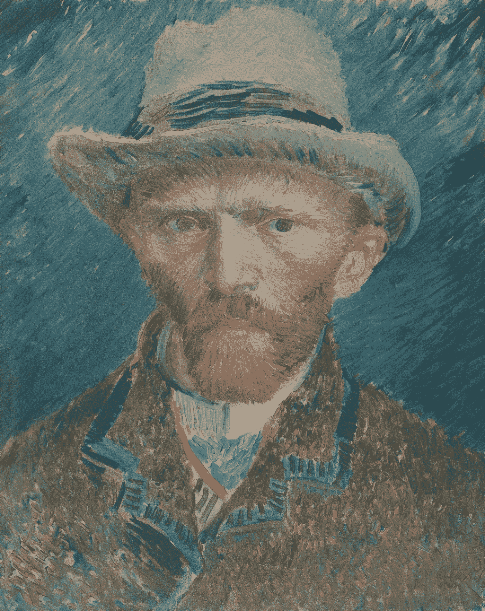
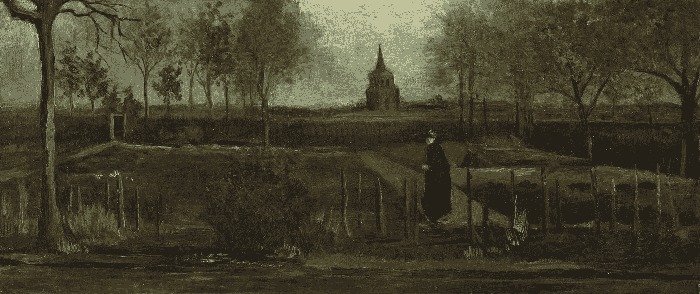

# 人类对抗机器:游戏改变了

> 原文：<https://medium.datadriveninvestor.com/human-versus-machine-the-game-changed-edff84ba6ab6?source=collection_archive---------4----------------------->

## 在自我孤立中变得有自我意识

Vincent van Gogh, *Self-Portrait, 1887*

1853 年 3 月 30 日。文森特·梵高出生了。他是有史以来最知名和最有影响力的画家之一。

但是，人和机器，自我意识和自我隔离有什么联系呢？

嗯，上周发生的一些事情让我质疑我对我们与技术的关系的看法。这是从梵高开始的。

2020 年 3 月 30 日。巧合的是，梵高的生日。他的画《春天的纽南牧师住宅花园》在荷兰的一家博物馆被盗。即使在当前的危机中，这也是全球新闻。

一般情况下，我不会太在意那起盗窃案。世界上正在发生更严重的事情。对我没有直接影响。没有人受伤。我也不是一个“艺术家”

在正常情况下，我会听到它，记录它，并迅速陷入日常生活中。会议。电话。电子邮件。交通。旅行。演示文稿。总是匆匆忙忙。

但是这次不一样。首先，小偷利用冠状病毒是很可怕的。博物馆关闭是为了防止病毒传播。当博物馆被疫情分散注意力时，计划和实施盗窃肯定更容易。

 [## 认知计算——一套被广泛认为是……

### 作为它的用户，我们已经习惯了科技。这些天几乎没有什么是司空见惯的…

www.datadriveninvestor.com](https://www.datadriveninvestor.com/2020/02/19/cognitive-computing-a-skill-set-widely-considered-to-be-the-most-vital-manifestation-of-artificial-intelligence/) 

但是还有更多。危机——任何严重的意外事件——都有助于正确看待事物。

我们重新看待事物。尤其是那些我们通常认为理所当然的事情，或者那些消失在我们日常生活中的事情。危机让我们质疑我们的价值观和我们赋予事物的价值。现在，我们都在经历一场危机。

所以，我很惊讶这幅画的消失对我的影响如此之大。春天*纽南牧师住宅花园被盗*让我质疑科技在我们这个世界的价值。

# 是什么让我们成为人类？

可以说我是“科技积极分子”我一直相信科技让世界变得更美好。

我对“人类对机器”的讨论也有明确的看法。我相信新兴技术会使许多工作自动化，但我也相信我们人类会有创造力。新的工作会出现。人工智能商业科学家、深度学习工程师、区块链开发者、首席道德官，仅举几例。

我想让我的学生为这些新工作做好准备。我希望他们明白，旧的工作方式将在数字化的未来消失。

我仍然相信大多数传统工作将会自动化。实话实说吧；我们做的很多事情都是标准化的。长期以来，流程和程序主宰了我们的生活。

但是，想到梵高的画被盗，我意识到在过去的几周里，我彻底改变了我的工作方式。我的智能手机是我最好的朋友。我总是不得不保持联系。

对“错过”的恐惧也困扰着我。我想知道世界上发生了什么。电子邮件。消息。社交媒体。

这种需求已经改变了。在过去的几周里，我的屏幕时间明显减少了。令人惊讶的是，现在我们被迫使用越来越多的数字工具来保持工作联系或有更多的时间上网。

我注意到在封闭状态下生活和远程工作让我更加珍惜我周围的环境。现在是春天，我非常清楚大自然是如何变化的。我从未如此喜欢遛狗。

但我也开始对人类的创造力和艺术有了更高的认识。书籍。音乐。绘画。我通常没有兴趣追求的东西(也因为我认为我根本没有时间)。

在困难时期，我意识到人类保持创造力是多么重要。春天纽南牧师住宅花园被盗让我更加意识到这一点。

*The Parsonage Garden at Nuenen in Spring*

这幅油画展示了一个人——一个穿着黑色衣服的女人——站在一个树木环绕的花园里，背景是一座教堂塔楼。梵高在春天创作这幅画，但这幅画使用了忧郁的色调，而不是我们通常会联想到他作品的鲜艳色彩和充满活力的风格。

然而，当这个女人转向我们时，她的脸上有种强大的力量。在私人时刻，她的凝视让我们——观众——感到不舒服。我们对风景的天真享受立刻转变成了某种更黑暗、更模糊，我认为更人性化的东西。

因为还有什么比春天在牧师住宅的花园里与陌生人分享复杂的时刻更有人情味的呢。

# 机器呢？

我仍然相信，技术将继续在我们的生活中发挥重要作用。我们的社会将越来越依赖人工智能、大数据和传感器。数字工具将主导教育。智能合同和区块链技术将推动智能城市的发展。

但我比以往任何时候都更加确信，新兴技术将帮助我们变得更加人性化。他们必须去除那些让我们无法享受梵高试图在这幅和其他画作中捕捉的丰富瞬间的程序和惯例。

技术不应成为常规化或程序化的来源。“迟钝”的另一个来源，在这种情况下，我们失去了欣赏人类价值的能力。相反，技术需要成为表达我们的个性和创造力的新平台。

在危机时刻，我们的人类技能仍然是相关的。我会说，更相关。讲故事。写作。绘画。

春天，看着纽南的牧师住宅花园，我确信未来不会是人类与机器的对决。我们不应该害怕技术革命。机器永远不会取代我们——人类的精神和人类的创造力。机器永远是工具。它们让我们所有人都能讲述自己的故事，进行实验，并发挥创造力和创新精神。

技术让我们所有人都成为艺术家、画家、音乐家，并与世界分享我们的才华和实验。技术使我们能够合作、共同创造和学习。

如果说我上周学到了什么，那就是科技永远不会侵蚀我们的人性。