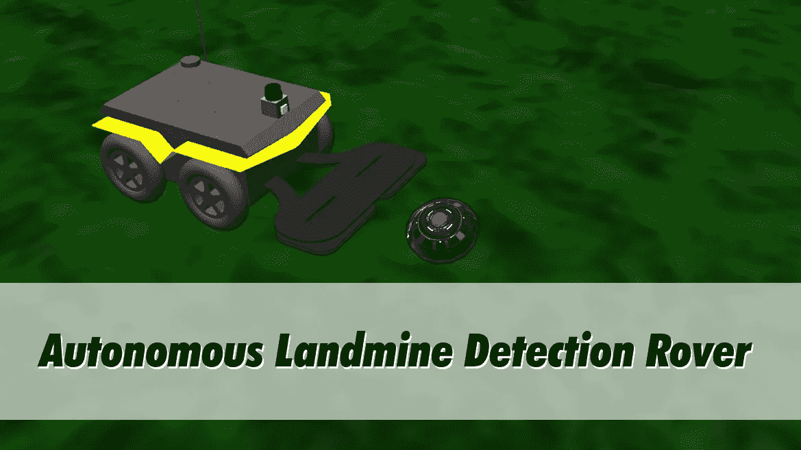
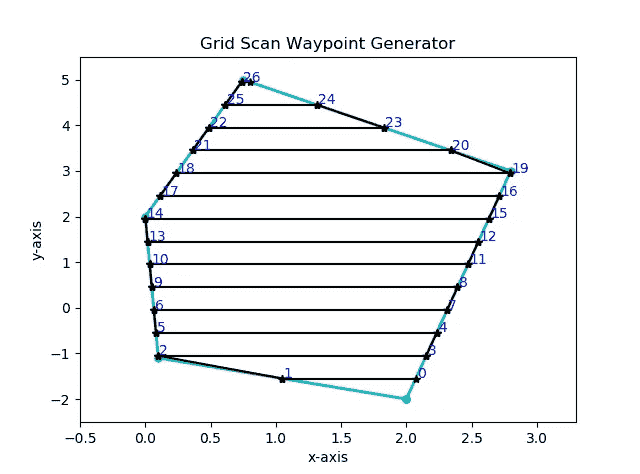
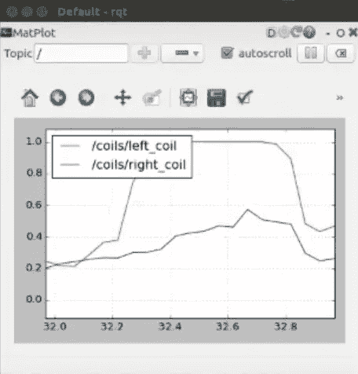
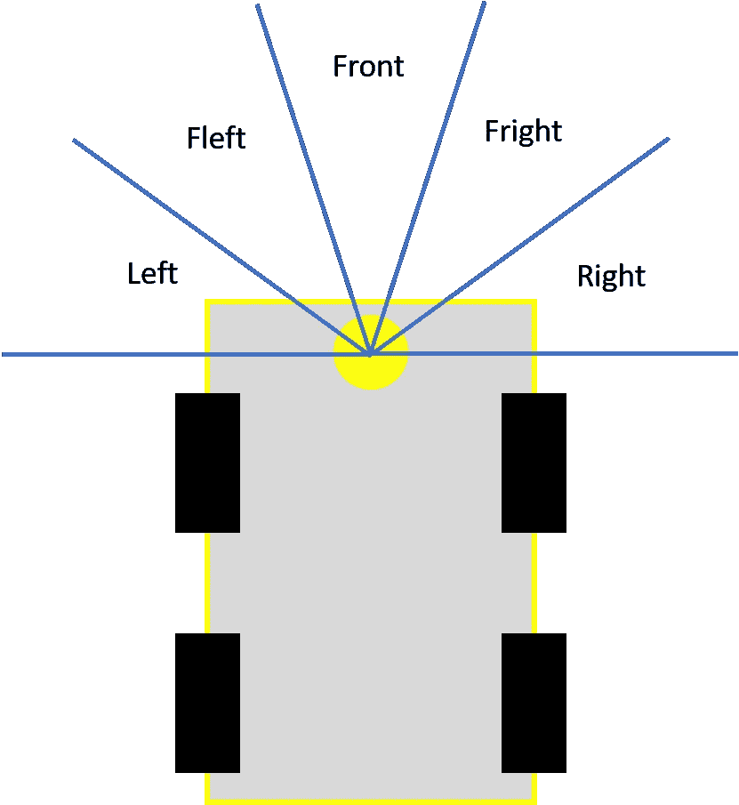
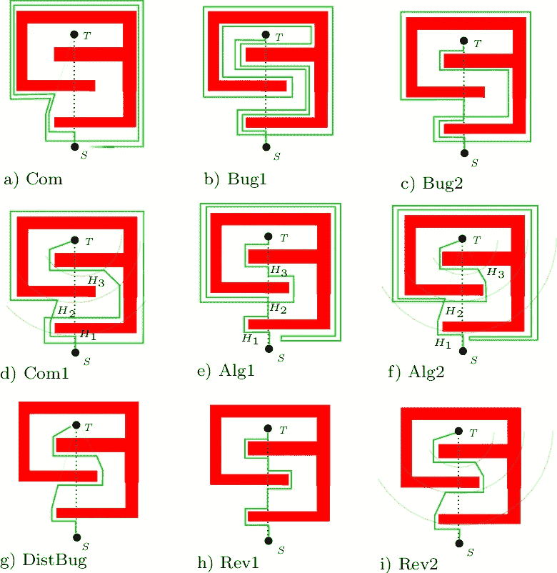

# 人道主义机器人:自主地雷探测车

> 原文：<https://medium.datadriveninvestor.com/humanitarian-robotics-autonomous-landmine-detection-rover-e58d791182ad?source=collection_archive---------12----------------------->

根据联合国地雷行动处的数据，地雷是过去战争遗留的威胁之一，每年造成 15，000-20，000 人死亡。每枚地雷的排雷费用为 300-1000 美元，给人们带来危险，每清除一枚地雷就有一人死亡，两人受伤。

## HRATC 2017

机器人真的可以帮助解决这个问题，因为它被设计来做“枯燥、肮脏、危险和困难”的任务。2017 年，IEEE 机器人自动化学会人道主义技术特别兴趣小组(RAS–SIGHT)举办了一场比赛。比赛是人道主义机器人和自动化技术挑战赛(HRATC)，在 2017 年机器人和自动化国际会议(ICRA '17)上举行。

这个模拟在 Gazebo 上运行，并使用机器人操作系统(ROS)执行，这是一个著名的机器人中间件。如果你想知道更多关于这些话题，请阅读它的网站[这里](https://www.ros.org/)。

Autonomous Landmine Detection Rover

虽然当时我没有直接参与，但我发现比赛很有趣，所以我通过完成挑战来练习我的机器人技术。模拟环境由委员会通过[他们的网站](http://www.inf.ufrgs.br/hratc2017/HRATC2017/Simulator.html)提供。我在模拟器环境中做了一些改变，通过探测 4 个地雷中的 3 个完成了任务。

我的自主算法包括一个航路点跟踪，地雷探测，和避障算法。查看以下 GitHub 库的代码，[修改的模拟环境](https://github.com/fazlurnu/jackal_minefield_simulator)和[自主算法](https://github.com/fazlurnu/jackal_minefield_template)。如果您对算法细节感兴趣，请继续阅读！



## 航路点跟踪算法

在应用中，机器人用户将定义机器人将在其中操作的感兴趣区域(ROI)。然后，算法将产生网格扫描模式，以在 ROI 内导航。与 ROI 边界的交点将用作路点。



Grid Scan Pattern

以下是航路点跟随导航算法的伪代码。一个重要的注释是机器人航向和距离的终止条件。应该定义一个容差，而不是使用精确的终止条件，而是使用等于(==)比较器。这一点很重要，因为传感器测量没有 100%的准确性，因此我们可能没有完全达到我们想要的姿势。

```
if(headingDiff > headingTolerance):
   rotateRight()elif(headingDiff < -headingTolerance):
   rotateLeft()else:
   if(distance > distanceTolerance):
      moveStaright() else: 
      stop() if (not lastWaypointReached):
         setNewTarget()
      else:
         missionFinished = True
```

漫游者配备了一个金属探测器传感器，由两个线圈组成，每侧一个。每当其中一个线圈值高于某个阈值时，流动站将注意到探测到地雷。

[](https://www.datadriveninvestor.com/2020/08/19/robotics-a-business-perspective/) [## 机器人——商业视角|数据驱动的投资者

### 一个晴朗的日子，你和你的小孩在公园散步，突然你注意到一个身体…

www.datadriveninvestor.com](https://www.datadriveninvestor.com/2020/08/19/robotics-a-business-perspective/) 

## 地雷探测

漫游者配备了一个金属探测器传感器，由两个线圈组成，每侧一个。当移动到下一个航路点时，只要线圈值高于某个阈值，漫游者就会注意到探测到地雷。



Coils Measurements

一旦漫游车将某个坐标标记为危险，它将在地雷周围创建一个新的路点，并更新路点列表。为了避免死锁，避免算法应该检查前一个航路点目标是否在地雷的安全距离内。如果离地雷太近，漫游者将忽略该路点，转而前进到下一个路点。

## 排除故障

漫游者配备了一个激光雷达传感器来检测障碍物，从漫游者的右侧到左侧，每 0.5 度测量一次，总共覆盖 180 度。

为简单起见，Li-DAR 测量分为五个区域，如下图所示。虽然降低了 Li-DAR 的能力，但这已足以避免模拟中的障碍。在更复杂的环境中，可能需要进一步的改进。



Li-DAR Illustration

避障算法利用 bug 算法来避免碰到障碍物。下图 g 点 DistBug 描述了模拟中使用的算法版本。



Bug Algorithm (image [source](https://www.researchgate.net/publication/327050213_A_Comparative_Study_of_Bug_Algorithms_for_Robot_Navigation/figures?lo=1))

下面是避障的伪代码。

```
""
currentObstacleState = 0, no obstacle
currentObstacleState = 1, obstacle at front or right, turn left
currentObstacleState = 2, obstacle at front or left, turn right
currentObstacleState = 3, obstacle at left or right side, follow wall
"""if (currentObstacleState == 0):
   goToWaypoint(headingDiff, distance)
elif (currentObstacleState == 1):
   turnLeft()
elif (currentObstacleState == 2):
   turnRight()
elif (currentObstacleState == 3):
   followWall()
else:
   robotStop(
```

如果你对算法进步有什么建议或者算法相关的问题，随时联系我。

**进入专家视角—** [**订阅 DDI 英特尔**](https://datadriveninvestor.com/ddi-intel)