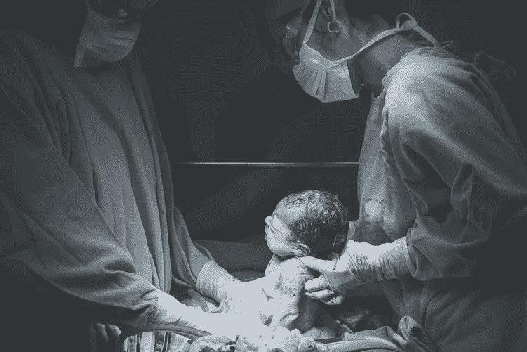

# 出生时的人性

> 原文：<https://medium.datadriveninvestor.com/humanity-in-birth-a1a6ef8ed947?source=collection_archive---------18----------------------->

# 我们生活在最不稳定的时代，从生到死，任何事情都可能发生。

我们正处于“出生”阶段，这是一个极其危险的过程，即使在我们的现代社会，当婴儿从子宫内走向外部世界的时候。这几个小时对婴儿和母亲来说是真正的“生死攸关”的时刻。

# 今天，在我们这一代，人类必须经历同样的过程！

虽然我们大多数人都相信人类是独立于自然之外的，但事实并非如此。我们从大自然的系统中诞生，我们仍然是它不可分割的一部分，我们仍然按照大自然的发展计划进化。

根据这个计划，我们现在必须转向一种不同的发展。

# 直到现在，我们一直在盲目地进化，本能地遵循我们固有的自我中心、个人主义和剥削的本性。

我们没有意识到任何推动我们发展的自然计划，尽管通过我们的本能、荷尔蒙反应、反复出现的恶性历史循环，也是进化发展了我们——利用危机、痛苦、难以忍受的苦难使我们从一个文明转向另一个文明。

对于我们骄傲的、被个人主义误导的西方人来说，塑造人类历史的是伟大的英雄、恶棍、探险家、先驱——尽管从许多例子中我们知道他们只是“在正确的时间正确的地点的正确的人，而如果没有他们，历史会以完全相同的方式在不同的行动者身上展开。

 [## 如果资本主义失败了，那么还有什么选择呢？数据驱动的投资者

### 在当前政治领域的修辞之旅中，我们都可以面对面地接触到流行词汇，如…

www.datadriveninvestor.com](https://www.datadriveninvestor.com/2020/03/16/if-capitalism-is-a-failure-then-what-is-the-alternative/) 

即使现在，人们仍在等待伟大的领袖、专家告诉我们该做什么，而他们建议的每件事，只会让我们陷入更深的危机。

# 进化要求我们开始一条非常不同的、有时间意识的道路。

我们——我们所有人——需要学会如何超越自我，对抗我们的本能和荷尔蒙，并开始根据大自然的整体蓝图发展——尽管这与我们固有的本性完全相反，但程序是有效的。

取代本能的、自私的个人主义、排他的、无情的竞争、利润、以对方为代价的生存，我们现在需要走向无私的、利他的、相互补充的、相互负责的合作，无条件地为集体的需要服务，高于个人利益。

***最重要的是这与政治议程、意识形态、专家意见无关，这与宗教、神秘主义这种朗朗上口的哲学无关。***

# 我们必须根据自然法则进行这种转变，从生命所依赖的平衡和稳态开始。

在这个已经开始的、痛苦的分娩阵痛中，我们将如何度过分娩过程取决于我们的准备。

**如果我们盲目地继续这个过程，**自私地，自私地，互相指责，想要改变，互相纠正，而我们想要保持现状，我们的出生将会流产- **通过毁灭性的全球灾难，世界大战，我们将会自我毁灭！**

**但是，如果我们做好适当的准备——通过正确的、有目的的和高度实用的教育方法**——并开始改变、调整、提升我们自己(我们所有人)，那么**我们将诞生于一个全新的、更好的、更安全的、更平等的、可持续的人类社会，一个质量更高的、集体生存的社会。**

# 这就是我们今天所站的地方，在一个非常真实的“生或死”的场景中，但也在人类历史上第一次获得了一个非常真实的自由选择！

