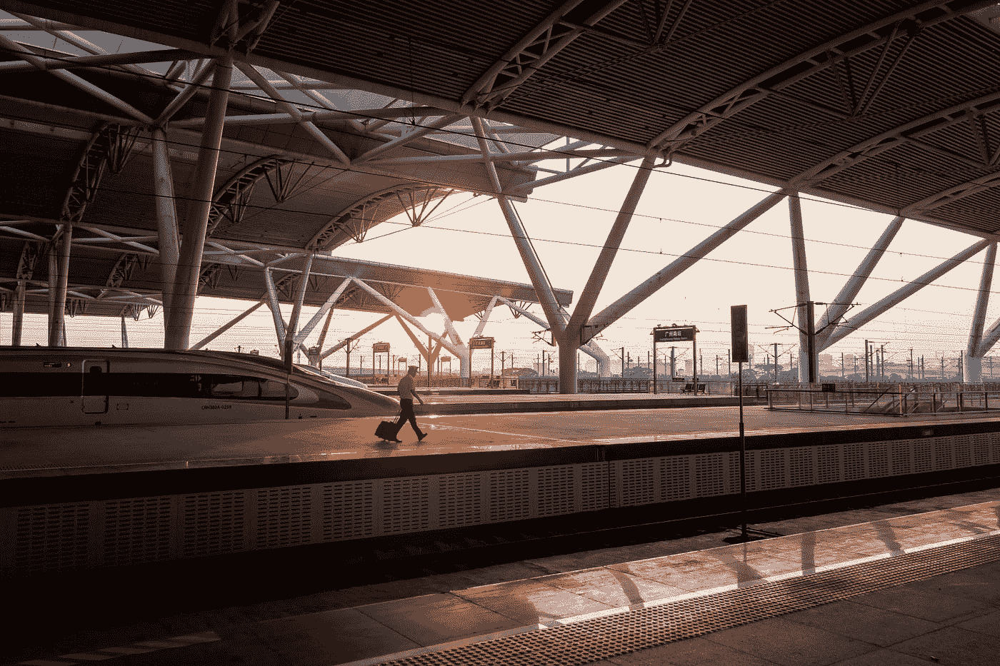

# 人类对新现实的追求！

> 原文：<https://medium.datadriveninvestor.com/humanitys-quest-for-new-realities-c8840e4de9ee?source=collection_archive---------20----------------------->

Photo by [Lau keith](https://unsplash.com/@hollowkeith?utm_source=medium&utm_medium=referral) on [Unsplash](https://unsplash.com?utm_source=medium&utm_medium=referral)

这个十年开始时，人们满怀希望，决心建设一个和平、和谐与富足的世界；过去 10 年的经济不确定性将逆转为更健康的局面。相反，我们的许多假设已经完全变成了一场旋风！

> 改变的秘密是把你所有的精力集中在建设新的而不是与旧的斗争上。苏格拉底

有时变化可能是短暂的，通常人类都希望有可持续的变化。可持续的变革是转型，因为预计变革将持续到指定的时间表之后。

我认为这种“新常态”的存在方式有七个关键方面？

1.  更加慷慨和关爱的心态；我们见证了同情心、欣赏力和分享力的增长。
2.  *范式转变；*人们的工作方式以及如何在工作场所保持社交距离。
3.  *污染；*随着污染水平大幅下降，保持空气质量成为一个关键问题。
4.  *饮食健康；*一直与昂贵联系在一起。政府已经对医疗服务的成本敲响了警钟；这能引发大众对有机产品的购买吗？*植物营养*会成为大众的“新常态”吗？
5.  *以家庭为基础的娱乐和创意；*可能提高了对过度依赖外部休闲活动的代价的认识；“新常态”是如何使用这些资源的一种平衡吗？
6.  *禅定、正念；本世纪获得了更多的动力；封锁见证了更多的在线节目和应用程序的推广。一天冥想两次是“新常态”吗*
7.  *生活节奏；*已经明显慢了下来，对一些行为如何在所谓的“忙碌的生活方式”中造成压力有了警觉；“新常态”是接受精神痛苦是由“不正常的存在方式”引起的，并且一种更自然和有益的生活方式是一种平衡的生活方式。

人类在世界许多地方目睹并经历了一种规定性的生活方式，回归事物本来面目的愿望可能是一种强烈的愿望；当然，决策者、立法者、政府、各种形式的领导人、跨国公司、消费者、服务提供商、教育者、抗议者、革命者和精神领袖都意识到这是加强社会生态系统的开始。

 [## 冠状病毒；惊慌失措；字里行间的 z |数据驱动的投资者

### 围绕冠状病毒的话题；更准确地说，新冠肺炎几乎占据了整个新闻预报的头条…

www.datadriveninvestor.com](https://www.datadriveninvestor.com/2020/03/23/coronavirus-a-to-panic-z-between-the-lines/)