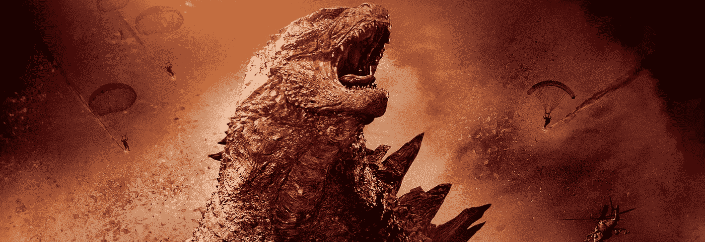

# 人性化人工智能&优化人类

> 原文：<https://medium.datadriveninvestor.com/humanize-artificial-intelligence-optimize-humankind-8be58c12bcd9?source=collection_archive---------17----------------------->

人工智能将拯救世界上崩溃的疫情经济；促进复苏，创造新的就业机会，帮助公民，但与此同时，消灭了世界上一半的企业，并将衰退周期拖了十年。这个看不见的友好的巨人走出了笼子，仿佛一个高耸的哥斯拉现在时刻威胁着世界的市中心，践踏着旧的结构，却创造着新的数字网关…为了驯服这个野兽，特殊技能是至关重要的，必须掌握协变性，但首先是事实…

**“人工智能就是人工无知”**

**当世界人口开始相信**未来的控制按钮属于人工智能时，一种全球性的恐惧出现了，让公众产生了噩梦般的恐惧。随着大流行后的恢复期变得混乱，虚假被剥光，真相和现实在上升，我们必须处理事实，因为“人工智能是人工的无知”，现在我们的时代需要一个新的人性化的视角来实现社会的自动化和机器人化。

 [## 人工智能和监督资本主义|数据驱动的投资者

### 大科技，总是现在:人工智能推动的大科技，已经使购物，搜索，在你的…

www.datadriveninvestor.com](https://www.datadriveninvestor.com/2020/03/04/on-artificial-intelligence-and-surveillance-capitalism/) 

**最初的概念**一些“聪明的结果”是虚假的智能伪装，由被创造性地称为“人工智能”的杰出程序产生，最初，被好莱坞轰动，被硅谷商业化，被股票市场炒作，被媒体抨击，都是出售创新技术的复杂营销策略。因此，在世界各地，人类不必要地害怕闪亮的令人毛骨悚然的玻璃眼睛机器人的到来，这些机器人被人工智能神秘地驱动，抢走我们的工作，控制我们的生活，窃取我们的金钱，带走我们的孩子，和我们爱的人一起逃跑，而有些人则爬进我们灯光昏暗的卧室。

**嘿，谷歌，叫一个机械战警……**

智能机器人不会取代我们的工作，而是帮助我们实现卓越的表现。烤面包机曾经是一种智能机器人，可以喷射烤面包片。今天，世界上最先进、最小、最便宜的机器人掌握在 50 亿人手中，那就是智能手机。当我们进入时，音频-视频-增强-虚拟现实的另一个陷阱给了我们实时的悬浮感，我们非常感谢新技术帮助我们的思想和表现进步。

当我们的身体无法用纸板翅膀飞翔时，我们的大脑发明了巨型喷气式飞机。想象一个各种各样的机器人帮助我们做家务和办公室工作的世界。就像过去的汽车、电梯和洗碗机一样。嘿谷歌，订购一个全新的定制厨房…并协商价格和付款…马上

**避免人工智能驱动的噩梦的五种方法**

**开始思考如何掌握我们的自我；
不断进步，数字思维，自我发现**

**开始对批判性思维、复杂问题解决、
进行深入研究，将人才与技术相结合，共同进步**

**开始发现独立可用的创业精神
终身学习；找个沙盒试试点子**

**停止关于机器如何超越人类的社交讨论；
讨论他们如何帮助我们快速前进**

**停止今天让我们忙碌的事情
因为未来会有更多的自由时间去思考**

**慢慢停止大部分体力劳动，同时慢慢推进
到脑力劳动，并在这个过程中找到放松**

人工智能不会抢走我们的工作，但它会提供更有回报的工作机会，让我们现有的和隐藏的才能随着我们的精神力量而闪耀。在各国之间实现人工智能霸权的竞赛进入了一场非常激烈的竞赛，谷歌的量子霸权是一个非常积极的全球新闻。

机器人的主人是新技术，机器人的奴隶是变革的否认者

我们不需要 10 亿个机器人来取代人类工人，而是需要全国动员 10 亿工人提高技能，以恢复他们的生产力，使他们与先进技术的联系更加人性化。人类交互阶段与智能技术相结合，如“电子人机工程学”，在这种技术中，人工智能+AR+VR+AV+远程工作的自由度远远超过人类的表现，这是脑力工作的亮点。

[**未来主义是无用功；**](https://thriveglobal.com/stories/futurism-is-workless/) **深入学习，获取战术技能，以对抗此类战场。**

各国必须决定，要么投资防暴装备，要么投资终身学习和全民创业。疫情复苏的[形状是什么？](https://moderndiplomacy.eu/2020/05/26/pandemic-recovery-shape-www/)五十亿互联的阿尔法梦想家将以某种方式改变世界，带来新的思维和新的模式；一个新世界正以慢动作展开。深入学习

**访问专家视图—** [**订阅 DDI 英特尔**](https://datadriveninvestor.com/ddi-intel)