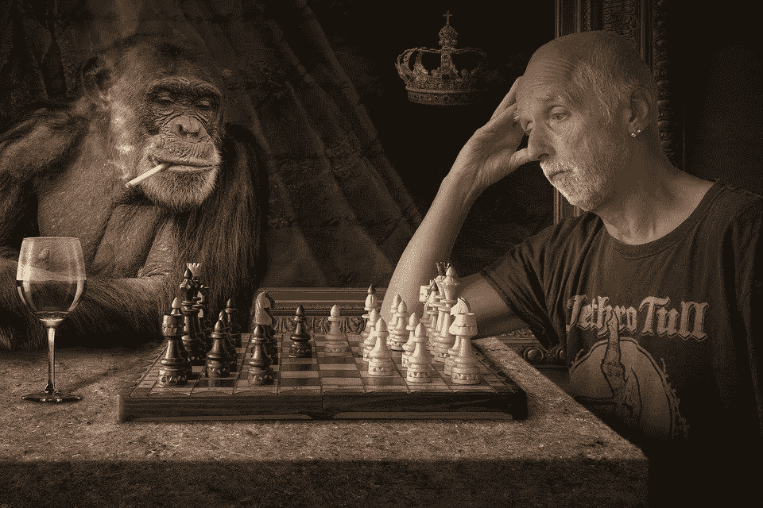
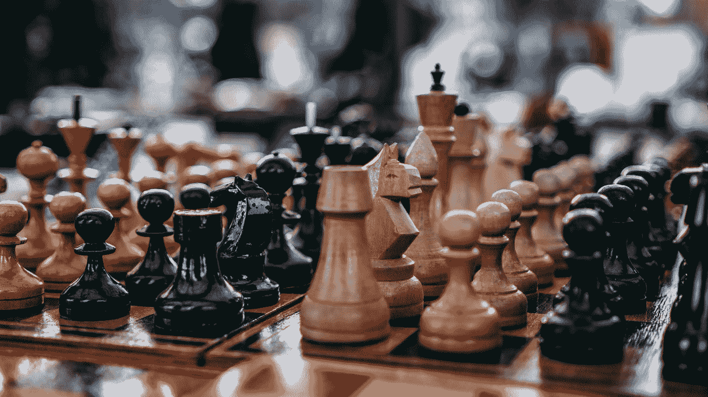

# 人类无法打败我——人工智能

> 原文：<https://medium.datadriveninvestor.com/humans-cant-defeat-me-chess-and-artificial-intelligence-dfe73523513b?source=collection_archive---------25----------------------->

## 科学|人工智能

Source: [Pixabay](https://pixabay.com/images/id-3827454/)

L

***它能自行做出聪明而致命的举动。***

网络通过深度学习技术进行学习，与自己对抗一百万次。

> 没有人能打败它，即使是世界冠军也不行

[DeepMind](http://science.sciencemag.org/content/362/6419/1140) 发表了一篇论文，讲述了一个玩游戏的人工智能。

> 研究人员将它用于双人游戏，特别是围棋、国际象棋和日本象棋。)

除了每场比赛的规则之外，没有给它任何特别的信息。首先，它随机移动，然后它开始自己学习。

2 小时后，它开始比正常的人类玩家表现得更好；4 小时后，该系统能够击败世界上最好的棋手。

在 9 个小时的时间里，国际象棋系统在专门的 ***谷歌硬件*** 上与自己进行了***4400 万场*** 对弈。

***是不是令人难以置信？***

Photo by [Alexander Grigoryev](https://unsplash.com/@alex__grig?utm_source=medium&utm_medium=referral) on [Unsplash](https://unsplash.com?utm_source=medium&utm_medium=referral)

这个名为 [***阿尔法零***](https://deepmind.com/blog/article/alphazero-shedding-new-light-grand-games-chess-shogi-and-go) 的程序，以击败世界上最好的围棋选手而闻名。

*阿尔法零战胜* [***李塞多尔***](https://www.theverge.com/2019/11/27/20985260/ai-go-alphago-lee-se-dol-retired-deepmind-defeat) *，世界上最好的围棋选手在一场比赛中，被一亿多人看了个遍。*

***【a . I .不可战胜】*** 说*[***李塞多尔***](https://www.businessinsider.com/deep-mind-alphago-ai-lee-sedol-south-korea-go-2019-11) *。**

*Alpha zero 的神经网络以系统的方式工作，网络接收布局输入，游戏的几个最近的移动。*

*作为输出，它评估当前玩家可能的获胜方式，并预测哪一步可能效果最好。*

> *一个多世纪以来，国际象棋一直被用作人类和机器认知的罗塞塔石碑。AlphaZero 通过做一些不同寻常的事情，重新建立了一个古老的棋盘游戏和尖端科学之间的非凡联系。“(加里·卡斯帕罗夫，前国际象棋冠军 *)**

*走向智能和自我意识的人工智能之旅。它有造福人类的非凡潜力。我们只需要对集体利益负责。*

*来源:*

1.  *【https://science.sciencemag.org/content/362/6419/1140 *