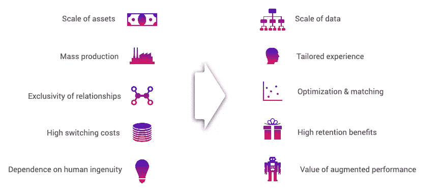
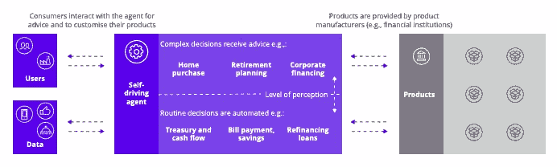
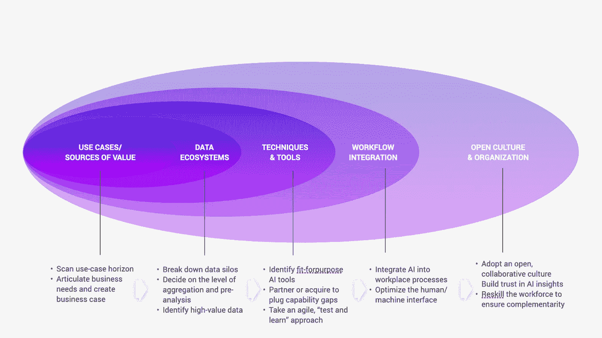
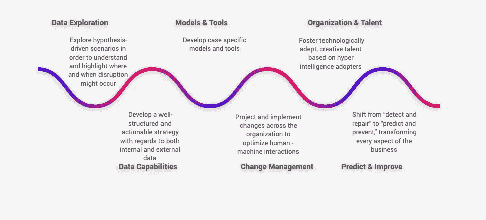
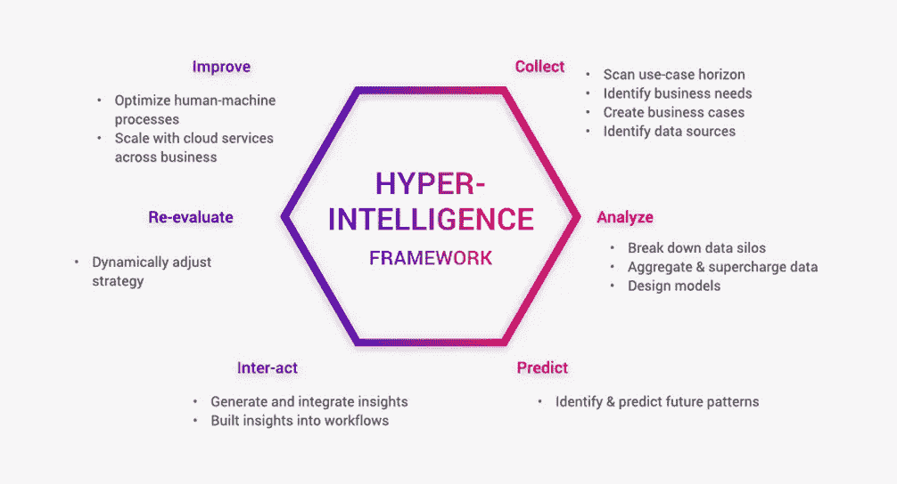
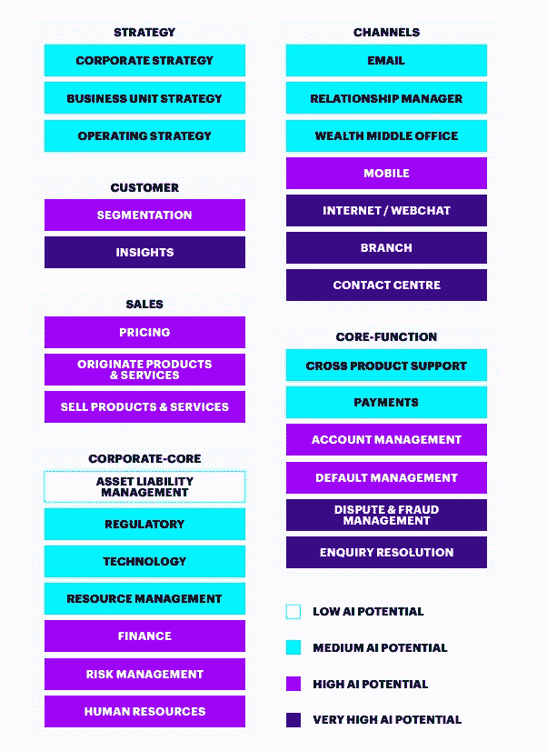

# 超智能:金融领域的智能转变

> 原文：<https://medium.datadriveninvestor.com/hyper-intelligence-intelligent-shift-in-finance-9262d3430cde?source=collection_archive---------6----------------------->

# 人工智能优先方法

将人工智能融入运营模式
超智能意味着专注于让人们能够与人工智能一起工作。这种联盟将企业推向了一种状态，在这种状态下，人类的智慧、创新和想象力通过技术得到解放和增强。最终，这提高了企业寻求做的所有事情的价值和效率。

传统业务通常围绕客户服务、财务、人力资源和供应链等核心职能进行组织，任务和数据在孤岛中管理。然而，通过采用围绕超智能框架组织的新运营模式，可以在这些功能内部和之间形成更好的连接，以创建超智能企业。

超智能转型采用人工智能优先的方法，并使用流程挖掘等创新方法，在较短的时间内以最小的中断增量方式转变运营模式。

超智能组织正在向一种基础架构过渡，这种基础架构能够提供现代消费者和员工期望的速度、响应能力和可靠性，从而在工作场所获得更多选择和创造力。

 [## 使用谷歌搜索趋势预测首次申请失业救济人数|数据驱动的投资者

### 几年来，我的重点一直是使用多种替代数据来预测宏观经济统计数据…

www.datadriveninvestor.com](https://www.datadriveninvestor.com/2020/03/25/using-google-search-trends-to-predict-initial-jobless-claims/) 

超智能组织正在向一种基础架构过渡，这种基础架构能够提供现代消费者和员工期望的速度、响应能力和可靠性，从而在工作场所获得更多选择和创造力。

# 智能换挡

**以客户为中心
智能转变——从以产品为中心的促销活动心态转变为以客户为中心的互动管理方法**,基于实时洞察确定最能反映客户和组织需求的**“下一个最佳行动”** (NBA)。

金融机构需要了解他们的数字原生客户:他们期望跨渠道的无摩擦体验能够满足他们的上下文需求。为了满足这些期望，金融机构需要实施智能自动化解决方案，在营销、销售和服务互动中以客户为中心。在预测分析和人工智能的支持下，认知自动化识别客户的关键时刻，并使金融机构能够实时提供相关行动和产品。与客户进行有意义的沟通和建立牢固的关系可以建立忠诚度和信任度。这种方法引导客户参与推动增长，同时节省成本。这种类型的解决方案的关键组件包括机器学习和预测分析，以在互动发生时实时了解每个客户的背景。分析需要包括自学反馈，以根据客户互动不断调整，并动态推荐最相关的行动、优惠、内容、时机和渠道。
智能转变使组织能够轻松设计、部署、执行、衡量和修订全渠道客户战略，并动态平衡客户期望和业务目标。它确保组织能够跨多个渠道及时做出决策和采取行动。

# 人工智能转型

**人工智能正在迅速改变金融营销和分销** 人工智能成功转型的核心要素包括构建数据生态系统、采用正确的技术和工具、将技术融入运营、打破孤岛以及采用开放、协作的文化。

**自动驾驶金融** 超智能转型改变金融建议的交付。它允许消费者与基于人工智能的代理进行交互，以获得建议和产品定制。自主代理提供与购房、退休规划、财富管理或企业融资相关的决策指导。它还可以自动化日常交易，如账单支付和再融资。

组织需要为最有价值的人工智能用例优化智能转型，并实施支持性的数字资产和能力。

**围绕真正的价值来源构建商业案例** 要构建人工智能商业案例，它需要与公司的战略保持一致。这需要真实世界的经验和对基本人工智能过程的理解。从长期来看，投资可以从分散风险的投资组合中获益。在短期内，重点关注目前可以大规模采用的成熟技术解决方案，包括聚类、细分、倾向建模和体验优化。需要“测试和学习”方法来验证业务案例，使用实验和扩大成功。

**人工智能计划应由包括业务和技术利益相关方的跨职能团队实施，以确保最佳验证。**

**聚合数据生态系统**

当今经济，所有的公司都是数据公司，金融机构也不例外。没有数据就不可能运行成功的人工智能实验。金融企业领导人需要了解如何最好地利用他们的丰富数据，并用人工智能为其增压。从客户数据中提取的洞察力会对金融机构的收入产生巨大影响。

一个非常重要的功能是利用暗数据——一种无法以关系格式获得或者无法用传统方法分析的数据。

组织需要建立基于人工智能的洞察能力，并将优势集成到他们的运营中，以优化人机界面。人类可能需要一些时间来适应这种范式转变。这意味着创造人工智能就绪的文化应该是早期的优先事项。

**成功的 XIG 战略建立在人工智能探索的洞察力之上，并解决了大规模分析计划的所有维度——从数据到人员到文化的一切。**

# 对金融服务的影响

**银行业热图** 最佳效率很可能首先体现在后台职能部门，在这些部门中，机器人流程自动化(RPA)已经产生了重大影响。基于认知自动化的虚拟劳动力，如 Robo-advisors，可以学习并适应业务需求，正在中台和前台运营中部署。当优化的人工智能界面为财务运营带来成本降低和收入增长方面的好处时。一家银行的 IT 运营成本预计可节省 20-25 %( T13 ),包括基础设施、维护和开发成本，以及跨产品线的收入提升、新产品开发的增加以及每产品收入、销量、客户维系和收购的提高。

**释放客户数据中的潜在价值不仅能节约成本，还能为未来增长创造全新的产品和服务**

超智能改变了银行在基础层面的工作方式，并将人工智能融入其智能价值链的整个范围，从而产生新的收入流。

通过金融健康共生棱镜分析的银行客户数据的价值提供了强大的优势，可以洞察客户的生活阶段和风格，突出他们不断变化的需求和挑战，建立关系和信任。