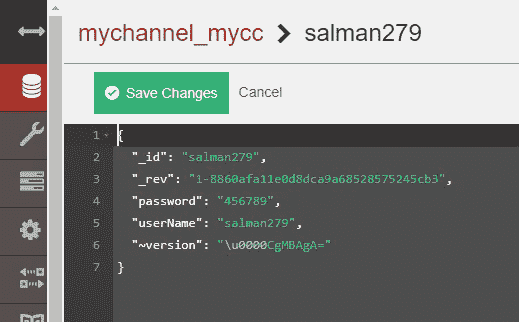
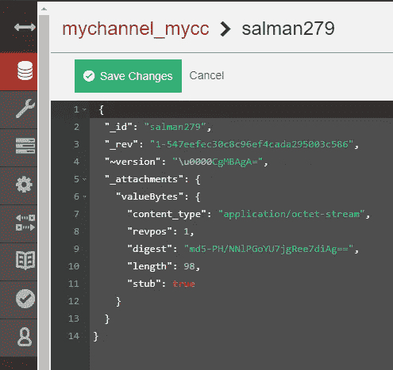

# Hyperledger 结构最佳实践-使用链码加密状态数据库排名第一

> 原文：<https://medium.datadriveninvestor.com/hyperledger-fabric-best-practices-in-production-1-encrypting-state-database-with-chaincode-8369b0bc345a?source=collection_archive---------0----------------------->


A Photo By [Life Of Pix](https://www.pexels.com/@life-of-pix) in [Pexels](https://www.pexels.com)

由于区块链技术令人难以置信的受欢迎程度，IBM 的 Hyperledger Fabric 项目触及天空，不仅仅是因为它是区块链框架之一。拥有一些很棒的独特特性，如许可架构、即插即用组件、对机密事务的通道支持、模块化和可伸缩性。由于所有这些事实，Hyperledger Fabric 在这个区块链时代变得具有革命性。它有改变行业的巨大潜力，我们现在已经看到了。在过去的几个月里，Hyperledger Fabric 取得了很大进展。无论你是 hyperledger fabric 的新手，还是有一些经验，并希望快速掌握 Hyperledger Fabric 生产和开发的最佳实践，这篇文章都适合你。这是一系列文章，我将在这个系列中添加更多的实践和技巧。现在，我想发布我的第一个选择**“# 1 用 Nodejs Chaincode 加密和解密状态数据库”**今天！


Google Image of Cat Doing Science

## 特种宽银幕电影

有些情况下，我们会处理敏感数据，如存储信用卡数据、银行信息、生物特征数据、健康信息等..作为分布式分类帐中业务应用程序的一部分。最终用户总是希望保护这些机密信息，即使数据库遭到破坏。在相当多的应用中，我们会要求对数据库中的数据进行加密，这样即使有人进入了数据库，他们也可能不知道数据是什么。然而，在区块链，数据库被黑客攻击的可能性微乎其微。尽管黑客入侵区块链数据库的可能性较小，但在存储到区块链数据库时加密用户数据是一个很好的做法。加密在许多应用中至关重要。随着 Hyperledger Fabric 最近越来越受欢迎，让我们看看如何使用 Nodejs 链码加密进入数据库的数据。

[](https://www.datadriveninvestor.com/2019/03/08/top-10-blockchain-courses/) [## 2019 年十大区块链课程|数据驱动的投资者

### 渴望在区块链发展吗？你想知道区块链是如何工作的，但不知道在哪里？或者就是太多了…

www.datadriveninvestor.com](https://www.datadriveninvestor.com/2019/03/08/top-10-blockchain-courses/) 

在任何生产级应用程序上尝试这种方法之前，您需要知道的一件事是，这将会减慢速度。这个过程涉及到两个额外的步骤——加密和解密数据。这将使您的应用程序变慢一点，并且根据您的数据库读写量，这可能会对您的应用程序的性能产生重大影响。在决定加密数据库中的所有内容之前，请记住这一点。

## 该过程

在我们开始加密之前，首先让我解释一下我在这里使用的链码逻辑。实际上，我们的链代码在这里做的是简单的用户注册和登录。用户将通过提供用户名和密码在我们的应用程序上注册。这些凭据将以纯文本形式存储在数据库中，每当用户使用这些凭据登录时，将使用存储在数据库中的凭据对提供的凭据进行验证。因此，我们将为这些凭据添加加密和解密层。容易吗？？我们开始吧。

对于这个例子，我保持这个超级简单，并为 Nodejs 使用一个内置的加密库。根据您正在使用的应用程序，您可以自定义加密的实现，并尽可能使它变得复杂。

**注意:**我将在本文中演示的这些加密和解密方法工作在 Nodejs 运行时 v 10 . 0 . 0(Nodejs 链码的当前运行时环境)下。— Hyperledger Fabric 1.4.3)但是，在未来的版本中，链码的 Nodejs 运行时将迁移到 v12.13.0，因此我们可以使用更好的方法来加密和解密数据。但是，技术是一样的。为此，我还在这个演示存储库中添加了 v12.13.0 兼容的加密和解密方法。

**更新:**出于安全和隐私考虑，我们不应该通过交易明确传递机密信息(即密码)，因为这涉及到将这些密码存储在特定的交易头中。如果网络中的其他用户可以扫描这些块，他们就可以读取你的机密信息(如密码)。相反，您可以散列密码并通过事务传递它(这是另一个故事)。我在这里描述的例子(注册和登录)是为了解释只用链码加密/解密的概念。

**1。加密:**

这个示例项目的整个加密实用程序如下:

```
function encrypt(data){   
  const cipher = crypto.createCipher('aes256', password);  
  let encrypted = cipher.update(data, 'utf8', 'hex');
  encrypted += cipher.final('hex');   
  return encrypted;
}
```

方法 **encrypt()** 会做您认为它会做的事情。它只是使用内置的基本加密器的五行代码。encrypt()函数将通过环境变量(`.env`)使用预定义的加密密码获取参数`data`，它将基于给定的算法`aes256`创建一个加密密钥，并使用该加密密钥加密`data`并返回加密的数据。这是 encrypt()函数背后的全部思想。如果您想了解更多关于每一行的具体功能，请点击这里的[。](https://nodejs.org/api/crypto.html)

**2。解密:**

下面是这个示例项目的解密实用程序:

```
function decrypt(cipherData)  {    
   const decipher = crypto.createDecipher('aes256', password);    
   let decrypted = decipher.update(cipherData, 'hex', 'utf8');
   decrypted += decipher.final('utf8');   
   return decrypted.toString();}
```

方法 **decrypt()** 将对加密的数据进行解密。 **decrypt()** 函数将再次接受一个参数— cipherData。有了密码，它将根据给定的算法`aes256`创建一个解密密钥，并用解密密钥解密`cipherData`并返回普通数据。[了解更多。](https://nodejs.org/api/crypto.html)

**3。链码实现:**

**注意:**术语密码代表两个不同的参数。一个是业务应用程序的注册/登录密码，另一个是加密/解密密码(通过`.env`提供给环境)来加密/解密数据

我们以前见过我们的链码逻辑。因此，当用户提交他的凭证(用户名和密码)时，我们应该在将它们放入数据库之前对它们进行加密。所以我们的第一个任务是将它们传递给 encrypt()方法。一旦数据被加密，encrypt()方法将返回加密的数据。现在我们需要将这些加密的数据放在数据库中，密钥为 username。迷茫？看看代码中的 **signUp()** 函数。

类似地，当用户登录时，我们的 chaincode 需要验证用户名是否存在于数据库中，如果存在，它应该检查提交的密码是否正确。因此，为了检查密码是否正确，应该首先解密与特定密钥(用户名)相关联的数据，因为它是加密的。所以，我们需要将这个加密的数据传递给`decrypt()`方法。解密后，如果提供的登录密码与特定密钥(用户名)相关的密码匹配，它将验证用户登录。这是完整的代码。

**快速演示**

```
git clone [https://github.com/Salmandabbakuti/hlf-encryption.git](https://github.com/Salmandabbakuti/hlf-encryption.git)cd hlf-encryption chmod 777 node-start.sh && chmod 777 go-start.sh./node-start.sh #nodejs chaincode encryption model (credentials storing and validation logic) head over to fauxton UI http://localhost:5984/_utils./go-start.sh #golang chaincode encryption model (tuna supplychain logic)
```



Plain Data in Database without Encryption.



Database With Added Encryption.

如你所见，加密和解密的魔力正在发挥作用。

如果你对直接进入代码感兴趣，你可以从[这里](https://github.com/Salmandabbakuti/hlf-encryption)分叉出完整的项目。如果您对此有任何疑问或建议，请随时在下面留下评论。

我准备发表一系列关于“Hyperledger Fabric 在生产中的最佳实践”的文章。在下一篇文章中，我将解释如何通过三个简单的步骤将 hyperledger explorer 连接到您的网络。

你们有兴趣吗？跟我来..

快乐超帐织物🙌