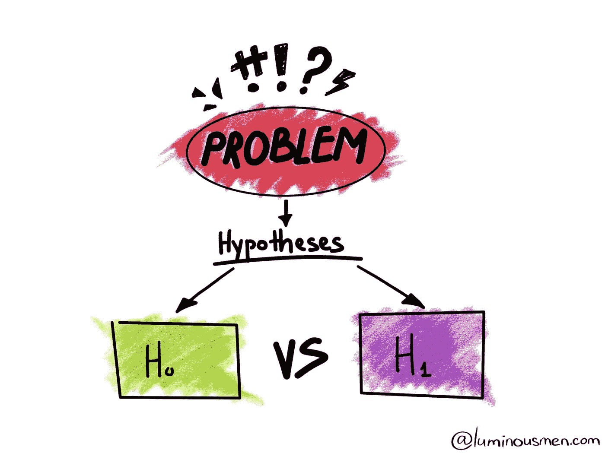
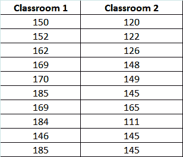
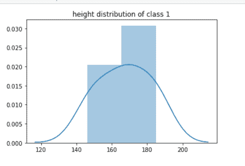
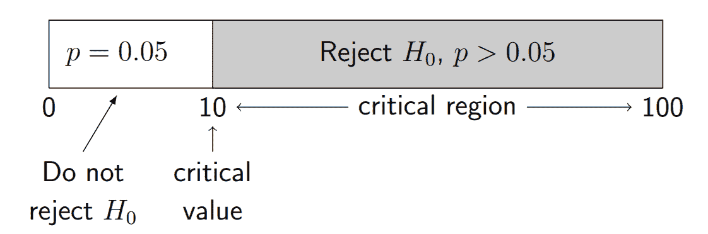
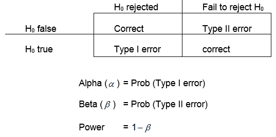
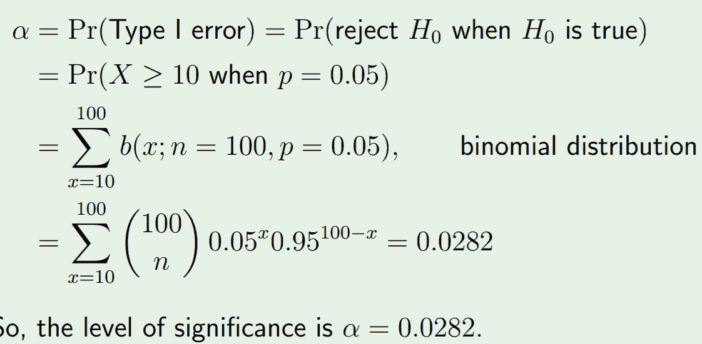
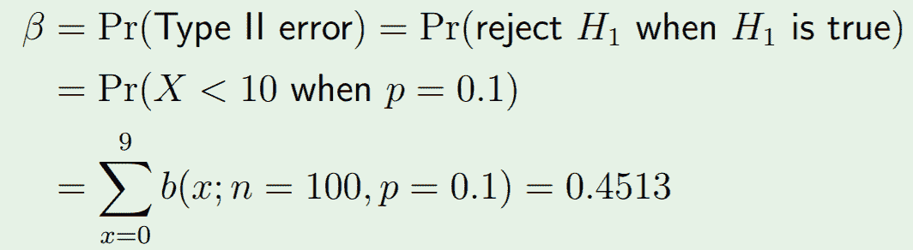

# 假设检验

> 原文：<https://medium.datadriveninvestor.com/hypothesis-testing-bbfa5819a8bf?source=collection_archive---------14----------------------->

[https://luminousmen.com/post/demystifying-hypothesis-testing](https://luminousmen.com/post/demystifying-hypothesis-testing)

假设检验是一种统计方法来检验我们的实验，看看我们是否有一个有意义的结果。

**由** [**维基**](https://en.wikipedia.org/wiki/Statistical_hypothesis_testing) **:**

> “统计假设是一种假设，它可以在观察数据的基础上进行检验，观察数据被建模为随机变量集合的实际值”

# 目录

*   假设检验方法
*   执行假设检验的步骤
*   案例分析 1:**1 教室和 2 教室学生身高有差异吗？**
*   案例分析 2 : ***一家生产 RAM 芯片的公司声称总体的次品率为 5%。设 p 表示真实缺陷概率。***
*   假设检验的性质

# 假设检验方法

在进入假设检验的细节之前，让我们定义一些重要的术语

> H0 =零假设
> 
> H1 =替代假设
> 
> p 值= **p 值**是反对零假设的证据。 **p** - **值**越小，你应该拒绝零假设的证据就越强。

# 执行假设检验的步骤:

1.  选择零假设
2.  选择替代假设
3.  选择 p 值
4.  通过接受或放弃假设来定义你的结果。

简而言之，假设检验可以理解为:

> “我们选择了一个大家都期待的结果(**零假设**)。但是我们实际上做了实验，零假设不太可能是真的。然后我们尝试了不同的模型，发现我们的原假设不成立，所以我们拒绝原假设，接受替代假设”

在假设检验中，我们希望 H1 很可能是真的。

所以有两种可能的结果:

*   *拒绝 H0，接受 H1，因为样本中有足够的证据支持 H1*
*   不要因为支持 H1 的证据不足而否定 H0。

# **案例研究 1:**

> q .**1 教室和 2 教室学生身高有区别吗？**

让我们取每个班 10 个学生的样本数据。

**选择一个检验统计。**

**X = 2 — 1**

**其中** 1:教室 1 的平均高度，2:教室 2 的平均高度。

让我们画出第一教室学生的身高分布图

heights of students in classroom 1

让我们画出第二教室学生的身高分布图

heights of students in classroom 2

**假设检验步骤:**

1.  **定义零假设**

> H0:1 和 2 没有区别

2.**定义替代假设**

> H1:1 和 2 的区别

3.**计算 P 值**:如果*零假设*为真，观察到的概率(2- 1)。

让我们说我们的

> p 值为 0.9，那么如果 H0 为真，则(2- 1)的概率为 0.9。
> 
> p 值是 0.05，那么如果 H0 为真，则(2- 1)的概率是 0.05。

4.通过接受或放弃假设来定义你的结果。

计算 1 = 1 班学生平均身高= 167.2

2 =二班学生的平均身高= 134.6

现在，根据我们的分析，发现 1 和 2 之间存在显著差异。所以我们可以抛弃我们的零假设，接受 H1 的替代假设。

# 案例研究 2

> ***一家制造 RAM 芯片的公司声称总体的次品率为 5%。设 p 表示真实缺陷概率。***

我们想测试是否:

H0 : p = 0.05

H1 : p > 0.05

**解决方案:**

让我们取 100 个芯片的样本。

100 个样本中的不良数量

1.  如果 100 个样本中 **X > = 10** ，则拒绝 H0。下图显示，如果 X 的值大于 10，那么我们的 p > 0.05，你拒绝 H0，接受 H1。

你可能想知道**为什么我们选择 10 作为临界值**。所以，临界值是从**伯努利过程中选取的。**

样品中的缺陷是 ***n*p = 100*0.05 = 5，*** 因此，10 个缺陷将是 p > 0.05 的有力证据。

由于这是基于有限样本的决策，因此出错的可能性非常高。

可能的结果是:

[https://sphweb.bumc.bu.edu/otlt/MPH-Modules/BS/SAS/SAS4-OneSampleTtest/SAS4-OneSampleTtest3.html](https://sphweb.bumc.bu.edu/otlt/MPH-Modules/BS/SAS/SAS4-OneSampleTtest/SAS4-OneSampleTtest3.html)

## **类型 1 错误**

正是**接受 H1 的时候，H0 才是真的。**也称为显著性水平，用**α**(α)表示

## **第二类错误:**

当 H1 为真时，拒绝 H0 是一个失败。犯第二类错误的概率用 **β表示。**

**注:**除非我们有特定的替代假设，否则不可能计算β。

1.  **对αα的计算:**

*   alpha 越低，我们犯 1 型错误的可能性就越小。

**β的计算**

我们不能计算 H1 的β:p > 0.05，因为真实的 p 是未知的。

然而，我们可以通过计算来进行测试

H0 : p = 0.05 反对另一个假设

H1:例如，p = 0.1。

***让我们来计算β***

根据α= 0.282，我们可以拒绝 H0，因为它不等于 0.05，而接受 H1。

# **假设检验的性质**

1.α和β是相关的；减少一个通常会增加另一个。

2.通过调整临界值，可以将α设置为所需的值。通常，α设置为 0.05 或 0.01。

3.增加 n(样本量)会降低α和β。

4.随着真实值和假设值(H1)之间的距离增加，β减小。

# **引用:**

*   [https://stats . stack exchange . com/questions/123287/how-to-choose-the-null-and-alternative-hypothesis](https://stats.stackexchange.com/questions/123287/how-to-choose-the-null-and-alternative-hypothesis)
*   [https://www . statisticshowto . com/probability-and-statistics/hypothesis-testing/](https://www.statisticshowto.com/probability-and-statistics/hypothesis-testing/)
*   [http://media . news . health . ufl . edu/misc/bolt/Intro/PHC 6050-6052/unit 4/0408-Unit4A-Hypothesis-Testing-steps . pdf](http://media.news.health.ufl.edu/misc/bolt/Intro/PHC6050-6052/Unit4/0408-Unit4A-Hypothesis-Testing-Steps.pdf)
*   [http://www . sci . Utah . edu/~ arpa iva/classes/UT _ ECE 3530/hypothesis _ testing . pdf](http://www.sci.utah.edu/~arpaiva/classes/UT_ece3530/hypothesis_testing.pdf)
*   [https://www.wallstreetmojo.com/hypothesis-testing/](https://www.wallstreetmojo.com/hypothesis-testing/)