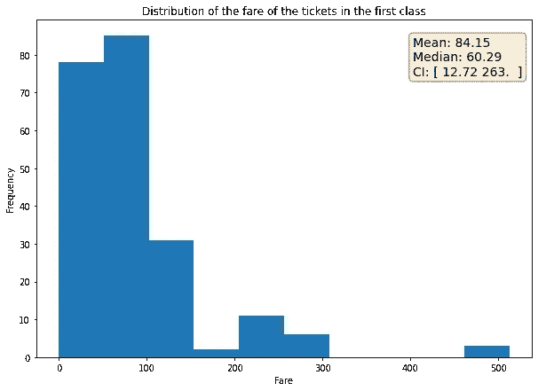
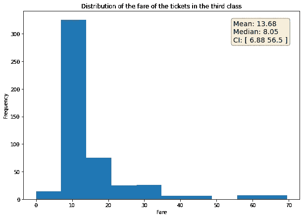
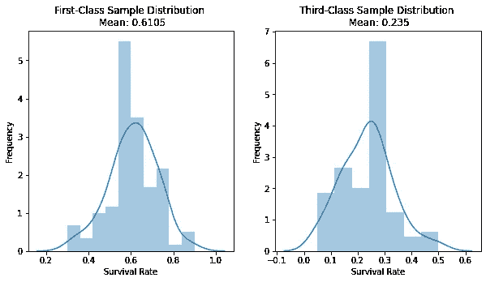

# 使用 Python 中的 Titanic 数据集直观地解释了假设检验。

> 原文：<https://medium.datadriveninvestor.com/hypothesis-testing-intuitively-explained-using-the-titanic-dataset-in-python-5afa1e580ba6?source=collection_archive---------1----------------------->


**注**:这是两篇关于分析和理解泰坦尼克号数据集的文章中的第一篇。请在这里找到第二部。

# **简介**

假设检验是统计推断中非常常见的概念。为了使用数据集做出结论或推断，必须进行假设检验以评估该结论的重要性。在这篇文章中，我将使用 Titanic 数据集来直观地解释显著性测试中的每一步。

我们都看了《泰坦尼克号》电影，我们看到了有钱人开始给钱以优先乘坐安全船只的部分。然后我们可以假设泰坦尼克号上的富人比其他人有更高的存活率。既然不能只相信一部电影就下结论，那就应该得到数据。

我将在这里使用 Kaggle [提供的数据集](https://www.kaggle.com/c/titanic/data)。让我们从加载数据并打印几行开始:

```
Data = pd.read_csv('train_titanic.csv')
Data.head(10)
```


数据有几个特征，但我们只关注以下内容:

*   存活:0 或 1 的类别，表示该个体是否存活。
*   这艘船被分成三个等级。第一，第二，第三。
*   票价:个人购买机票的价格。

让我们用直方图来看看这些数据:

```
# Distribution for rich:
first_fares = Data["Fare"][Data["Pclass"]==1]
first_mean = round(np.mean(first_fares), 2)
first_median = round(np.median(first_fares), 2)
first_conf = np.round(np.percentile(first_fares, [2.5, 97.5]), 2)fig, ax = plt.subplots(figsize = (10, 7))ax.hist(first_fares)
props = dict(boxstyle='round', facecolor='wheat', alpha=0.5)ax.text(0.76, 0.95, f"Mean: {first_mean} \nMedian: {first_median} \nCI: {first_conf}", transform=ax.transAxes, fontsize=14,
        verticalalignment='top', bbox=props)
plt.xlabel("Fare")
plt.ylabel("Frequency")
plt.title("Distribution of the fare of the tickets in the first class")
plt.show()# Distribution for Poorthird_fares = Data["Fare"][Data["Pclass"]==3]
third_mean = round(np.mean(third_fares), 2)
third_median = round(np.median(third_fares), 2)
third_conf = np.round(np.percentile(third_fares, [2.5, 97.5]), 2)fig, ax = plt.subplots(figsize = (10, 7))ax.hist(third_fares)
props = dict(boxstyle='round', facecolor='wheat', alpha=0.5)ax.text(0.76, 0.95, f"Mean: {third_mean} \nMedian: {third_median} \nCI: {third_conf}", transform=ax.transAxes, fontsize=14,
        verticalalignment='top', bbox=props)
plt.xlabel("Fare")
plt.ylabel("Frequency")
plt.title("Distribution of the fare of the tickets in the third class")
plt.show()
```



一等舱票价在 12.72 美元至 263 美元之间，平均为 84.15 美元，而三等舱票价在 6.88 美元至 56.5 美元之间，平均为 13.68 美元。因此，我们可以看到，阶级特征是船上的人的社会经济地位的代表，我们可以假设在一等群体中的人是富人。

# 为什么要进行显著性测试

现在，我们可以回到之前的假设。富人有更好的生存机会吗？

回答这个问题的一个天真的(仍然是直觉的)方法是检查第一类人群中幸存下来的人的比例，并将其与第三类人群的比例进行比较，看看哪个更大:

```
x = ["First-Class", "Third-Class"]
y = [np.mean(Data["Survived"][Data["Pclass"]==1]), np.mean(Data["Survived"][Data["Pclass"]==3])]
plt.bar(x, y)
plt.ylabel("Survival Rate")
plt.title("Survival Rate for people in the first and third classes")
plt.show()
```


从剧情来看，很明显，一流的人存活率更高。然而，这个结论是无效的(或者说是仓促的)，原因有二:

*   首先，我们拥有的数据只是一个样本。我们不知道这个样本是否是随机的、独立的、无偏见的，甚至是泰坦尼克号上所有人的代表。我们使用这个样本数据，因为这是我们所有的。
*   其次，这些数据是由人类收集的，因此在数据收集过程中很容易出现人为错误、偏差或随机性。

假设检验的重要性来了。在统计推断中，假设检验用于检查两个总体之间观察到的差异是否真的显著，或者只是由于数据中的一些随机性/偏差。假设检验有几种类型，最常见的是我们将使用的 z 检验。

[](https://www.datadriveninvestor.com/2020/07/07/introduction-to-time-series-forecasting-of-stock-prices-with-python/) [## 用 Python |数据驱动投资者进行股票价格时间序列预测简介

### 在这个简单的教程中，我们将看看如何将时间序列模型应用于股票价格。更具体地说，一个…

www.datadriveninvestor.com](https://www.datadriveninvestor.com/2020/07/07/introduction-to-time-series-forecasting-of-stock-prices-with-python/) 

# 假设检验的 z 检验和中心极限定理

进行 z 检验的第一步是陈述我们试图检验的假设。假设很简单:“一等公民比三等公民有更高的存活率”。或者更概括地说，我们可以说“人们的社会经济地位影响他们的存活率”。在科学术语中，该假设将使用无效假设和替代假设的概念来构建:

*   无效假设:人们的社会经济阶层对存活率没有影响。
*   替代假设:人们的社会经济阶层影响他们的存活率。

然后进行显著性检验，看是否应该拒绝或接受零假设。这似乎是一种有点间接的评估我们假设的方式，因为我们检查我们假设的反面(零假设)是否正确，而不是直接评估我们的假设(替代假设)。之所以这样进行测试，是因为因果关系和相关性是两个不同的概念。另一种假设提出了一个非常大胆的主张，它认为社会经济阶层是许多人死亡的原因。这种因果关系不容易证明，需要统计因果推理分析(许多科学家甚至认为你永远无法确定因果关系)。所以我们不去证明这个主张，只是表明我们无法反驳它。换句话说，我们证明了我们没有反对这种说法的证据。

现在下一步是研究两个群体(第一类和第三类)的分布。为了使 z 检验有效，两个总体必须是正态分布的。换句话说，第一类人的存活率的概率分布和第三类人的存活率的概率分布都必须是正态分布。然而，我们实际上没有整个人口的数据，我们只有一个样本人口。解决这个问题的方法是中心极限定理。如果我们从总体中抽取足够大的均值样本，那么我们的样本分布将是正态分布。我们开始吧！！

我将从每个群体中抽取 100 个平均值作为样本:

```
First_Class_Sample = np.array([np.mean(Data[Data["Pclass"]==1].sample(20)["Survived"].values) for i in range(100)])third_Class_Sample = np.array([np.mean(Data[Data["Pclass"]==3].sample(20)["Survived"].values) for i in range(100)])
```

注意，中心极限定理说样本中的每个点都应该是一个较小样本的平均值。这就是为什么在上面的代码中，我取了 100 个样本，其中每个样本都是 20 个点的平均值(每个点都是 0 或 1，表示存活率，这就是为什么取它们的平均值可以提供存活率)。

根据中心极限定理，我们的两个样本总体应近似呈正态分布:

```
plt.subplots(1, 2, figsize = (10, 5))
plt.subplot(1,2, 1)
sn.distplot(First_Class_Sample)
plt.title("First-Class Sample Distribution")
plt.xlabel("Survival Rate")
plt.ylabel("Frequency")
plt.subplot(1, 2, 2)
sn.distplot(third_Class_Sample)
plt.title("Third-Class Sample Distribution")
plt.xlabel("Survival Rate")
plt.ylabel("Frequency")plt.show()
```



看起来不错！！

# z 得分和 P 值

根据样本分布，类的影响是 0.6105–0.235 = 0.3755

如上所述，我们需要检查这种影响是否真的显著，或者只是由于样本数据中的偶然性或随机性。z 检验通过计算 z 得分来检查该影响的显著性。z 得分只是衡量一个值相对于平均值的标准偏差。这意味着 z 值越高，离平均值越远。离平均值越远，这个值就越不可能来自正态分布，因为它在曲线的两端。换句话说，z 分数是一种度量，它描述了从总体的正态分布中提取效果的可能性有多大。如果我们假设零假设为真(假设类别对存活率没有影响)，那么两个群体(真实群体而非样本)的分布差异的均值应该为零。观察到的效应的 z 得分将描述该效应与零的标准偏差。如果它太大，那么这个效应就不太可能来自这个分布。

通常，显著性测试试图通过将 z 值转换为 P 值来更好地理解 z 值。假设零假设为真，P 值就是观察到该效应(类的效应)的概率。这意味着如果 P 值很高，那么我们可以接受零假设，因为获得存活率的极端差异的概率很高(即使当类没有影响时)。换句话说，P 值是这个类对存活率的测量影响只是由于随机性的概率。因此，较低的 P 值表明，由于随机性而观察到该效应的几率较低，并且该效应应归因于一个重要因素(类别)，在这种情况下，应拒绝零假设。

在计算 z 值和 P 值之前，我们必须设置一个显著性水平。这只是一个我们认为是我们的阈值的值。我们说，如果 P 值低于这个水平，那么我们可以轻松地拒绝零假设。换句话说，显著性水平是我们对于认为观察到的效应是由于数据的随机性而产生的容忍程度。如果我们将该水平设置为 0.05，那么我们是说，如果观察到该效应的概率(P 值)为 5%或更高，那么我们将假设这只是由于随机性，我们可以接受零假设。

现在，我们可以计算 z 值。如上所述，z 得分就是一个值与分布平均值的标准差。根据定义，z 值的公式是:


在哪里

*   μ₁是一流的平均水平
*   μ₃是第三等级的平均值(所以μ₁——μ₃是观察到的结果)
*   σ₁₋₃是两个总体间差异分布的标准差

请注意，这些参数应取自整个总体分布，但由于我们没有整个总体，我们只是在处理一个样本，而且该样本很大，因此可以使用以下公式将每个样本的标准偏差视为真实总体标准偏差的良好近似值:


在哪里

*   σ₁是一级样本分布的标准差
*   n 是一级样本分布大小
*   σ₃是第三类样本分布的标准差
*   m 是第三类样本分布大小

现在，让我们回到我们的数据来计算这些值:

```
effect = np.mean(First_Class_Sample) - np.mean(third_Class_Sample)
sigma_first = np.std(First_Class_Sample)
sigma_third = np.std(third_Class_Sample)
sigma_difference = np.sqrt((sigma_first**2)/len(First_Class_Sample)  +  (sigma_third**2)/len(third_Class_Sample))z_score = effect / sigma_difference 
```

从代码上看，z 分是 25.85！！这是一个很高的 z 值。我们可以使用 Python 来获得 P 值(对于双尾测试):

```
st.norm.sf(abs(z_score))*2
```

P 值为 2.24e-147。这肯定比我们设定的 0.05 的显著性水平小得多。P 值意味着，如果我们假设零假设为真，那么随机观察到该效应的概率是 2.24e-145%，这是一个非常小的概率，使我们可以轻松地拒绝零假设。

# 结论

结论是，所提供的样本证明了社会经济阶层和存活率之间的显著相关性。请注意，我们仍然不能确定这两个特征之间的因果关系，正如我们上面讨论的那样，但我们可以做出一个概括的归纳，即富人在船上有更好的生存机会。

我希望这篇文章是有帮助的，请在这里找到完整的代码。

# 有用的资源

*   [https://www . statistics show to . com/probability-and-statistics/hypothesis-testing/](https://www.statisticshowto.com/probability-and-statistics/hypothesis-testing/)
*   [https://stat trek . com/hypothesis-test/hypothesis-testing . aspx](https://stattrek.com/hypothesis-test/hypothesis-testing.aspx)
*   [https://machine learning mastery . com/statistical-hypothesis-tests/](https://machinelearningmastery.com/statistical-hypothesis-tests/)

## 获得专家观点— [订阅 DDI 英特尔](https://datadriveninvestor.com/ddi-intel)