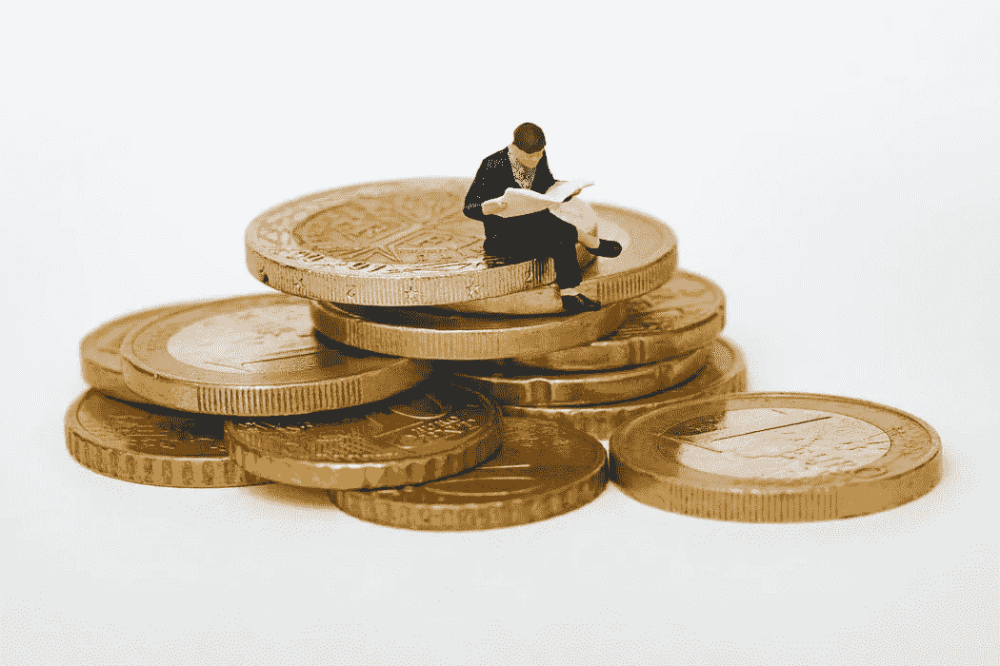
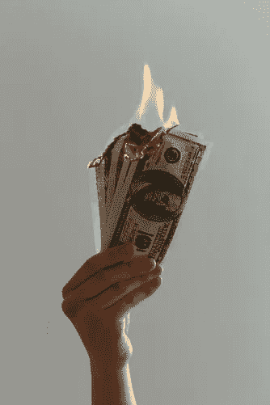

# 我 36 了，刚开始投资，我来晚了吗？

> 原文：<https://medium.datadriveninvestor.com/i-am-36-and-just-started-investing-is-it-too-late-for-me-f3f30d5ae0f4?source=collection_archive---------3----------------------->

## 金钱

## 尝试“中等投资挑战”

Photo by [Mathieu Stern](https://unsplash.com/@mathieustern?utm_source=unsplash&utm_medium=referral&utm_content=creditCopyText) on [Unsplash](https://unsplash.com/s/photos/investing?utm_source=unsplash&utm_medium=referral&utm_content=creditCopyText)

在我人生的大部分时间里，投资没有多大意义，我甚至没有买过一只股票。我是个体户，赚了很多钱，从来不觉得有必要这么做。乐趣，以及我的未来，似乎是确定无疑的，因为我得到保证，大量新的资金将总是会进来。即使在我的生意失败后，我仍然花了很长时间才理解投资的概念，我 36 岁才开始。

## 冒险一试

如此多的疑虑使我不敢迈出这一步。例如，我对投资或者从哪里开始一无所知。我该相信谁或者向谁学习？什么是市值，什么是股息？没有一些基础知识，投资股票就像在赌场赌博，我肯定会输。

此外，即使当我开始学习投资基础知识时，试图买股票也同样令人生畏。我需要多少开始？感觉上，如果你没有成千上万的钱去传播，这甚至都不值得。在我所有的花费之后，把剩下的一点点钱锁在你花不完的地方并没有那么吸引人。我仍然喜欢在业余时间和金钱中寻找乐趣。毕竟，对我来说，生活不仅仅是工作和储蓄。收入越少，就越难将投资视为可行的解决方案。我怎么可能用我能投入市场的微薄的几块钱来影响我的未来呢？！？！这种怀疑就是穷人不投资的原因。

所有这些疑虑让我直到现在都没有进入市场，因为我意识到它们也让我无法实现更光明的未来。任何使用免费 Youtube 和谷歌资源的人都可以学习投资基础知识。底线是这只是研究。我仍然知之甚少，但我能够根据更聪明的投资者的观点做出一些明智的决定。我不得不投入投资的微薄资金足够启动并迅速积累。

Photo by [Jp Valery](https://unsplash.com/@jpvalery?utm_source=unsplash&utm_medium=referral&utm_content=creditCopyText) on [Unsplash](https://unsplash.com/s/photos/investing?utm_source=unsplash&utm_medium=referral&utm_content=creditCopyText)

## **变得有投资意识**

越来越多像我一样的人开始认识到富人享有的优势，并被这些优势所吸引。如今，由于可扩展性和被动收入的可能性，任何人都有可能从中受益。进行任何规模的投资都可以帮助你在睡觉时赚钱，这是富人的思维和行为方式。钱生钱。与我们大多数人按小时工作或领薪水的方式相比，这是一个鲜明的对比。一天只有这么多时间，你只能在这段时间里得到这么多报酬，与富人的投资心态相比，这是非常有限的。

投资就像存钱，但由于风险稍高，回报也更高。我的储蓄账户和其他金融工具支付的利息少得可怜，不足以让我的钱快速增值，甚至跟不上通货膨胀。这就是为什么像许多其他人一样，我觉得开始投资以获得更高回报是明智的。股票市场可能看起来不稳定，但如果你从长期来看，它是相当周期性的，许多好股票保持或增长价值。虽然有些人不这样做，但我认为分散投资是很重要的，这样在一个人投资失败的情况下，还有其他人来平衡。

这不是为了快速致富，而是为了表现得像个富人，这样我就能确保我的未来。想要一夜暴富会导致糟糕的短期决策，这只会让你离目标更远。在考虑投资的时候，我会考虑 15-30 年后的事情。我还会努力工作来维持生计吗？还是我现在要牺牲一点，这样我就可以像上一代那样退休了？这就是我看到的我父母那一代人和我们这一代人的区别。他们把钱存起来以备后用，但我们这一代人是靠薪水过活的。我们这一代人可能会接触到不同的环境，但最终，我不得不问自己，我会让这些环境阻止我获得财富吗？感觉落后，感觉委屈，感觉失落都是无济于事的因素，因为它们让我处于生存模式，而不是冒险，让我茁壮成长。

## “中期投资策略”

这篇文章不仅仅是关于我的。我希望它能引起你的共鸣，并给你一些希望。但是我不会让你一直悬着。我向你发出挑战。谁都可以做。在 Medium 上写文章，在每个月底，投资你的收益。无论你的中等收入是 1 美元还是 1000 美元，都可以用它们来开立个人退休账户、购买股票或投资加密货币。做你的研究，明智地投资，但是把你的文字赚来的钱当作积累财富的大门。如果你写了一篇像样的文章，赚了 10 美元，看看它能变成什么岂不是更酷？当人们后来问你怎么这么早就退休了，你可能会说，“我写了字，买了股票。”

如果你喜欢阅读这样的故事，并想支持我成为一名作家，可以考虑每月 5 美元订阅 Medium。作为会员，你可以无限制地访问媒体上的故事。如果你注册使用我的链接，我会赚一小笔佣金。

这里是 [**链接**](https://bradislava.medium.com/membership) 无限阅读文章。