# 我是一个婴儿潮一代，这就是我们这代人如何让巨大的财富分化发生的！

> 原文：<https://medium.datadriveninvestor.com/i-am-a-baby-boomer-and-this-is-the-story-of-how-my-generation-let-the-great-wealth-divide-happen-24af80502150?source=collection_archive---------11----------------------->

## 以 1976 年的缅因资本公司为特色


Image by Mackenzie Andersen using public domain clip art

法律地位披露:这是外行人的意见。独立研究员，缅因州的普通公民。如果你不是媒体订阅者，想要为媒体上独一无二的独立研究内容投票，你可以通过关注麦肯锡安达信 来支持它[](https://mackenzieandersen.substack.com/)

*我这一代人，也就是婴儿潮一代，没有以牺牲大多数人的利益为代价来创造有利于少数人的巨大财富鸿沟，但是我们允许它发生。为了理解这种巨大的影响，我们需要理解发生在人类个体互动范围内的分子反应。这个故事假设，美国经济的集中化是造成和加剧贫富差距的一个重要因素，并研究了它是如何体现在少数人的私人资本利益的位置上的。*

*[](https://www.datadriveninvestor.com/2020/05/21/state-run-insurance-for-all-or-across-the-state-lines-private-healthcare-coverage-economics-politics-social-mix-up/) [## 全民或跨州的国营保险私人医疗保险:经济学…

### 我们目前生活在一个所有非医疗行业都痴迷于…

www.datadriveninvestor.com](https://www.datadriveninvestor.com/2020/05/21/state-run-insurance-for-all-or-across-the-state-lines-private-healthcare-coverage-economics-politics-social-mix-up/) 

这个故事可以追溯到 1976 年缅因州宣布实行中央管理经济后，第一部法案通过的时候。该法案规定了缅因资本公司。

但首先，让我们更进一步追溯到鼓励缅因州立法机关重塑缅因州执政政治哲学的事件。

# 前奏:美国编纂了中央管理经济


Bermix-Studio Unsplash

在 1968 年至 1971 年的短短几年间，联邦政府内部发生了三件大事，巩固了美国经济从以自由企业制度为主向以财富再分配经济为主的转变，将自由企业制度推向了边缘。

可以肯定的是，当时婴儿潮一代正处于自身的转型阶段，从 1967 年爱情之夏的花童到 1968 年反对战争、种族主义、性别歧视、争取人权、摇滚以及生活在由青年文化主导的时代和地方的令人兴奋的阴谋的社会行动主义爆发。我们还没有到担任领导角色的人生阶段，但这是我的故事开始的地方。


A crowd of people holding candles, including African Americans, at a march at night to the White House, led by Coretta Scott King as part of the Moratorium to End the War in Vietnam which took place on October 15, 1969, Public Domain Image from [*U.S. News & World Report*](https://memory.loc.gov/ammem/awhhtml/awpnp6/usnews_coll.html) *collection at the* [*Library of Congress*](https://en.wikipedia.org/wiki/Library_of_Congress)*.*

我们的主要新闻来源是电视、广播和报纸。那时候只有三个电视网和晚间新闻广播，没有 24 小时新闻报道。更具戏剧性的新闻占据了中心舞台，而在幕后，国会颁布了一项对国家政治哲学的根本性变革。

针对最贫困阶层的扶贫战争和 T2 国家艺术捐赠基金项目为中央管理经济铺平了道路。他们一起创造了对中央管理的国民经济的接受，在这种背景下，巨大的贫富差距不断扩大。

在那些日子里，我不知道[1968 年美国政府间合作法，公法 90–577](https://www.govinfo.gov/content/pkg/STATUTE-82/pdf/STATUTE-82-Pg1098.pdf#page=1)I。我只是在最近研究另一个主题的过程中发现了它，这个主题在 1968 年并不存在。在我的研究中，我发现一些最有影响力的立法是在公众知之甚少的情况下通过的。

# 联邦政府的无限权力

当美国联邦成立时，联邦(联邦)的权力被限制在宪法列举的权力之内。美国宪法列举的联邦权力中不包括对经济的中央管理。尽管如此。自联邦成立以来，联邦政府一直在逐步扩大其权力。今天，联邦政府通过一个财富再分配系统来控制各州，这个系统通过拨款和税收激励来实现。

## 1968 年，颁布了国家财富再分配的结构性形式

《1968 年美国政府间合作法案》公法 90–577 旨在集中管理从联邦到市一级的整个联盟的经济。

下图显示，直到 20 世纪 50 年代，联邦政府都没有参与“社区和地区发展”这一类别，这一类别在 20 世纪 60 年代及以后急剧扩大。今天，很可能每个州都有一个经济和社区发展部，这在 1968 年的《美国政府间合作法》和公法 90-577 中有所规定，是接受和重新分配联邦政府拨款的必要手段。在缅因州，缅因州金融管理局负责收集和集中财富，并由缅因州经济和社区发展部进行分配。

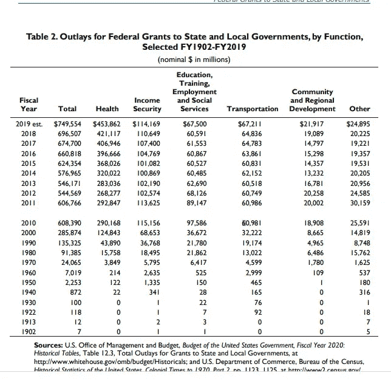

[Federal Grants to State and Local Governments: A Historical Perspective on Contemporary Issues](https://fas.org/sgp/crs/misc/R40638.pdf)

《联邦法案》的作者毫不避讳地将他们的使命表述为联邦权力的扩张:

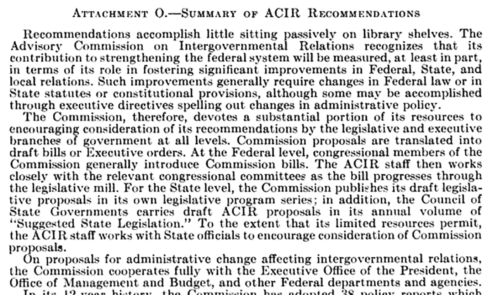

[The United States Intergovernmental Cooperation Act of 1968, Public Law 90–577 i](https://books.google.com/books?id=cLxgVU0MWSYC&pg=PA62&lpg=PA62&dq=The+United+States+Intergovernmental+Cooperation+Act+of+1968,+Public+Law+90%E2%80%93577+i&source=bl&ots=UNHWOu9265&sig=ACfU3U01_pJ_odDgV6J7pXRvbxRaGeoMew&hl=en&sa=X&ved=2ahUKEwj1_tKK96fqAhXhdd8KHZTNAwoQ6AEwA3oECAcQAQ#v=onepage&q&f=false)

[1968 年美国政府间合作法案，公法 90–577](https://www.govinfo.gov/content/pkg/STATUTE-82/pdf/STATUTE-82-Pg1098.pdf#page=1)包括如何修订州和市宪法和法律的详细说明，以符合联邦对联邦经济的管理。[公法 90–577](https://www.govinfo.gov/content/pkg/STATUTE-82/pdf/STATUTE-82-Pg1098.pdf#page=1)使用赠款鼓励各州制定其议程，并包括让各州了解赠款可用性的指示。虽然联邦法律的部分内容看起来似乎支持地方治理的自治，但人们不能忽视的是，联邦政府指导各州如何管理市政当局，试图使整个国家遵守一套联邦制定的指导方针和一个关于如何实现经济发展及其方向的想法。忘掉组成美国的陈旧观念，在这个观念中，每个州都是管理和政治哲学的实验。从 1968 年开始，整个国家将由联邦政府管理，以财富再分配为手段。


Kyle Glenn-Unsplash

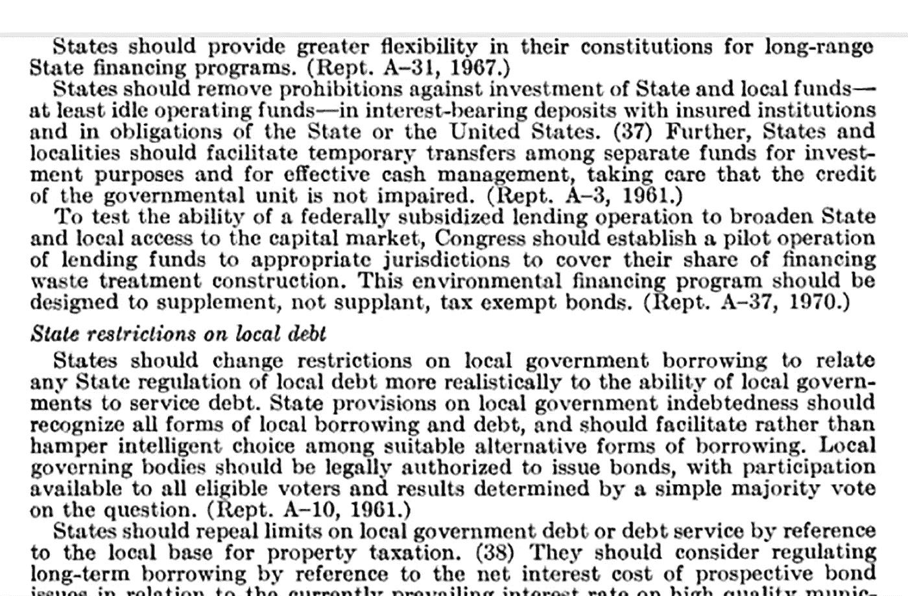

[The United States Intergovernmental Cooperation Act of 1968, Public Law 90–577 i](https://books.google.com/books?id=cLxgVU0MWSYC&pg=PA62&lpg=PA62&dq=The+United+States+Intergovernmental+Cooperation+Act+of+1968,+Public+Law+90%E2%80%93577+i&source=bl&ots=UNHWOu9265&sig=ACfU3U01_pJ_odDgV6J7pXRvbxRaGeoMew&hl=en&sa=X&ved=2ahUKEwj1_tKK96fqAhXhdd8KHZTNAwoQ6AEwA3oECAcQAQ#v=onepage&q&f=false)

## 1971 年[菲亚特 Mone](https://en.wikipedia.org/wiki/Fiat_money#:~:text=Fiat%20money%20started%20to%20predominate,government%20to%20be%20legal%20tender.) y 取代金本位制

1971 年 8 月 15 日，理查德·尼克松总统宣布美国不再以固定价值将美元兑换成黄金，从而放弃了金本位制。法定货币的价值取决于一个公认权威的说法，即它是存在的。今天，法定货币由美联储发行到美国经济中。

## 1975 年大规模引入了可退税信贷。

根据美国国会预算办公室的数据，退税优惠最早出现在 1975 年。可退还的税收抵免意味着当没有税款拖欠时，纳税人欠抵免持有人一笔现金付款。与免税相结合，可退还的税收抵免可能被称为可逆税收抵免，颠倒了纳税人和收税人的角色。

# 缅因州的回应

随着时间的推移，1968 年《美国政府间合作法》公法 90–577 中的许多指令随后在缅因州颁布，如今缅因州是一个中央集权多于地方管理的州

1976 年，缅因州州长 Longley 创建了一个由缅因州最大和最有实力的行业负责人组成的委员会，并指定该委员会领导立法机构将缅因州转变为一个由州中央管理的经济体，反映了联邦中央经济管理并与私营部门利益合作，因此私营部门委员会被指定领导公开选举的立法机构。

隆利总督工作队于 1976 年 10 月发表了一份题为《经济发展总督工作队的立法建议》的报告。这份报告不能在网上获得，但是可以从缅因州立法图书馆下载。

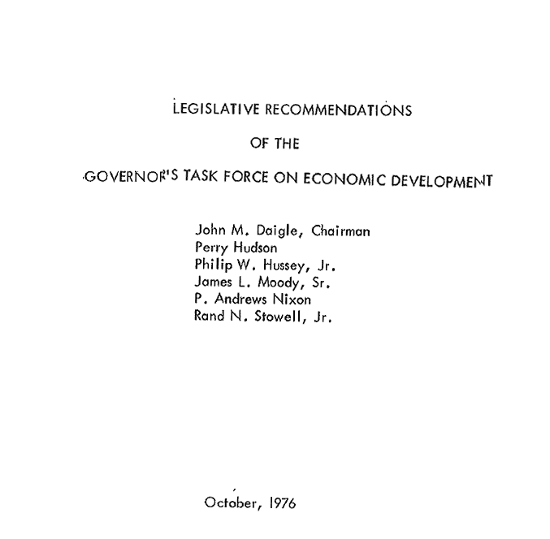

John M Daigle was president of [Casco Bank Trust Co](http://www.fundinguniverse.com/company-histories/casco-northern-bank-history/) and [Casco Northern Corporation.](http://www.engagingnews.us/select/Casco-Northern-Corp.html) [Perry Hudson](http://www.highbeam.com/doc/1P1-227754265.html) was the general manager of New England Telephone. Phillip W Hussey, Jr, owner of [Hussey Seating Company.](http://www.highbeam.com/doc/1P1-193640356.html) [P. Andrews Nixon](http://www.cstoredecisions.com/2008/05/12/dead-river-ceo-retires/) was the head of the largest distributor of residential heating fuel in New England and the operator of the Dead River chain of 20 c-stores in New England. [N Stowel Junior](https://www.linkedin.com/pub/rand-stowell/48/b51/83b) was the CEO, President of United Timber Corp, a family-owned forest products company with multiple subsidiaries. including wood products manufacturing, sawmilling operations, and extensive timberlands making it one of Maine’s larger businesses. James L Moody Sr is credited on the report, but it seems more likely that it would have been James L Moody Jr. The senior Moody was a teacher, while the younger Moody was the chief executive of Hannaford for 19 years and thereafter a board member for another five years. Under Moody, Hannaford grew from a small Maine wholesaler to a $2.9-billion regional grocery retailer

隆利董事会的报告只确定了两个目标。其中一个目标是取消 1969 年缅因州宪法地方自治修正案[授权的经济发展债券市政公投。](http://www.maine.gov/legis/const/#a8)

> 2:取消对市政债券发行进行地方公投的要求。[1976 年州长经济发展特别工作组](https://www.maine.gov/legis/lawlib/refemail.htm)

在联邦政府颁布了一项将各州和各市视为联邦政府工具的法律一年后，缅因州人民投票成为自治州，这仅仅是一个巧合吗？缅因州法院的裁决，史密斯诉皮茨顿镇，提供了缅因州地方自治的悠久历史和讨论，但没有提到同时颁布的联邦中央集权经济。有可能这是因为没有媒体的光照耀在制定中央管理经济的联邦法案上？

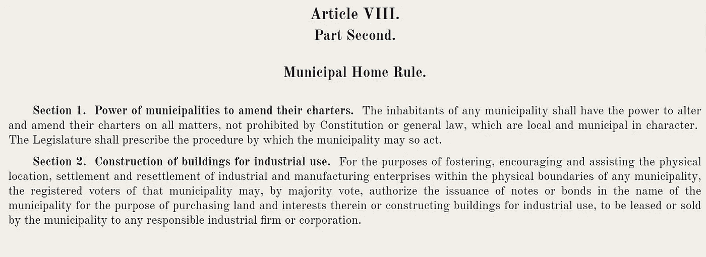

The Home Rule Amendment was added to [the Maine Constitution](https://www.maine.gov/legis/const/#a8) in 1969

在《自治法修正案》第 2 节成为《自治法修正案》的一部分之前，它被放在第九条第 8 节中。**平等税收，**J 元帅丁克解释了原因:

> 如果使用一般义务债券，使某一特定行业以援助的形式收回税收，这可能相当于不平等税率，从而减损第 8 节。*J .丁克元帅-缅因州宪法:参考手册*

在这个故事的后面，随着企业福利越来越大，最高法院将推翻这一观点，宣布以援助的形式返还税收并不违反平等税收，因为税收激励被归类为支出而不是税收。

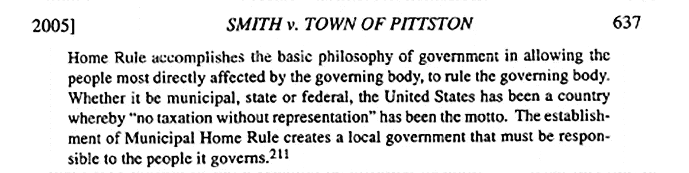

[Smith v. Town of Pittston: Municipal Home Rule on: Municipal Home Rule’s Narrow Escape ow Escape from the Morass of Implicit Preemption Shane Wright](https://digitalcommons.mainelaw.maine.edu/cgi/viewcontent.cgi?article=1362&context=mlr) University of Maine School of Law

即使在像缅因州这样的中央管理州，描述地方自治功能的词语也是正确的。尽管联邦政府想要控制一切，但事实并非如此。联邦政府不知道一旦到了地方管理层面，它的项目会发生什么样的变化。中央管理的公私合营州作为一个公司为自己的利益服务，为所欲为，既不尊重联邦拨款条款的意图，也不对缅因州人民的共同利益负责。缅因资本公司的故事就证明了这一点。

## 一种新形式的权利

州长的特别工作组报告建议立法机关批准两个互补的公司，缅因资本公司和缅因发展公司。缅因资本公司是缅因州立法机构特许的第一家公司。立法调查结果和意图声明合理地解释了缅因州小型企业在寻找资本方面的困难，这使得该州与私人利益合作以鼓励对缅因州企业的投资是合适的:

> 第 108 章
> 
> 缅因资本公司
> 
> 950.立法结论和意图的陈述
> 
> 立法机关发现，该州有益的经济发展的一个限制因素是缅因州商业和企业家长期需求的资金有限。特别是，缺乏股权资本来资助新的商业企业和现有企业的扩张或资本重组是至关重要的。这种权益资本的缺乏可能会阻碍有价值的企业的建立；它还可能迫使企业在权益资本更合适的地方使用债务资本。这就产生了新的或扩张中的企业可能无法成功满足的偿债需求，导致企业因缺乏适当的资本而失败。
> 
> 这种对缅因州可行企业发展和扩张的阻碍对缅因州全体人民产生了不利影响，并且是导致失业、就业不足、人均收入低和资源利用不足等现状的一个因素。通过限制经济发展，它给州政府带来了沉重的压力，要他们为那些无法养活自己的公民提供服务**。**
> 
> 为了帮助纠正这种情况，利用私人投资者的利润动机来实现该州的额外经济发展是适当的。这可以通过建立一个投资公司来为缅因州的企业提供股权资本，并为公司的投资者建立有限的税收抵免来实现，以鼓励私人资本的形成和使用，用于维持和加强该州经济的重要公共目的。

理性使用了一个很少有人会反对的传统真理，即没有资本，很难发展一个企业，但解决方案否定了缅因州宪法的法治，根据该宪法，挪用公共资源为私人利润动机服务是不合法的，只有在市政一级的经济发展需要公众公投批准才能例外。地方自治将受益于私营工业发展的社区与成本负担的责任和批准它的权力联系起来。

> 修正案(地方自治法，第 2 条)明确规定，一般义务现在可用于帮助私营企业达到某些目的。“本条仅适用于市政当局的一般义务，不适用于不产生市政债务或责任的融资形式”

Longley 州长的特别工作组特许缅因资本公司的目标可以说违反了缅因宪法第四条第三部分第 13 节第 16 节第 14 节第 T3 节，因为特许私人投资公司的目的可以根据该州的一般法律实现，但一般法律不允许私人投资公司使用特殊税收抵免来谈判股票销售。然而，在上述调查结果陈述中，虽然利润动机的使用被宣布为适当的解决方案，但它没有被归类为公司的目标，因此逻辑不适用于宪法例外。所述的目的是“维护和加强国家的经济”，这可以通过许多其他方法来实现。

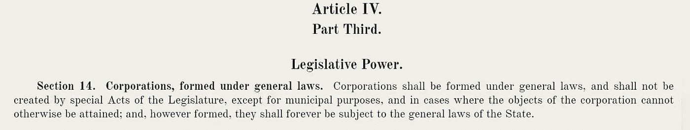

[Maine Constitution, Article IV, Part Third, sections 14](http://www.maine.gov/legis/const/#a4)

[美国 1968 年政府间合作法案，公法 90–577](https://www.govinfo.gov/content/pkg/STATUTE-82/pdf/STATUTE-82-Pg1098.pdf#page=1)鼓励各州修改其宪法、法规和市政条例，以符合联邦化议程。这说起来容易做起来难，但是由于违宪的法律直到在法庭上被成功质疑之前仍然是法律的规则，一个更简单的方法是简单地忽略和/或用成文法覆盖宪法。

## 一个不用多说的退税优惠。

1977 年，对缅因资本公司投资的税收抵免被编为 **5202。紧随其后的是第 5202-A 号法令，该法令免除了小企业投资公司的税收。**

> **1977 年**
> 
> **标题 36:税收**
> 
> **第八部分:所得税**
> 
> 第 817 章:对公司征税
> 
> [5202T5**。**对缅因资本公司的投资信贷](http://legislature.maine.gov/legis/statutes/36/title36sec5202.html)
> 
> (已废除)1977 年章节历史，c. 531，4(新)。1981 年，c. 364，67 (RP)。
> 
> [**5202 A**](http://legislature.maine.gov/legis/statutes/36/title36sec5202-A.html)**。小企业投资公司免税**
> 
> 根据《1958 年美国小企业投资法》(经修订)获得许可、商业地址位于缅因州且主要在缅因州开展业务的公司小企业投资公司应根据本部分规定免于纳税。[1977 年，c. 640，2(新的*)。】*
> 
> *该部分未被废除，目前存在于缅因州法规中(作者注)*

[](http://legislature.maine.gov/legis/statutes/36/title36sec5202.html)**5202 并没有说税收抵免是可退还的，这意味着如果没有拖欠税款，持有人就应该从纳税人那里获得投资退款，但由于 [**5202-A**](http://legislature.maine.gov/legis/statutes/36/title36sec5202-A.html) 对投资缅因州小企业的投资公司是 100%免税的，[](http://legislature.maine.gov/legis/statutes/36/title36sec5202.html)**5202 没有什么意义，除非它是可退还的税收抵免。****

****MCC 税收抵免被置于缅因资本公司章程之外。当 MCC 被废除时，5202 和 5202MCC 税收抵免也被废除，但是 5202-A 中的免税至今仍然存在于缅因州的法规中。****

****今天搜索缅因资本公司，显示第 10 篇第 108 章:缅因资本公司。点击此链接，似乎整个法案已经被废除。该法是报告中提到的“授权立法”。****

****但是，实际的税收抵免位于两个不同的纳税地点。信贷列在税收项下的事实是一个可行的法律论据，即税收信贷是税收的一个功能，受缅因州宪法第 8 节平等税收的管辖，然而，正如本故事后面所讨论的，缅因州最高法院已经裁定税收信贷是支出而不是税收，因此平等税收不适用于税收信贷。****

****奇怪的是，今天当谷歌搜索缅因资本公司时，链接指向 [5167。标题 36:税收第 8 部分:所得税第 811 章:居民地产和信托](http://legislature.maine.gov/statutes/36/title36sec5167.html)应税收入的计算下的缅因资本公司投资抵免显示在列表顶部。如果你点击那个链接，看起来这个信用被取消了，这就是全部，但是这是骗人的。****

****第 36 章第 8 部分还有一个部分没有在谷歌搜索中显示。在标题 36:第 8 部分:第 817 章:对公司征税中可以找到 [5202-A](http://legislature.maine.gov/legis/statutes/36/title36sec5202-A.html) ，它使得小商业投资公司免税。它被归入税收部分。****

****免税加上可退还的税收抵免意味着纳税人将欠持有者一笔钱。有人可能会认为这违反了 [**缅因州宪法第九条总则第九节。征税权**](https://www.maine.gov/legis/const/#a9) **。立法机关不得以任何方式中止或放弃征税权。******

****缅因州资本公司的税收抵免是在可退税抵免首次使用时建立的。我推测，这就是它不被称为可退税信贷的原因，因为该类别的语言尚未建立，但通过将信贷和免税联系起来，它显然是可退税信贷，而且很明显，可退税信贷不是税收，而是补贴，这与后来缅因州最高法院将返还的税收收入归类为支出的裁决一致。它最初被归类在税收项下的事实证明，以援助的形式将税收返还给某一特定行业的做法相当于不平等税率和对第 8 节的减损。将提前退税信贷置于法定税收部分支持补贴是税收。****

## ****审查的结论是，千年挑战公司没有达到其授权立法的目的，但没有考虑授权宪法****

****世纪挑战公司的章程要求在 1984 年对缅因资本公司进行审查，以确定该公司是否符合其授权立法的目的。无论是 1976 年州长工作小组的原始报告，还是 1984 年税收联合常务委员会提交给缅因州第 111 届立法机关 的研究报告[，都没有考虑缅因资本公司和](http://lldc.mainelegislature.org/Open/Rpts/kf1080_z99m2_1984.pdf)[缅因州宪法](http://www.maine.gov/legis/const/#a4)(缅因州成文法的授权机构)之间的一致性。****

****1984 年的立法报告评估了该法律的目的是如何在实践中实现的，该法律授权缅因资本公司为缅因小企业的利益服务。****

****联合常务委员会的多数派和少数派意见一致认为，授权法案的目的没有达到，并表示缅因资本公司的目的与全国大多数风险资本公司的目的没有什么不同。****

****因此，众所周知，缅因州资本公司的目标不符合缅因州宪法第四部分第三部分第 14 节*的例外规定，即公司的目标只能通过特别立法法案*才能实现。然而，由于缅因州立法机关没有考虑“千年挑战公司”是否符合缅因州宪法，这并没有纳入报告的目标。****

> ****虽然缅因资本公司的主要目标与授权立法中的目标不同，但它的主要目标与全国大多数风险投资公司的目标并无不同。根据风险经济学，“风险资本投资的首要动机是为投资者获得非常大的资本收益。”通过依靠一个对股东负有义务的严格的私人风险资本投资公司，并且没有州强加的绩效标准作为促进该州经济发展的手段，缅因州已经接受了这样的前提，即风险资本在缅因州经济中的注入本身是一种公共利益，并且促进了经济发展。在这种情况下，更相关的问题可能是缅因州一家私人风险投资公司为缅因州经济提供所需资本的有效性程度。[缅因州第 111 届立法机关税收联合常务委员会的研究报告](http://lldc.mainelegislature.org/Open/Rpts/kf1080_z99m2_1984.pdf)****

****该报告接着得出结论，该公司拥有巨大的潜力，应该有机会通过取消资本化限制和地理区域仅限于缅因州的要求来实现这一潜力。该报告没有说明这种潜力是什么，也没有说明受益者是谁。为了避免地理扩张导致投资集中在州外的危险，建议将投资增长的一定比例保留给缅因州。****

****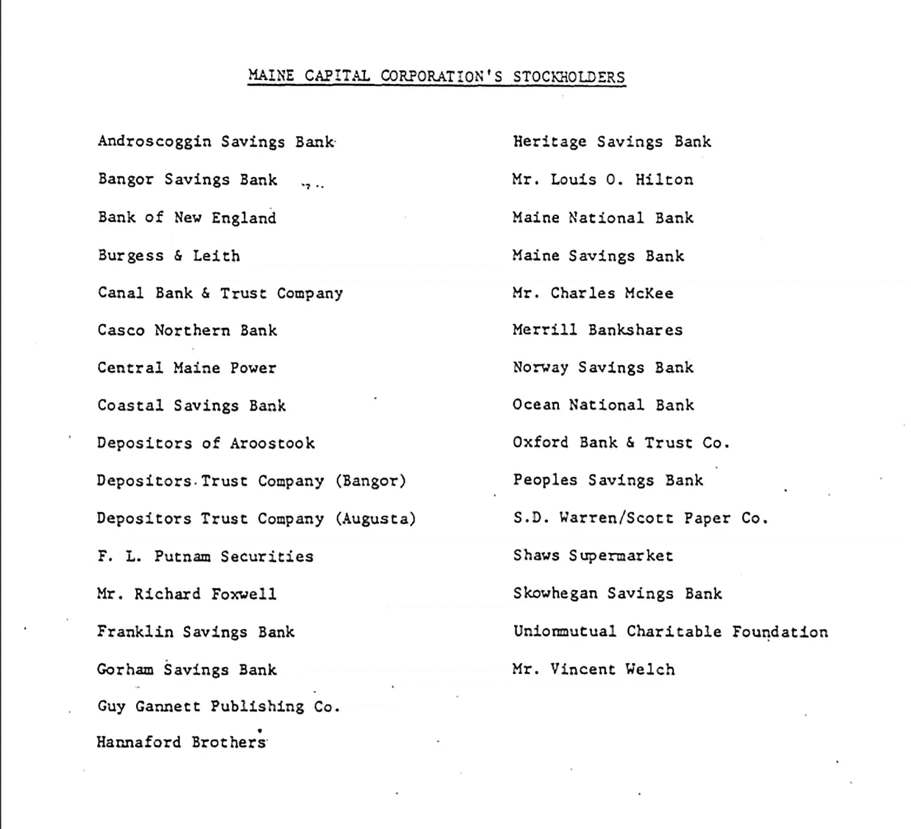****

****The Tower of Power: Original stockholders, 6 individuals, 6 corporations, and 19 banks****

****联合常务委员会建议恢复 1981 年对法规的修改，该修改将税收抵免扩展到缅因资本公司的任何投资者，将税收抵免限制在原始股东，包括 6 个人、6 家公司和 19 家银行。****

> ****创建 MCC 的原始法律将所得税抵免限制在“缅因州资本公司普通股的认购者”司法部长办公室将“普通股认购者”解释为缅因资本公司的初始投资者。根据这一观点，“……从认购人处购买股票的受让人不是认购人，因此，信贷不能延伸到受让人。[向缅因州第 111 届议会提交的税收联合常务委员会研究报告](http://lldc.mainelegislature.org/Open/Rpts/kf1080_z99m2_1984.pdf)****

****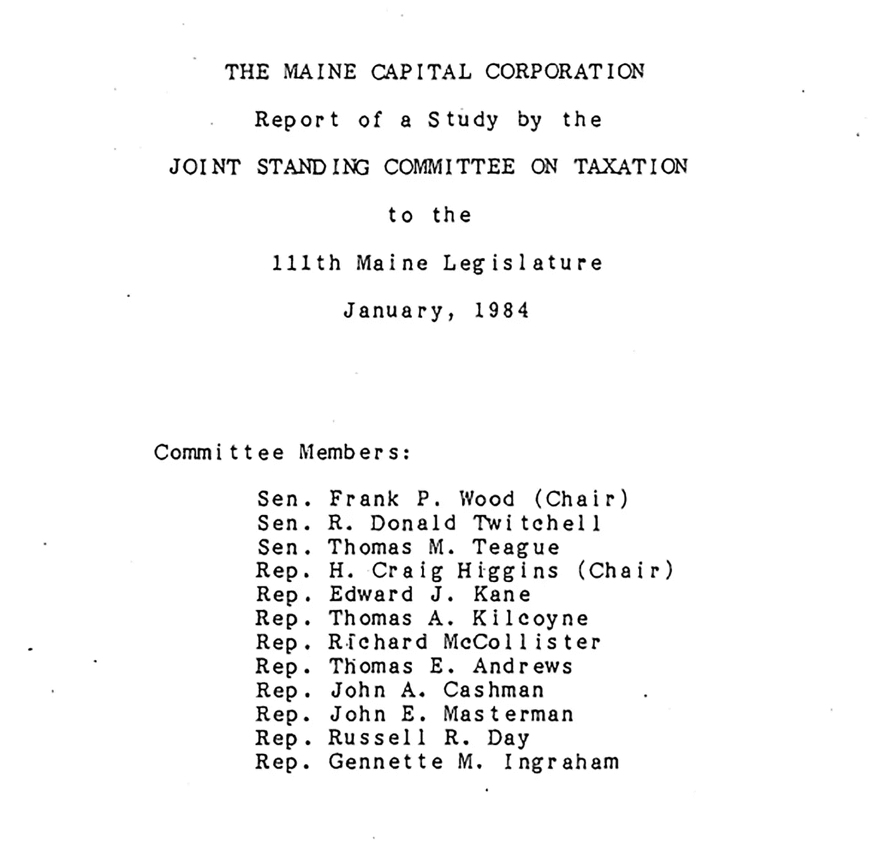****

****Servants of the Tower****

****对于缅因州总检察长办公室的解释，没有提供任何解释。在这位作者的外行看来，需要在宪法中增加一些词语来支持司法部长对“普通股认购者”作为意向中的“初始投资者”的解释。如果法定章程规定“认购者”是指最初成立公司的团体，那么应该用简单的英语来表述。“共同”这个词传达的是“大家共同的”。缅因资本公司第 108 章中没有提供定义来支持“普通股认购者”指的是“初始投资者”等优先股东群体的解释。****

> ****什么是普通股股东？****
> 
> ****普通股股东是指持有一家公司[普通股](https://www.investopedia.com/terms/c/commonstock.asp)的个人、企业或机构，持有人拥有该公司的股份。这也将赋予持有者在公司问题上投票的[权利](https://www.investopedia.com/terms/v/votingright.asp)，比如董事会选举和公司政策，以及任何普通[股息](https://www.investopedia.com/terms/d/dividend.asp)支付的权利。[投资媒体定义](https://www.investopedia.com/terms/c/common_shareholder.asp#:~:text=A%20common%20shareholder%20is%20someone,after%20debtholders%20and%20preferred%20shareholders.)****

****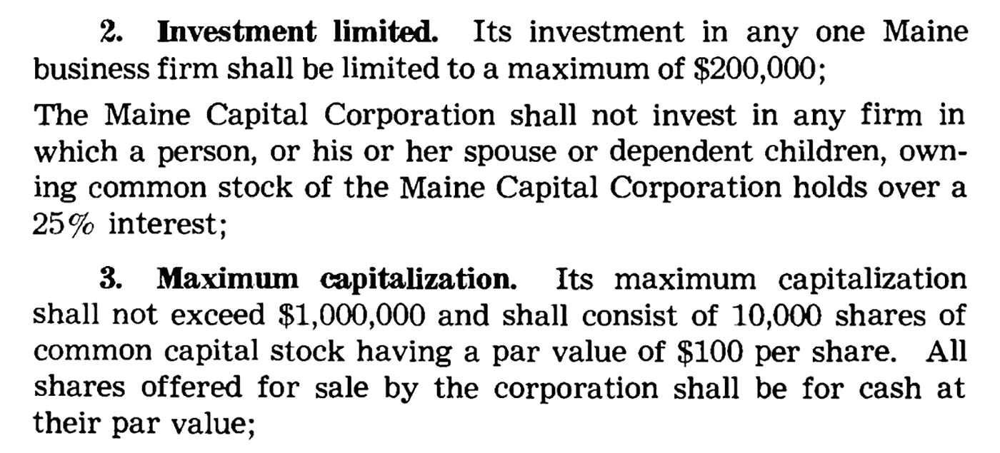****

****Chapter 108, The Maine Capital Corporation, Section 952****

****司法部长解释的一个动机可能是，当税收抵免随着股票的私人出售而转移时，可以认为缅因州立法机关将征税权交给了缅因州资本公司。这样的转移可以说是违反了缅因州宪法第九条总则第九款。征税权。立法机关不得以任何方式中止或放弃征税权。****

> ****立法机关不得以任何方式中止或放弃征税权。征税权。****

****1979 年的授权法将税收抵免扩大到缅因资本公司普通股的认购者。1981 年立法将税收抵免定义为适用于公司的任何股东，与缅因州宪法第九条第 8 款 [**一致**](http://www.maine.gov/legis/const/#a9)****

> ****[缅因州宪法第九条第八款。税收。](https://www.maine.gov/legis/const/#a8)由本州当局评估的不动产和动产的所有税收应根据其公正价值平等分摊和评估。****

****最初的股东反对这一改变，其原因在联合常务委员会的报告中没有解释。MCC 出售税收抵免股票的行为可能是将征税权从立法机关转移到私人投资公司，这可能是为什么 MCC 章程中没有规定股票出售时税收抵免转移的一个因素。****

> ****作为调查的结果，税务问题联合常设委员会发现，授权立法和所得税抵免规定于 1979 年进行了修订。在修订所得税抵免规定以促进税收抵免管理的过程中，立法机构可能无意中扩大了 MCC 税收抵免的资格。最初，只有 MCC 股票的原始认购者有资格获得税收抵免，但目前，该公司的任何投资者都有资格获得抵免。委员会一致建议修改所得税抵免，仅适用于原始订户。[缅因资本公司税务联合常务委员会研究报告](http://lldc.mainelegislature.org/Open/Rpts/kf1080_z99m2_1984.pdf)****

****在上述章节中，有人提出，立法机关为持续扩大税收抵免而颁布的变革“可能是无意的”。偶然做出这种改变的立法机构有多尽责？更有可能是有意为之。****

****通过限制原始股东的税收抵免。它可以被解释为服务于寡头政治的利益，违反了税收平等的原则。不可回避的问题是，在缅因州宪法的参数范围内，公私合营企业是违宪的，作为一个整体设计，而不是分裂成一个个互不相关的部分。当考虑缅因州宪法作为一个相互关联的整体时，缅因州资本公司不可能与缅因州宪法保持一致。当税收被解释为包括税收利益时，为了税收政策的平等，缅因资本公司必须成为授予税收权力的机构。否则，MCC 必须符合州公司的资格，这是违反缅因州宪法第四条第三部分第 14 节的。即使作为一个州公司，立法机关也必须是出售股票的权力机构，并附有税收抵免，以符合缅因州宪法第 9 条的规定。MCC 出售有税收抵免的股票的事实澄清了抵免，后来被缅因州最高法院归类为支出，而不是税收，实际上是税收的一种功能，是州的一种功能。****

## ****缅因州法院驳回了对企业福利的宪法挑战****

****可以说，平等税收的意图要求将利益分配包括在分摊措施中，但最近缅因州法院的判决并不同意，特别是在涉及经济发展和企业福利时。法院支持分配与税收无关的论点，得出的结论是，如果每个人都被平等征税，但一些人以可退还的税收抵免的形式收回他们的税款，这就是平等征税，因为退还的税收抵免被归类为分配或支出，而不是税收。一些纳税人必须承担将税款返还给其他纳税人的成本，这一事实并没有纳入法院的意见。****

```
**MAINE SUPREME JUDICIAL COURT					Reporter of Decisions
Decision:	1998 ME 246
Docket:	Ken-98-342
Argued:	November 3, 1998
Decided:	November 23, 1998PANEL: WATHEN, C.J. and CLIFFORD, RUDMAN, DANA, SAUFLEY, ALEXANDER, and
CALKINS, JJ.ORLANDO E. DELOGU et al.{1}v.STATE OF MAINE et al.{2}II. THE CONSTITUTIONALITY OF THE CREDIT ENHANCEMENT TIF[¶17]  Article IX, section 8 of the Maine Constitution requires that "all taxes upon real and personal estate, assessed by authority of this State, shall be apportioned and assessed equally according to the just value thereof."  
Thus, all property taxes assessed must be assessed on an equal basis. McBreairty v. Commissioner of Admin. & Fin. Serv., 663 A.2d 50, 54 (Me.1995). The trial court held that the City of Bath's reimbursement to BIW of property taxes directly attributable to the project does not violate this requirement.   
	[¶18]  BIW will be assessed and pay property taxes on equal terms with all other taxpayers in the City of Bath.  The reimbursement to BIW is a distribution of tax revenues.  A critical distinction exists between the assessment of taxes and the spending of tax revenues.  As we held in McBreairty:**
```

> *****尽管第九条第 8 款要求对财产税进行平等评估，但它不适用于政府选择的税收支出方式。没有要求立法机关平等分配税收。*****

```
**McBreairty, 663 A.2d at 55 (citation omitted).  Consequently, the
reimbursement of the taxes to BIW by the City of Bath does not violate**
```

****可退税信贷是缅因州企业福利的主要内容，是州经济发展政策的基础。法院接受这种解释，即大公司创造就业机会是为了公共利益，尽管这并不适用于所有规模的企业。这意味着如果没有欠税，纳税人欠持有者一笔支出。缅因州免税可以减少高达 100%的税收。此后，可退还的税收抵免颠倒了税收的角色，使纳税人成为收税人。****

****虽然就法律的意图而言，区分税收和支出是有理由的，但宪法是最终的参考，在解释其意图时必须考虑整个宪法。法律是在一个时期制定的，在另一个时期被解释。尽管最初的创始人可能很聪明，但他们无法预见未来将会发生的每一件事。****

## ****缅因州最高法院进步主义****

****在《t [何缅因州宪法参考手册》中，J 元帅叮当](https://books.google.com/books/about/The_Maine_state_constitution.html?id=FclGAQAAIAAJ)写道:****

> ****19 世纪后期，法院对经济权利表现出更多的关注，根据“收入”条款和征税权条款，推翻了以牺牲财产所有者或纳税人的利益为代价来促进私营工业的立法。这种方法与全国趋势相一致，但缅因州法院在限制州方面走得更远，因为法院在审查各种各样的监管计划和资助项目时越来越遵从立法。在使这一转变合理化的过程中，大法官解释说，他们“把我们的宪法解释为一种有生命力的、灵活的工具，完全能够满足和服务于变化着的世界中的社会的迫切需要”(大法官的意见，231 A. 2D 431，434 {ME 1967})。****

****宪法作为一种活的、灵活的工具的概念是进步主义的哲学。****

****缅因州最高法院权衡的另一个缅因州宪法问题是州信用和债务问题。缅因州
宪法的原话是:****

> ******第十四节。债券发行的权限和程序。**除第 14-A、14-B、14-C 和 14-D 节的规定外，在任何情况下，州政府的信贷都不得直接或间接贷出。立法机关不得代表州政府制造任何债务、负债或债务，这些债务、负债或债务单独或与以前的债务和债务一起累计超过 2，000，000 美元，除非是为了镇压起义……。[缅因州宪法第九条。一般规定](https://www.maine.gov/legis/const/#a9)****

****通过使用“直接或间接”和“不得代表州产生任何债务、责任或债务”等词语，这似乎非常简单明了，但缅因州法院表示，很难解释和深入研究其他州如何解释其宪法债务限制的长篇论文，尽管缅因州不受其他州宪法的约束，而是受我们自己宪法的约束。****

****在[共同原因诉国家**455 a . 2d 1(1983)**](https://law.justia.com/cases/maine/supreme-court/1983/455-a-2d-1-0.html)****

****关于巴斯钢铁厂的债券融资，原告声称:****

> ****(1)以协定设想的方式使用公共资金将构成为私人目的征税，违反缅因州和美国宪法；****
> 
> ****(2)根据《协议》的规定，州政府为 BIW 的利益而承担债务，这是《缅因州宪法》第九条第 14 款所禁止的州政府贷款；和****
> 
> ****(3)根据缅因州宪法第九条第 14 款的要求，出于协议规定目的的债券发行未经缅因州选民授权。****

****法院断言，缅因州宪法中的“直接或间接贷款”一词指的是“保证”，对此我认为，如果宪法指的是保证，那就应该说是保证。****

****然而，1983 年缅因州最高法院使用了自己的主张，即缅因州宪法中的“信贷”指的是“保证”，认为“没有丝毫迹象表明，*通过授权有限保证债务*，旨在取消否则可允许的直接州债务。”难道法院没有宣读第 14A 条的全部内容吗，该条还规定"*立法机关不得代表州产生任何债务、责任或负债，这些债务、责任或负债单独或与以前的债务和负债一起在任何时候总计超过 2，000，000 美元*"****

> ****原告认为，缅因州宪法第九条第 14-A 款是州资助经济发展项目的唯一途径。该节授权立法机关为工业、制造业、渔业、农业和娱乐企业的房地产和个人财产的抵押贷款付款提供保险，并为此目的代表国家发行债券。[40]这个论点没有说服力。无论是第 14-A 条的案文，还是 1957 年最初通过之前的立法辩论，都没有丝毫迹象表明，该条通过授权有限的保证债务，旨在排除其他可允许的直接州债务。见 2 立法建议 1963-64、2312-15、2335-38、2509-14(1957 年)。****

****这是最高法院的决定，人们可能会认为这是终审法院，在这种特殊情况下，但马歇尔·J·廷克尔是缅因州立法机构推荐的宪法作者，他报道了 1983 年裁决忽略的早期先例。另一个法院有希望回到以前的先例作为指导。****

****正如 J .丁克元帅的书中所写的，在 1983 年的裁决中，早期的法院判例对被称为“T0”否则可允许的直接国家债务进行了权衡。廷克尔写道，在《地方自治法修正案》之前，法院裁定一般义务债券不得用于特定行业的利益:****

> ****“如果使用一般义务债券，使某一特定行业以援助形式收回税收，这可能相当于不平等税率，从而减损第 8 节。*J .丁克元帅-缅因州宪法:参考手册】*****

## ****序言的重要性****

****在解释宪法的意图时，序言对于理解其意图至关重要。缅因州宪法的序言表达了对“宇宙最高统治者的仁慈”的依赖:****

> ****缅因州宪法序言。****
> 
> ******政府的目标**。我们缅因州的人民，为了建立正义，确保宁静，提供我们的共同防御，促进我们的共同福利，并确保我们自己和我们的后代自由的祝福，怀着感激的心承认宇宙的主权统治者的善良给我们提供了一个机会，所以有利于设计；恳求上帝的帮助和指引，我们同意按照缅因州的风格和名称，建立一个自由独立的州，并为政府制定以下宪法。****

****缅因州宪法的序言用词与美国宪法相似，但术语“一般福利”被转换为“共同福利”。推测起来，在缅因州宪法制定的时候,“一般福利”一词可能已经有了广泛而有问题的解释。****

****“共同福利”一词更加具体。共同福利由所有人共同分享。因此，缅因州宪法确定政府的目标仅限于促进所有人共同享有的福利。上帝的仁慈被认为是实现政府目标的向导。****

****上帝的善是一个哲学概念，与国家的中央管理截然不同。上帝是一种比凡人更高理解的信仰。国家是由凡人治理的。缅因州宪法的序言将政府的目标定义为促进所有人共同分享的利益，并以超越凡人的理解为信念。如果人们认为这是值得的，根据缅因州宪法的序言，由国家对经济进行中央管理是违反宪法的。****

## ****宪法禁止国营公司****

****缅因州宪法第四条第三部分第 14 节更具体地禁止缅因州立法机关通过特别立法法案特许公司，除非是为了市政目的，或者如果公司的目标不能通过其他方式实现。****

## ****MCC 报告详细说明了其未能实现目标的原因****

****MCC 授权立法将缅因资本公司的目标定义为州内不断增长的小企业和农村经济发展。经济发展可以通过政府以外的手段实现，如在自由企业经济中，通过多样化的资源，因此不符合宪法规定的“公司的目标不能以其他方式实现”的例外，因为报告显示，MCC 利用税收抵免使股东受益，在 1984 年只投资了三个企业，其中一个后来破产了。****

****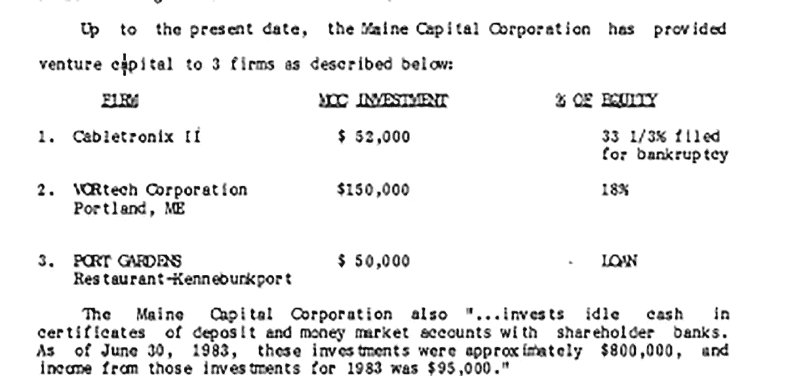****

****THE MAINE CAPITAL CORPORATION Report of a Study by the JOINT STANDING COMMITTEE ON TAXATION to the 111th Maine Legislature January 1984****

## ****缅因资本公司授权立法的经济发展参数包括:****

> ****1.发展或促进新业务的发展****
> 
> ****2.促进可行的业务扩张****
> 
> ****3.鼓励资本再投资****
> 
> ****四..减少失业人数****
> 
> ****5.增加人均收入。****

## ****相反，根据 MCC 手册，缅因资本公司的主要目标是:****

> ****“为企业股东和缅因资本公司创造长期资本增值****

****根据 1984 年的报告，100 万美元的总投资中只有 20 万美元投资于缅因州的小企业，到 1983 年 6 月，MCC 已经在其股东银行的生息账户中投资了 80 万美元。****

> ****缅因资本公司还“将闲置现金投资于股东银行的存款证和货币市场账户。截至 1983 年 6 月 30 日，这些投资约为 80 万美元，1983 年这些投资的收入为 9.5 万美元。”[向缅因州第 111 届议会提交的税务联合常务委员会研究报告](http://lldc.mainelegislature.org/Open/Rpts/kf1080_z99m2_1984.pdf)****

## ****[贝尔登·赫尔丹尼尔斯](https://www.tscfund.org/about/board-staff/belden-hull-daniels/)意见****

****监督委员会聘请贝尔登·赫尔·丹尼尔斯公司撰写一份研究缅因资本公司有效性的报告。Belden Hull Daniels 撰写的题为[缅因小企业发展金融的报告对缅因小企业经济进行了详细而相关的讨论，而监督委员会的报告仅涉及如何吸引投资者进入缅因资本公司，并未就衡量缅因资本公司对缅因经济发展的有效性提出任何建议。](http://lldc.mainelegislature.org/Open/Rpts/hg4057_m2c68_1983.pdf)****

****丹尼尔斯报告的结论是****

> ****“MCC 认为，在缅因州寻找投资机会时，它不能损害其回报预期或任何其他投资标准。这意味着 MCC 只能接受 25-30%的预期回报率。[缅因州小企业发展融资。](http://lldc.mainelegislature.org/Open/Rpts/hg4057_m2c68_1983.pdf)****

****丹尼尔斯报告质疑 MCC 的主要目标是否与授权法中的目标一致，并且不同意联合常务委员会的中心前提，即“对缅因州首府有利的就是对缅因州有利的。”发现 MCC 对股东过于慷慨。****

> ****Belden Hull Daniels 的报告认为，MCC 寻求的最低投资回报率为 25%至 30%。此外，丹尼尔斯报告断言，与股东们实际投资的 50 万美元相比，这一回报率是相当可观的。50%的所得税减免将 1，000，000 美元的投资减少到 500，000 美元，并将有效回报率提高到 50-60%。Belden Hull Daniels 为缅因州小企业发展融资。****

****丹尼尔斯报告强烈要求 MCC 在法律规定的目的方面对国家负责，建议在法律中包括最低标准和目标，如创造新的就业机会的数量，以便投资者有资格获得税收抵免。这些想法没有应用于缅因资本公司，但被纳入了后来的州经济发展福利，其中州用不断增加的公司福利换取 x 数量的“高质量工作”，其中“质量”完全由工资和福利的比率来衡量。****

## ****常设委员会驳回了丹尼尔斯报告的结论****

****常务委员会的报告将缅因经济发展的衡量标准简化为仅仅为缅因资本公司的投资者创造有吸引力的条件。尽管丹尼尔斯报告是一份全面的分析报告，但由于联合常务委员会建议的解决方案仅涉及 MCC 投资者的利益，丹尼尔斯报告几乎被常务委员会忽视。委员会没有给出任何建议来保证缅因资本公司发展了缅因的小企业经济。****

> ****在运营的第一年，MCC 与 Maine Development Foundation 签订了合同，后者同意以每年不超过 65，000 美元的价格向风险投资公司提供设施和人员。利用缅因发展基金会的行政和人力资源，世纪挑战公司向洛克兰的一家名为 Cabletronix 的公司进行了第一笔 52，000 美元的投资。1981 年 6 月，Cabletronix 申请破产。[向缅因州第 111 届议会提交的税务联合常务委员会研究报告](http://lldc.mainelegislature.org/Open/Rpts/kf1080_z99m2_1984.pdf)****

****[缅因发展基金会](http://americanpoliticalphilosophy.blogspot.com/search?q=Maine+Development+Foundation)是在缅因资本公司成立的同时由缅因立法机构特许成立的。缅因发展基金会今天仍然存在。它的董事会成员遍布全州最有影响力的董事会。今天，国家的大部分由董事会管理，对公众不透明。董事会通常会聘用经理或员工，他们在向董事会负责的同时与公众打交道。管理人员和工作人员是与公众的人文界面，倾听公众的关切并与之互动，但不一定反映与公众一步之遥董事会的观点。委员会很可能与州政府协调，要求将拨款分配给地方组织，其中大部分拨款是通过联邦政府下达的，并由联邦政府授权的议程管理。****

****缅因资本公司于 1994 年被撤销，声明其已经实现了最初的公共目标。缅因资本公司的废除是由联合常务委员会协调的，税收抵免已经结束。一旦税收抵免不再存在，据说缅因资本公司就没有进一步的目标要实现。联合常务委员会建议将缅因资本公司转变为根据缅因普通法运作的公司。****

****向缅因州立法图书馆提出的一项请求没有带来缅因州资本公司对小企业投资的进一步报告。我能在国家记录中找到的关于其活动的唯一报告是 1984 年的评论。国务卿网站上列出的几份年度报告显示，MCC 于 1995 年解散。我将继续挖掘相关记录，但是，我认为，如果立法机构将 MCC 作为一项经济发展计划，并向其股东提供税收抵免，那么立法机构应该对该经济发展项目发生的事情承担一定的责任，特别是在该项目首次审查失败后，股东可以继续收集税收抵免达十年之久。废除法案表明它已经达到了目的，如果是这样的话，为什么还需要一个庞大的国家经济发展公司网络呢？****

****我家的企业是那些很难找到投资资本的小企业之一，这也是建立中央集权经济的原因。大约在那个时候，我们的业务正在扩大。我父亲说如果他寻求更多的资金会更容易找到。多年来，我一直在研究缅因州的经济发展系统，它是中央管理经济的产物，我父亲的观点是显而易见的。在每一个转折点上，这个体系都让那些有钱人比其他人更有优势。通过用企业福利换取 x 份薪资和福利高于平均水平的“高质量工作”，该体系实际上是以牺牲整体经济为代价，补贴了上层经济。只看这一个简单的事实，就不难理解为什么随着中央集权经济的发展，财富差距也在扩大。****

****在 1968 年，做这个故事的研究要困难得多，互联网让信息更容易获取。今天有 24 小时新闻和许多新闻资源。这既有积极的一面，也有消极的一面，人们必须意识到这两方面，但好的一面是有可能听到更多的声音。到处都有宣传，但这意味着人们会变得更聪明。在某些阶段，天真会逐渐消失，普通大众会变得更加成熟。与此同时，冠状病毒正在影响我们曾经认为理所当然的一切。一个新世界正在形成。让我们成为更好更明智的人。****

*****原载于 2020 年 7 月 13 日*[*【https://www.datadriveninvestor.com】*](https://www.datadriveninvestor.com/2020/07/13/i-am-a-baby-boomer-and-this-is-the-story-of-how-my-generation-let-the-great-wealth-divide-happen/)*。*****

******访问专家视图—** [**订阅 DDI 英特尔**](https://datadriveninvestor.com/ddi-intel)****

****通过跟踪 [Mackenzie Andersen 的子堆栈](https://mackenzieandersen.substack.com/)支持独立研究****

## ****麦肯齐·安德森是一名独立研究员。****

****如果你想加入 Medium 并使用这个附属链接，你可以支持我的研究并访问 Medium 上成千上万作家的作品。
你也可以发表自己的故事，创建一个媒体出版物。每月只需支付 5 美元。
加入中等会员使用 [***麦肯锡安达信的加盟链接此处***](https://mackenziana.medium.com/membership) *。*****

*****也可以通过订阅我的子栈简讯* [***个人 vs 帝国***](https://mackenzieandersen.substack.com/subscribe?utm_medium=web&utm_source=subscribe-widget-preamble&utm_content=58632124) 来支持我的工作*****