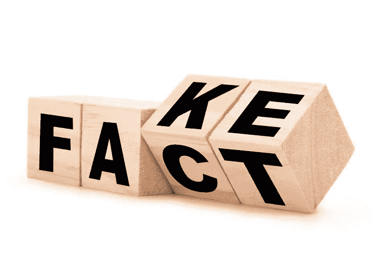
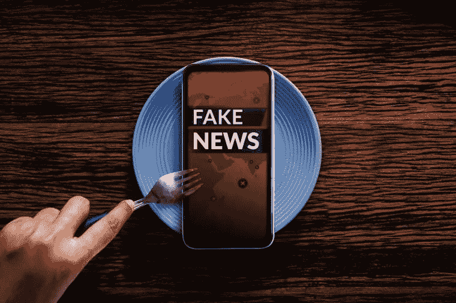

# 我是对的，你是错的。在我们了解更多之前，我们有权犯错

> 原文：<https://medium.datadriveninvestor.com/i-am-right-you-are-wrong-we-have-the-right-to-be-wrong-until-we-know-better-2a28641fc390?source=collection_archive---------17----------------------->

I am right, you are wrong. Photo by@freepik via freepik.com

# 我是对的，你是错的

我是对的，你是错的。我们都有这种倾向，生活在我们自己的回音室中，通过确认偏见在我们自己的正义中得到安慰；我们相信我们是对的，而世界其他地方是错的。我们看到这种情况在我们周围发生，我们对别人这样做，别人也对我们这样做。

> *维基百科将*确认偏见*定义为以确认或支持某人先前信仰或价值观的方式搜索、解释、偏好和回忆信息的倾向。当人们选择支持他们观点的信息，忽略相反的信息，或者当他们将模糊的证据解释为支持他们现有的立场时，他们就会表现出这种偏见。*

人类的行为从何而来？行为来自于我们对一个事件或一个情境的感知。感知从何而来？感知来自接收到的信息，无论是来自个人经历、报纸还是媒体。如果我们的行为受到信息的影响，我们如何确定我们收到的信息是真实的？如今很难知道该相信什么，该相信谁。你在报纸和电视上看到的可能很有欺骗性。同一个事件可以有两种不同的解释，这取决于解释的人是谁。人类的感知是可以控制的，媒体是编造故事以影响公众舆论的专家。

Fact or Fake? Photo from @freepik via freepik.com

> 维基百科将宣传定义为宣传。“在公共关系和政治中，歪曲是一种宣传形式，其目的是故意对某一事件或活动进行有偏见的解释，以影响公众对某个组织或公众人物的看法。虽然传统的公共关系和广告可能会设法呈现事实，但“T7”spin*“通常意味着使用不诚实、欺骗和操纵的策略。”*

通过*旋转*，控制人类感知是可能的，最好的方法是过滤或审查公众收到的信息类型，或者通过使用欺骗策略，如托词、宣传或错误信息，让公众相信一些不真实的东西。

> *"* 媒体是地球上最强大的实体。他们有能力让无辜的人有罪，让有罪的人无罪。他们控制了大众的思想。如果你不小心的话，报纸会让你憎恨受压迫的人，而热爱进行压迫的人”。马尔科姆·Ⅹ

每天，我们都发现自己处于“*我是对的，你是错的”*这种情况。人们有权以自己的方式思考，不管是*对的*还是*错的。*这是言论自由的基石。但是谁知道什么是对什么是错呢？事情一直在变化，今天正确的可能明天就错了。而且，有可能同时是 100%正确和 100%错误。你会问，怎么会呢？！你可以对一个事件(好的或坏的)100%正确，但对你选择分享消息的时间或方式 100%错误。

# 我是对的，你是错的。所说的话非常重要

有些人固执己见，没有什么能让他们改变对这个或那个的看法；而且这也行，这叫思想自由，表达自由。你可以自由地想你想的方式，说你想说的话；但是当你这样做的时候，要意识到语言有能量和力量，它们有能力帮助、治愈、教育，但是它们也能阻碍、欺骗、伤害和毁灭。

记住这一点，让我们试着不要在这种情况下猛烈抨击某人，对一种短暂的感觉或想法发出声音，试图随机而残酷地将我们的思想内容倾倒给某人。当我们需要和另一个人坦率地谈论某事时，让我们试着用一种表达同情、尊重和温柔的方式说话。

*“*The media is the most powerful entity on earth. They have the power to make the innocent guilty and to make the guilty innocent. They control the minds of the masses” Photo by @freepik via freepik.com

加里·查普曼在他的书《爱是一种生活方式》中用了一个完美的比喻，把词语比喻成子弹或种子。如果我们带着优越感和谴责感像子弹一样使用我们的话语，那么要走出根深蒂固的立场将是非常困难的。但是如果我们用我们的语言作为种子，我们带着同情和善意说话，对话将从根深蒂固走向建设性。

请注意这样一个事实，人们经常说着充满善意、理解和同情的话，但他们的行为却与这些话完全不同步。请记住，行动胜于言语，所以在这种特殊的情况下，不要太关注言语，因为它们没有任何实质内容，只是绒毛，但要非常关注这些言语之后的行动。我还想鼓励你对所说的话缺乏一致性给予极大的关注，那些正在做他们不久前谴责的事情而没有羞耻或任何自我意识的人不应该被信任。

# 我是对的，你是错的。你有军人心态还是童子军心态？

当你有士兵心态时，你会表现得好像某些信息或想法是你的盟友，在这种情况下，你希望他们赢。你认为相反的想法或概念是你的敌人，你希望那些被击落。这种军人心态在工作场所、体育和政治中非常普遍。当有人不公平地评判我们的团队时，我们会感到不安，但当同样的事情发生在另一方时，我们会觉得正义得到了伸张。士兵心态根植于情感、侵略和部落主义，并在所有类型的互动中创造了一种加速升级的模式。

*童子军心态*是关于理解，而不是捍卫我们的信仰。侦察兵出去，绘制地形图，确定真正的挑战。他想知道那里到底有什么。童子军的心态根植于好奇心。它是关于思想开放，学习新事物，当新的事实与他们的信念相矛盾时被激起兴趣，并且不会因为改变主意而感到软弱。当你有一种童子军的心态时，你会变得强大而踏实，你的自我价值与你的对错无关。

# 言论自由。我们必须收回我们的话语权和知情权

思想自由是一项基本权利，它被解释为不被强迫相信某事的权利，这包括犯错的权利。现在很难知道什么是真的，什么是假的，这就是为什么思想和言论自由如此重要，因为它保护每个人对真理的理解，更重要的是它保护对真理的探索。

曾几何时，每个人都认为地球是平的，是宇宙的中心；否则的话，你将自动被贴上异教徒的标签，伴随着所有可怕的后果。在早期，那些冒险提出不同于“*公认理论”*的理论的科学家面临着当局的起诉。1633 年，物理学家和天文学家伽利略被教皇乌尔班七世任命的首席检察官起诉，因为他相信地球是围绕太阳转的。这种信仰被天主教会视为异端，他们拒绝接受(尽管有相反的科学证据)地球不是宇宙的中心。

Freedom to speak and freedom to know. Photo by @freepik via freepik.com

如今，人类的互动比以往任何时候都更多地通过无数小时的在线交流来进行，我们不得不在信息的海啸中导航，有时甚至是错误的信息。话语权和知情权岌岌可危，这种令人担忧的现象正在世界各地发生。[文章 19.org 组织](https://www.article19.org/)整理了[2019/20 年全球言论报告](https://www.article19.org/gxr2020/)，他们得出结论，全球言论自由正在下降:

以下是该报告调查结果的摘要:

全球言论自由正在下降。2019 年全球表达指标(GxR)降至 50(1 至 100 分制)；它表明超过 50%的人类生活在专制政权下。

对这些领导人来说，压制言论自由既是手段，也是目的，他们压制不同意见，压制对其政权的审查，猖獗的腐败和任人唯亲是家常便饭。

世界人口的一半现在生活在 Gx R 分数低于 20/100 的国家，在这些国家，发言权和知情权经常受到侵犯。最糟糕的罪犯是**中国、印度、俄国、土耳其、伊朗和孟加拉国；当像美国这样的国家正在危险地动摇并为未经审查的交流、言论自由、发言权和知情权创造一个越来越敌对的环境时。**

少数公司获得了市场控制权，它们掌握着巨大的权力，创造了一种不尊重人权的企业垄断环境，并充当了全世界言论的把关人。

新冠肺炎病毒出现在一个已经充满审查和诋毁持不同政见者或政治反对派的环境中，许多政府以健康危机为借口，进一步控制网上、媒体和街头的言论。

言论自由的权力越来越集中在少数社交媒体平台手中，当局的重点仍然是监管用户，而不是确保平台和公司尊重人权。

尽管互联网因信息民主化而受到称赞，但数据却讲述了一个不同的故事。网上观点的数量增加了，但是有害的两极分化和错误信息也激增了。

世界各地的人们能够从多元化和多样化的媒体来源获得准确的信息并据此采取行动是至关重要的。

知情权是抵御腐败的屏障。信息的自由流动是必不可少的，它使参与成为可能，权利的行使促进可持续发展，改善经济表现，并使当局负起责任。

我们必须在为时已晚之前收回我们的发言权和知情权。言论自由涉及每个人通过任何方式表达和传播观点、想法和信息的权利，以及与当权者持不同意见的权利。知情权涉及掌权者为透明度、善治和可持续发展而要求和获得信息的权利。

我想以一个音符来结束这篇文章，让你和乔斯·史东以及她的歌曲“对错”在一起

乔斯·史东的《被错的权利》

***对错***

我有犯错的权利
我的错误会让我变得强大
我正走向未知的伟大
我感觉到了翅膀虽然我从未飞翔过
我有自己的思想
我是血肉之躯
我不是石头做的
我有犯错的权利
所以别来烦我

我有权犯错
我被压抑太久
我必须挣脱
这样我才能最终呼吸
我有权犯错
我必须唱我自己的歌
我可能唱走调了
但是我确实感觉很好
我有权犯错
所以让我一个人静静

你有权发表你的意见
但这真的是我的决定
我不能回头我在执行任务
如果你在乎难道你敢模糊我的视线
让我做我能做的一切
不要用消极来压制我
不管外面有什么在等着我
我…

来源: [LyricFind](https://www.lyricfind.com/)

Joanne Reed The Author
Author of “This Is Your Quest”. You can’t buy happiness but you can buy books. Your mission, should you wish to accept it is to experience happiness

**访问专家视图—** [**订阅 DDI 英特尔**](https://datadriveninvestor.com/ddi-intel)