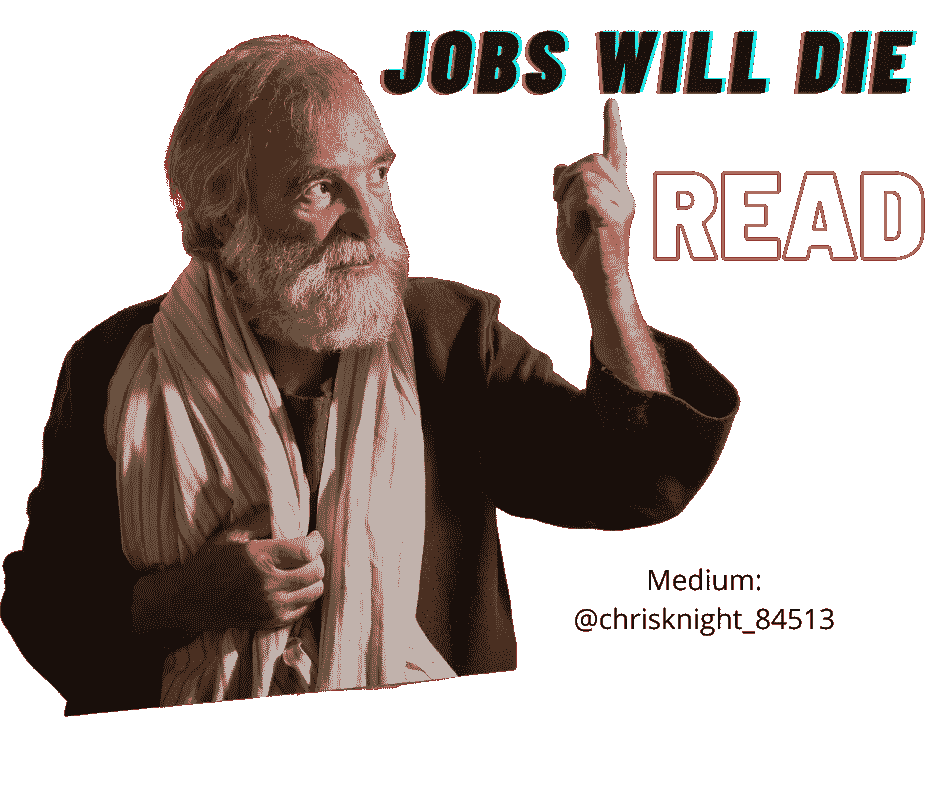

# 我是你的经济末日预言家听着，或者成为那些失业者中的一员

> 原文：<https://medium.datadriveninvestor.com/i-am-your-economic-doomsday-prophet-listen-or-be-amongst-those-unemployed-a97c7740f158?source=collection_archive---------9----------------------->

## 我的话是公司的死亡使者，金钱灵魂的掠夺者，工作的粉碎者。谁会听从召唤？

Source: Self Created Image with Canva

真相的第一部分已经在 90 天内发生。*第二次将在年内到来。*

在我发表的[数据驱动的投资者](https://medium.com/datadriveninvestor?source=post_page-----e99294760f29----------------------)文章“[永久失业加上永久外包对你来说意味着艰难的未来](https://medium.com/datadriveninvestor/permanent-unemployment-combined-with-permanent-outsourcing-equals-a-tough-future-for-you-e99294760f29?source=friends_link&sk=385598b1072e803290d10a248c896012)”中，我做了一个观察。2020 年 5 月，我预言不可避免的法律诉讼浪潮将冲击你的工作保障。

这些诉讼浪潮现在就在你的就业大门前。

今天我附和你们政府税收不可避免的崩溃。政府不顾一切地试图保护你对过时工作仅有的一点点工作保障。在 3 万亿美元的财富贬值后，政府正处于价值危机的边缘。

下一次攻击在这里。法律体系正在强制向那些受新冠肺炎影响的人支付合法款项。具体来说，这些合法报酬是针对你的雇主保留你过时的工作。

 [## 对有商业头脑的投资者有用的行为经济学概念|数据驱动的投资者

### 在美国企业界，高斯统计，对我们周围世界的确定性解释，以及理性…

www.datadriveninvestor.com](https://www.datadriveninvestor.com/2020/07/09/helpful-behavioral-economics-concepts-for-the-business-minded/) 

**诉讼预言成真**

全国各地的雇主都站在困境家庭的道路上。被新冠肺炎疫情弄得痛苦不堪的家庭向律师投诉。这些工薪家庭声称他们的亲人在工作中感染了致命的新冠肺炎病毒。索赔造成的损失开始攀升。保护公司员工的逻辑正在动摇。

沃尔玛公司、Safeway 公司、泰森食品公司和一些医疗机构最近被起诉。法律诉讼是针对重大过失或非正常死亡。这些诉讼不到 5 个月就提交了。

2020 年 5 月 20 日在[数据驱动型投资者](https://medium.com/datadriveninvestor?source=post_page-----e99294760f29----------------------)中写道，我的话在该书出版后不到 90 天就应验了。

这些公司的雇员声称雇主未能[保护工人免受电晕病毒](https://apple.news/ADjJaNZ_TQJW-x_-G2cQ7Hg)。由于这些指控，律师们声称公司应该赔偿受影响的家庭成员。

幸免于病毒的工人正在分别起诉。幸存的工人索赔是医疗费、未来收入和其他损失。我们不要从诉讼费开始。律师费很高。

**一名雇员 10 美元的报酬现在是潜在的雇主威胁**。威胁包括:潜在的[40 万美元医疗账单](https://www.nytimes.com/2020/06/14/nyregion/coronavirus-billing-nyc.html)、至少 6 个月的未来收入损失、精神痛苦和法定损害赔偿。

祝贺员工辩护律师，你们实现了我的话。**每个工人阶级现在都是潜在的百万美元负债**。

**常识下一步**

如果您知道站在您的房子周围，每天会有数百名感染者经过，您会怎么做？

你可能会停止住在那里。

如果您意识到如果您的任何一个朋友生病了，他们可能会勒索您超过年薪的钱，您会怎么做？

你可能不会允许他们进你的房子。

**工程量的未来**

就业数量的前景是暗淡的。事实是，面对这些法律诉讼，许多工作将会蒸发。每家公司都必须付款并结算。让我们面对现实吧，辩护将会花费巨大。

每家公司都象征性地问，“我们真的需要这么多人住在我们的房子里吗？”答案将是响亮的“不”

考虑到自动化和技术，这一点尤其明显。面对现实吧。收银员是*不需要的*。门卫是*不需要的*。银行出纳员是不需要的。前台人员不需要*。电影票销售人员*不需要*。服务员和服务生是不需要的。*

*就业岗位将经历严重萎缩，直至被淘汰。*

***通过数字***

*美国经济在今年第二季度萎缩了 32.9%。这个疫情比 2009 年的大衰退还要糟糕四倍。*

*T2 经济分析局发布的数据巩固了连续两个季度的负面表现。这意味着我们正处于“衰退”中，尽管所有的股票炒作。*

*尽管总共 3200 万个工作岗位中有 83%被认为是暂时的，但根据高盛(Goldman Sachs 月 31 日进行的一项分析，总共 544 万个工作岗位仍然是永久性的。*

*不到 6 个月就失去了很多工作。*

***未来口号***

*我们有一种新的安全方法来保护我们的工人免于生病。*

*认识一下新的智能人工智能女主人“吉尔”,在你入座前为你点餐。*

*认识一下新的智能人工智能出纳员“约翰”,处理您所有的日常银行业务需求。*

*认识“比尔”,新的智能人工智能礼宾处理您所有的登记需求。*

***在关闭***

*你注意到一个趋势了吗？*

***通过消除员工与客户的互动来保护人性，同时增加利润！增加的利润推动股票市场上涨，支持关于股票市场飙升的政治声明。***

> *通过允许公司削减成本以增加利润数字而使股市上涨成为可能，这不是增长…这是从声称是鲸脂的人体躯干上切下的假猪油。*

*那没有任何价值。那块肥肉很臭。*

*我们已经习惯了缺乏人际交往。德克萨斯州的收费公路刚刚把所有的付费站都改成了网上支付。我今天从休斯顿开车去达拉斯时看到了它。不需要 EZ 标签。*

*WebMD 附和了所有专家的观点。[疫苗研发出来至少需要 12-18 个月(乐观地说)](https://www.webmd.com/lung/covid-19-vaccine)。*

*根据欧洲社会心理学杂志发表的一项研究，一个习惯需要 66 天才能形成。*

*我们不与人交往的习惯会持续 66 天以上。发现虚拟技能、技术驱动能力或编码。明天的工作就在你的电脑前。不要把昨天当成明天。明天已经来了。不要去外面找工作。就在你的卧室里。*

*祝你知识成功！*

*关于 Christopher:Christopher Knight Lopez 是一名职业骗子，在他的职业生涯中，他与职业企业家进行了广泛的合作。在他 14 年的职业生涯中，Christopher 已经开了超过 7 家公司。克里斯托弗的目的是利用各种市场驱动的机会。Christopher 是注册项目经理(MPM)和认证财务分析师(AFA)。Christopher 之前通过了 65 系列证券执照考试。克里斯托弗也有他的总路线——人寿、意外、健康和健康维护组织。Christopher 已经管理了总计 2 . 86 亿美元的报告管理资产和建议资产。Christopher 在 29 个国家有工作经验，为各种业务筹集了超过 5000 万美元，在他的个人职业生涯中总收入超过 1300 万美元。Christopher 曾在高科技行业工作:生物技术、金融、证券、制造、房地产和住房抵押贷款。克里斯托弗是一名美国空军老兵。克里斯托弗热爱家庭、竞技体育、钓鱼、武术，并倡导企业家精神。克里斯托弗为崭露头角的企业家提供自助课程。克里斯托弗对导师的热情来自于企业家和骗子需要指导的信念。这个世界充满了关于企业家身份的相互矛盾的信息。在[www.christopherklopez.com 看更多。](http://www.christopherklopez.com.)*

*免责声明:这些信息并不意味着是一种投资建议或财务建议。不要把这种情况应用到你自己的个人环境中。各种风险包括:商业风险、投资风险、政治风险和其他风险。此信息仅用于信息和教育目的。请不要向作者寻求任何投资策略或哲学。针对自己的情况，请咨询自己的理财顾问或法律顾问。不是任何形式的推荐或认可。*

*获得专家视图— [订阅 DDI 英特尔](https://datadriveninvestor.com/ddi-intel)*