# 我分析了 25 份时事通讯。这是我学到的…

> 原文：<https://medium.datadriveninvestor.com/i-analyzed-25-newsletters-this-is-what-i-learned-ffbe35c0e1ca?source=collection_archive---------1----------------------->

Photo by [Lukas](https://www.pexels.com/@goumbik?utm_content=attributionCopyText&utm_medium=referral&utm_source=pexels) from [Pexels](https://www.pexels.com/photo/person-writing-on-notebook-669615/?utm_content=attributionCopyText&utm_medium=referral&utm_source=pexels)

作为一名设计师/营销人员，你应该知道你的电子邮件活动是否有效。了解这一点的最佳方法是从实际的客户互动中收集数据。在分析所有数据之前，明确你的目标受众、公司目标和营销目标是很重要的。

通过跟踪邮件打开率、点击打开率(CTOR)、点击率(CTR)、用户交互和电子邮件客户端，您可以更好地了解自己做得对和错的地方。如果效果不好，你可以在发送下一封邮件之前改进(内容和设计)邮件。这很有趣，因为你用真实的数据来构建一个完整的故事，描述你的活动在每个阶段的表现。

我设计了许多邮件/简讯，主要目标是提高点击率(预期点击率为 2.5%-4%)。).这是最重要的潜在客户生成指标，可以提高邮件的绩效。虽然我们不能忽视其他营销指标。因此，我总是分析打开率，点击打开率(CTOR)，以及用户互动。这有助于我对活动有一个总体的了解。

以下是我从分析中得到的收获…

# **1。个性化可以提高打开率和点击率**

许多研究人员发现，个性化主题和个性化内容可以显著提高打开率和点击率。

## **用收件人的名字个性化主题行**

这些来自“真正好的邮件”的主题引起了我的注意，因为它们包含了我的名字。

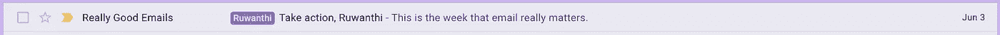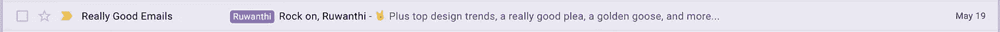

Personalize subject line

最近我想测试一下个性化主题，我分析了 4 份时事通讯。首先，我们的团队发出了 2 封电子邮件，第一封是产品名称(通常的一封),另一封是收件人的姓名。

下面是接下来发生的事情…

第一封带有产品名称的邮件(通常的那封)获得了 19.60%的打开率。而写有收件人名字的那条，获得了 20.09%的打开率。

一个月后，该团队发出了一封新的电子邮件，主题为“介绍…(产品特性)”，邮件打开率为 13.63%。最后，我们发送了主题为“5 个原因…(与产品特性相关)”的第 4 封电子邮件，邮件打开率为 16.13%。

**哪个效果最好？**

确切地说，这是一个带有收件人姓名(个性化主题行)的邮件

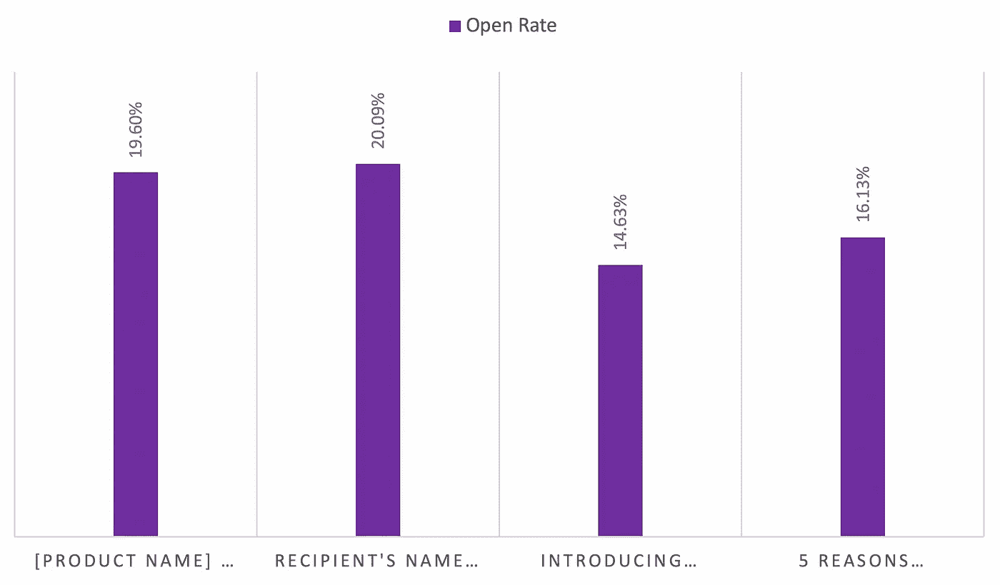

Open rate by email subject line

> 个性化主题行不足以让你的时事通讯发挥最大功效。你也应该个性化时事通讯的内容。

# 2.主题行中的字符数越少，打开率越高

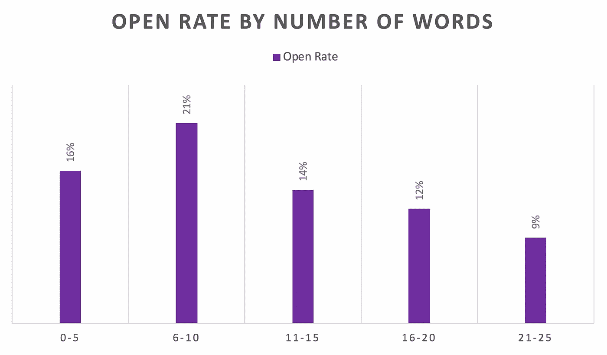

Email open rate by the number of words in the subject line

> 一份报告称，包含 6 到 10 个单词的电子邮件主题可以提高 21%的打开率。

虽然这不是影响邮件打开率的唯一原因。第一印象总是最重要的。因此，用户 1st 可以识别发件人姓名、主题行和前置标题。这些给用户一种邮件里面是什么的感觉。

> 根据[研究](https://www.emailmonday.com/mobile-email-usage-statistics/)，在移动设备上阅读的电子邮件比在桌面电子邮件客户端阅读的多。(47%的人使用移动设备查看电子邮件)。

如果你设置了一个很长的主题行，它可能会在移动设备上被切断。如果越来越多的人在移动设备上阅读你的简讯，一个很长的主题可能会对你的打开率产生负面影响。

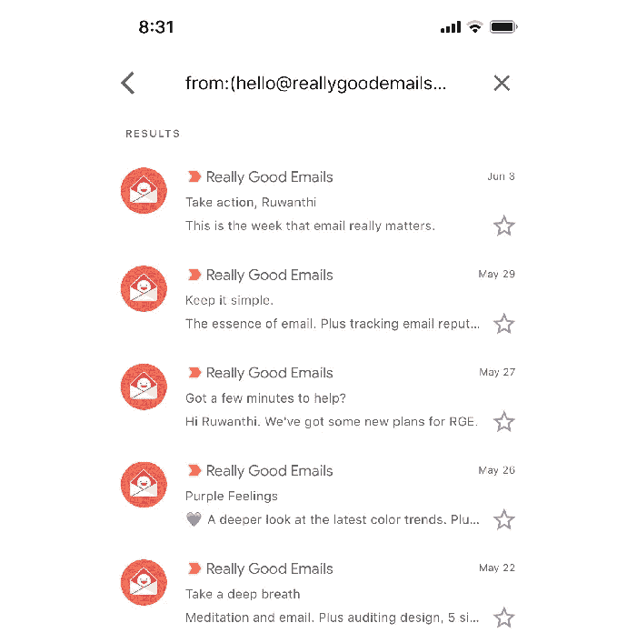

A good example of less number of characters in the subject lines

接下来，用户可以看到**预报头**。大多数营销人员不会考虑这一点。但是前置标题比个性化主题更能影响邮件的打开率。因此，我们最好也把注意力放在前置标题上。此外，大多数营销人员害怕在主题行或标题前使用**表情符号**。

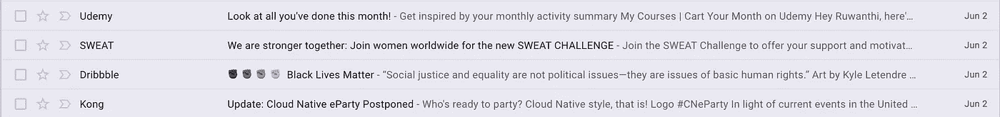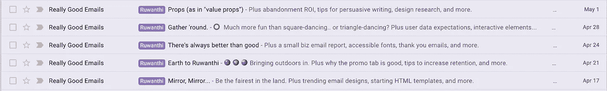

Example of emojis in the subject line and pre-header

你对以上例子中的表情符号有什么感觉？

没错，表情符号吸引了更多的注意力…

一天之内我们收到了这么多邮件。如果我们使用表情符号，它可以帮助我们比其他邮件发送者更能抓住用户的注意力。此外，一些研究发现，主题行或标题前的表情符号对电子邮件的打开率有很好的影响。

> 如果你觉得表情符号不适合你的品牌，那就不要用。然而，这是做 A/B 测试的好策略。

# 3.电子邮件客户端支持黑暗模式

2019 年，苹果将黑暗模式引入桌面电子邮件客户端和 iOS 13 版本。现在很多邮件客户端都支持黑暗模式。

**哪些邮件客户端支持黑暗模式？**

*   Gmail(安卓、iOS)
*   Outlook(安卓、iOS)
*   Outlook 2019 (Mac、Windows)
*   Outlook.com
*   苹果邮件

我分析了我们时事通讯的电子邮件客户端，让我们看看它是如何影响打开率的。

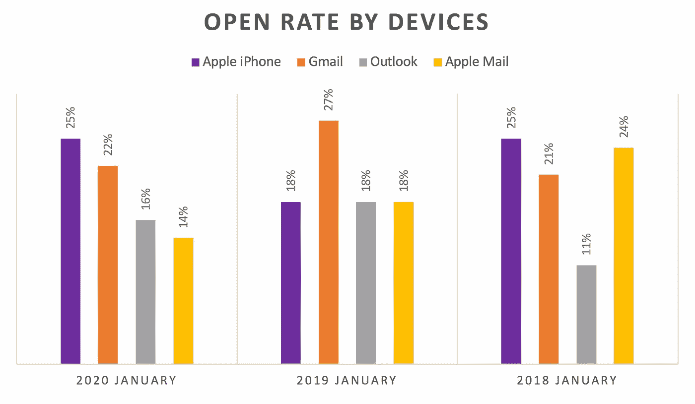

Email open rate by email clients

你怎么想呢?

是的，[我们不能忽视黑暗模式](https://ruwanthisulanjali.medium.com/how-i-created-dark-mode-friendly-mailers-d40e15e2a5f5)。因为我们大部分的邮件客户端都支持黑暗模式。因此，当我们设计简讯/邮件时，我们总是需要进行渲染，看看用户如何在黑暗模式下看到我们的邮件，以及他们如何在不同的设备上查看邮件。

**为什么很多用户更喜欢黑暗模式？**

*   看起来很舒服。
*   降低屏幕亮度
*   大多数开发人员都致力于较暗的接口
*   它有助于提高内容的可读性。

**黑暗模式主题是如何工作的？**

它应该确定的地区与轻背景，并转换成黑暗的背景和黑暗的文字成为轻。

不幸的是，在 Gmail 应用程序(iOS13)和 outlook 2019 (Windows)中，客户端将亮背景识别为暗背景，并将暗背景识别为亮背景。

我尝试了许多方法来改善邮件的外观和感觉，最后，我采取了以下措施:

*   总是测试你的邮件在光明和黑暗的外观。
*   对图像使用透明背景。一些布局不适合透明背景。不断测试和改变适合这两种模式的内容。
*   如果您的徽标是黑色的，您可以添加轮廓或阴影(黑色徽标在变为深色模式时不明显)。我不会选择在徽标上应用阴影。因此，我减少了标志的暗部比例。因为邮件客户端把#000000(黑)变成了#ffffff(白)，白变成了黑。
*   **如果**你不需要替换背景色，使用一个背景色相同的背景图片。(完整模板我不推荐这个。)

电子邮件客户端正在发生变化。因此，在点击发送按钮之前，不断测试你的邮件。因为昨天行得通的今天可能行不通。

# **4。发送邮件的最佳日期**

> 研究发现，周一和周二的打开率和点击率都不错。此外，周六和周日是 CTOR 最喜欢的两天。

让我们看看这对我们的用户有多准确。我想用两种不同的观众来测试这一点。因为用户行为因用户组而异。

事情是这样的…

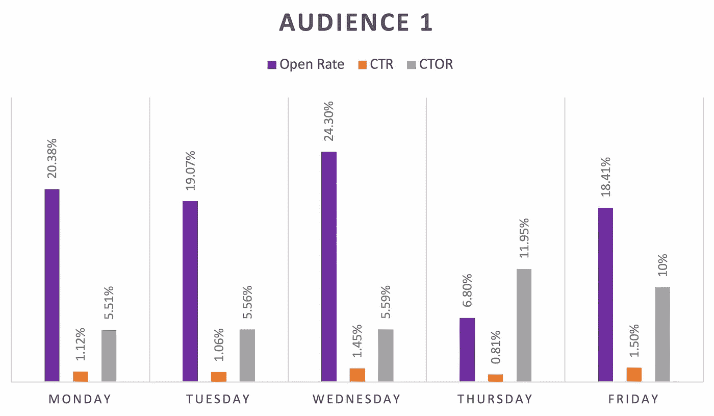

Result of 1st audience by days

周三和周一的开放价格

CTR -星期五和星期三

CTOR -周四和周五

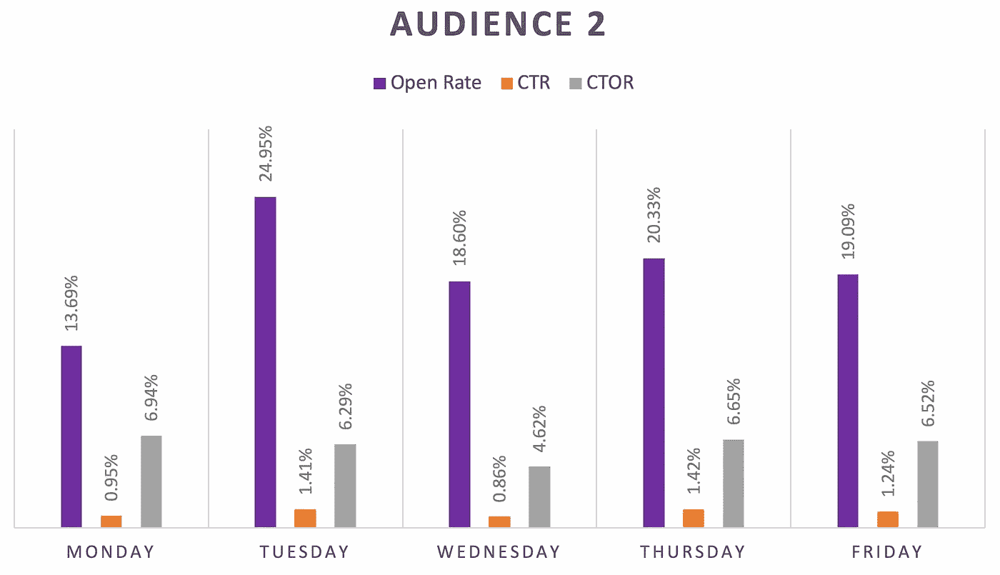

Result of 2nd audience by days

开放价格-周二和周四

CTR -周四和周二

CTOR -周一和周四

在这里，你可以看到，周三和周一是一个观众打开率的前两个选择，周二和周四在其他观众的打开率和点击率方面都很好。

发生了什么…？

是的，一个用户群的行为与另一个用户群不同，它也不同于营销基准。

每个观众都是不同的，他们会因为许多原因而改变他们的行为。因此，我建议你为你的观众做 A/B 测试，并保持跟踪。然后计划你的电子邮件活动来实现你的目标。

# **5。“wh-word** ”标题和第一个链接的点击率最高

我分析了同一产品下的 3 个邮件活动。因此用户群和他们的兴趣是相同的。所有 3 封邮件都有 5 个主要部分，每个部分都有一个行动号召(CTA)。

**点击率报告**

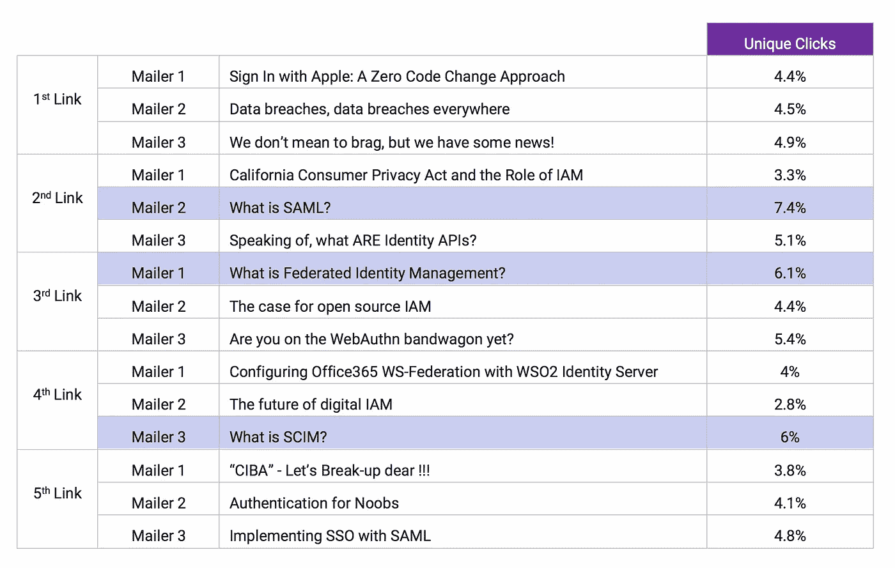

Click-through report of three mailer campaigns

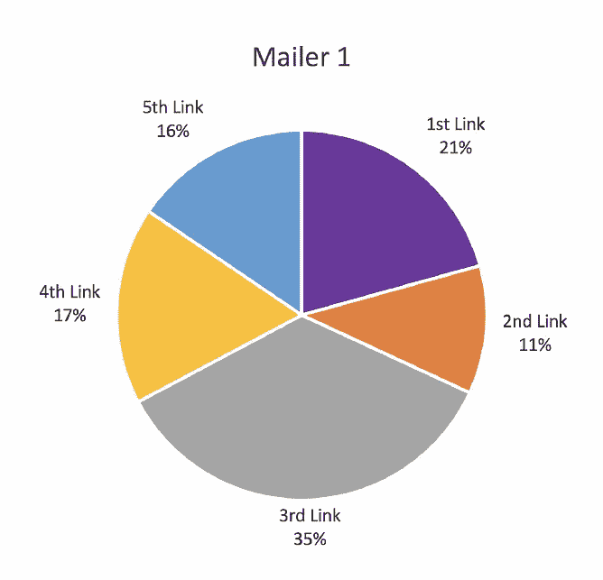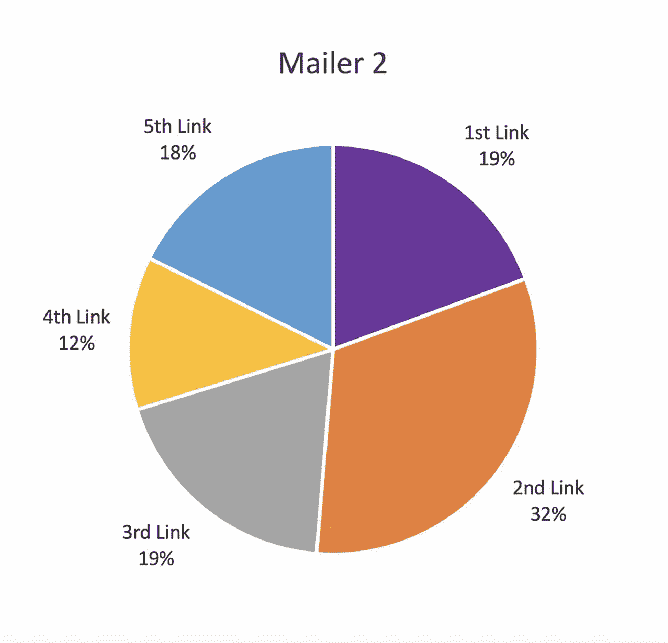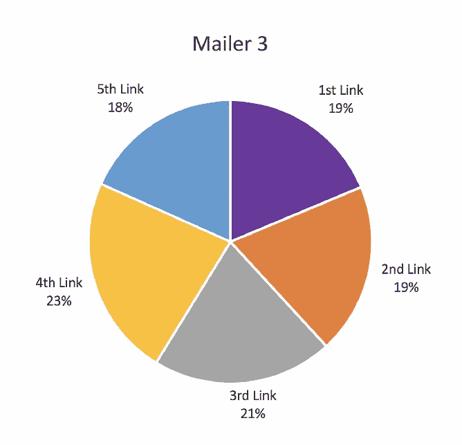

Click-through rate analysis

在这里，我注意到我们的产品简讯“**wh-word**”(*why*、 *who* 、 *which* 、 *what* 、 *where* 、 *when* 和 *how* )标题与其他标题相比点击量更大。虽然要看兴趣区域和受众。正如我前面提到的，不同的目标群体有不同的行为。我们应该通过每天分析用户行为来识别这些。

另一方面，如果您的邮件有更多的分段(超过 6 个)，数字可能会发生变化。最近我注意到，通过分析两年的数据，我们的通用简讯 1st link 的点击量最高。一般时事通讯有 6 个以上的部分。但是我们可以理解，用户行为会随着你的简讯的段数(长度)而改变。但是，它不适用于所有其他用户组。你最好在你的时事通讯中测试这些策略。

# 6.使用动画 gif 或图像来获得更高的点击率

我已经为许多邮寄者试验了这个。首先，我发送了一个带有 GIF(动画)图像的邮件和另一个带有插图的邮件，最后一个没有图像(大量文本的 HTML)。

接下来我注意到的是…

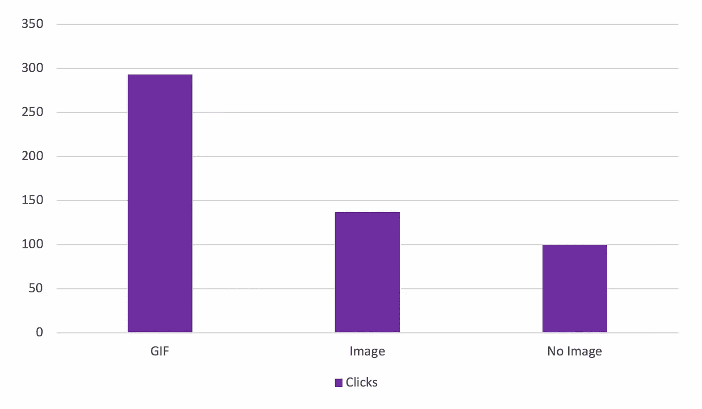

Results of GIF, Image and without image by click-through rate

大多数时候我注意到 gif 的点击率最高。此外，许多研究人员发现，邮件中的视频能产生最高的参与度。但是我们不能将视频嵌入到电子邮件中，因为一些电子邮件客户端不支持嵌入视频。因此，我们可以使用看起来像视频播放器的 gif 并链接到页面。这将有助于提高邮件程序的性能。

另一方面，图片对邮件的点击率也有影响。MailChimp 的研究发现，纯文本的邮件广告比图片超过 10 张的电子邮件广告效果更好。我也经历过。**更好地分析各种策略，看看哪种策略最适合您的特定受众。**

祝你下次通讯顺利，并让我知道你的经历。