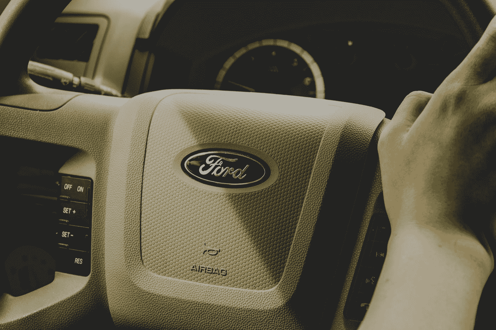

# 我基本上拿了 1500 美元，然后把它烧了

> 原文：<https://medium.datadriveninvestor.com/i-basically-took-1-500-and-set-it-on-fire-79f7ae5b95a9?source=collection_archive---------16----------------------->

## 我真是个该死的白痴。写这篇文章很受伤。

Photo by [Nadine Shaabana](https://unsplash.com/@nadineshaabana?utm_source=medium&utm_medium=referral) on [Unsplash](https://unsplash.com?utm_source=medium&utm_medium=referral)

这篇我就长话短说了，因为写这篇文章已经很痛了。

我应该像对待拉斯维加斯一样对待我的随机投机交易。我不应该为自己设定参数。我应该把谨慎抛到脑后。我没有。对此我简直是个白痴。

也可能不是。

我们将在本文结束时解决这个问题。

但首先，请看这篇 11 月[数据驱动投资者](https://medium.com/u/de42e9af1960?source=post_page-----79f7ae5b95a9--------------------------------)的文章了解背景:

 [## 在你喜欢的股票上花更少的钱，赚更多的钱

### 一种比购买股票成本更低的策略

medium.com](https://medium.com/datadriveninvestor/spend-less-profit-more-on-stocks-you-love-12c0640ebaa6) 

因此，我拥有 10 份 2023 年 1 月 15 日的福特 LEAPS 期权。

这就是为什么我是个白痴。

**Source: Charles Schwab**

我以每支 65 美元的价格卖掉了我的电话。我在这个位置上升了 30%或 40%(我认为。我试着把发生的事情尽量忘掉。后来福特股票下跌，我陷入了亏损。

下降了百分之七，我决定“自律”我退出了阵地，再也没有回头。

直到今天。

双叹。

有一段时间，我回避了有关福特股票的报道。但我瞥见一篇文章提到福特最近的大规模挤兑。我不得不看。

基本上，如果我仍然拥有这些福特电话，我将坐拥大约 1550 美元的利润。对于一个两个月前的职位来说，这还算不错。

是这样的。如果你是普通或全职交易者，你必须像我一样做。无论你设定的数字是多少，当你下跌时，你卖出是有原因的。对于每一个最终出现转机的职位，其他几个职位可能会让你出局。

类似地，如果我持有福特的股票并从中获利，我会给自己树立一个坏榜样。我可能会让这一点点成功(部分运气)影响未来的立场。交易者不能这样做。这是大多数交易者失败的主要原因之一。

也就是说，我不是交易者。

我相信福特会去跑步。我是对的。我应该像对待拉斯维加斯一样对待它，并说，“我带了 700 美元，如果我丢了，我就丢了。”

这就是把严肃的交易作为一种职业(甚至是一种消遣)和作为一个更大的、长期的、防御性的、主要是[股息股票](https://roccopendola.medium.com/3-reasons-to-consider-dividend-growth-investing-9db9cd15c155)投资组合的一小部分的不频繁的投机之间的区别。

不过，一切都很好。我拿走了我的福特收益，并把它们分配到我的一篮子长期投资中。

尽管我从未真正拥有过 1550 美元(意识到这一点很重要)，但我仍然觉得我把那么多钱付之一炬。