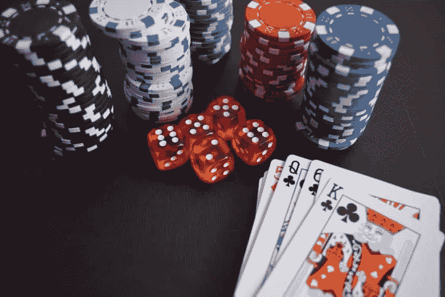

# 我打赌你不会读这篇文章，以及一个嗜赌成性的赌徒的其他想法。

> 原文：<https://medium.datadriveninvestor.com/i-bet-you-wont-read-this-and-other-musings-from-a-compulsive-gambler-b6b88d5fc834?source=collection_archive---------14----------------------->

pexels

我是一个强迫性赌徒，正在康复中，最后一次下注日期，2020 年 11 月 5 日。

在我最近陷入与赌博相关的绝望之前，我有 60 天没有碰毒品。

两个月没有打赌。

我喜欢赌什么？

任何事。

一切。

我现在 34 岁，21 岁时开始职业玩扑克。24 岁时，我开始专业交易股票期权。

我对赌博的痴迷是从什么时候开始的？

我相信我 18 岁的时候，我意识到扑克是无限深入的。我被频繁的涨跌和快速赚钱的诱惑所吸引。我被狡猾的思维水平所欺骗。进入别人的大脑。

又过了几年，我才意识到一切都变得无限深刻。

但是扑克，她是我的初恋。

我年轻时赚了很多钱，但最终都回到了市场和赌场，无论是在陆地上还是在网上。

但我有几年过得很好，一切都很顺利。

我的银行账户迅速增加，我下了更大的赌注。总是挑战极限。这将最终导致我的毁灭。

它变成了一种快感。有时低点和高点一样重要。

只要我有感觉。兴奋。绝望。乔伊。恐惧。

我还活着。

生活令人兴奋。

就像瘾君子追逐他的第一次高潮一样，我总是在追逐我最伟大的交易。

钱呢。这是次要的。

最重要的是旅程。

2012 年，当我吸食大麻并第一次精神崩溃时，我的整个生活都改变了。

从那时起，我再也不能在交易或扑克中获胜，尽管我尽力了。

在牌桌上，我总觉得自己被忽悠了。我在追逐英雄召唤的高潮。你知道，用 a-High 跟注，因为你认为你的对手错过了一个上下顺子听牌。

耙那个锅，把那些筹码堆起来，纯粹是天赐之福。你是对的。你是重点。你是最棒的。

或者最坏的情况。

在我最糟糕的时候，我在所有网络游戏的自我排除名单上签了名。

我几乎立刻就后悔了。

当我不能再玩扑克的时候，我求助于什么？

又回到了股票市场。

交易股票期权。但这次没有专业软件，也没有银行卷。

我总是在错误的时间下注。下注太早太快。

我想要高额回报。一周内增长了 300%。

我开始交易前一周期权。高潮很高。低点比低点低。

我在骗谁呢？我没有赢得任何东西。而且就算我有，我也不会在现实生活中用这些钱买东西。我只会用它来赌更多。

下更大的赌注。

我有多想赢？

无限。

我最想要的是行动。

我只想让筹码留在游戏中。

赌博是我的逃避。是我的逃避。

从这个世界。来自抑郁症。精神病。从绝望中。

只是，她承诺的是更多的沮丧。绝望感增加。精神病加重。绝望。和死亡。

今天，当我写这篇文章的时候，我已经两个小时没碰毒品了。一天一天来。一次一小时。

我在经济上失去的可能永远也找不回来了。

但话说回来，这从来都不是钱的问题。

我所获得的是无法估量的。

安心。从小事中获得快乐。希望有更好的日子。

我的生活。

我叫迈克尔 X 克里斯托弗，我是一个嗜赌如命的赌徒，最后一次下注是 2020 年 11 月 5 日。

如果您有赌博问题，请致电 1–800-赌徒。

你可以得到帮助。

谢谢你听我说完。