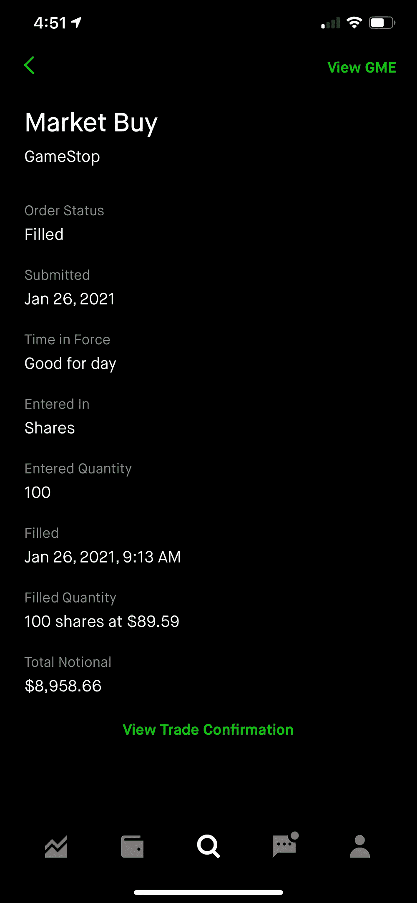
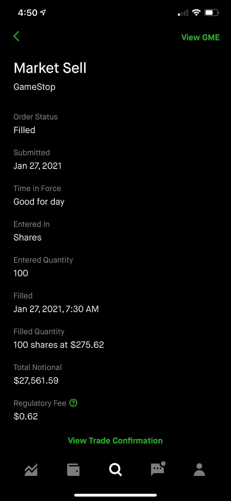

# 在卖空交易中，我买了价值 9000 美元的 GameStop (GME)股票

> 原文：<https://medium.datadriveninvestor.com/i-bought-gamestop-during-the-frenzy-a2c336feeedc?source=collection_archive---------19----------------------->

我不会回顾 Gamestop 发生了什么，因为每个人和他们的母亲都在谈论它。

但是，看起来 r/wallstreetbets 的用户开始分享他们的收益，所以这里是我的经验和我赚了多少。

# 增加

在风险投资家 Chamath Palihapitiya 在推特上说他买了 Gamestop 看涨期权后不久，我以 89.59 美元的价格买了 100 股。这是 1 月 26 日上午 9 点 13 分。

不到 24 小时后，我以每股 275.62 美元的价格卖出了我的 100 股股票，这几乎是 210%的涨幅。我在 1 月 27 日早上 7:30 卖出。

经过快速计算，我赚了 18，602.93 美元。

以下是截图为证:

我显然欣喜若狂，但与其他交易者相比，这只是小钱。这种狂热一夜之间造就了数十名百万富翁。

# 我会再做一次吗？

老实说…是的。我可能会。

我知道这里有很多人认为把金钱成本平均化到间谍身上是最好的方法。或者只投资于资产负债表强劲的公司。别担心，我还在船上。

但我认为，在过去的几个月里，特别是在这种卖空的情况下，散户投资者证明了普通人可以成功地操纵股票并创造动力。

在 2020 年和 2021 年，我们已经看到 Robinhood 和 r/wallstreetbets 用户喜爱的某些股票大幅增长。

这些公司大多不是财务状况良好的传统公司，而是具有强劲增长潜力的公司。

商店，PRPL，NIO，TSLA，GME，AMC，BB…

这样的例子不胜枚举。

甚至有一只创新 ETF 持有许多这类股票。调查 ARKK ETF。它在去年经历了超过 150%的增长。

同样，我仍将把大部分投资组合放在指数基金中，但我会继续用少量资金探索 reddit 的建议。这不是投资建议。我知道这有很高的风险，可能会被投机性投资所吞噬。

股市是否已经足够民主化，散户投资者可以继续在股市中创造动力？还是我们正处于一个“迷因股”泡沫中？

我不确定，但我是来享受旅程的。